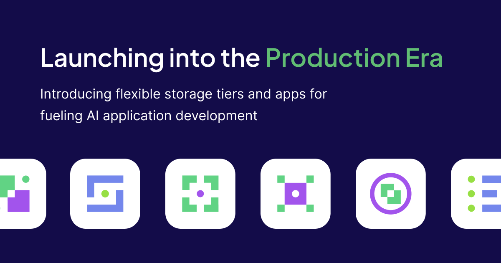

As Weaviate celebrates its fifth anniversary, we've had the privilege of collaborating with tens of thousands of developers, gaining invaluable insights into the evolving landscape of AI projects and strategies. Our users constantly push the boundaries of what’s possible. As they continue to scale their applications in production, they guide the evolution of our product and the market itself. 

## The need for optionality

One of the main reasons developers choose Weaviate is the optionality it offers in terms of machine learning models, frameworks, and deployment. With new AI models and tools emerging daily, it's crucial to build systems that allow flexibility for tech stacks to evolve. This optionality, combined with ease of use, helps teams scale AI prototypes into production faster.

Flexibility is also vital when it comes to architecture. Different use cases have different requirements. For example, we work with many software companies and those operating in regulated industries. They often require multi-tenancy to isolate data and maintain compliance. When building a Retrieval Augmented Generation (RAG) application, using account or user-specific data to contextualize results, data must remain within a dedicated tenant for its user group. Weaviate’s native, multi-tenant architecture shines for customers who need to prioritize data privacy while maintaining fast retrieval and accuracy.

On the other hand, we support some very large scale single-tenant use cases that orient toward real-time data access. Many of these are in e-commerce and industries that compete on speed and customer experience. Even the slightest latency can send their users looking elsewhere. 

These use cases leverage our HNSW index on hot storage and vector compression to ensure low latency. 

The point is, there is no one-size-fits-all solution so optionality is key. I’m very proud that through learning from our customers and community, we’re building a solution that supports diverse use cases and the evolving needs of developers.

## Introducing hot, warm, and cold storage tiers 

It’s amazing to see our customers' products gain popularity, attracting more users, and in many cases, tenants. However, as multi-tenant use cases scale, infrastructure costs can quickly become prohibitive. Since multi-tenancy is a core tenet of our architecture, the next logical step for us was to build a way to help customers drive more efficient resource consumption. 

We’re pleased to offer tenant offloading and hot, warm, and cold storage tiers as part of our [latest release](/developers/weaviate/release-notes/release_1_26). Weaviate users (Open Source and Enterprise Cloud) can now deactivate or offload tenants to less-expensive warm or cold storage and reactivate them dynamically, based on the unique patterns of their use case. 

Here’s what it might look like in practice: 

One of our customers develops an email platform with tens of thousands of users. 80% of their users are only active during a 12-hour window (US business hours). With our new storage tiers, they can offload tenants to cold storage to save on infrastructure costs when users are inactive. When a user comes online, they can quickly warm up the tenant. This way they reduce storage costs while still offering performance that meets the needs of their customers.

<figure style={{ maxWidth: "70%", margin: "0 auto" }}>
  
</figure>

### The Weaviate AI Unit

To adapt to this product change and the evolving AI stack, we’ve introduced a [new pricing](/pricing) unit to our Enterprise Cloud offering. An AI Unit (AIU) is a Weaviate-specific unit that can be applied to hot, warm, and cold storage tiers and compute costs. AIUs enable customers to better monitor usage and improve budgeting. In addition to resource costs, AIUs will apply to new AI-native Apps as they are released (more on that next).

## Apps and tools to fuel AI-native development 

As we continue to listen to our community, it’s clear that developers need an AI-native framework offering not just flexibility, but also modular GUI tools to interact with their data and accelerate their use cases. We’re excited about a new line of AI-native apps and tools that will help developers and business users accelerate common use cases. 

### Recommender App

Our first app is a [Recommender service](/workbench/recommender), now in private beta. The Recommender is a fully managed, low-code way to build scalable recommendation systems. It offers configurable endpoints for item-to-item, item-to-user, and user-to-user recommendation scenarios across multimodal data. Sign up for the private beta [here](https://events.weaviate.io/early-access), and stay tuned for more Apps updates coming soon. 

<figure style={{ maxWidth: "70%", margin: "0 auto" }}>
  
</figure>

### Weaviate Cloud Tools

Lastly, new [Weaviate Cloud Tools](/workbench) give developers and non-technical users an easier way to manage, explore, and interact with their data within Weaviate Cloud. The [Query](/workbench/query) and [Collections](/workbench/collections) tools are available now in the Weaviate Cloud Console.

It’s been an exciting few months, and I’m ecstatic to continue learning from our community and empowering developers to build the future of AI-native possibilities. 

To dive deeper into our latest product updates, join our [upcoming webinar](https://events.weaviate.io/update-126). 

import WhatNext from '/_includes/what-next.mdx';

<WhatNext />
