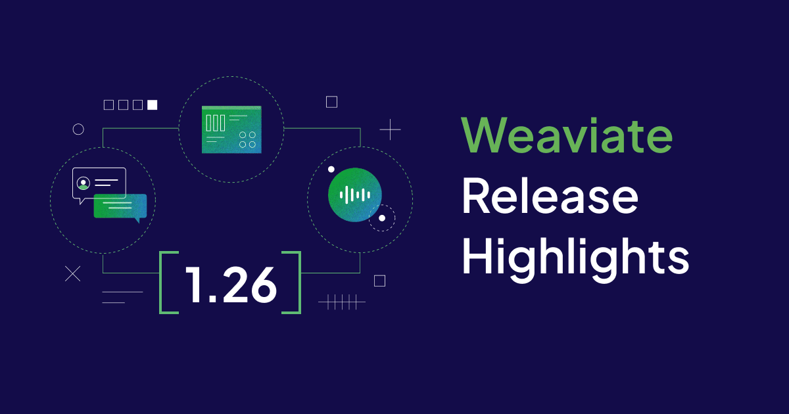

Weaviate `1.26` is here!

Here are the release ⭐️*highlights*⭐️!

- [**Improved Range Queries**](#improved-range-queries)
- [**Async Replication**](#async-replication)
- [**Anthropic integration**](#anthropic-integration)
- [**Bulk enable API-based modules**](#bulk-enable-modules)
- [**Multi target vector search**](#multi-target-vector-search)
- [**Tenant statuses changed**](#tenant-statuses-changed)
- [**Tenant offload to cloud storage**](#tenant-offload-to-cloud-storage)
- [**Async Python client**](#async-python-client)
- [**Scalar Quantization**](#scalar-quantization)
- [**Dashboards for async indexes**](#dashboards-for-async-indexes)
- [**Korean tokenizer**](#korean-tokenizer)
- [**Additional changes**](#additional-changes)

## Improved Range Queries

import RangeGraphic from '/blog/2024-07-31-weaviate-1-26-release/img/Range.jpg';

The rangeable index is a powerful new tool for quantitative comparisons.

Object properties in Weaviate are indexed and searchable. In earlier releases, range queries are computationally expensive. The new rangeable index provides a more efficient way to quickly search ranges of data.

Use the new index type when you anticipate using numerical comparisons over ranges of values. Consider defining a rangeable index in your [collection schema](/developers/weaviate/config-refs/schema) when you define a property type as `int`, `number`, or `date`.

The rangeable index works alone and with [filterable indexes](/developers/weaviate/config-refs/schema/range-index#considerations). Combine filters and range queries to quickly narrow your searches to the most relevant information.

Internally, rangeable indexes are implemented as [roaring bitmap slices](https://www.featurebase.com/blog/range-encoded-bitmaps). This is an exciting data structure that combines several clever ideas to reduce memory requirements while improving processing speeds.

This feature is only available for new properties and new collections.

## Async Replication

Data consistency is an important consideration for multi-node clusters. Weaviate v1.18 introduces a [repair-on-read](https://weaviate.io/blog/weaviate-1-18-release#repair-on-read) feature that finds and fixes problems at read time. The current release adds another powerful tool, async replication. [Async replication](/developers/weaviate/concepts/replication-architecture/consistency#async-replication) works in the background, checking and updating your data to keep it consistent.

In Weaviate, consistency has two components - schema consistency and object consistency. The [Raft](https://raft.github.io/) algorithm ensures strongly consistent schema replication. Data objects on the other hand, are eventually consistent. This means all nodes eventually contain the same data, but at a given point in time some nodes may be out of sync.

Eventual consistency is a trade-off that helps to ensure high availability, but at the risk of occasionally serving stale data.

Async replication addresses this risk and minimizes it. The aysnc replication mechanism uses an efficient algorithm to monitor and compare nodes within a cluster. If the algorithm identifies an inconsistency, it resyncs the data on the inconsistent node.

Async replication is more effective than repair-on-read when there are many inconsistencies between nodes. If, for example, an offline node misses a series of updates, async replication quickly restores consistency for all of the objects when the node returns to service. Under a repair-on-read approach, the missing updates might not be noticed for a long time.

For details, see [async replication](/developers/weaviate/concepts/replication-architecture/consistency#async-replication).

## Anthropic integration

An Anthropic generative AI integration is available in Weaviate. This integration allows you to use the `Claude` family of models from Anthropic to perform generative search on your data. The integration includes support for the latest models, such as `Claude 3.5 Sonnet`.

The Anthropic integration is enabled by default on Weaviate Cloud [WCD](https://console.weaviate.cloud/) instances.

To enable the Anthropic integration on a local deployment, add `generative-anthropic` to the `ENABLE_MODULES` [environment variable](/developers/weaviate/config-refs/env-vars), or set the `ENABLE_API_BASED_MODULES` environment variable to `true`.

For details, see the [Anthropic integration page](/developers/weaviate/model-providers/anthropic).

## Bulk enable modules

**Experimental** This feature is experimental and may change in future releases.

To enable all API-based [model provider integrations](/developers/weaviate/model-providers/index), set the `ENABLE_API_BASED_MODULES` [environment variable](/developers/weaviate/config-refs/env-vars) to `true`.

You do no have to enable individual modules in the `ENABLE_MODULES` environment variable.

`ENABLE_API_BASED_MODULES` and `ENABLE_MODULES` are additive. Set `ENABLE_API_BASED_MODULES` to `true` to enable API based modules. Use `ENABLE_MODULES` to configure additional modules such as `text2vec-ollama`, `generative-ollama`, and `backup-s3`.

When `ENABLE_API_BASED_MODULES` is `true`, the GraphQL [`Explore`](/developers/weaviate/api/graphql/explore) feature is unavailable.

## Multi target vector search

Weaviate 1.24 introduces objects with multiple vectors. This release introduces multi target vector search. Starting in 1.26, you can make a single query that combines results from across multiple target vectors.

When you search multiple vectors, add a list of target vectors to the query instead of a single, named vector. Weaviate automatically combines the results from all of the target search vectors. The mechanism is conceptually similar to the [hybrid fusion](/blog/hybrid-search-fusion-algorithms) algorithm in [hybrid search](/developers/weaviate/search/hybrid).

Each vectorizer creates vectors with their own characteristics. Weaviate allows you to tune your multi vector search to ballance the target vectors in a way that reflects your application needs.

For details, see [multi target vector search](/developers/weaviate/search/multi-vector).

## Tenant statuses changed

Tenant [activity status](/developers/weaviate/concepts/data#tenant-status) is used to manage memory usage.

The old status names change to `ACTIVE` and `INACTIVE` in Weaviate `1.26` to better reflect the tenant status. The status definitions are the same as before.

- `ACTIVE` tenants are available for read and write operations.
- `INACTIVE` tenants are not available for read or write operations.

In earlier versions, `INACTIVE` tenants are marked as `COLD`, and `ACTIVE` tenants are marked as `HOT`.

This release also adds a new status, `OFFLOADED`. (See [below](#tenant-offload-to-cloud-storage).)

## Tenant offload to cloud storage

Weaviate `1.26` introduces the ability to offload `INACTIVE` tenants to cloud storage. This feature gives you the flexibility to store tenants on disk or in cloud storage, which helps you to manage costs. Move `INACTIVE` tenants to lower-cost cloud storage when they aren't in use, and reload the tenants into memory when you need them.

A tenant that is in cloud storage is marked as `OFFLOADED` and is not available for read or write operations. While the tenant is in process of offloading from memory, it's status is `OFFLOADING`. The tenant's status is `ONLOADING` while it is reloaded into memory.

Currently, tenant offload is supported for AWS S3 storage. Additional cloud storage providers are coming in future releases.

This feature is only available for self-hosted instances. It is not yet available in [Weaviate Cloud](/developers/wcs).

For details, see [tenant activity statuses](/developers/weaviate/manage-data/multi-tenancy#update-tenant-activity-status) and the [`s3-offload` module](/developers/weaviate/configuration/modules#offload-s3-module).

## Async Python client

The Weaviate Python client library adds a `WeaviateAsyncClient` object and a new API that supports asynchronous operations. Highly concurrent applications can use the new API for more efficient processing.

For detailed information on the new async client API, see [Async API](/developers/weaviate/client-libraries/python/async). The async API is very similar to the synchronous client API. The [helper methods](/developers/weaviate/client-libraries/python/async#instantiation-helper-functions) to connect to the aysnc API are analogous to the sync connection methods:

- `use_async_with_local`
- `use_async_with_weaviate_cloud`
- `use_async_with_custom`

For code examples, see [async usage examples](/developers/weaviate/client-libraries/python/async#async-usage-examples).

[FastAPI](https://fastapi.tiangolo.com/) is a popular asynchronous web framework for creating modular, web API microservices. For sample application code that uses the async client with FastAPI, see the [application example](/developers/weaviate/client-libraries/python/async#application-level-example).

## Scalar Quantization

import SQGraphic from '/blog/2024-07-31-weaviate-1-26-release/img/SQ.jpg';

This release introduces a new vector compression technique called scalar quantization (SQ). SQ is a powerful technique that reduces the storage space required for each dimension of a vector. In Weaviate, vector dimensions are typically stored using 32 bit floating point numbers. With scalar quantization, each dimension is converted into an 8 bit integer. This transformation effectively cuts the size of vectors by 75% since 8 bit representations only need a quarter of the original 32 bits.

Image color depth is a helpful analogy. An image that has a deep pallet uses many bits of information to capture shades of a color. An image with low bit-depth has a more limited number of colors (256 values for 8 bits). The scene is still clearly visible. Even though there may be visual artifacts, the lower bit-depth significantly reduces the storage space required.

Practically speaking, scalar quantization provides a fourfold reduction in vector size with about a 5% loss in retrieval recall. Techniques such as over-fetching and rescoring mitigate the reduction and improve recall.

Scalar quantization offers a compelling trade-off between storage efficiency and retrieval accuracy. This makes SQ an essential tool for optimizing vector storage in Weaviate. Look for more details on SQ and SQ related experiments in a deep dive blog post that's coming soon!

## Dashboards for async indexes

import ChartsGraphic from '/blog/2024-07-31-weaviate-1-26-release/img/Charts.jpg';

Weaviate gathers metrics that are compatible with the open-source [Prometheus](https://prometheus.io/docs/introduction/overview/) monitoring and alerting system. The v1.26 Weaviate release adds [new metrics](/developers/weaviate/configuration/monitoring) that monitor aysnc indexing queues.

Use these metrics with Prometheus and [Grafana](https://grafana.com/docs/) to monitor your Weaviate instance.

If you don't see a metric that you need, you can extend Weaviate to add new metrics. To suggest a new metric, or to get started writing your own, see the [contributor guide](/developers/contributor-guide).

## Korean tokenizer

**Experimental** This feature is experimental and may change in future releases.

A new Korean tokenizer is available in Weaviate `1.26` (and `1.25.7`). This tokenizer is based on the `kagome` library and a `MeCab` dictionary.

To enable the Korean tokenizer, set the `ENABLE_TOKENIZER_KAGOME_KR` [environment variable](/developers/weaviate/config-refs/env-vars) to `true`. Set the [tokenization method](/developers/weaviate/config-refs/schema/#kagome_kr-tokenization-method) for the relevant properties to `kagome_kr`.

## Additional changes

- Starting in Helm chart version 17.0.1, constraints on module resources are commented out to improve performance. To constrain resources for specific modules, add the constraints in your `values.yaml` file.

- The HNSW `maxConnections` value is updated. Instead of 64 connections, the HNSW graph now defaults to 32 connections.

  The lower value works better with modern ANN datasets that have high dimensionality. Testing shows that the QPS/recall curves improve with lower `maxConnections` values. The best values are in the 16-32 range, depending on dataset size. To improve target recall, `ef` can be increased.

## Summary

Enjoy the new features and improvements in Weaviate `1.26`. This release is available as a docker image and is coming soon to Weaviate Cloud [WCD](https://console.weaviate.cloud/).

Thanks for reading, see you next time 👋!
