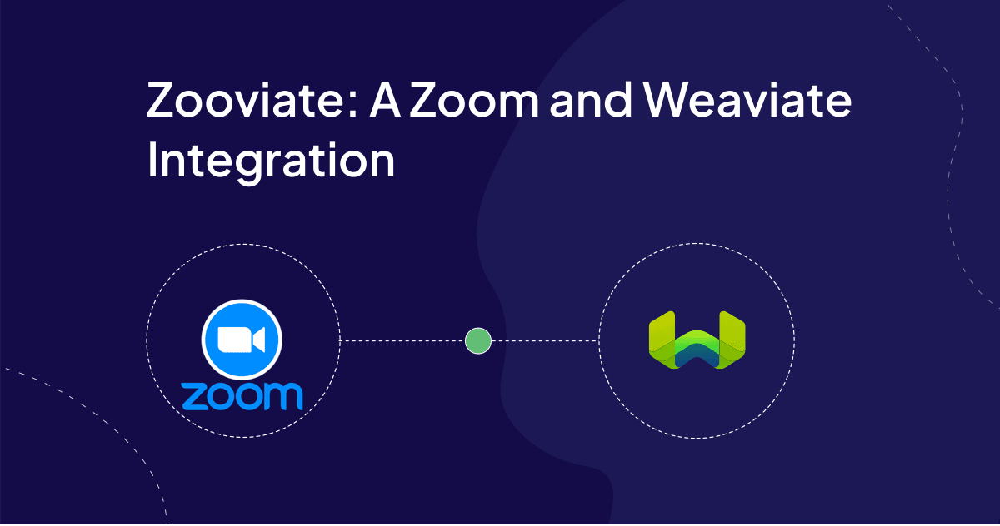
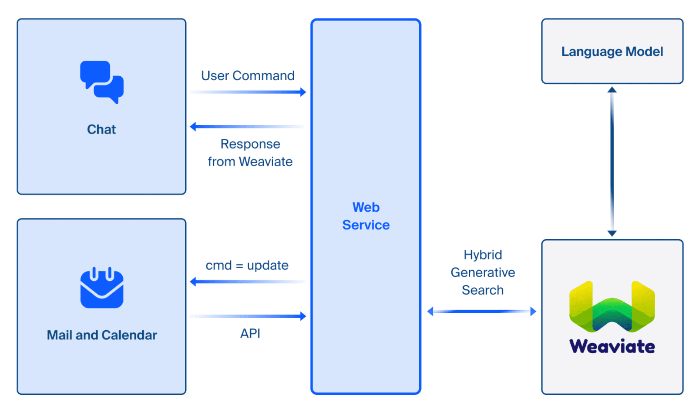
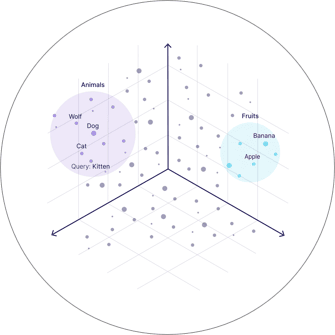
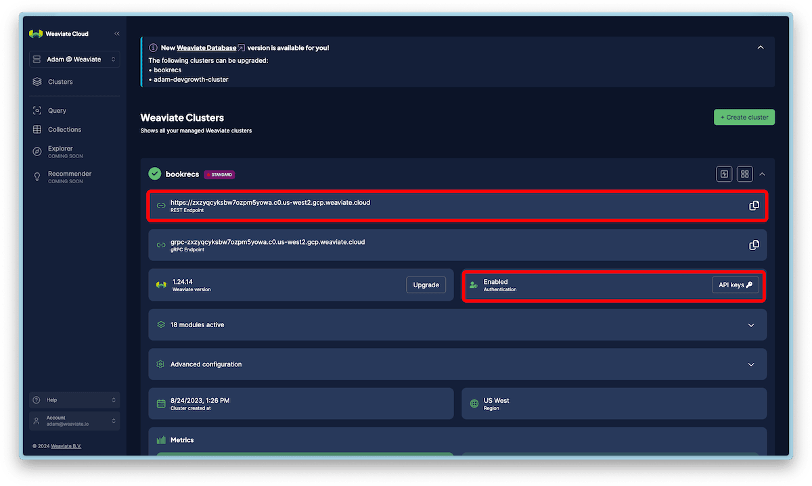

# Overview

The applications of a vector database for Retrieval Augmented Generation reach far into any industry for any application. Zoom Workplace provides a plethora of tools that enable communication, productivity, and maximize engagement through digital interfaces connecting people across the planet. With the API features available in the Zoom Developers ecosystem, we can create integrations with any technology and services that exposes an API, that includes Weaviate and is what we'll be exploring in this blog post. 

RAG is a common design pattern that enables an applications to leverage the power of large language models with contextual data that wasn't part of a language models initial training dataset. There are many options you have when building your own RAG pipelines. In this blog post, we're going to implement a simple RAG pipeline to showcase how you can integrate Weaviate directly into your applications.

If you want to learn more about RAG and Weaviate, check out our Quickstart and developer docs, [here](/developers/weaviate/quickstart).

Let's get started!

## Zoom Developer Platform

Zoom is a well known product to the world since we shifted to a remote first workplace during the pandemic. Much lesser known however, is the Zoom Developer Platform, which is an entry point to creating customizable apps and scalable integrations to help business owners expand and grow their services through Zoom products.

The Zoom Developer Platform exposes information in Zoom through APIs and webhooks, you can build application with their Video SDK to create highly customized experiences, embed zoom directly into your applications, and much more. You can learn more about the Zoom Developer Platform [here](https://developers.zoom.us/).

For this blog post, we'll leverage your Zoom Calendar and Mail data, pass it into Weaviate as embedded data iniated through Zoom Team Chat, then retrieve that data with Weaviate using Zoom Team Chat to surface the data back to the user. This application will showcase how to expose AI powered search capabilities through Weaviate directly into your Zoom applications.

In the following section we'll go over this sample application's architectural diagram.


## Architectural Diagram Overview



## Zoom Team Chat

The entry point into our AI application is Zoom Team Chat. As a chat interface, we can programmatically define behavior based on text input into the application and parse it to execute some predefined task. Naturally, it is also the place where we can surface data back to the application from the large language model after the text inputs are passed into Weaviate as a query to retrieve context and then into the language model to generate the appropriate inference.

Zoom Team Chat is configured to send those messages to a web service for processing.

## Web Service: The Orchestrator

The Orchestrator has two important responsibilities:
* Update data into Weaviate
* Respond to user queries with real world data


### Update Command 

When the message arrives at the web service, it's responsible for parsing that message and orchestrating the next action. The message may contain the "update" command or a generic question related to the Zoom Workplace data. In the case where the message "update" is sent into Zoom Team Chat, the web service logic is to retrieve the data from Zoom Calendar and Zoom Mail via the API. Once the orchestrator has the Zoom Calendar and Mail data in it's domain, it can began generating embeddings for each email and calendar info. 

### User Queries

In the scenario where the message is not "update" and is a question related to the Zoom Workplace data, the orchestrator is responsible for retrieving the most relevant data from Weaviate and then passing that data to a language model to generate a response with the retrieved context, and then pass the language model response back to the user. We call this [Generative Search](/developers/weaviate/search/generative). The orchestrator retrieves relevant documents by applying a search algorithm over HNSW Indexed data in Weaviate. This search algorithm takes advantage of the vector embeddings that are generated through Weaviate to find relevant documents that have been uploaded through the "update" command.

If you're new to vector embeddings, check out [our blog post](/blog/vector-embeddings-explained) explaining what vector embeddings are. The Orchestrator will use Weaviate's vector search capabilities to retrieve the most relevant data from Weaviate.

### 30,000 foot view of vector embeddings

Here's a 30,000 foot view: vector embeddings (or simply embeddings) are stored in Weaviate alongside the original data they represent. Embeddings of your data exist in vector space closely situated to other data that are semantically similar. These vectors are generated from machine learning models that encode concepts as weights throughout the network. The output of embedding models are a set of numbers, or a vector representation, of the input you pass in. This properties allow us to execute utilize sophisticated search algorithms over your data such that we can produce highly customized inference with your information, without having to fine tune or train a new language model.

Another advantage of leveraging AI powered search, is that we can build real time applications that evolve with your evolving data. So you don't have to fine tune a new model every time you get a new email or a new calendar invite.

We create embeddings by defining a collection in Weaviate and configuring a text2vec-openai vectorizer. On this vectorizer configuration, we can define which vectorizer from OpenAI to use within the collection, and which fields within the collection to vectorize. From then on, when we use the API of Weaviate to import an object into that collection, it'll automatically begin vectorizing that data and store the original object as well as the embedding in Weaviate.

We'll demonstrate how to create this collection in Weaviate after discussing the Zoom Mail and Calendar requirements.



## Zoom Mail and Calendar

Zoom Mail and Zoom Calendar are Zoom Workplace features that allow you to see your data in a central location. There are a variety of configuration settings you'll need to apply to your Zoom Mail and Calendar to enable the API. Here are several prerequisites:

- Zoom One Pro or Standard Pro, Zoom One Business or Zoom One Enterprise account
- Zoom Mail and Calendar Clients enabled with customized domains, Zoom Team Chat enabled
- End-to-end encryption disabled on Zoom Mail
- Configure the Zoom App and Chatbot
- Select the required scopes in your Zoom App

Here are the necessary scopes for this application:

Mail:
- **Legacy Scopes**: mail:read,mail:read:admin 
- **Granular Scopes**: email:read:list_msgs,email:read:list_msgs:admin, email:read:msg,email:read:msg:admin

Calendar: 
- **Legacy Scopes**: calendar:read,calendar:read:admin
- **Granular Scopes**: calendar:read:list_events,calendar:read:list_events:admin,calendar:read:event,calendar:read:event:admin


Chatbot:
- **Scopes**: imchat:bot

And here are the APIs we'll be using from Zoom:

### Mail: 
**Endpoint**: GET /v2/emails/mailboxes/{mailboxEmail}/messages

    To fetch email messages from a specified mailbox.

**Endpoint**: GET /v2/emails/mailboxes/{mailboxEmail}/messages/{messageId}

    To fetch the details of a specific email message

### Calendar: 

**Endpoint**: GET /v2/calendars/{calendarId}/events
	
    Fetch a list of events from a specified calendar.

**Endpoint**: GET /v2/calendars/{calendarId}/events/{eventId}

	  Fetch the details of a specific calendar event by its ID.

### Chatbot:

**Endpoint**: POST /v2/im/chat/messages

    Send chat messages to Zoom Team Chat via chatbot


## Weaviate Setup

There are a variety of ways to use Weaviate, from self hosting it using Docker or Kubernetes, to running it in the cloud with Weaviate Cloud or in your own VPC through an Enterprise Deployment. For this project, we used a cluster created through Weaviate Cloud. Weaviate Cloud is a fully managed service that allows you to deploy Weaviate in a few clicks. You can find more create a cluster on Weaviate Cloud [here](https://console.weaviate.cloud/).

Once you've created a cluster on Weaviate Cloud, you'll get the Endpoint URL from your cluster as well as the API key. You'll be able to see them once you expand the details for your cluster, as shown in the following screenshot.



Within your cluster, we can create the collection that represents our data from Zoom Mail and Calendar. This collection will configure a vectorizer through OpenAI using the text2vec-openai vectorizer module in Weaviate. This vectorizer module is attached to a collection, and will automatically generate embeddings for any data that is imported into that collection. We vectorize any Zoom Mail and Zoom Calendar data along with their metadata.

The python script below will create the collection and configure the vectorizer.

```python

import os
import requests
import weaviate
import weaviate.classes as wvc

client = weaviate.connect_to_wcs(
    cluster_url=os.getenv("WCS_URL"),
    auth_credentials=weaviate.auth.AuthApiKey(os.getenv("WCS_API_KEY")),
    headers={
        "X-OpenAI-Api-Key": os.environ["OPENAI_APIKEY"]  # Replace with your inference API key
    }
)

client.collections.delete("ZoomWorkplaceData")

ZoomWorkplaceData = client.collections.create(
    name="ZoomWorkplaceData",
    vectorizer_config=wvc.config.Configure.Vectorizer.text2vec_openai(model="text-embedding-3-small"),
    generative_config=wvc.config.Configure.Generative.openai(model="gpt-4")
)

client.close()
```

This can also be found within the [git repository](https://github.com/ojusave/zoom-weaviate/blob/main/weaviate-server/create_schema.py) for this project. Once the collection is created and the vectorizer is configured, we can import the data into the collection using the "update" command through Zoom Team Chat.


## Running the Orchestrator

The orchestrator is broken into two web services, these are available on the main [git repository](https://github.com/ojusave/zoom-weaviate/). The [zoom-server](https://github.com/ojusave/zoom-weaviate/blob/main/zoom-server) manages message transactions from the Zoom Team Chat, as well as making API calls to retrieve data from Zoom Mail and Zoom Calendar. When the user sends a query message through Zoom Team Chat, the Zoom Server sends the query message to the [weaviate-server](https://github.com/ojusave/zoom-weaviate/blob/main/weaviate-server). The Weaviate server takes this query message, then initiates a Weaviate generative hybrid search query. The Weaviate server then sends the results back to the Zoom Server, which then sends the results back to the user.

Here's the code that manages the query on the Weaviate-server. 

```python


@app.route('/query', methods=['POST'])
def query_data(): 
    user_query = request.json.get('message')


    content_type = request.headers.get('Content-Type')
    if (content_type == 'application/json'):

        client = weaviate.connect_to_wcs(
            cluster_url=os.getenv("WCS_URL"),
            auth_credentials=weaviate.auth.AuthApiKey(os.getenv("WCS_API_KEY")),
            headers={
                "X-OpenAI-Api-Key": os.environ["OPENAI_APIKEY"]  # Replace with your inference API key
            }
        )

        try:
            ZoomWorkplaceData = client.collections.get("ZoomWorkplaceData")
            response = ZoomWorkplaceData.generate.hybrid(query=user_query,
                limit=4,
                grouped_task=f"You are a helpful AI Assistant. Be brief in your responses. Write a reply to a chat message in reply to the following data. Here's the user's message {request.json.get('message')}",)

        finally:
            client.close()  # Close client gracefully
        
        return jsonify({"response": response.generated}), 200

    else:
        return 'Content-Type not supported!'

```

A generative hybrid search query is a query that takes in a language model prompt, as well as a data retrieval query. In this case, we are using a hybrid search, which means we are asking Weaviate to do a Keyword search query as well as a vector search query, 

Once that data is sent back to the zoom-server, it surfaces it into Zoom Team Chat with the inference completed by the LLM.


## Conclusion

If you enjoyed this, watch our [talk](https://www.youtube.com/watch?v=wueMJS80Z8Y) delivered at the Zoom Developer Summit in 2024 and follow along with our code from this [repository](https://github.com/ojusave/zoom-weaviate/)!


That's a wrap! If you like [Weaviate](https://github.com/weaviate/weaviate) and [Zooviate](https://github.com/ojusave/zoom-weaviate/), make sure to give the Open Source git repositories some love and star those repos!

If you have questions, come on by to our community Forum on Slack.

import WhatsNext from '/_includes/what-next.mdx';

<WhatsNext />
