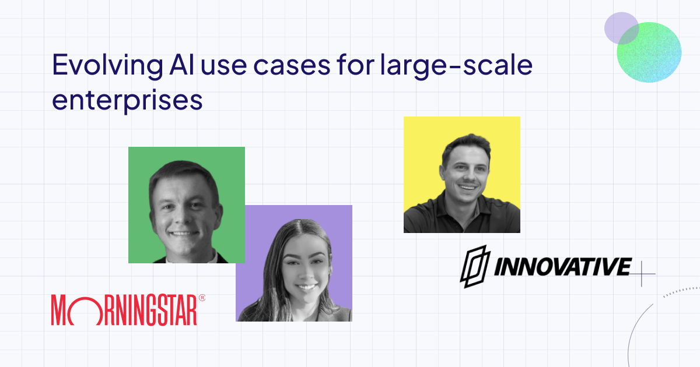

<!-- truncate -->

In July we stopped by the Windy City along with our friends from Innovative Solutions and Morningstar to host another roadshow event. Even though this was our first-ever visit to Chicago, our space was packed to the brim with AI enthusiasts asking awesome questions of our presenters and completing our hands-on training in the second half of the day.

Ben Barrett, Head of Technology, and Aisis Julian, Senior Software Engineer at [Morningstar](https://www.morningstar.com/), shared their journey in building an intelligence engine platform for financial data. They focused on the evolution of the platform, emphasizing corpus management as a critical feature that allows Morningstar to leverage its extensive data across multiple applications. The talk showed how Weaviate has been instrumental in enhancing the precision and flexibility of their generative AI applications.

> Amazingly, our team was able to build this entire pipeline very quickly with Weaviate's Python client and their model provider integration so that we could have a seamless implementation and configuration of embedding models.

> *Aisis Julian, Senior Software Engineer, Morningstar* 

    <iframe src="//youtube.com/embed/AHlQdf3uEMM" 
    frameBorder="0"
    width="700"
    height="400" 
    allowFullScreen></iframe>

### Key Takeaways:
* **Intelligence Engine Platform**: Built with Weaviate, this platform enables scalable and flexible management of financial research data, supporting multiple AI applications across Morningstar.

* **Corpus management**: The platform's corpus management system allows for dynamic and context-aware document chunking, improving the relevance and accuracy of retrieval-augmented generation (RAG) applications.

* **Cited source transparency**: Enhancing transparency and accuracy, Morningstar's system ensures that AI-generated answers are backed by verifiable and trusted sources, aiding user confidence in the output.

* **Ease-of-use, versatility, and scalability**: The ability to support multiple use cases—from search engines to tailored AI applications—and get them up-and-running quickly,demonstrates the versatility and scalability of Weaviate's capabilities in handling large and diverse data sets.

Anthony Loss, Lead Solutions Architect at [Innovative Solutions](https://innovativesol.com/), provided an insightful presentation on how Innovative uses Weaviate’s vector database within AWS environments to enhance generative AI solutions for their clients. He shared the story of a recent customer in the call center industry for whom Innovative deployed a two-pronged solution involving live call analytics and digital voice agents. 

    <iframe src="//youtube.com/embed/EpazvwC1z2Q" 
    frameBorder="0"
    width="700"
    height="400" 
    allowFullScreen></iframe>

### Key takeaways:
* **Weaviate’s scalability**: Weaviate integrates seamlessly within AWS environments and scales to support large use cases with ease, making it a preferred choice for deploying AI-driven solutions.

* **Innovative’s AI capabilities**: Innovative Solutions leverages advanced AI technologies, including IBM Watson on AWS, to enhance real-time customer experience monitoring and interaction flows.

* **Case study success**: Innovative successfully implemented a complex solution for a call center-focused customer, demonstrating the practical and powerful application of Weaviate's technology in improving customer satisfaction and operational efficiency.

Interested in joining us in person? Keep an eye on our [events page](https://weaviate.io/community/events) to see when we’re headed to your city! 

import WhatsNext from '/_includes/what-next.mdx';

<WhatsNext />
