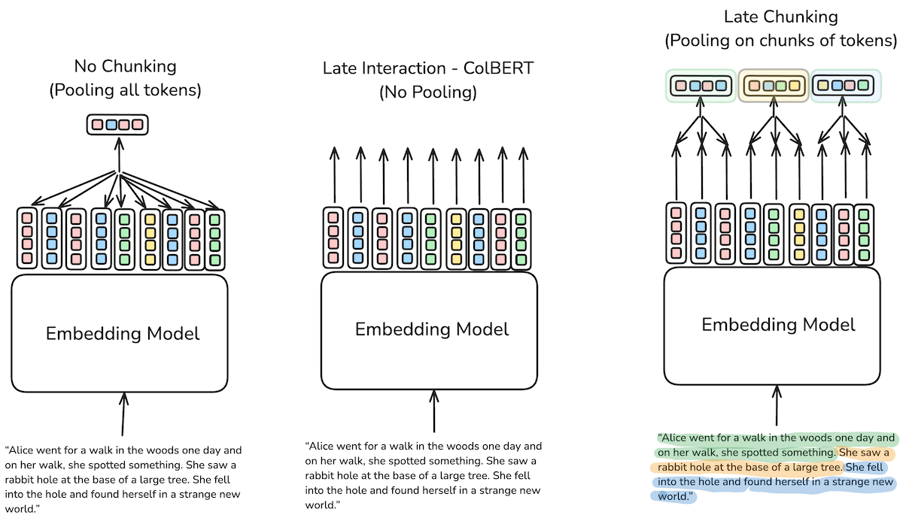
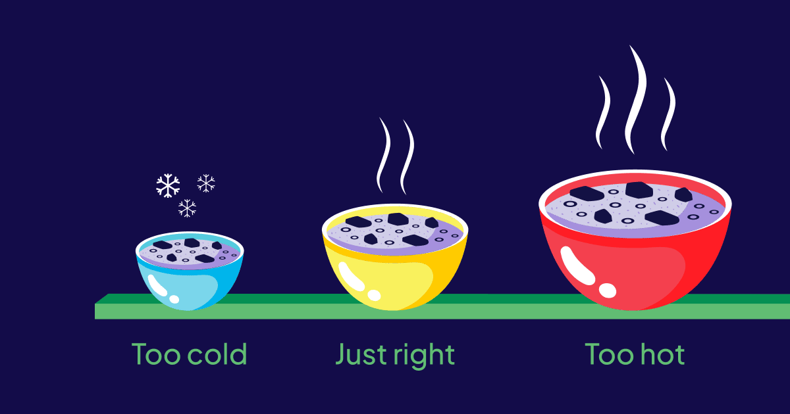

Last week, [JinaAI announced](https://jina.ai/news/late-chunking-in-long-context-embedding-models/) a new methodology to aid in long-context retrieval called late chunking. For users looking to build large-scale RAG applications, the difficulties of developing precise long context retrieval applications will be very familiar.

This article explores why late chunking may just be the happy medium between naive (but cheap) solutions and more precise (but expensive) solutions like ColBERT for users looking to build high-quality retrieval systems on long documents.

## What is Late Chunking?

:::note
Late chunking's similarity in name to late interaction is no coincidence, the authors of late chunking chose the name due to its links with late interaction.
:::

Late chunking aims to help preserve contextual information across large documents by performing the pooling step of embedding models' token representations at a later stage. To do this late chunking utilizes a long context embedding model to create token embeddings for every token in a document which are later broken up and pooled into multiple embeddings representing each chunk in the text.

In typical setups, all of these token embeddings would be pooled (mean, cls etc) into a single vector representation. However, with the onset of RAG it has become a concern that a single vector for long documents does not preserve enough contextual information and ultimately results in sacrificing precision during retrieval. Additionally, very long documents can result in more expensive calls to LLMs, increased latency, and a higher chance of hallucination as a result.

## Current Approaches to Long Context Retrieval

### Naive Chunking

This approach breaks up a long document into chunks (for which there exist numerous [chunking strategies](https://weaviate.io/developers/academy/py/standalone/chunking)) and individually embeds each of those chunks. While this solution can work in some setups it inherently does not account for any contextual dependencies that may exist between chunks because their embeddings are generated independently. Take for example the below paragraph:

> _Alice went for a walk in the woods one day and on her walk, she spotted something. She saw a rabbit hole at the base of a large tree. She fell into the hole and found herself in a strange new world._

If we were to chunk this paragraph by sentences we would get:

1. _Alice went for a walk in the woods one day and on her walk, she spotted something._
2. _She saw a rabbit hole at the base of a large tree._
3. _She fell into the hole and found herself in a strange new world._

Now imagine that a user has populated their vector database with multiple documents, paragraphs from a book, or even multiple books. If they were to ask **"Where did Alice fall"** we as humans can intuitively understand that the coreference of "her" in sentence 3 refers to Alice from sentence 1. However, since these embeddings were created independently of one another there is no way for the model representation of sentence 3 to account for this relationship to the name Alice.

### Late Interaction and ColBERT

On the other side of this is the ColBERT approach which utilizes [late interaction](https://arxiv.org/pdf/2004.12832). Unlike the naive approach described above, late interaction performs no pooling step on the token embeddings belonging to the query and document. Instead, each query token is compared with all document tokens. In a retrieval setup each document has its token-level representations stored in a vector index and then at query time they can be compared via late interaction.

While ColBERT was not initially designed to work with long context, [recent extensions](https://blog.vespa.ai/announcing-long-context-colbert-in-vespa/) to the underlying model have successfully extended the capabilities (via a sliding window approach) to achieve this. It is worth noting that this sliding window approach itself may actually result in the loss of important contextual information as it is a heuristic approach to creating overlaps in chunks and does not guarantee that all tokens have to ability to attend to all other tokens in the document.

Late interaction's core benefit is through the **contextual information** stored in **each individual token representation** being compared directly with each token representation in the query, without any pooling method being applied ahead of retrieval. While this approach is highly performant it can quickly become prohibitive for users from a storage and cost perspective.

For example, let's compare the storage requirements for a long context model that outputs **8000 token-level embeddings** and either uses late interaction or naive chunking:

:::note
This comparison assumes a fixed chunking strategy of 512 tokens for the naive approach. Where the text is split into chunks of 512 tokens, and each of those text chunks are individually embedded.
:::

| Approach                                       | Total embeddings required per document | Number of Documents | Total Vectors Stored |
| ---------------------------------------------- | -------------------------------------- | ------------------- | -------------------- |
| **Late Interaction (no pooling)**              | 8,000                                  | 100,000             | 800 million          |
| **Naive Approach (chunking before inference)** | 16 ( 8,000 / 512 )                     | 100,000             | ~1.6 million         |

**Key Takeaway:**

- The naive approach requires only **1/500th** of the storage resources compared to late interaction.
- Late interaction, while more precise, demands significantly more storage capacity.
- As we will see later, late chunking can offer the **same reduction in storage requirements** as the naive approach while preserving the contextual information that late interaction offers.

### Too hot, too cold, just right?

It appears we have a goldilocks problem, the naive approach may be more cost-effective but can reduce precision, while on the other hand, late interaction and ColBERT offer us increased precision at extreme costs. Surely there must be something in the middle that's just right? Well, late chunking may exactly that.

## How Late Chunking Works

As mentioned earlier late chunking origins are linked closely with late interaction in that both utilise the token-level vector representations that are produced during the forward pass of an embedding model.

Unlike late interaction, there is a pooling step that occurs after the initial inference. This pooling differs from traditional embedding models that pool all representations from every token into a single representation. In late interaction, this pooling is done on segments of the text according to some predetermined chunking strategy that can be aligned based on token spans or boundary cues, thus the term late chunking.

The result is that a long document is still represented by numerous embeddings but critically those embeddings are primed with contextual information relevant to their neighboring chunks.

### What's required

Late chunking requires a relatively simple alteration to the pooling step that can be implemented in under 30 lines of code and its vectors can be ingested as individual chunks into a vector database.

There are however some requirements needed ahead of performing late chunking:

1. **Long context models** are a requirement as we need token representation for the entirety of the long document to make them contextually aware. Notably, JinaAI tested using their model [jina-embeddings-v2-base-en](https://huggingface.co/jinaai/jina-embeddings-v2-base-en) which has the highest performance to parameter ratio on MTEBs long embed retrieval benchmark. This model supports up to 8192 tokens which is roughly equivalent to 10 standard pages of text. This model also uses a mean pooling strategy in typical behavior which is a requirement for any model looking to take advantage of late interaction.

2. **Chunking logic:** being able to chunk text ahead of inference as well as associating each chunk with its corresponding token spans is also critical to making late chunking work. Luckily there are many ways to create chunks in this manner and given late chunking's ability to condition each chunk on previous ones chunking approaches like fixed-size chunking without any overlap may be all that is needed.

## Late Chunking in Action

In the below head-to-head comparison, we used our recent [blog](https://weaviate.io/blog/launching-into-production) as a sample to test late chunking vs naive chunking against. Using a fixed token chunking strategy (**num tokens = 128**) resulted in the following sentence being split across two different chunks:

> Weaviate's native, multi-tenant architecture shines for customers who need to prioritize data privacy while maintaining fast retrieval and accuracy.

The two chunks that sentence was split split between are:

<table>
  <tr>
    <th> Chunk 1 </th>
    <th> Chunk 2 </th>
  </tr>
  <tr>
    <td>
      ...When building a Retrieval Augmented Generation (RAG) application, using
      account or user-specific data to contextualize results, data must remain
      within a dedicated tenant for its user group. Weaviate’s native,
      multi-tenant architecture shines for customers who need to prioritize...
    </td>
    <td>
      ...data privacy while maintaining fast retrieval and accuracy. On the
      other hand, we support some very large scale single-tenant use cases that
      orient toward real-time data access. Many of these are in e-commerce and
      industries that compete on speed and customer experience.
    </td>
  </tr>
</table>

### Head to Head Comparison

To answer the query:

> what do customers need to prioritise?

We need to return **both** of the above chunks. However, with the naive approach we end up with two separate chunks that are not neighboring one another.

But when we apply late chunking we end returning the two exact paragraphs over which the query is most relevant.

<table>
  <tr>
    <th>Naive Approach (Top 2)</th>
    <th>Late Chunking (Top 2)</th>
  </tr>
  <tr>
    <td>
      1. <b>Chunk 8</b> (Similarity: 0.756): "product updates, join our upcoming
      webinar."
    </td>
    <td>
      2. <b>Chunk 2</b> (Similarity: 0.701): "data privacy while maintaining
      fast retrieval and accuracy. On the other hand, we support some very large
      scale single-tenant use cases that orient toward real-time data access.
      Many of these are in e-commerce and industries that compete on speed and
      customer experience..."
    </td>
  </tr>
  <tr>
    <td>
      1. <b>Chunk 3</b> (Similarity: 0.748): "diverse use cases and the evolving
      needs of developers. Introducing hot, warm, and cold storage tiers. It's
      amazing to see our customers' products gain popularity, attracting more
      users, and in many cases, tenants. However, as multi-tenant use cases
      scale, infrastructure costs can quickly become prohibitive..."
    </td>
    <td>
      2. <b>Chunk 1</b> (Similarity: 0.689): "tech stacks to evolve. This
      optionality, combined with ease of use, helps teams scale AI prototypes
      into production faster. Flexibility is also vital when it comes to
      architecture. Different use cases have different requirements. For
      example, we work with many software companies and those operating in
      regulated industries. They often require multi-tenancy to isolate data and
      maintain compliance. When building a Retrieval Augmented Generation (RAG)
      application, using account or user-specific data to contextualize results,
      data must remain within a dedicated tenant for its user group. Weaviate’s
      native, multi-tenant architecture shines for customers who need to
      prioritize"
    </td>
  </tr>
</table>

Intuitively we as readers understand the link between the two correlated chunks, however with the naive approach there is no ability to **condition** the two separate embeddings with information about their neighboring chunks.

However, when we apply late chunking this contextual conditioning is preserved and we are able to return the two exact paragraphs needed to answer the query in a RAG application.

## What does this mean for users building RAG applications?

Many RAG setups today have to try and implement imperfect chunking heuristics to try and overcome this issue or utilise high strategies such as ColBERT to get the required performance. Late chunking is extremely promising as it lessens the requirement for very extremely tailored chunking strategies and provides a cost-effective path forward for users doing long context retrieval.

However the potential benefits go even further. If our ability to retrieve the right context is improved and semantical related passages can be retrieved in groups, users should also be able to:

- Reduce the total number of documents requested at query time.
- Only pass the most relevant contexts to LLMs, which should result in faster, cheaper, and more accurate responses.

## What's next?

Late chunking is a very new approach and as such there is limited data available on its performance in benchmarks, which for long context retrieval are already scarcely available.

The initial [quantitative benchmarks from JinaAI](https://github.com/jina-ai/late-chunking) are promising showing improved results across the board against naive chunking. The effect of the uplift from late chunking was also shown to improve as the document length in characters increased, which makes sense given where the late chunking operation comes into effect.

We are keen to test late chunking out in further detail, particularly in benchmarks designed for assessing performance in long embedding retrieval. So stay tuned for more on this topic as we continue to explore the benefits of late chunking and integrate it into Weaviate.
