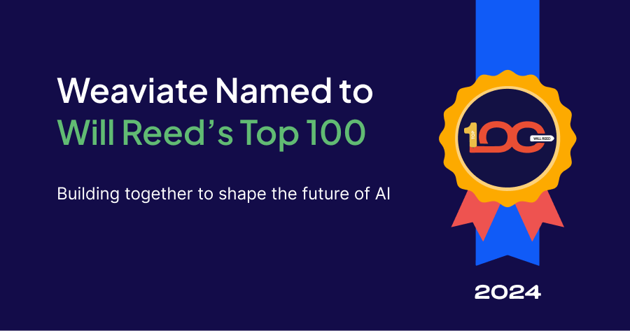

I am proud to share that Weaviate has been named #38 on [Will Reed’s Top 100 list](https://www.willreedstop100.com/), a curated list of emerging tech companies building values-driven cultures where employees and customers thrive. This recognition is a powerful testament to the work our entire team has been doing, and I want to take a moment to reflect on what it means to us—and where we’re headed.

## People as the foundation for our growth 
At the core of everything we do at Weaviate are the incredible people. From the beginning, we’ve been focused on creating a team that’s driven not just by talent but by a shared vision of building together. [Much like how cells](/company/playbook/cell-theory-planning-for-organic-growth) form the building blocks of any living organism, each team member plays a vital role in the success and evolution of our company. We’ve created a culture where each individual is empowered to contribute and grow within an interconnected system with kindness, transparency, and collaboration as core pillars. While we are [fully-remote](/company/remote) and distributed around the world, our teams are encouraged to work together and build trust in both synchronous and asynchronous ways. 

As may be obvious by name, our People team plays a huge role in retaining our culture and values, especially as we continue to onboard more and more employees. From hiring to onboarding to employee recognition and support, I’m grateful to have wonderful partners to drive the company forward with. 

In a fast-paced startup environment, it’s easy to get lost in the pursuit of scale or efficiency, but we’ve always believed that our people-first approach will fuel sustainable growth. We’ve built a culture where innovation, collaboration, and accountability thrive. That’s what makes [being recognized](https://www.willreedstop100.com/) on this list so rewarding.

## Driven by our community 
For us, growth is not just about numbers but about impact. It’s about creating value and helping our open-source community, customers, and partners be successful with AI. With open-source at the core of our ethos, we embed transparency and collaboration into both internal and external workstreams. This open exchange of ideas not only empowers our employees, but it contributes to a larger ecosystem of innovators. We are not just building or using a database—we’re building the future of AI together.

## Building the future, together
This recognition is not just an acknowledgment of our achievements, but also a reminder to continue pushing boundaries. We are deeply committed to our mission of empowering AI developers through accessible technology, community engagement, and open-source collaboration. We believe in building together, and as we move forward, we will continue to nurture our vibrant community. By providing an accessible, reliable, and flexible vector database ecosystem along with extensive [education and enablement](/deployment/enablement) resources, we aim to help developers and businesses harness the value of AI. 

I want to take a moment to thank Will Reed and PitchBook for this honor, but most importantly, I want to thank our team, our customers, and the broader community who have helped shape our journey. Here’s to the future! 

P.S. [We’re hiring](/company/careers) :) 

import WhatsNext from '/_includes/what-next.mdx';

<WhatsNext />