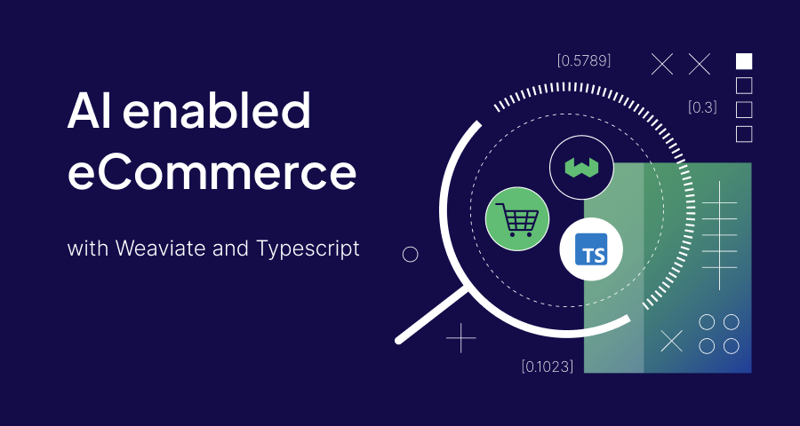
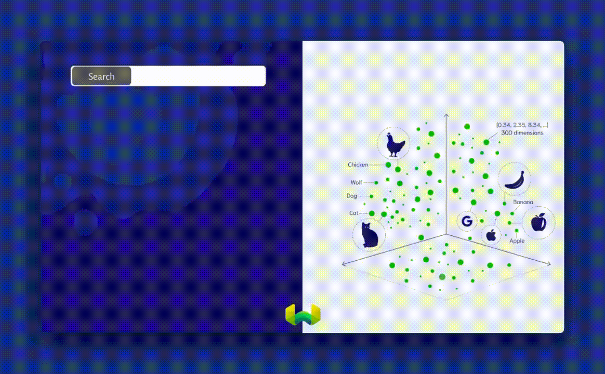
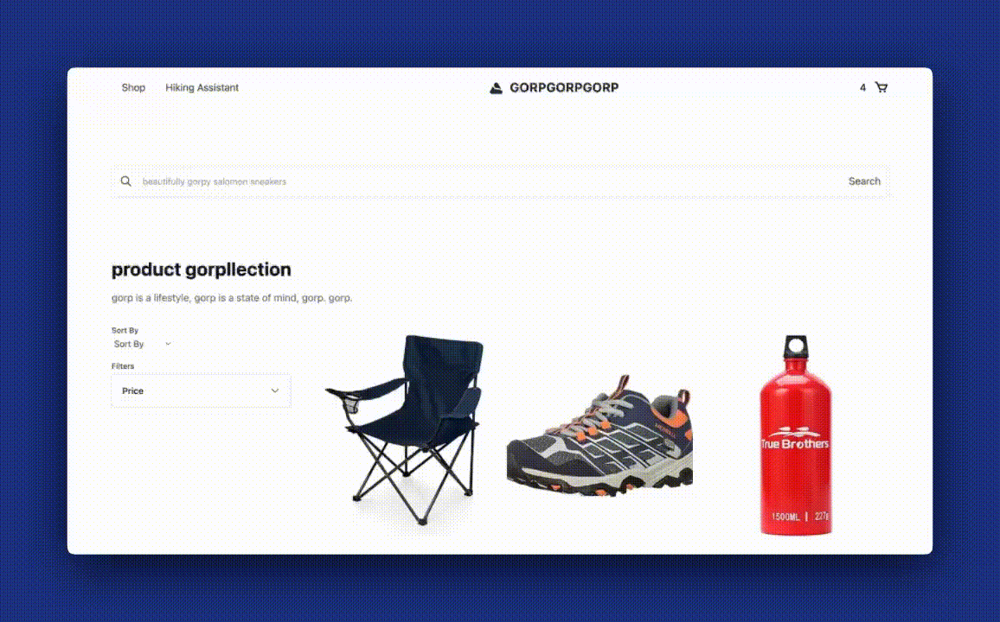

Today, there are [2.64 billion online buyers](https://www.yaguara.co/online-shopping-statistics/#:~:text=online%20shopping%2Dconsumer.-,There%20are%202.64%20billion%20online%20buyers%20in%20the%20world%20as,3.1%25%20increase%20in%20online%20buyers.) in the world. Making up more than 33% of the world’s total population. For comparison, [5.35 billion people](https://www.forbes.com/home-improvement/internet/internet-statistics/#:~:text=There%20are%205.35%20billion%20internet%20users%20worldwide.&text=Out%20of%20the%20nearly%208,the%20internet%2C%20according%20to%20Statista.) have access to the internet as of 2024. Almost half of the people using the internet shop online. However, that experience could be anything but perfect. A [Google report ](https://cloud.google.com/blog/topics/retail/search-abandonment-impacts-retail-sales-brand-loyalty)shows that nearly $300 billion is lost each year from bad online search experiences with 85% of global online customers viewing a brand differently after an unsuccessful search. Search is clearly very important for great e-commerce experiences. 


Here are a few more stats to drive the point home.


* Over [50% of eCommerce sales](https://www.doofinder.com/en/blog/ecommerce-site-search-statistics) can be traced back to customers who use the search bar! 
* It turns out that [34% of online shoppers](https://www.doofinder.com/en/blog/non-product-searches) try to search for non-product content. 
* [87% of shoppers begin](https://www.salesforce.com/blog/2018/08/digital-shopper-first-retail-report-research.html) their product searches online.
* 43% of users on retail websites [go directly to the search bar](https://www.forrester.com/report/MustHave+eCommerce+Features/-/E-RES89561).
* Site searchers are [2-3x more likely to convert.](https://neilpatel.com/blog/site-search-killing-your-conversion/)

A few standouts, but clearly, all drive the conclusion that search is a critical component of any e-commerce product.  

## eCommerce search pitfalls 
 
A few things are responsible for terrible search experiences, namely...


* **Poor or no responses (especially with non-product searches):** Users search for problems sometimes, not just products. 
* **A lack of multilingual search capabilities:** There is an expectation that site search should find users in whatever language they are comfortable in.
* **Limited “narrow’ search modalities:** Sometimes, text isn’t enough. Pictures do tell a thousand words, multimodal search today is no longer a luxury.

In this article, we’ll look at how we can make eCommerce search better by solving the pitfalls mentioned above. At the end of this post, we’ll have a demo e-commerce application to act as a basis for what a good search is.


## Understanding Semantic Search for eCommerce

Leveraging semantic search to power our e-commerce search solves each of the e-commerce search pitfalls we detailed above, but what exactly is semantic search? 

Semantic search, also known as vector search, uses machine learning to grasp the context of data by converting it to numerical vectors. It then uses these vectors to find matches based on conceptual similarity for accurate, relevant search results. 




Behind the scenes, it uses approximate nearest neighbors (ANN) algorithms to calculate the approximate nearest neighbors to a query, as opposed to kNN algorithms, which calculate the true nearest neighbors.


Semantic search with a vector database will rid us of the most terrible responses and assure of responses for non-keyword searches. The first problem is sorted. 


## Building an AI-enabled Search Web Application for eCommerce

We will use Nuxt.js, Weaviate, and Cohere to build our web application.

### Requirements
You need the following to go through with this tutorial.

- An LTS version of Node.js (Node 18+)
- Basic knowledge of Javascript
- Basic Git knowledge 
- A Cohere account

> The project that this tutorial is based on is available on [GitHub](https://github.com/weaviate-tutorials/nuxt-ecommerce-rag) if you’d like to give it a try before going through with the tutorial.


### Step 1: Installing dependencies

Create your Nuxt.js application with the command below.

```bash
npx nuxi@latest init <project-name>
```

You will also need to install a few dependencies. The Weaviate Typescript client to make using Weaviate in our app easier, dotenv to work with secrets, zod for schema validation, tsc and typescript to compile our Typescript code and Tailwind CSS for styling.

```bash
npm install weaviate-client dotenv zod tsc typescript
```

We need additional steps for tailwind as we install it as a Nuxt module.

```bash
npx nuxi@latest module add tailwindcss
```

After which you should add the following to your `nuxt.config` file. 

```javascript
export default defineNuxtConfig({
  modules: ['@nuxtjs/tailwindcss']
})
```

> To get Typescript and Weaviate setup, please follow these instructions detailed in the [client library documentation](https://weaviate.io/developers/weaviate/client-libraries/typescript/typescript-v3#typescript-setup). 

### Step 2: Getting Weaviate Running


To get started with Weaviate, we'll create a Weaviate instance on Weaviate Cloud Services as described in [this guide](https://weaviate.io/developers/wcs/quickstart). Weaviate is an AI-Native database. It gives you the flexibility to pick what embedding models you use. Embedding models come in all shapes and sizes, for this project, you will be using Cohere's multilingual embedding models. This will enable us to run searches in multiple languages helping us overcome one of the pitfalls. 

Once set up add your Weaviate URL, Admin API key and Cohere API key to a `.env` file in the root of your project. 

Your `nuxt.config` file should include your project secrets following [this format](https://github.com/weaviate-tutorials/nuxt-ecommerce-rag/blob/9b717ece0036eb8945ff4244689c71c41aafac06/nuxt.config.ts#L16). 


### Step 3: Importing data


We’ll be using [Amazon Products Sales Dataset 2023](https://www.kaggle.com/datasets/lokeshparab/amazon-products-dataset). You can find a clean-up version of the file on [Github](https://github.com/weaviate-tutorials/nuxt-ecommerce-rag/blob/main/public/products.csv). Download it and place it in your `./public` folder. 

In the root of your file, create a folder called import. Create a file called `simple.ts` to act as your import script.


```typescript
import weaviate, { type WeaviateClient } from "weaviate-client";
import 'dotenv/config'

import * as fs from 'fs';
import { join } from 'path';
import { parse } from 'csv-parse/sync';

let client: WeaviateClient | null = null;

async function initClient() {
    if (!client) {
        client = await weaviate.connectToWeaviateCloud(process.env.NUXT_WEAVIATE_HOST_URL || '', {
            authCredentials: new weaviate.ApiKey(process.env.NUXT_WEAVIATE_ADMIN_KEY!!),
            headers: {
                "X-Cohere-Api-Key": process.env.NUXT_COHERE_API_KEY!!,
 },
 });
 }

    const ready = await client.isReady()
    console.info('Client is ready?', ready)
    return client
}

async function createCollection() {
    client = await initClient()

    const productsResponse = await client.collections.create({
        name: "TestProduct",
        vectorizers: weaviate.configure.vectorizer.text2VecCohere({
            model: 'embed-multilingual-v3.0',
            sourceProperties: ['name', 'sub_category'] 
 }),
 })

}

async function importProductData(fileName: string, collectionName: string) {
    client = await initClient();
    const filePath = join(process.cwd(), `./public/${fileName}`);
    const content = await fs.readFileSync(filePath)

    // Parse the CSV content
    console.log('content', content)
    const records = parse(content, { delimiter: ';' });

    const myCollection = client.collections.get(collectionName);
    let itemsToInsert = [];
    let counter = 0;

    for (const item of records) {
        counter++
        if (counter % 1000 == 0) {
            console.log(`Import: ${counter}`);
 }

        itemsToInsert.push({
            name: item[0],
            main_category: item[1],
            sub_category: item[2],
            image: item[3],
            link: item[4],
            rating: item[5],
            price: item[8]
 });

        // insert data in batches of 2k objects
        if (itemsToInsert.length == 2000) {
            const response = await myCollection.data.insertMany(itemsToInsert);
            itemsToInsert = [];

            if (response.hasErrors) {
                throw new Error("Something went wrong in import!");
 }
 }

 }


    // insert the remaining objects
    if (itemsToInsert.length > 0) {
        const response = await myCollection.data.insertMany(itemsToInsert);

        if (response.hasErrors) {
            throw new Error("Something went wrong in import!");
 }
 }

    return { status: "Import Complete" };
}


// Uncomment to create collection and import data before you run the script
// await createCollection()
// await importProductData('products.csv','TestProduct')
```

This creates a collection with the `createCollection()` called "TestProduct" which has the Cohere embedding model defined as vectorizers. It then imports the data in our `products.csv` file into Weaviate.

To run our import process, we need to add the following scripts to our `package.json` file.

```json
 …
"scripts": {
      …
    "import": "npx tsc && node import/simple.js"
      …
 },
 …

```


We can now run `npm run import` to start the import process. Depending on how much data you're importing, it can take a little time. While that runs, let's create our search experience.


### Step 4: Building Semantic Search Functionality


To start, we'll create an API route to make an initial call and display products. 

In `server/api` create a file called `init.ts` and paste the following code.


```ts
import weaviate, { WeaviateClient } from "weaviate-client"

export default defineLazyEventHandler(async () => {
  const config = useRuntimeConfig()

const client: WeaviateClient = await weaviate.connectToWeaviateCloud(config.weaviateHostURL,{
    authCredentials: new weaviate.ApiKey(config.weaviateReadKey),
    headers: {
      'X-Cohere-Api-Key': config.cohereApiKey,
 }
 }
)

async function initialFetch() {
const myProductCollection = client.collections.get('TestProduct')

const response = await myProductCollection.query.fetchObjects({ limit : 20 })

return response.objects

}

  return defineEventHandler(async () => {
  
    return await initialFetch()
 })
})
```

This code calls `initialFetch()` which fetches 20 objects from the Weaviate database and displays them so we have products for our users to see when they land on our page.

Next, in `server/api` create a file called `search.ts`

```ts
import weaviate, { WeaviateClient } from "weaviate-client"
import { z } from 'zod'

export default defineLazyEventHandler(async () => {
  const config = useRuntimeConfig()

const client: WeaviateClient = await weaviate.connectToWeaviateCloud(config.weaviateHostURL,{
    authCredentials: new weaviate.ApiKey(config.weaviateReadKey),
    headers: {
      'X-Cohere-Api-Key': config.cohereApiKey,
 }
 }
)

const responseSchema = z.object({
  query: z.string(),
})

async function vectorSearch(searchTerm:string) {
  const myProductCollection = client.collections.get('TestProduct')

const response = await myProductCollection.query.nearText(searchTerm, { limit : 10 })

return response.objects


}

  return defineEventHandler<{query: { query: string } }>(async (event) => {
  
    const result = await getValidatedQuery(event, body => responseSchema.safeParse(body))
    if (!result.success)
      throw result.error.issues
  
    const searchTerm = result.data.query
  
    return await vectorSearch(searchTerm)
 })
})
```


To give everything an interface, in `app.vue` paste the following code.

```js
<template>
    <div>
        <div class="bg-white text-gray-600 work-sans leading-normal text-base tracking-normal">
            <section class="bg-white py-8 container py-8 px-6 mx-auto box pt-6 box-wrapper">
                <div class=" bg-white rounded flex items-center w-full p-3 shadow-sm border border-gray-200">
                    <button class="outline-none focus:outline-none"><svg class=" w-5 text-gray-600 h-5 cursor-pointer"
                            fill="none" stroke-linecap="round" stroke-linejoin="round" stroke-width="2"
                            stroke="currentColor" viewBox="0 0 24 24">
                            <path d="M21 21l-6-6m2-5a7 7 0 11-14 0 7 7 0 0114 0z"></path>
                        </svg></button>
                    <input v-model="searchTerm" type="search" name="" id="" placeholder="beautifully gorpy salomon sneakers"
                        x-model="q" class="w-full pl-4 text-sm outline-none focus:outline-none bg-transparent">
                    <div>
                        <button @click="submitSearch"> Search
                        </button>
                    </div>
                </div>
            </section>

            <section class="bg-white py-4">
                <div class="container mx-auto flex items-center flex-wrap pb-12">
                    <div v-if="!searchMade">
                        <section>
                            <div class="mx-auto max-w-screen-xl px-4 py-8 sm:px-6 sm:py-4 lg:px-">

                                <div class="mt-4 lg:mt-8 lg:grid lg:grid-cols-4 lg:items-start lg:gap-8">

                                    <div class="lg:col-span-3">
                                        <ul class="grid gap-4 sm:grid-cols-2 lg:grid-cols-3">
                                            <div v-for="item in products">
                                                <li>
                                                    <a href="#" class="group block overflow-hidden">
                                                        
                                                        <div class="relative bg-white pt-3">
                                                            <h3
                                                                class="text-xs text-gray-700 group-hover:underline group-hover:underline-offset-4">
                                                                    {{ item.properties.name.slice(0, 80) }}...
                                                            </h3>

                                                            <p class="mt-2">
                                                                <span class="sr-only"> Regular Price </span>
                                                                <span class="tracking-wider text-gray-900">
                                                                   ${{ parseFloat(item.properties.price.replace("₹", ''))
                                                                    }}</span>
                                                            </p>

                                                        </div>
                                                    </a>
                                                    <button @click="addToCart(item)" class="bg-blue-300 text-white p-1">Add to Cart</button>
                                                </li>
                                            </div>
                                        </ul>
                                    </div>
                                </div>
                            </div>
                        </section>
                    </div>

                    <div v-if="searchMade">
                        <section>
                            <div class="mx-auto max-w-screen-xl px-4 py-8 sm:px-6 sm:py-4 lg:px-">
                                <header>
                                    <h2 class="text-xl font-bold text-gray-900 sm:text-3xl">Product Collection</h2>

                                    <p class="mt-4 max-w-md text-gray-500"> gorp is a lifestyle, gorp is a state of mind, gorp. gorp.
                                    </p>
                                </header>

                                <div class="mt-8 block lg:hidden">
                                    <button
                                        class="flex cursor-pointer items-center gap-2 border-b border-gray-400 pb-1 text-gray-900 transition hover:border-gray-600">
                                        <span class="text-sm font-medium"> Filters & Sorting </span>

                                        <svg xmlns="http://www.w3.org/2000/svg" fill="none" viewBox="0 0 24 24"
                                            stroke-width="1.5" stroke="currentColor" class="size-4 rtl:rotate-180">
                                            <path stroke-linecap="round" stroke-linejoin="round"
                                                d="M8.25 4.5l7.5 7.5-7.5 7.5" />
                                        </svg>
                                    </button>
                                </div>

                                <div class="mt-4 lg:mt-8 lg:grid lg:grid-cols-4 lg:items-start lg:gap-8">
                                    <Sidebar />

                                    <div class="lg:col-span-3">
                                        <ul class="grid gap-4 sm:grid-cols-2 lg:grid-cols-3">
                                            <div v-for="item in searchResult">
                                                <li>
                                                    <a href="#" class="group block overflow-hidden">
                                                        

                                                        <div class="relative bg-white pt-3">
                                                            <h3
                                                               class="text-xs text-gray-700 group-hover:underline group-hover:underline-offset-4">
                                                                 {{ item.properties.name.slice(0, 80) }}...
                                                            </h3>

                                                            <p class="mt-2">
                                                                <span class="sr-only"> Regular Price </span>

                                                                <span class="tracking-wider text-gray-900">
                                                                     ${{ parseFloat(item.properties.price.replace("₹", ''))
                                                                    }}</span>
                                                            </p>
                                                        </div>
                                                    </a>
                                                    <button @click="addToCart(item)" class="bg-blue-300 text-white p-1">Add to Cart</button>
                                                </li>
                                            </div>
                                        </ul>
                                    </div>
                                </div>
                            </div>
                        </section>
                    </div>
                </div>
            </section>

        </div>
    </div>
</template>
```

This puts up an interface we can interact with i.e. a search input and search button.

For the logic to actually run our searches, below your `<template>` tag, paste the following.

```ts
<script setup>
import { nextTick } from 'vue';

const searchMade = ref(false)
const loading = ref(false)
const searchTerm = ref('')
const searchResult = ref()

let products = ref({});

onMounted(async () => {
    await nextTick();
    products.value = await $fetch(`/api/init`)
});

async function submitSearch() {
    searchResult.value = null
    loading.value = true
    searchResult.value = await $fetch(`/api/search?query=${searchTerm.value}`)
    searchMade.value = true
    loading.value = false
}

</script>
```

This snippet makes a call to the API route we created earlier and then passes the user's search as a query. We then display the results on our web page.


## Final Result



Searching for "too much sunlight" gives relevant products back.

Searching "randoneé glaceé" (French for an icy hike) will give you relevant products for icy hikes showing multilingual understanding and catering to non-product searches.

We have one pitfall left, semantic search lets us leverage the best of multi-modality, you can read more about how to do that in that [blog post here](../2024-01-23-typescript-multimodal-search/index.mdx).


> As a challenge, if you can get multi-modality working on your version of an e-commerce application. Send [me a message on LinkedIn](https://www.linkedin.com/in/malgamves/) and we’ll send you some goodies. 


## Conclusion

We just saw how to marginally make our eCommerce experiences better with AI search. Without even getting into RAG or recommendations. If you'd like to see the full implementation of this project, find it [on Github](https://github.com/weaviate-tutorials/nuxt-ecommerce-rag/tree/main) and keep an eye on our blog as we will publish a second part talking about RAG in eCommerce. If this is something you find interesting or would love to continue a conversation on, find me online at [malgamves](https://twitter.com/malgamves).


import WhatsNext from '/_includes/what-next.mdx';

<WhatsNext />
