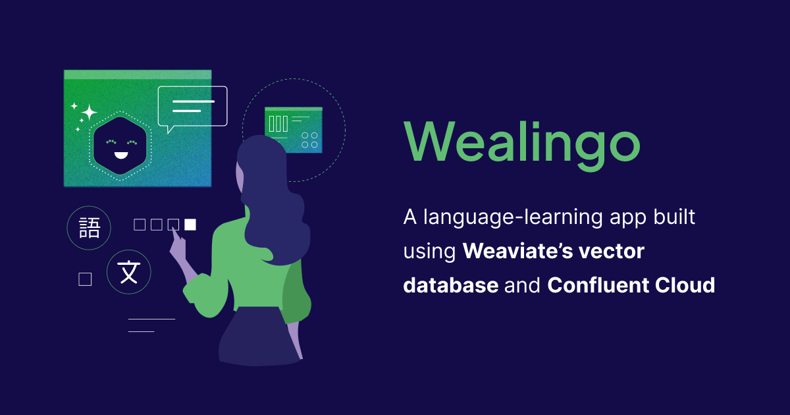

At [Confluent Current 2024](https://current.confluent.io/), we demoed Wealingo, a language-learning app built using Weaviate’s vector database and Confluent Cloud, a ****fully managed streaming data service based on Apache Kafka. The demo highlighted how **real-time data** and **vector embeddings** enable personalized learning by continuously adapting to user performance. Let’s dive into how Wealingo leverages these technologies to provide dynamic, tailored language lessons in real time.

## App Overview

Wealingo is a personalized language-learning app designed to help users learn Italian through a tailored experience. It stands out with two key innovations:

1. **Semantic Search**: Users can quickly search for lessons across all topics, bypassing a rigid structure. This enables them to immediately find the most relevant content based on their current needs and context.
2. **Personalized Question Generation**: The app generates custom questions based on individual user performance and preferences.

The goal is to provide continuous, adaptive learning aligned with each user’s strengths, weaknesses, and interests.

### Architecture

<figure style={{ maxWidth: "90%", margin: "0 auto" }}>
  
</figure>

Wealingo’s architecture consists of the following key components:

1. Mobile Application: Where users interact with the app, search for phrases, and request personalized questions.
2. [**PostgreSQL**](https://www.postgresql.org/): Acts as the system of record, storing all application and user data, including the question bank and user performance.
3. [Debezium PostgreSQL Change Data Capture](https://debezium.io/documentation/reference/stable/connectors/postgresql.html) (CDC): Captures any changes in the database and streams them to Confluent Cloud in real-time.
4. [Confluent Cloud](https://www.confluent.io/confluent-cloud/): Processes real-time data streams, ensuring the app adapts to user progress.
5. Large Language Model (LLM): Generates personalised questions
6. Weaviate: Handles vector embeddings, semantic search and interacting with the LLM

## How It Works

### Semantic Search

Semantic search in Wealingo allows users to find questions based on the meaning behind their queries, rather than being tied to exact keywords. This flexibility helps users quickly locate lessons that are most relevant to their current needs.

For example, let’s say the user is interested in lessons about “how to buy flowers”. Doing a semantic search for this query will return results like:

- I want to buy red roses
- Can I buy a basket of yellow daisies?
- Do you have hibiscus flowers in different colors?

<figure style={{ maxWidth: "90%", margin: "0 auto" }}>
  
</figure>

By comparing vector embeddings of the user search queries with the translations already saved in the database, we can retrieve phrases that are analogous to what the user requested. With Weaviate, you can combine the power of vector and keyword searches by using the hybrid search API. Hybrid search fuses the result sets from vector and keyword search into one, based on the value of alpha in the api. An `alpha` of `1` is a pure vector search, while `0` is a pure keyword search. 

```python
search_query = "how to buy flowers"

conversations = client.collections.get("ConversationalStatements")

response = conversations.query.hybrid(
    limit=10,
    query=search_query,
    query_properties=["question"],
    return_properties=["question", "answer"],
    return_metadata=MetadataQuery(score=True),
)
```

### Personalized Question Generation

Sometimes, users may need help with highly specific scenarios. For example, let’s assume a user wants to learn about “buying a bouquet of blue lilies.” This level of specificity is unlikely to be found in any pre-written lesson because the lessons are written by human teachers and no human could anticipate every scenario.

This is where Generative AI steps in. Wealingo leverages **Weaviate** and **LLMs** to dynamically generate a personalized question that fits the user’s exact needs and tailored to their current skill level, helping them learn in context, no matter how niche the request.

For example, if a user asks the AI to generate questions about  “buying a bouquet of blue lilies”:

<figure style={{ maxWidth: "60%", margin: "0 auto" }}>
  
</figure>

Under the hood,  the app first gathers the query and relevant profile data, such as the user’s past mistakes, and sends this information to **Weaviate**. Weaviate uses these inputs to craft a prompt, which it then passes to an LLM (OpenAI in this case) via the [generative-openai](https://weaviate.io/developers/weaviate/model-providers/openai/generative) module. The LLM generates personalized questions that are sent back to the app and saved in the **PostgreSQL** database, which serves as the system of record. To capture the fluency of the user, Wealingo fetches the past unanswered or wrong questions and uses them in the context. 

```python
context = "Create 3 new questions based on fluency of user"
generate_query = "buying a bouquet of blue lilies"

response = conversations.generate.near_text(
    query=generate_query,
    limit=10,
    grouped_task=context,
)
```

To keep everything up to date, the Debezium PostgreSQL CDC connector streams any newly generated questions into a **Kafka** queue in real-time. From there, our [spark-connector](https://github.com/weaviate/spark-connector) consumes the questions from Kafka, ensuring that the next time a user searches for something similar e.g. “purchase bouquet of blue lilies”, the AI-generated content will already be in Weaviate, ready for retrieval:

<figure style={{ maxWidth: "80%", margin: "0 auto" }}>
  
</figure>

This setup allows Wealingo’s question bank to continuously grow and evolve, according to real-world user needs.

## Conclusion

Wealingo demonstrates how real-time data streaming and AI can transform language learning into a personalized experience. With Weaviate’s seamless integration into Confluent Cloud and LLMs, the app dynamically generates tailored lessons and continuously evolves based on user interactions.

If you're interested in exploring further, feel free to fork the [Wealingo code](https://github.com/weaviate/wealingo-demo) and experiment with it yourself.

import WhatsNext from '/_includes/what-next.mdx';

<WhatsNext />
