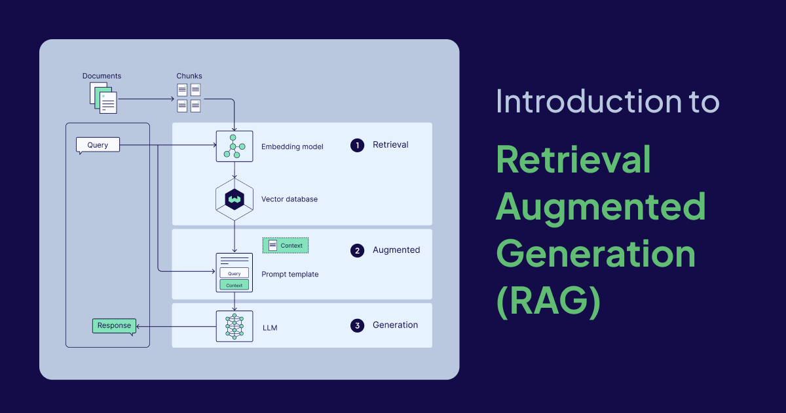
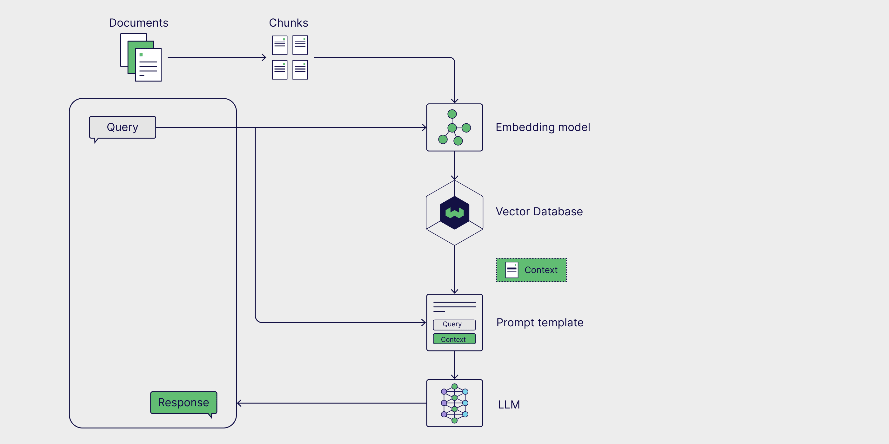
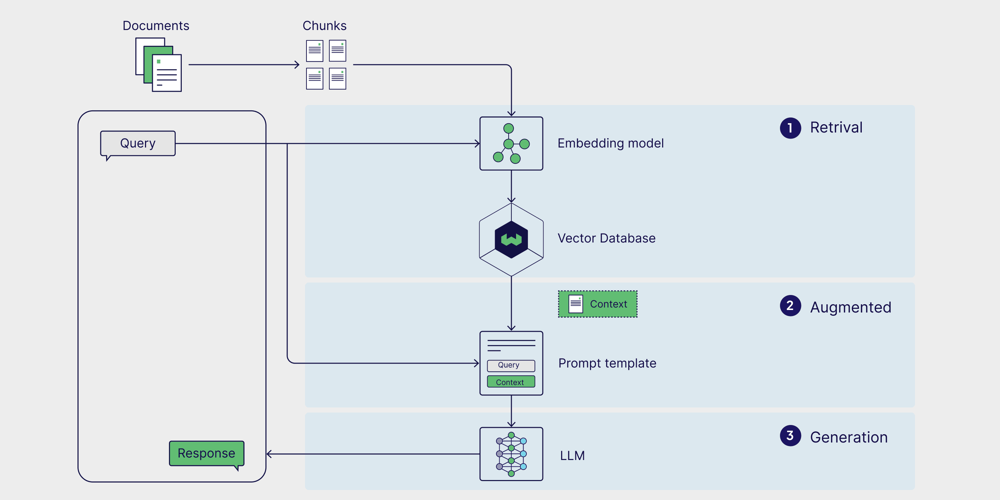
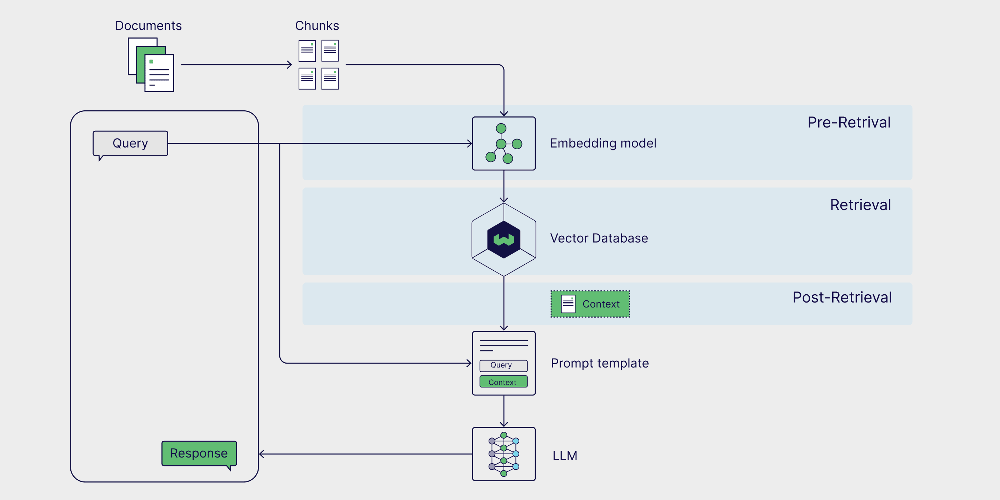

import Verba from './img/verba_nocompress.mp4';

Despite the steady release of increasingly larger and smarter models, state-of-the-art generative large language models (LLMs) still have a big problem: they struggle with tasks that require specialized knowledge. This lack of specialized knowledge can lead to issues like hallucinations, where the model generates inaccurate or fabricated information. **Retrieval-Augmented Generation (RAG)** helps mitigate this by allowing the model to pull in real-time, niche data from external sources, enhancing its ability to provide accurate and detailed responses.

Despite these limitations, generative models are impactful tools that automate mundane processes, assist us in our everyday work, and enable us to interact with data in new ways. So how can we leverage their broad knowledge while also making them work for our specific use cases? The answer lies in providing generative models with task-specific data.

In this article, we take a deep dive into Retrieval Augmented Generation (RAG), a framework that enhances the capabilities of generative models by allowing them to reference external data. We’ll explore the limitations of generative models that led to the creation of RAG, explain how RAG works, and break down the architecture behind RAG pipelines. We’ll also get practical and outline some real-world RAG use cases, suggest concrete ways to implement RAG, introduce you to a few advanced RAG techniques, and discuss RAG evaluation methods.

:::note

LLM is a broad term that refers to language models trained on large datasets that are capable of performing a variety of text- and language-related tasks. LLMs that generate novel text in response to a user prompt, like those used in chatbots, are called generative LLMs, or **generative models**. LLMs that encode text data in the semantic space are called **embedding models**. Thus, we use the terms generative model and embedding model to distinguish between these two types of models in this article.

:::

## Limitations of generative models

Generative models are trained on large datasets, including (but not limited to) social media posts, books, scholarly articles and scraped webpages, allowing them to acquire a sense of general knowledge. As a result, these models can generate human-like text, respond to diverse questions, and assist with tasks like answering, summarizing, and creative writing.

However, training datasets for generative models are inevitably incomplete, as they lack information on niche topics and new developments beyond the dataset’s cutoff date. Generative models also lack access to proprietary data from internal databases or repositories. Furthermore, when these models don’t know the answer to a question, they often guess, and sometimes not very well. This tendency to generate incorrect or fabricated information in a convincing manner is known as hallucination, and can cause real reputational damage in client-facing AI applications.

The key to enhancing performance on specialized tasks and reducing hallucinations is to provide generative models with additional information not found in their training data. This is where RAG comes in.

## What is Retrieval Augmented Generation (RAG)?

[**Retrieval-Augmented Generation (RAG)**](https://arxiv.org/abs/2005.11401) is a framework that *augments* the general knowledge of a generative LLM by providing it with additional data relevant to the task at hand *retrieved* from an external data source.

External data sources can include internal databases, files, and repositories, as well as publicly available data such as news articles, websites, or other online content. Access to this data empowers the model to respond more factually, cite its sources in its responses, and avoid “guessing” when prompted about information not found in the model’s original training dataset.

Common use cases for RAG include retrieving up-to-date information, accessing specialized domain knowledge, and answering complex, data-driven queries.

## RAG architecture

The basic parts of a RAG pipeline can be broken down into **three components**: an external knowledge source, a prompt template, and a generative model. Together, these components enable LLM-powered applications to generate more accurate responses by leveraging valuable task-specific data.



### External knowledge source

Without access to external knowledge, a generative model is limited to generating responses based only on its **parametric knowledge**, which is learned during the model training phase. With RAG, we have the opportunity to incorporate **external knowledge sources**, also referred to as **non-parametric knowledge**, in our pipeline.

External data sources are often task-specific and likely beyond the scope of the model’s original training data, or its parametric knowledge. Furthermore, they are often stored in vector databases and can vary widely in topic and format.

Popular sources of external data include internal company databases, legal codes and documents, medical and scientific literature, and scraped webpages. Private data sources can be used in RAG as well. Personal AI assistants, like Microsoft’s Copilot, leverage multiple sources of personal data including, emails, documents, and instant messages to provide tailored responses and automate tasks more efficiently.

### Prompt template

Prompts are the tools we use to communicate our requests to generative models. Prompts may contain several elements, but generally include a query, instructions, and context that guides the model in generating a relevant response.

**Prompt templates** provide a structured way to generate standardized prompts, in which various queries and contexts can be inserted. In a RAG pipeline, relevant data is retrieved from an external data source and inserted into prompt templates, thus augmenting the prompt. Essentially, prompt templates act as the bridge between the external data and the model, providing the model with contextually relevant information during inference to generate an accurate response.

```py
prompt_template = "Context information is below.\n"
                  "---------------------\n"
                  "{context_str}\n"
                  "---------------------\n"
                  "Given the context information and not prior knowledge, "
                  "answer the query.\n"
                  "Query: {query_str}\n"
                  "Answer: "
```

### Generative large language model (LLM)

The final component in RAG is the generative LLM, or generative model, which is used to generate a final response to the user’s query. The augmented prompt, enriched with information from the external knowledge base, is sent to the model, which generates a response that combines the model's internal knowledge with the newly retrieved data.

Now that we’ve covered the RAG architecture and its key components, let’s see how they come together in a RAG workflow.

## How does RAG work?

RAG is a multi-step framework that works in two stages. First, the external knowledge is preprocessed and prepared for retrieval during the ingestion stage. Next, during the inference stage, the model retrieves relevant data from the external knowledge base, augments it with the user’s prompt, and generates a response. Now, let’s take a closer look at each of these stages.

### Stage 1: Ingestion

First, the external knowledge source needs to be prepared. Essentially, the external data needs to be cleaned and transformed into a format that the model can understand. This is called the **ingestion stage**. During ingestion, text or image data is transformed from its raw format into **embeddings** through a process called **vectorization**. Once embeddings are generated, they need to be stored in a manner that allows them to be retrieved at a later time. Most commonly, these embeddings are stored in a vector database, which allows for quick, efficient retrieval of the information for downstream tasks.


### Stage 2: Inference

After external data is encoded and stored, it’s ready to be retrieved during **inference**, when the model generates a response or answers a question. Inference is broken down into three steps: retrieval, augmentation, and generation.



#### Retrieval

The inference stage starts with retrieval, in which data is retrieved from an external knowledge source in relation to a user query. Retrieval methods vary in format and complexity, however in the naive RAG schema, in which external knowledge is embedded and stored in a vector database, similarity search is the simplest form of retrieval.

To perform similarity search, the user query must be first embedded in the same multi-dimensional space as the external data, which allows for direct comparison between the query and embedded external data. During [**similarity search**](https://weaviate.io/developers/weaviate/search/similarity), the distance between the query and external data points is calculated, returning those with the shortest distance and completing the retrieval process.

#### Augmentation

Once the most relevant data points from the external data source have been retrieved, the augmentation process integrates this external information by inserting it into a predefined prompt template.

#### Generation

After the augmented prompt is injected into the model’s context window, it proceeds to generate the final response to the user’s prompt. In the generation phase, the model combines both its internal language understanding and the augmented external data to produce a coherent, contextually appropriate answer.

This step involves crafting the response in a fluent, natural manner while drawing on the enriched information to ensure that the output is both accurate and relevant to the user's query. While augmentation is about incorporating external facts, generation is about transforming that combined knowledge into a well-formed, human-like output tailored to the specific request.

## RAG use cases

Now that we’ve covered what RAG is, how it works, and its architecture, let’s explore some practical use cases to see how this framework is applied in real-world scenarios. Augmenting generative LLMs with up-to-date, task-specific data boosts their accuracy, relevance, and ability to handle specialized tasks. Consequently, RAG is widely used for real-time information retrieval, creating content recommendation systems, and building personal AI assistants.

### Real-time information retrieval

When used alone, generative models are limited to retrieving only information found in their training dataset. When used in the context of RAG, however, these models can retrieve data and information from external sources, ensuring more accurate and up-to-date responses. One such example is ChatGPT-4o’s ability to access and retrieve information directly from the web in real-time. This is an example of a RAG use case that leverages an external data source that is *not* embedded in a vector database and can be especially useful in responding to user queries regarding the news or other current events, such as stock prices, travel advisories, and weather updates.

### Content recommendation systems

Content recommendation systems analyze user data and preferences to suggest relevant products or content to users. Traditionally, these systems required sophisticated ensemble models and massive user preference datasets. RAG simplifies recommendation systems directly integrating external, contextually relevant user data with the model's general knowledge, allowing it to generate personalized recommendations.

### Personal AI assistants

Our personal data, including files, emails, Slack messages, and notes are a valuable source of data for generative models. Running RAG over our personal data enables us to interact with it in a conversational way, increasing efficiency and allowing for the automation of mundane tasks. With AI assistants, such as Microsoft’s Copilot and Notion’s Ask AI, we can use simple prompts to search for relevant documents, write personalized emails, summarize documents and meeting notes, schedule meetings, and more.

## How to implement RAG

Now that we know how RAG works, let’s explore how to build a functional RAG pipeline. RAG can be implemented through a number of different frameworks, which simplify the building process by providing pre-built tools and modules for integrating individual RAG components as well as external services like vector databases, embedding generation tools, and other APIs.

LangChain, LlamaIndex, and DSPy are all robust open source Python libraries with highly engaged communities that offer powerful tools and integrations for building and optimizing RAG pipelines and LLM applications.

* [**LangChain**](https://www.langchain.com/) provides building blocks, components, and third-party integrations to aid in the development of LLM-powered applications. It can be used with [LangGraph](https://langchain-ai.github.io/langgraph/tutorials/introduction/) for building agentic RAG pipelines and [LangSmith](https://docs.smith.langchain.com/) for RAG evaluation.
* [**LlamaIndex**](https://www.llamaindex.ai/) is a framework that offers tools to build LLM-powered applications integrated with external data sources. LlamaIndex maintains the [LlamaHub](https://llamahub.ai/), a rich repository of data loaders, agent tools, datasets, and other components, that streamline the creation of RAG pipelines.
* [**DSPy**](https://dspy-docs.vercel.app/) is a modular framework for optimizing LLM pipelines. Both LLMs and RMs (Retrieval Models) can be configured within DSPy, allowing for seamless optimization of RAG pipelines.

:::note

Weaviate provides [integrations](https://weaviate.io/developers/integrations) and [recipes](https://github.com/weaviate/recipes) for each of these frameworks. For specific examples, take a look at our notebooks that show how to build RAG pipelines with Weaviate and [LlamaIndex](https://github.com/weaviate/recipes/blob/main/integrations/llm-frameworks/llamaindex/retrieval-augmented-generation/naive_rag.ipynb) and [DSPy](https://github.com/weaviate/recipes/blob/main/integrations/llm-frameworks/dspy/1.Getting-Started-with-RAG-in-DSPy.ipynb).

:::

If you’re looking for a way to get up and running with RAG quickly, check out [**Verba**](https://github.com/weaviate/Verba), an open source out-of-the-box RAG application with a shiny, pre-built frontend. Verba enables you to visually explore datasets, extract insights, and build customizable RAG pipelines in just a few easy steps, without having to learn an entirely new framework. Verba is a multifunctional tool that can be used as a playground for testing and experimenting with RAG pipelines as well as for personal tasks like assisting with research, analyzing internal documents, and streamlining various RAG-related tasks.

<figure>
  <video width="100%" autoplay loop muted controls>
    <source src={Verba} type="video/mp4" />
    Your browser does not support the video tag.
  </video>
  <figcaption>Out-of-the-box RAG implementation with Verba</figcaption>
</figure>

## RAG techniques

The vanilla RAG workflow is generally composed of an external data source embedded in a vector database retrieved via similarity search. However, there are several ways to enhance RAG workflows to yield more accurate and robust results, which collectively are referred to as advanced RAG.

Functionality of RAG pipelines can be further extended by incorporating the use of graph databases and agents, which enable even more advanced reasoning and dynamic data retrieval. In this next section, we’ll go over some common advanced RAG techniques and give you an overview of Agentic RAG and Graph RAG.

### Advanced RAG

Advanced RAG techniques can be deployed at various stages in the pipeline. Pre-retrieval strategies like **metadata filtering** and text **chunking** can help improve the retrieval efficiency and relevance by narrowing down the search space and ensuring only the most relevant sections of data are considered. Employing more advanced retrieval techniques, such as **hybrid search**, which combines the strengths of similarity search with keyword search, can also yield more robust retrieval results. Finally, **re-ranking** retrieved results with a ranker model and using a generative LLM **fine-tuned** on domain-specific data help improve the quality of generated results.



For a more in-depth exploration of this topic, check out our blog post on [advanced RAG techniques](https://weaviate.io/blog/advanced-rag#3-fine-tuning-embedding-models).

### Agentic RAG

**AI agents** are autonomous systems that can interpret information, formulate plans, and make decisions. When added to a RAG pipeline, agents can reformulate user queries and re-retrieve more relevant information if initial results are inaccurate or irrelevant. Agentic RAG can also handle more complex queries that require multi-step reasoning, like comparing information across multiple documents, asking follow-up questions, and iteratively adjusting retrieval and generation strategies.

To take a closer look at a RAG pipeline that incorporates agents and utilizes advanced techniques like text chunking and reranking, check out this [post](https://www.llamaindex.ai/blog/agentic-rag-with-llamaindex-2721b8a49ff6) and accompanying [notebook](https://github.com/cobusgreyling/LlamaIndex/blob/d8902482a247c76c7902ded143a875d5580f072a/Agentic_RAG_Multi_Document_Agents-v1.ipynb) on the LlamaIndex blog.

### Graph RAG

While traditional RAG excels at simple question answering tasks that can be resolved by retrieval alone, it is unable to answer questions and draw conclusions over an *entire* external knowledge base. Graph RAG aims to solve this by using a generative model to create a knowledge graph that extracts and stores the relationships between key entities and can then be added as a data source to the RAG pipeline. This enables the RAG system to respond to queries asking to compare and summarize multiple documents and data sources.

For more information on building graph RAG pipelines, take a look at Microsoft’s GraphRAG [package](https://github.com/microsoft/graphrag/tree/main?tab=readme-ov-file) and [documentation](https://microsoft.github.io/graphrag/).

## How to evaluate RAG

RAG is a multi-stage, multi-step framework that requires both holistic and granular [evaluation](https://weaviate.io/blog/rag-evaluation). This approach ensures both component-level reliability and high-level accuracy. In this section, we’ll explore both of these evaluation approaches and touch on RAGAS, a popular evaluation framework.


### Component-level evaluation

On a component-level, RAG evaluation generally focuses on assessing the quality of the retriever and the generator, as they both play critical roles in producing accurate and relevant responses.

Evaluation of the retriever centers around accuracy and relevance. In this context, **accuracy** measures how precisely the retriever selects information that directly addresses the query, while **relevance** assesses how closely the retrieved data aligns with the specific needs and context of the query.

On the other hand, evaluation of the generator focuses on faithfulness and correctness. **Faithfulness** evaluates whether the response generated by the model accurately represents the information from the relevant documents and checks how consistent the response is with the original sources. **Correctness** assesses whether the generated response is truly factual and aligns with the ground truth or expected answer based on the query's context.

### End-to-end evaluation

Although the retriever and the generator are two distinct components, they rely on each other to produce coherent responses to user queries.

Calculating Answer Semantic Similarity is a simple and efficient method of assessing how well the retriever and generator work together. **Answer Semantic Similarity** calculates the semantic similarity between generated responses and ground truth samples. Generated responses with a high degree of similarity to ground truth samples are indicative of a pipeline that can retrieve relevant information and generate contextually appropriate responses.

:::note

RAG evaluation frameworks offer structured methods, tools, or platforms to evaluate RAG pipelines. [**RAGAS**](https://docs.ragas.io/en/stable/index.html#) (Retrieval Augmented Generation Assessment) is an especially popular framework, as it offers a suite of metrics to assess retrieval relevance, generation quality, and faithfulness without requiring human-labeled data. Listen to this [episode](https://www.youtube.com/watch?v=C-UQwvO8Koc) of the Weaviate podcast to learn more about how RAGAS works and advanced techniques for optimizing RAGAS scores, straight from the creators themselves.

:::

## RAG vs. fine-tuning

RAG is only one of several methods to expand the capabilities and mitigate the limitations of generative LLMs. Fine-tuning LLMs is a particularly popular technique for tailoring models to perform highly specialized tasks by training them on domain-specific data. While fine-tuning may be ideal for certain use cases, such as training a LLM to adopt a specific tone or writing style, RAG is often the lowest-hanging fruit for improving model accuracy, reducing hallucinations, and tailoring LLMs for specific tasks.

The beauty of RAG lies in the fact that the weights of the underlying generative model don’t need to be updated, which can be costly and time-consuming. RAG allows models to access external data dynamically, improving accuracy without costly retraining. This makes it a practical solution for applications needing real-time information. In the next section, we’ll dive deeper into the architecture of RAG and how its components work together to create a powerful retrieval-augmented system.

# Summary

In this article, we introduced you to RAG, a framework that leverages task-specific external knowledge to improve the performance of applications powered by generative models. We learned about the different components of RAG pipelines, including external knowledge sources, prompt templates, and generative models as well as how they work together in retrieval, augmentation, and generation. We also discussed popular RAG use cases and frameworks for implementation, such as LangChain, LlamaIndex, and DSPy. Finally, we touched on some specialized RAG techniques, including advanced RAG methods, agentic RAG, and graph RAG as well as methods for evaluating RAG pipelines.

At a minimum, each section in this post deserves its own individual blog post, if not an entire chapter in a book. As a result, we’ve put together a resource guide with academic papers, blog posts, YouTube videos, tutorials, notebooks, and recipes to help you learn more about the topics, frameworks, and methods presented in this article.

### Resource guide

📄 [Retrieval-Augmented Generation for Knowledge-Intensive NLP Tasks](https://arxiv.org/abs/2005.11401) (Original RAG paper)

👩‍🍳 [Getting Started with RAG in DSPy](https://github.com/weaviate/recipes/blob/main/integrations/llm-frameworks/dspy/1.Getting-Started-with-RAG-in-DSPy.ipynb) (Recipe)

👩‍🍳 [Naive RAG with LlamaIndex](https://github.com/weaviate/recipes/blob/main/integrations/llm-frameworks/llamaindex/retrieval-augmented-generation/naive_rag.ipynb) (Recipe)

📝 [Advanced RAG Techniques](https://weaviate.io/blog/advanced-rag#3-fine-tuning-embedding-models) (Blog post)

📒 [Agentic RAG with Multi-Document Agents](https://github.com/cobusgreyling/LlamaIndex/blob/d8902482a247c76c7902ded143a875d5580f072a/Agentic_RAG_Multi_Document_Agents-v1.ipynb) (Notebook)

📝 [An Overview of RAG Evaluation](https://weaviate.io/blog/rag-evaluation) (Blog post)

📄 [Evaluation of Retrieval-Augmented Generation: A Survey](https://arxiv.org/abs/2405.07437) (Academic paper)

import WhatsNext from '/_includes/what-next.mdx';

<WhatsNext />
