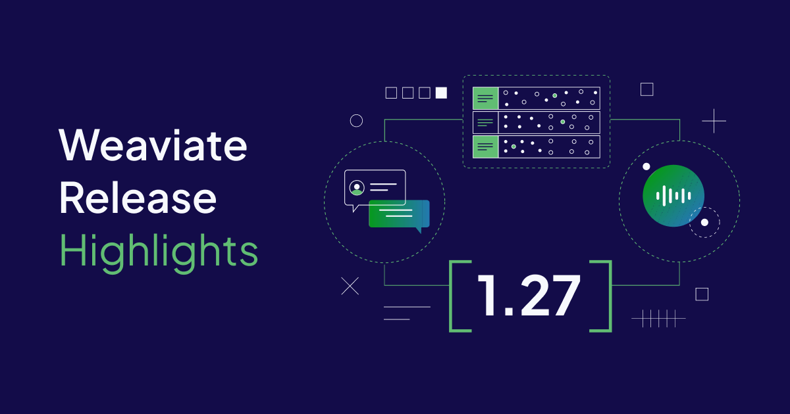

Weaviate `1.27` is here!

Here are the release ⭐️*highlights*⭐️!

:::warning TODO
Svitlana: I've just got the old hero image here. I think the `1.27` one could be a "standard" release image, or perhaps we could incorporate the "Acorn" image suggested below.
:::

- [**Big filtered search improvements**](#improved-filtered-search)
- [**Multi-target vector search improvements**](#multi-target-vector-search-improvements)
- [**Jina V3 embedding support**](#jina-v3-embedding-support)
- [**Cancel backups**](#cancel-backups)
- [**Deletion strategy settings**](#deletion-strategy-settings)
- [**Other changes**](#other-changes)

## Improved Filtered Search

Weaviate `1.27` introduces a new filtering strategy with big potential benefits for performance and scalability.

This exciting new search strategy/algorithm comes from our Applied Research team, who was inspired by the popular [`ACORN`](https://arxiv.org/html/2403.04871v1) paper. This ACORN implementation builds on the paper's algorithm to make it even better for Weaviate users.

If you ever found yourself wishing filtered vector search was faster, we encourage you to try this out. The ACORN algorithm is particularly beneficial for the negatively correlated filtered HNSW searches.

:::tip What is a negatively correlated filtered search?

A filtered search combined the structured, rule-based inclusion and exclusion of entities with the vector-based similarity search. The structured part is the filter, and the vector-based part is the search.
 

In a negatively correlated filtered search, the filter disproportionately removes entities that would be most similar to the search query, as shown below.

:::

:::warning Img needs update
Femke/Svitlana: What do you think about making a version of this with Weaviate styling? Or, we could just re-use it with credit to the original source.

Source: https://arxiv.org/html/2403.04871v1
:::

<figure>

<figcaption align="center"> An illustration of vector query / filter correlation (<a href="https://arxiv.org/html/2403.04871v1">original figure</a>). </figcaption>

</figure>

This type of filtered search can be slower than other filtered searches. As in the figure, the vector search starts at the "wrong" end of the vector space, where the most similar entities are removed by the filter.

The new ACORN filter strategy in Weaviate `1.27` dramatically improves the filtered vector search performance in situations like this.

### How does ACORN work?

The ACORN algorithm improves filtered search performance in three different ways:

- Objects that do not meet the filters are ignored in distance calculations.
- The algorithm reaches the relevant part of the HNSW graph faster, by using a multi-hop approach to evaluate the neighborhood of candidates.
- The entry points are randomly seeded to speed up convergence to the filtered zone.

This implementation is [Weaviate's own version](/developers/weaviate/concepts/filtering) of that described in the original paper, with modifications to make it even better for Weaviate users.

### How to use ACORN

ACORN can be enabled as the filter strategy in one of two ways:

- Set the `FILTER_STRATEGY` [environment variable](/developers/weaviate/config-refs/env-vars#general) to `acorn`.
- Set the `filterStrategy` field for the relevant HNSW vector index [in the collection configuration](/developers/weaviate/manage-data/collections#set-vector-index-parameters).

According to our internal tests, using the ACORN algorithm will improve the filtered vector search performance overall, with the most significant improvements in negatively correlated filtered searches.

Note that there may be a small cost in recall, but our testing has found this to be minimal if not negligible.

:::warning TODO
Should we create a forum thread for feedback, and link it below?
:::

:::note Tell us about your experience ACORN
We would love to hear from you about your experiences with ACORN. Please drop by to [our forum](https://forum.weaviate.io/) and tell us about it!
:::

## Multi-Target Vector Search Improvements

:::info What is a multi-target vector search?

Weaviate `1.26` introduced [multi-target vector searches](/developers/weaviate/search/multi-vector), where one search query can search across multiple target vectors.
 

For example, you can search a product object with a query, and compare the query to both the product's title vector and the product's description vector in one search.

:::

In Weaviate `1.27`, multi-target vector search has been improved further to allow for even more flexibility in your searches.

You can now search the [same vector field multiple times](/developers/weaviate/search/multi-vector#specify-query-vectors) in one query. These new options provide even more options for comprehensive, flexible searches through your data with Weaviate.

Take a look at the [multi-target vector search page](/developers/weaviate/search/multi-vector) for more examples.

## Jina V3 embedding support

:::warning Femke/Svitlana
Should we create an image like this one below, but for Jina?
:::

import WeaviateAndJinaImg from '/blog/2023-10-31-weaviate-1-22-release/img/Weaviate-release-1-22-python.png';

Weaviate's [Jina AI embedding integration](/developers/weaviate/model-providers/jinaai/embeddings) has been updated to support Jina AI's new V3 embeddings.

:::info About Jina AI's v3 embedding model

This model is a multilingual model that remains small and efficient while performing well on standard retrieval benchmarks.
 

The v3 model adopts binary passage retrieval capabilities, which understands the difference between the database entries (`passages`) and the user `queries`. Weaviate automatically implements this for convenience, embedding objects as `passages` during import, and as `queries` during `nearText` search.
 

Furthermore, the v3 model produces Matryoshka style embeddings, This means that the generated embeddings can be truncated to suit the required precision.

:::

### How to use the v3 embedding model

From your perspective, all you have to set is the model name, to `jina-embeddings-v3` [here](/developers/weaviate/model-providers/jinaai/embeddings#configure-the-vectorizer).

With the v3 model, you can optionally specify the `dimensions` parameter in the collection configuration with the Jina AI model integration. This will set Weaviate's Jina AI model integration to obtain vectors of the correct length. You can balance your search quality needs here with resource usage.

Note you can combine Weaviate's [quantization techniques](/developers/weaviate/starter-guides/managing-resources/compression) with this to further manage resource usage.

See the [Jina AI model integration page](/developers/weaviate/model-providers/jinaai/embeddings) for information on how to use this model.

You can find more information about the model on [JinaAI's website](https://jina.ai/news/jina-embeddings-v3-a-frontier-multilingual-embedding-model/).

## Cancel backups

[Creating backups](/developers/weaviate/configuration/backups) is a big part of database administration, especially in a production setting.

In some cases, however, a backup process may be unwanted. Perhaps a backup was triggered by accident, or a backup process may be stuck.

To address this, we have added a backup cancellation feature. Now, an unwanted, ongoing backup process can be stopped instead of consuming valuable CPU cycles.

Backups can be cancelled [through a supported Weaviate client](/developers/weaviate/configuration/backups), or through the [REST endpoint](/developers/weaviate/api/rest).

## Deletion strategy settings

Weaviate supports [data replication](/developers/weaviate/concepts/replication-architecture/) to help support higher server loads, and provide data redundancy.

Providing [data consistency](/developers/weaviate/concepts/replication-architecture/consistency) is a big part of such distributed systems. We have found that in some cases, performing deletion with a consistency level other than `ALL` can lead to non-deterministic outcomes, with the deleted objects coming back in certain conditions.

So, we add a deletion strategy option that allows you to explicitly specify how to resolve such conflicts. You can [set this value in a collection's replication configuration](/developers/weaviate/configuration/replication#deletion-strategy) to `DELETE_ON_CONFLICT` for example. This will configure the collection to always delete the object if it encounters such a conflict.

:::note More deletion strategies being evaluated
We are evaluating additional deletion strategies for resolving these conflicts. Keep an eye out on this space :).
:::

## Other changes

### Case sensitive vectorization

Weaviate [integrates with embedding model providers](/developers/weaviate/model-providers) in order to conveniently vectorize data during import. With `v1.27`, we have slightly tweaked this process, so that the text is no longer lowercased by default before vectorization.

This change reflects the modern embeddings' capabilities to deal with uppercase (vs lowercase) characters. We expect that any changes to embeddings here will be very small, but we expect this to be closer to how modern embedding models expect inputs to look.

If you prefer the previous behavior where the inputs are lowercased before import, set the `LOWERCASE_VECTORIZATION_INPUT` [environment variable](/developers/weaviate/config-refs/env-vars#general) to `true`.

### Google modules renamed

The Weaviate modules that underpin its [Google model integrations](/developers/weaviate/model-providers/google) have been renamed. Historically, they were named after the `PaLM` generation of models, thus having names `text2vec-palm`, `generative-palm`, `multi2vec-palm`.

They have been renamed to `text2vec-google`, `generative-google`, `multi2vec-google` respectively.

These modules are aliased under-the-hood in Weaviate, so your existing codebase will continue to work. However, we recommend updating your existing code if you are upgrading Weaviate - so that your codebase follows the latest conventions.

## Reliability and performance improvements

In between `1.26` and `1.27`, Weaviate's engineering and applied research teams have been hard at work, making significant improvements under-the-hood for reliability and performance improvements.

We won't list them all here, but they include improvements to BM25 & hybrid query performance, Raft improvements, tombstone cleanup improvements and more.

As always, we recommend updating your version of Weaviate to the latest available patch release (e.g. `1.26.2` ➡️ `1.26.5`). And we encourage to consider upgrading to the latest release (e.g. `1.26.2` ➡️ `1.27.0`).

## Summary

Enjoy the new features and improvements in Weaviate `1.27`. The release is available as an open-source release, and is coming soon to [Weaviate Cloud](https://console.weaviate.cloud/).

Thanks for reading, see you next time 👋!
