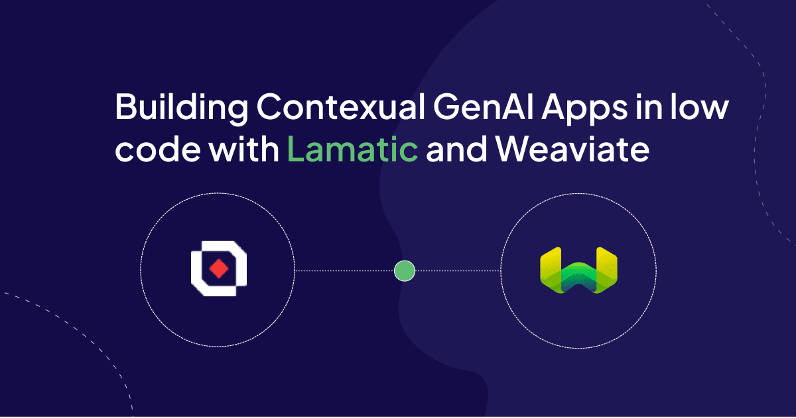
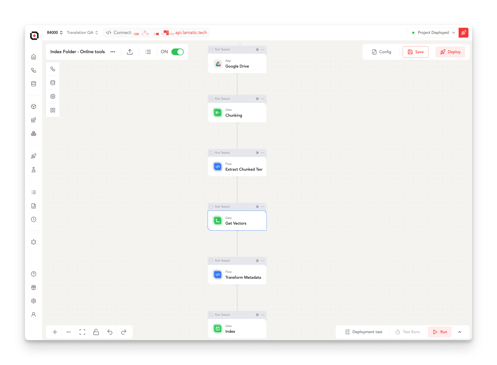
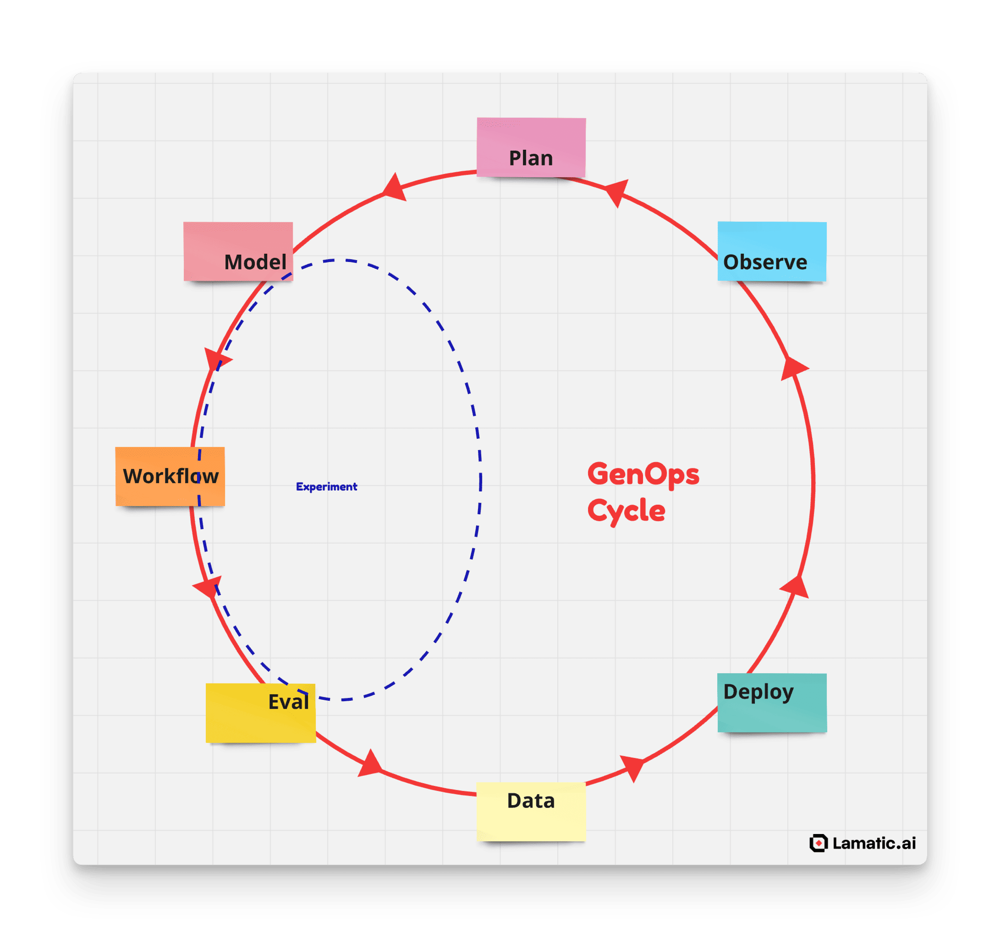

Large Language Models (LLMs) and Vector Databases have revolutionized knowledge management and automation. Retrieval pipelines now enable businesses with vast data repositories to provide their employees with instant access to crucial insights and answers. However, implementing these systems effectively requires a certain level of expertise. There's always a risk of misapplying AI, which is best avoided.

Weaviate simplifies this process by offering an easy way to launch a serverless vector database instance and develop retrieval-based applications such as vector search and RAG chatbots. [Lamatic.ai](http://Lamatic.ai) takes this convenience a step further by providing serverless middleware that allows you to seamlessly integrate these features into your product. This approach eliminates the need for hiring specialized technical talent, extensive learning curves, and managing complex infrastructure.

## About Lamatic.ai: Empowering High-Performance GenAI

Lamatic is a comprehensive managed platform that combines a low-code visual builder, Weaviate, and integrations with various apps and models. It enables users to build, test, and deploy high-performance GenAI applications on the edge, all within minutes.

Key offerings of [Lamatic.ai](http://Lamatic.ai) include:

- **Intuitive Managed Backend:** Facilitates drag-and-drop connectivity to your preferred models, data sources, tools, and applications
- **Collaborative Development Environment:** Enables teams to collaboratively build, test, and refine sophisticated GenAI workflows in a unified space
- **Seamless Prototype to Production Pipeline:** Features weaviate and self-documenting GraphQL API that automatically scales on Serverless Edge infrastructure

# Leveraging [Lamatic.ai](http://Lamatic.ai) and Weaviate for Effortless Contextual App Development

[Lamatic.ai](http://Lamatic.ai) offers a powerful, fully managed GenAI stack that includes Weaviate. This innovative platform allows users to harness advanced AI technologies without requiring deep technical expertise. Let's explore how you can build a simple contextual chatbot using [Lamatic.ai](http://Lamatic.ai), following three key phases: Build, Connect, and Deploy.

## Build: Creating Your GenAI Flows

The first step is to build your flows. A flow is a visual representation of your GenAI app's logic. For our contextual chatbot, we'll need two flows:

1. Data Indexing Flow:

This flow automatically fetches files from a data source (like Google Drive) and indexes them into the VectorDB. It periodically checks for new changes and updates the index accordingly. 

<aside>

💡 You can get started quickly with this [pre-built template](https://hub.lamatic.ai/templates/google-drive-sync).

</aside>

2. Retrieval and Response Flow:

This flow is triggered by a Slack command (e.g., /ask) and responds with answers based on the indexed data. It retrieves relevant information from the VectorDB and uses an LLM to generate a response.

<aside>

💡 Jump-start your development with this [ready-to-use template](https://hub.lamatic.ai/templates/slack-ask-bot).

</aside>

## Connect: Integrating Your Components

After setting up your flows, connect the necessary components:

- Apps: Integrate with Google Drive for data sourcing and Slack for user interaction.
- Models: Choose and connect your preferred LLM for vectorization and querying.
- Vector Store: Set up a Weaviate vector store within [Lamatic.ai](http://Lamatic.ai).

## Deploy: Bringing Your Chatbot to Life

Before deployment, thoroughly test your flows using [Lamatic.ai](http://Lamatic.ai)'s built-in debug options. Once you're satisfied with the performance, hit deploy to launch your project on the Edge. The indexing flow will start populating your Weaviate Store, and soon your Slack users can start asking questions using the /ask command.

> The beauty of this approach is its versatility. With these same building blocks, you can create a wide range of applications that leverage contextual information from various sources. Let your imagination run wild! You can find more apps, templates and models here
> 
> 
> [Lamatic.ai Hub](https://hub.lamatic.ai/)
> 

---

# 10 tips on building reliable Contextual apps with low code

1. **Research Thoroughly:** Understand the problem domain and explore available technologies through academic papers, industry reports, and expert opinions.
2. **Study Existing Cases:** Learn from successful implementations by examining case studies and engaging with professionals who've tackled similar challenges.
3. **Plan Comprehensively:** Develop a detailed roadmap outlining project milestones, resources, risks, and contingencies before starting development.
4. **Test Multiple Approaches:** Experiment with various strategies through prototypes, simulations, or A/B tests to find the most effective solution.
5. **Handle Edge Cases:** Identify and resolve potential issues through comprehensive testing, including stress tests and unusual scenarios.
6. **Seek User Feedback:** Engage with existing users to gather insights on relevance and usability through surveys, interviews, and usability tests.
7. **Integrate Strategically:** Analyze your app's ecosystem to implement features where they provide the most value to users.
8. **Automate Data Flows:** Create efficient, self-maintaining data pipelines with robust error handling and automated reporting.
9. **Monitor Continuously:** Implement tracking systems to monitor performance and user interactions in real-time using analytics tools and custom dashboards.
10. **Optimize Iteratively:** Refine your application based on user feedback, performance metrics, and market trends through regular review cycles.

---

# Potential Applications

1. **Intelligent Documentation Assistant for Slack**
Create a Slack bot that provides instant answers from your documentation, enhancing team productivity and knowledge sharing. For example, GenAI Collective significantly improved their event organizers' experience by implementing an answer bot within their apps, reducing response times and increasing efficiency.
2. **Enhanced Website Search with Vector and Hybrid Capabilities**
Use advanced search techniques to improve website navigation and content discovery, leading to a better user experience. For instance, [84000.co](http://84000.co) incorporated a hybrid search system to make Buddhist translations easily discoverable, combining traditional keyword search with AI-powered semantic understanding for more accurate results.
3. **Integrated Image and Text Generation**
Integrate GenAI features like image generation and content creation directly within your app. [Dinnerfy.com](http://Dinnerfy.com) exemplifies this by offering AI-generated recipe images and descriptions, enhancing user engagement and providing a more interactive culinary experience.
4. **Automated Information Extraction and Summarization**
Extract key information, score, and summarize large volumes of data. [Traq.ai](http://Traq.ai) demonstrates this capability by automatically summarizing and scoring customer calls, providing valuable insights for businesses to improve their customer service and sales strategies.

# Go Beyond

The examples above merely scratch the surface of what's achievable with [Lamatic.ai](http://Lamatic.ai). The possibilities are truly limitless. Rather than investing time and resources in recruiting scarce talent and managing complex infrastructure, focus on realizing your unique use case. 
We believe tools like [lamatic.ai](http://lamatic.ai) are pivotal in democratizing AI, making it more accessible to businesses of all sizes and ultimately improving lives. The low-code approach offered by [Lamatic.ai](http://Lamatic.ai) transforms complex technical concepts such as vector databases, text chunking, and model selection into intuitive, approachable processes. This simplification breaks down barriers that have traditionally deterred many from exploring AI applications.

Furthermore, the platform's extensive library of templates and pre-built configurations significantly accelerates the development process. This allows businesses to rapidly prototype, iterate, and scale their AI solutions without getting bogged down in technical intricacies. By lowering the entry barrier and speeding up development cycles, [Lamatic.ai](http://Lamatic.ai) empowers organizations to focus on innovation and problem-solving rather than wrestling with infrastructure and code.

The impact of such accessible AI tools extends beyond individual businesses. As more organizations leverage AI capabilities, we anticipate a ripple effect of innovation across industries, leading to enhanced products, services, and customer experiences. This democratization of AI technology has the potential to drive economic growth, foster competition, and ultimately contribute to societal progress on a global scale.

Ready to explore further? Sign up for Lamatic AI or schedule a complimentary 1:1 AI workshop to discuss your specific use case.

For those looking to bring Vector Database capabilities closer to their application infrastructure, get started with Weaviate Cloud today.

import WhatsNext from '/_includes/what-next.mdx';

<WhatsNext />
