Vector embeddings have revolutionized how we think about search, especially across large datasets. Weaviate’s vector and hybrid search capabilities power recommendation engines, content management systems, or e-commerce sites.

A “search”, however, is a complex animal. It is rare that a search query is as simple as “find items most similar to ‘comfortable dress shoes’. A query in the wild often requires that the resulting objects also meet certain criteria - like, `deliverable to my location`, `tan in color`, and `under $200`. In other words, they require traditional “filters” along with a “search”.

This seemingly simple requirement creates a fascinating technical challenge.

Do we filter first and then search for similarity? Search first and filter later? How does this affect the overall query quality and performance? Does the relationship between the search string and filter criteria matter?

In this post, we'll talk about how Weaviate has implemented ANN Constraint-Optimized Retrieval Network, also commonly referred to as ACORN. ACORN is an innovative solution that we are very excited about. But before we get to all of that, let’s first explore these challenges at a high level, starting with the “pre-filtering” solution.

## Pre-filtering for vector search

One way to solve the filtered search problem is to apply the filter first over the data, and then perform the vector search. This is called a “pre-filtering” solution, and in its simplest form, is very straightforward. One significant impact of pre-filtering is that a graph-based (e.g. HNSW) vector search will not be usable as is, since the graph cannot be modified at query time.  A pre-filtering solution would require a “brute force” vector search instead, where each vector is compared to the query vector.

Brute forcing a small amount of data is actually good if the filters reduce the dataset to a manageable number of objects. But it is not a good way to go if your filtered objects are still too many, as brute force searches only scale linearly. In Weaviate, we manage this by using a parameter for switching from brute force to something smarter. More specifically, you can control when to abandon the brute force search strategy by setting the flatSearchCutOff parameter of 100 000.

Now, what is the “smarter” solution for when you still have too many objects after applying the filter? The answer is to use our graph for this, by combining our HNSW indexes in a post-filtering solution as discussed in the next section.

## Post-filtering for vector search

So, what is post-filtering? As the name suggests, post-filtering means we first search for the closest vectors to our query, and then we apply the filter.

```mermaid
flowchart LR
%% Define main flow nodes
Start["🔍 Search Query"] --> VectorSearch["⚡ Vector Search"]
VectorSearch --> Filter["📑 Apply Filters"]
Filter --> Results["✨ Search Results"]

%% Group the post-filtering process
subgraph postfilter ["Post-filtering Search"]
direction LR
VectorSearch
Filter
end

%% Style nodes
style Start fill:#ffffff,stroke:#B9C8DF,color:#130C49
style VectorSearch fill:#ffffff,stroke:#B9C8DF,color:#130C49
style Filter fill:#ffffff,stroke:#B9C8DF,color:#130C49
style Results fill:#ffffff,stroke:#B9C8DF,color:#130C49

%% Style subgraph
style postfilter fill:#ffffff,stroke:#130C49,stroke-width:2px,color:#130C49
```

This poses some questions immediately, however. Suppose we need to select the top 10 similar vectors to our query that includes a filter. We know that applying a filter over the results set will reduce its number. So, the search results prior to filtering must contain more results. But - just how many more should it contain? Including more results will slow down the search, but not including enough may mean we end up with fewer than the desired number (10) once the filter is applied.

We could estimate this based on the selectivity of the filter. For example, if we have a filter that roughly passes one objects out of 10, then we could obtain an unfiltered results set of 100 and expect to end up with 10 results post-filtering.

This estimation is not necessarily accurate, however. A filter’s selectivity will be variable, depending on the distribution of your filtered vectors and their correlation with the query vector.

This assumes that the filter’s selectivity is uniform, meaning that no matter where your search is performed in the search space, the selectivity of the filter is the same. But does that actually hold, even as a rough estimate? Let us explore this further.
Imagine you have a filter on the price of the objects in an e-commerce database. We would expect that all else being equal, objects of similar prices would be more likely to be similar than those of vastly different prices. For example, consider an e-commerce site selling products with “ring” in the product name. Perhaps the site is, “Rings ‘r Us”. In this site’s vector index, diamond rings are likely to be closer in vector space as well as price, while novelty rings or even bike chain rings are likely to be in a different region on the search space.

In other words, it is possible that your filter is highly correlated to your query. If you search for example for diamond rings with a high price filter, you might end up with a search result where most objects pass the filter. In this scenario, it will be a waste of performance to search for 100 objects in order to only select 10 in the filtering phase.

Recall that the result set prior to applying the filter is the `top n` / `assumed selectivity`. Here, since the filter will pass a much larger portion of the results than 10%. Conversely, if we search for diamond rings also but with a very low price, chances are we will not obtain a result set where most objects will pass the filter. In this scenario, if we only fetch 100 objects in order to send 10 back, when we apply the filter we might end up without any objects at all.

So in situations such as these, the algorithm designer could be faced with a choice, balancing the risk of insufficient results being found and achieving acceptable search performance.

## Weaviate filtered search, pre-ACORN

Up until the introduction of ACORN, Weaviate combined both solutions. As explained before, we use the flatSearchCutOff param to switch between the two solutions. The post-filtering solution, however, is enhanced by filtering the result set as we search.

This means that we traverse the graph unfiltered but before we add to the result set, we check whether each object passes the filter or not. This way, we can dynamically identify the point where we need to stop our filtered search. This is an effective approach, with one caveat.

As mentioned before, the traversing of the graph is performed without taking the filter into consideration. The drawback of this is that the search performance is not optimal since we calculate distances to objects that do not pass the filter and will never make it to the final result set.

So, can we just ignore those vectors for objects that will not pass the filter during the traversal of the graph? As it turns out - no, as we then risk disconnecting our graph, which is the entire basis of the HNSW search algorithm that traverses from an entry point and greedily searches its neighboring nodes. Disconnecting portions of the graph may dramatically reduce its quality, as measured in recall.

This is especially true if the filter is very selective. As we discussed before, if we look for cheap diamond rings using a partly disconnected graph, it is possible that there is no path at all from the entry point in the graph for our query vector to the region of the search space where the results should be.

As a result, the search performance (i.e. speed/throughput) can degrade even though HNSW is generally very fast. Given sufficiently large graphs, and restrictive enough filters with low correlation to the query vector, the search performance may start to be problematically slow.

There exist some solutions that attempt to solve this problem. An example of it is the [Filtered DiskANN algorithm](https://harsha-simhadri.org/pubs/Filtered-DiskANN23.pdf). This solution aims to keep the graph connected for a predefined set of filters by adding some connections that would normally not exist in the graph. Although clever, it requires anticipating the filters and associated connections in advance, which may not even be possible sometimes. Imagine, again, the case where you have price involved. It would be impossible to anticipate all possible filters around it.

Another younger alternative is [ACORN](https://arxiv.org/abs/2403.04871). ACORN is much better in the sense that it is filter agnostic at indexing time.

After learning about it, and [discussing](https://youtu.be/PxJ7FpbopKY) the topic with one of the authors of the paper, we decided this would be a good addition to Weaviate. We discuss the solution in detail next.

## ACORN

The core idea of ACORN is maintaining a well-connected graph under any possible filter we might use. This necessitates a denser graph than a typical HNSW graph.

The very first difference from the normal HNSW algorithm is the elimination of normal triangle pruning. While the maxConnections parameter limits the graph size, we avoid pruning to avoid disconnecting the graph for some filters. The graph requires compression given that the traversing approach is different, which we will get cover after explaining the traversing mechanism.

The resulting graph is much larger without pruning. Once we filter our graph, however, to only consider connections where out-neighbors pass the filter criteria, the effective graph size will be manageable.

The crucial difference is how the neighborhood is expanded in ACORN to keep connectivity of the graph high. The main risk with filtering connections is that you could prune good paths as an intervening vector fails to pass the filter. As an example, consider the following:

Assume we are searching for the top two closest neighbors of the blue query vector in this graph.

The green dots illustrate vectors whose objects pass the filter, and the gray those that do not. Ideally, the search algorithm could follow the graph from an entry point to the target region. Assuming starting from the red entry point, the graph would traverse to the vector labeled A, then to the vector labeled B as the distances reduce in that direction. From here, the algorithm should be able to find vector E through C and F through D. The problem is that if C and D are disconnected and thus not evaluated, then the search algorithm cannot find E and F. On the other hand, if considering C and D means we need to calculate the distance between the query vector and those vectors, going back to the above challenge of high resource usage.

So, how does ACORN solve this issue? It cleverly uses a two-hop based expansion of the neighborhood, evaluating nodes that are two hops away rather than one. This means that E and F become out-neighbors of B, as they are two hops away. This speeds up traversal of a graph as you can imagine, and help to ameliorate challenges of low correlation between the filter and the query vector.

Now let’s discuss how this strategy enables compression. Notice that  vector A now has out-neighbors B and C, but C is also an out-neighbor of B. As a result there is no need to explicitly add C to the out-neighbors of A, as the B to C connection can be used to find C from A. We compress the connections of A by removing C from the list of A’s out-neighbors and only keep it on B.

ACORN is a fascinating algorithm. If you would like to read more about it, we encourage you to refer to the [original paper]https://arxiv.org/abs/2403.04871.  Our implementation of ACORN involved a few customizations to our users’ needs - let’s touch on that before we wrap up.

## Weaviate implementation of ACORN

The Weaviate implementation of ACORN differs from that of the paper in a few ways.

The first important change is the building of the graph. While it is true that a different indexing logic helps keep the graph connected, we have decided not to modify the indexing at all from “vanilla” HNSW indexing. This means that anyone using Weaviate, will benefit from an ACORN-like algorithm at querying time without the overhead of re-indexing.

With this decision, you only need to enable ACORN in your Weaviate instance and everything will keep working the same. Only in case you perform a filtered search with a high selectivity rate, Weaviate would use ACORN at query time, otherwise falling back to regular HNSW.

The second important difference is in how we explore the graph while querying. Weaviate’s ACORN implementation does not always use the two hop expansion. Instead, it conditionally evaluates whether to do so.

If the first hop passes the filter, then the algorithm traverses the graph normally since the second hop will be explored anyways as the search progresses. We only use the two hop expansion if the connecting node does not pass the filter. This means that when is not a uniform distribution of the filtered nodes in the graph, our algorithm will operate as a regular HNSW in areas in areas where a dense amount of nodes pass the filter and as a pure ACORN where a sparse amount of nodes pass the filter.

The third difference is in the selection of the entry point at the layer zero of the graph. It is a known challenge that a high query latency can be seen both with regular HNSW but also with ACORN when querying with a low correlation between the filter and the query vector.

The reason for this is that if we land in a region of the search space where we barely have any node passing the filter, we need to expand the search in all directions away from the query until we reach the region where the nodes passing the filter are.

To better understand this, imagine you are looking for diamond rings around a 10 Euro price point, for example between 5 and 20 Euros. The vector search will have an entry point near the vector for “diamond rings”, and expand outwards. You will eventually find some low priced jewelry, but it will require the algorithm to blindly search through a huge number of objects in the database, since the entry point of “diamond rings” will have very few objects passing the filter.

The outcome is that the search will suffer in speed or quality. It will either resemble a brute force search and be very slow, or it may not include good enough results, if it instead terminates too soon.

Either way, this is not a great outcome.

## Some practical results

We next show some experiments using random uniform filters but also using high or low correlation between the filters and the queries. You could easily test your own data in Weaviate by [switching the filtering method in the collection definition to sweeping or acorn](/developers/weaviate/manage-data/collections#set-vector-index-parameters). The [benchmark tool](https://github.com/weaviate/weaviate-benchmarking) has been updated to easily test your data with the flags -–filter to signal that we are doing a filtered test and –filterStrategy which accepts acorn as a valid strategy to indicate that we want to activate the new logic during querying.

### Random uniform filters

We will initiate our experiments using a uniform distribution for the filter with 20% selectivity. This might be the less interesting case since we do not expect this scenario too often in real applications but it will set a baseline for our experiments. The image below shows such results.

From this comparison, we could infer there is still no significant difference between the curves - but let’s keep going.

:::caution FIGURE GOES HERE
:::

### High correlation between filters and queries

Next, we have built a collection out of the [Beir dataset](https://paperswithcode.com/dataset/beir). We have merged different domain objects into a single dataset and used the source of the data as the filter. In this case, we expect a high correlation between filters and queries. Queries come from the same data source and data from the same data source is strongly connected to each other.
This is a case where our regular HNSW algorithm performs roughly as well, or slightly better than our ACORN implementation. Results are shown in the image below. For high recall settings we can see that ACORN performs similar to the regular HNSW logic.

:::caution FIGURE GOES HERE
:::

### Low correlation between filters and queries

This is where the ACORN implementation really begins to shine. In this example, we have a dataset shifting queries to different data sources. This means that queries would target different data sources and thus we should expect a low correlation between the filters and queries. The results are shown in the image below.

:::caution FIGURE GOES HERE
:::

Under these settings, we can observe that Weaviate’s ACORN implementation significantly (an order of magnitude, in fact) outperforms the “vanilla” HNSW algorithm. The difference here is such that the previous throughput (QPS) would have been a significant potential bottleneck, whereas our ACORN algorithm performs comparably to the previous scenario. The explanation for this disparity is that the old logic ends up performing nearly a brute force over the full data while the new logic can find the target region in a better performant way.

You could imagine it makes little sense to have such a low correlation between filters and queries but in practice, this is actually not that unusual.

As a result, this is really where the new ACORN algorithm pays off. By preventing occurrences of such bottlenecks, it is able to ensure that a vector/hybrid search system does not get bogged down when these “unusual” queries in fact become quite common as we have seen happen in the wild.

It goes without saying, we are very excited about introducing this algorithm and improving the overall robustness of the system as a result.

## Conclusions

Vector search with filters is a common requirement in real-world applications, but achieving both high performance and accuracy can be challenging. This is especially so when filters and queries have low correlation. ACORN provides an elegant solution to this problem by maintaining graph connectivity through two-hop expansion, without requiring any special indexing or predefined filter configurations.

Our implementation in Weaviate builds on ACORN's strengths while adding practical optimizations:

- No re-indexing required - works with existing HNSW indexes
- Adaptive two-hop expansion that switches between HNSW and ACORN based on filter density
- Smart handling of entry points for better performance

The results speak for themselves: up to 10x performance improvement in challenging scenarios where filters and queries have low correlation, while maintaining comparable performance in other cases. This makes filtered vector search more robust and predictable, eliminating potential bottlenecks that could affect your application's performance.

Ready to try it out? ACORN is available in [Weaviate 1.27](/blog/2024-10-29-weaviate-1-27-release/) and newer. Simply enable it in your collection configuration and start experimenting with your own datasets. We're excited to hear about your experiences and use cases!

For more information on using ACORN in Weaviate, check out our [documentation](/developers/weaviate/), such as [how to enable ACORN](/developers/weaviate/manage-data/collections#set-vector-index-parameters), and [how to perform filtered searches](/developers/weaviate/search/filters).

import WhatsNext from '/_includes/what-next.mdx';

<WhatsNext />
