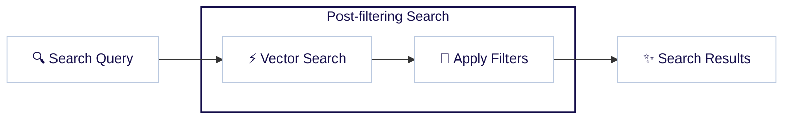
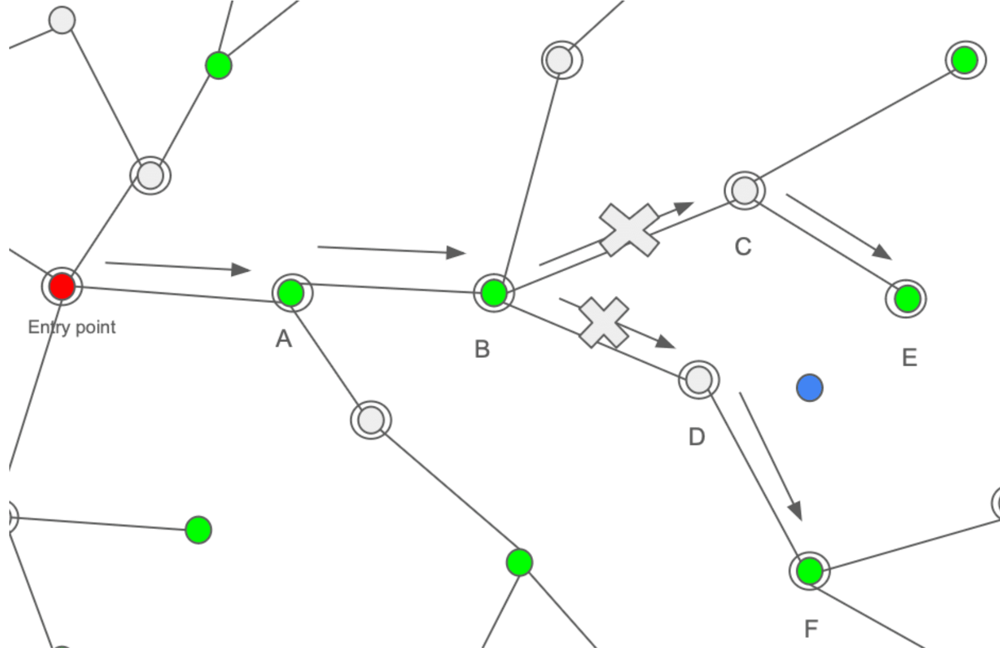

Vector embeddings have revolutionized how we think about search, especially across large datasets. Weaviate’s vector and hybrid search capabilities power recommendation engines, content management systems, and e-commerce sites.

A “search”, however, is a complex animal. It is rare that a search query is as simple as “find items most similar to `comfortable dress shoes`. A query in the wild often requires that the resulting objects also meet certain criteria - like, `deliverable to my location`, `tan in color`, and `under $200`. In other words, they require traditional “filters” along with a “search”.

This seemingly simple requirement creates a fascinating technical challenge.

Do we filter first and then search for similarity? Search first and filter later? How does this affect the overall query quality and performance? Does the relationship between the search and filter criteria matter?

In this post, we'll talk about how Weaviate has added a new filter strategy called ANN Constraint-Optimized Retrieval Network, commonly referred to as ACORN. ACORN is an innovative solution that we are very excited about. But before we get to all of that, let’s first explore these challenges at a high level, starting with the “pre-filtering” solution.

## Pre-filtering for vector search

One way to solve the filtered search problem is to apply the filter first over the data, and then perform the vector search. This is called a “pre-filtering” approach, and in its simplest form, is very straightforward. The search will determine which objects match the filter, skip the HNSW graph index, and just brute force these filtered objects.

Brute force over a small amount of data is actually quite fast especially if the filters reduce the dataset to a manageable number of objects. But this approach will quickly become slower as the number of filtered objects increase, as brute force query performance scales linearly with the dataset size. When using HNSW as the vector index in Weaviate, we use this approach for small filters (configurable by the `flatSearchCutOff` parameter).

Now, what is a “smarter” solution for when you still have too many objects after applying the filter? In this case one option is post-filtering.

## Post-filtering for vector search

So, what is post-filtering? As the name suggests, post-filtering means we first search for the closest vectors to our query using the HNSW graph index, and then we apply the filter.

This poses some questions immediately, however. Suppose we need to select the top 10 similar vectors to our query that includes a filter. We know that applying a filter over the results set will reduce its number. So, the search results prior to filtering must contain more results. But just how many more should it contain? Including more results will slow down the search, but not including enough may mean we end up with fewer than the desired number (10) once the filter is applied.

We could estimate this based on the selectivity of the filter. For example, if we have a filter that roughly passes one objects out of 10, then we could obtain an unfiltered results set of 100 and expect to end up with 10 results post-filtering.

However it is hard to estimate this accurately. A filter’s selectivity will vary, depending on the distribution of the filtered vectors and its correlation with the query vector.

Imagine you have a filter on the price of the objects in an e-commerce dataset. We would expect that all else being equal, objects of similar prices would be more likely to be similar than those of vastly different prices. For example, consider an e-commerce site selling products with “ring” in the product name. Perhaps the site is, “Rings ‘r Us”. In this site’s vector index, diamond rings are likely to be closer in vector space as well as price, while novelty rings or even bike chain rings are likely to be in a different region in the search space.

In other words, it is possible that your filter has correlation to your query. If you search for example for diamond rings with a high price filter, you might end up with a search result where most objects pass the filter. In this scenario, it will be a waste of performance to search for 100 objects in order to only select 10 in the filtering phase.

In this high correlation situation the filter will pass a much larger portion of the results than 10%. Conversely, if we search for diamond rings also but with a very low price, chances are we will not obtain a result set where most objects will pass the filter. In this scenario, if we only fetch 100 objects in order to send 10 back, when we apply the filter we might end up without any objects at all.

So in situations such as these, the algorithm designer could be faced with a choice, balancing the risk of insufficient results being found and achieving acceptable search performance.

## Weaviate filtered search, pre-ACORN

Up until the introduction of ACORN, Weaviate combined both solutions. As explained before, we use the `flatSearchCutOff` param to trigger switching between the two solutions. The post-filtering solution, however, is enhanced by filtering the result set inline while searching.

This means that we explore the graph unfiltered but before we add candidates to the result set, we check whether each object passes the filter or not. In this way, we can dynamically identify the point where we need to stop our filtered search. We call this filter strategy `sweeping` and it is an effective approach, with some caveats.

As mentioned before, traversing of the graph is performed without taking the filter into consideration. The drawback of this is that, especially with low correlation, it is possible to have situations where a significant percentage of objects do not pass the filter and so will never make it to the final result set. This causes unnecessary distance calculations which negatively impacts query performance.

Can we just ignore those vectors for objects that will not pass the filter during the traversal of the graph? As it turns out - no, as we then risk disconnecting the graph, which breaks the connectivity needed for the HNSW search algorithm to greedily search through neighboring nodes. Disconnecting portions of the graph can dramatically reduce the result quality, as measured in recall.

This is especially true when looking for cheap diamond rings with a very selective filter. Using a partly disconnected graph, it is possible that there is no path at all from the entry point in the graph for our query vector to the region of the search space where the results should be.

As a result, the search performance (i.e. speed/throughput) can degrade even though HNSW is generally very fast. Given sufficiently large graphs, and restrictive enough filters with low correlation to the query vector, the search performance may start to be problematically slow.

There exist some solutions that attempt to solve this problem. One example is the [Filtered DiskANN algorithm](https://harsha-simhadri.org/pubs/Filtered-DiskANN23.pdf). This solution aims to keep the graph connected for a predefined set of filters by adding some connections that would normally not exist in the graph. Although clever, it requires anticipating the filters and associated connections in advance, which may not even be possible sometimes. Imagine, again, the case where you have price involved. It would be impossible to anticipate all possible filters around it.

Another alternative is [ACORN](https://arxiv.org/abs/2403.04871). We found ACORN much more appealing because it is filter-agnostic so doesn't require knowledge of what filters will be performed at index time.

After learning about it, and [discussing](https://youtu.be/PxJ7FpbopKY) the topic with one of the authors of the paper, we decided this would be a good addition to Weaviate. We discuss the solution in detail next.

## ACORN

The original ACORN paper builds upon HNSW and provides two variants ACORN-1 and ACORN-γ. Our explanation will focus on ACORN-1 here which is the basis for Weaviate's implementation.

The very first difference of ACORN from the normal HNSW algorithm is the elimination of normal triangle pruning. While the max connections parameter limits the graph size, ACORN avoids pruning to avoid disconnecting the graph for some filters. The graph requires compression given the different traversal approach, which we will cover after explaining the mechanism.

The resulting graph is much larger without pruning. Once we filter our graph, however, to only consider connections where out-neighbors pass the filter criteria, the effective graph size will be manageable.

The crucial difference is in how the neighborhood is expanded in ACORN to keep connectivity of the graph high. The main risk with filtering connections is that you could prune good paths as an intervening vector fails to pass the filter. As an example, consider the following:

Let's assume we are searching for the top two closest neighbors of the blue query vector in this graph.

The green dots illustrate vectors whose objects pass the filter, and the gray those that do not. Ideally, the search algorithm could follow the graph from an entry point to the target region. Starting from the red entry point, the graph would traverse to the vector labeled A, then to the vector labeled B as the distances reduce in that direction. From here, the algorithm should be able to find vector E through C and F through D. The problem is that if C and D are disconnected and thus not evaluated, then the search algorithm cannot find E and F. On the other hand, if considering C and D means we need to calculate the distance between the query vector and those vectors, going back to the above challenge of high resource usage.

So, how does ACORN solve this issue? It cleverly uses a two-hop based expansion of the neighborhood, evaluating nodes that are two hops away rather than one. This means that E and F become out-neighbors of B, as they are two hops away. This speeds up traversal of a graph as you can imagine, and help to ameliorate challenges of low correlation between the filter and the query vector.

Now let’s discuss how this strategy enables compression. Notice that vector A now has out-neighbors B and C, but C is also an out-neighbor of B. As a result there is no need to explicitly add C to the out-neighbors of A, as the B to C connection can be used to find C from A. We compress the connections of A by removing C from the list of A’s out-neighbors and only keep it on B.

ACORN is a fascinating algorithm. If you would like to read more about it, we encourage you to refer to the [original paper](https://arxiv.org/abs/2403.04871).  Our implementation of ACORN involved a few customizations - let’s touch on that before we wrap up.

## Weaviate implementation of ACORN

The Weaviate implementation of ACORN differs from that of the paper in a few ways.

The first important change is during building the graph. While it is true that a different pruning logic helps keep the graph connected, we decided not to modify the indexing from “vanilla” HNSW.

We did this mainly to limit resource overhead from unpruned nodes, and found the impact to recall acceptable. This came with the added benefit that for existing users of Weaviate, ACORN can be enabled without any requirement to reindex existing data.

The second important difference is how we explore the graph while querying. Weaviate's ACORN implementation conditionally evaluates whether to use the two-hop expansion.

If the first hop passes the filter, then the algorithm traverses the graph normally since the second hop will be explored anyway as the search progresses. We only use the two-hop expansion if the connecting node does not pass the filter. This means that when there is not a uniform distribution of the filtered nodes in the graph, our algorithm will operate as a regular HNSW in areas where a dense amount of nodes pass the filter and as ACORN where a sparse amount of nodes pass the filter.

The third difference is how we seed additional entry points at layer zero of the graph to better deal with the problem of queries having low correlation to the filter.

The challenge is that if we land in a region of the search space where barely any nodes pass the filter, we need to expand the search in all directions away from the query until we reach a region with nodes passing the filter.

To better understand this, imagine you are looking for diamond rings around a low price point. In normal HNSW, the entrypoint on the base layer is influenced by distance calculations on higher layers so generally the entrypoint will land near the vector for “diamond rings”, however in this location very few nodes may match the price filter.

The search will eventually find some low priced jewelry, but it can require the algorithm to search through a huge number of objects in the graph. The outcome is that the search performance will suffer. We found seeding additional entry points that match the filter to be very effective in improving performance here.

## Internal test results - ACORN vs pre-ACORN

We next show some experiments using for filtered vector search and differing correlation between the filters and the queries. You can easily test ACORN with your own data in Weaviate by [switching the filtering strategy in the collection definition to sweeping or acorn](/developers/weaviate/manage-data/collections#set-vector-index-parameters). The [benchmark tool](https://github.com/weaviate/weaviate-benchmarking) has been updated to easily test your data with the flags `-–filter` to signal that we are doing a filtered test, pre-filtering disabled with `--flatSearchCutoff` set to zero, and `-–filterStrategy` which accepts acorn as a valid strategy to indicate that we want to activate the new logic during querying.

### Low correlation between filters and queries

Here, we built collections out of the [Cohere's BEIR embeddings](https://huggingface.co/datasets/Cohere/beir-embed-english-v3). We merged different BEIR datasets together and used the source of data as the filter. This allows for us to construct both high and low correlated queries if the query vector has a filter matching or not matching its original dataset.

Firstly, let's show some test results where we sample from the NQ and MSMARCO datasets, use query vectors from NQ but filter for MSMARCO and vary the percentage from 20% to 50%. The selectivity rate is the percentage of objects that pass the filter. The higher the selectivity rate, the more objects pass the filter and the easier it is to find the target region in the search space.

The `acorn` line represents the new ACORN implementation, while the `sweeping` line represents the original Weaviate implementation. The y-axis shows the throughput in queries per second (QPS), while the x-axis shows the search quality (recall). The search quality is controlled by setting the `ef` parameter in the vector index configuration. The higher the `ef`, the better the search quality, but the slower the search.

If we take a look at these figures, a very interesting pattern emerges. The `sweeping` implementation performs quite well at high selectivity rates, but the performance begins to drop as the selectivity rate decreases.

**50% selectivity**

**40% selectivity**

**30% selectivity**

**20% selectivity**

When we look at the differences between graphs of the 50% and 20% selectivity rates, we can see that the relative positions between the two implementations are somewhat reversed. At 50% selectivity, the `sweeping` implementation performs better than the `acorn` implementation. However, at 20% selectivity, the `acorn` implementation is much faster than the `sweeping` implementation.

For low selectivity rates (at 20%), it is worth noting that the query throughput (QPS) of the `sweeping` implementation can be half the throughput of the `acorn` implementation at the same recall level. Here, we start to see benefits of the ACORN algorithm's ability to maintain graph connectivity and traverse the graph more efficiently.

Next, let's look at the results when the correlation between filters and queries are very low.

### Very low correlation between filters and queries

This is where the ACORN implementation really shows its value. In this example, we increased the number of datasets and kept low correlated filtering. This means that queries would target different datasets and thus we should expect a low correlation between the filters and queries. The results are shown in the image below.

Under these settings, we can observe that Weaviate’s ACORN implementation significantly outperforms (an order of magnitude, in fact) the original sweeping algorithm. The difference here is such that the previous throughput (QPS) would have been a significant potential bottleneck, whereas our ACORN algorithm performs comparably to the previous scenario. The explanation for this disparity is that the old logic ends up performing nearly a brute force over the full graph while ACORN can find the target region much faster.

You could imagine it makes little sense to have such a low correlation between filters and queries but in practice, this is actually not that unusual and just depends on the semantics of the filter.

By preventing occurrences of such bottlenecks, Weaviate with the new ACORN search strategy is able to ensure that vector and hybrid search systems do not get bogged down when these “unusual” but sometimes quite common / real-world queries.

### High correlation between filter and queries

Finally let's show what happens with highly correlated queries using the same NQ and MSMARCO datasets as before.

Here we see `sweeping` is still faster because due to the high correlation, the results from a filtered vs unfiltered vector search are very similar and the `sweeping` algorithm does very little extra calculations.

To address these variations we are exploring a dynamic filter strategy. Currently as of Weaviate 1.27, the `acorn` filter strategy is opt-in and will automatically switch back to sweeping if it detects a high selectivity filter. We are looking further into dynamic selection of filtering strategy based on filter match rates while exploring the graph.

## Conclusions

Vector search with filtering is a common requirement in real-world applications, but achieving both high performance and accuracy can be challenging. This is especially so when filters and queries have low correlation. ACORN provides an elegant solution to this problem by maintaining graph connectivity through two-hop expansion, without requiring any special indexing or predefined filter configurations.

ACORN presents a very interesting approach to improving filtered vector search on HNSW. Especially around low selectivity filters, the new search strategy is able to ensure that a vector/hybrid search system performs well regardless of the filter.

Our implementation in Weaviate builds on ACORN's strengths while adding practical optimizations:

- No re-indexing required - works with existing HNSW indexes
- Adaptive two-hop expansion that switches between HNSW and ACORN based on filter density
- Smart handling of entry points for better performance

The results speak for themselves: up to 10x performance improvement in challenging scenarios where filters and queries have low correlation, while maintaining good performance in other cases. This makes filtered vector search more robust and predictable.

Ready to try it out? ACORN is available in [Weaviate 1.27](/blog/weaviate-1-27-release/) and newer. Simply enable it in your collection configuration and start experimenting with your own datasets. We're excited to hear about your experiences and use cases!

For more information on using ACORN in Weaviate, check out our [documentation](/developers/weaviate/), such as [how to enable ACORN](/developers/weaviate/manage-data/collections#set-vector-index-parameters), and [how to perform filtered searches](/developers/weaviate/search/filters).

import WhatsNext from '/_includes/what-next.mdx';

<WhatsNext />
