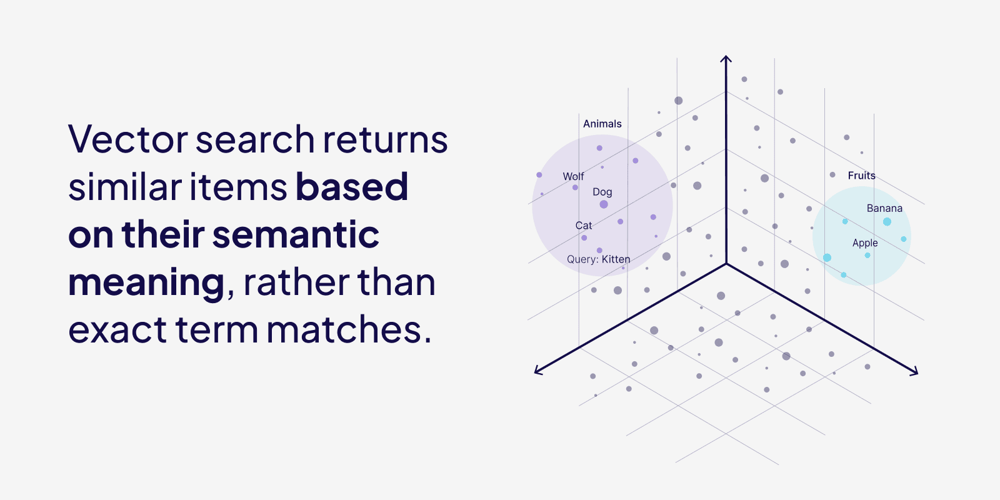

Vector search has fundamentally shifted how we approach information retrieval in modern development. It operates on numerical representations of data called vector embeddings, which capture the semantic meaning in a vector space. Vector search can identify related objects without requiring exact text matches, making it increasingly important for modern information retrieval systems, particularly in AI-native applications where traditional search systems fall short.

##  What is vector search? 

Vector search is a technique for finding and retrieving similar items in large datasets by comparing their vector representations, which are numerical encodings of their features. Unlike traditional search that relies on exact matches, vector search looks for similarity based on meaning or context. It's used in applications like image retrieval, recommendation systems, and search engines.

## How does vector search work?

Vector search works by converting data and queries into [vector embeddings](https://weaviate.io/blog/vector-embeddings-explained). Vector embeddings are generated by language models that learn to capture the meaning and context of data within numerical representations.



At the time of entry/import (or any significant changes to data objects), every data object, and the query, are converted into numerical vector representations using [embedding models](https://weaviate.io/blog/how-to-choose-an-embedding-model). Every data object in a dataset gets a vector, and this is compared to the query vector at search time.

In a nutshell, vector embeddings are an array of numbers, which can be used as coordinates in a high-dimensional space. Although it is hard to imagine coordinates in more than 3-dimensional space (x, y, z), we can still use the vectors to compute the distance between vectors, which can be used to indicate similarity between objects. There are many different [distance metrics](https://weaviate.io/blog/distance-metrics-in-vector-search), like [cosine similarity](https://en.wikipedia.org/wiki/Cosine_similarity) and [Euclidean distance (L2 distance)](https://en.wikipedia.org/wiki/Euclidean_distance). 

Whenever we run a query (like: "What is the tallest building in Berlin?"), a vector search system will convert it to a "query" vector. The task of a vector database is to identify and retrieve a list of vectors that are closest to the vector of your query, using a distance metric and a search algorithm.

This is a bit like a game of boules – where the small marker (jack) is the location of our query vector, and the balls (boules) are our data vectors – and we need to find the boules that are nearest to the marker.

An example of a search algorithm is a [k-nearest neighbors (kNN) algorithm](https://en.wikipedia.org/wiki/K-nearest_neighbors_algorithm), which returns the k nearest vectors, by calculating a similarity score for every data vector in the database to the query vector. In our boules example, with 6 boules, the kNN algorithm would measure the distance between the jack and each of the 6 boules on the ground. This would result in 6 separate calculations.


*[kNN search in a game of Boules.]*

## How to implement Vector Search (from scratch) in Python

We can implement a simple vector search solution from scratch with just a few lines of code in Python.

Let’s start by installing the OpenAI python package to generate vector embeddings for our text, and numpy to do our similarity calculations.

```
pip install openai
pip install numpy
```

We can then import all our dependencies, set our \`OPENAI\_API\_KEY\`, and define our list of sentences. 

```py
from openai import OpenAI
from dotenv import load_dotenv
import os
import numpy as np

load_dotenv()

client = OpenAI(
    api_key=os.getenv("OPENAI_API_KEY"),
)

sentences = [
    "Best pizza places nearby.",
    "Popular breakfast spots in New York.",
    "Top-rated seafood restaurants in Miami.",
    "Cheap hotels near the beach.",
    "Recipes for quick pasta dishes.",
]
```

We can use OpenAI to generate vector embeddings for every sentence, and store these in a new dictionary. 

```py
def get_embedding(text, model="text-embedding-3-small"):
    embedding = client.embeddings.create(input=[text], model=model).data[0].embedding
    return embedding

sentence_vectors = {}
for sentence in sentences:
    embedding = get_embedding(sentence)
    sentence_vectors[sentence] = embedding

```

To calculate the similarity score between the query and each sentence, we can use [cosine similarity](https://en.wikipedia.org/wiki/Cosine_similarity) scoring method. 

```py
def calculate_cosine_similarity(query_vector, vector):
    return np.dot(query_vector, vector) / (np.linalg.norm(query_vector) * np.linalg.norm(vector))
```

Finally, this function will take our query, convert it to a vector, and calculate the similarity score between every query vector and document vector. Then, it will order the results based on relevance, and return the top two scored sentences. 

```py
def get_top_n_similar(query_sentence, n=2):
    query_embedding = get_embedding(query_sentence)

    similarities = {sentence: calculate_cosine_similarity(query_embedding, sentence_vectors[sentence]) for sentence in sentences}

    sorted_similarities = dict(sorted(similarities.items(), key=lambda x: x[1], reverse=True))
    top_matches = list(sorted_similarities.items())[:n]

    for sentence, score in top_matches:
        print(f"Similarity: {score:.4f} - {sentence}")
```

You can see that even though the query and the first returned sentence don’t have all the words in common, it still scores as a high match because the *meaning* is very similar. 

```py
query_sentence = "Find the best pizza restaurant close to me."
get_top_n_similar(query_sentence, n=2)
```

```
Similarity: 0.7056 - Best pizza places nearby.
Similarity: 0.3585 - Top-rated seafood restaurants in Miami.
```

Although this method is able to give us similar items based on text vectors, it’s pretty inefficient. Manually computing cosine similarity over every vector in a large dataset can become computationally expensive fast. Also, without an indexing mechanism, all the vectors are stored in their raw form, requiring high memory consumption and slowing down search speeds. And finally, just storing the vectors and text objects in a dictionary means we lack structured database features. 

To fix all these problems, we can use a vector database to store and search through our vectors. 

## Vector search in vector databases

Vector search, also called semantic search, using a vector database is able to handle large amounts of [unstructured data](https://weaviate.io/learn/knowledgecards/unstructured-data-objects) (think paragraphs instead of spreadsheets) quickly and efficiently, and provides relevant results in search and recommendation systems based on semantic similarity rather than exact matches. This can allow you to do advanced search through millions of documents, for example, [a Wikipedia dataset with over 28 million paragraphs](https://huggingface.co/datasets/weaviate/wiki-sample).

If we query for articles related to: "urban planning in Europe", the vector database (like [Weaviate](https://weaviate.io/developers/weaviate)) responds with a series of articles about the topic, such as "The cities designed to be capitals".

Finding the correct answer in a gigantic repository of unstructured data is not the most impressive part of [vector databases](https://weaviate.io/blog/what-is-a-vector-database) (I mean, it is very impressive), but it is the 🚀 speed at which it all happens. To find the most relevant answer to our semantic search query, it only takes milliseconds in a dataset containing 28 million paragraphs. This is super important when dealing with massive amounts of data, like in recommendation engines or large document datasets. 

The inevitable question that follows up this explanation is always: Why is this so incredibly fast?

### Approximate nearest neighbors (ANN)

Instead of comparing vectors one by one, most vector databases use [Approximate Nearest Neighbor (ANN) algorithms](https://weaviate.io/learn/knowledgecards/ann-approximate-nearest-neighbor), which trade off a bit of accuracy (hence the A in the name) for a huge gain in speed.  

ANN algorithms may not return the true k nearest vectors, but they are very efficient. ANN algorithms maintain good performance (sublinear time, e.g. (poly)logarithmic complexity) on very large-scale datasets.


*[O(n) and O(log n) complexity]*

Note that most vector databases allow you to configure how your ANN algorithm should behave. This lets you find the right balance between the recall tradeoff (the fraction of results that are the true top-k nearest neighbors), latency, throughput (queries per second) and import time.

### Examples of ANN algorithms

Examples of ANN methods are:

* trees – e.g. [ANNOY](https://github.com/spotify/annoy) (Figure 3),  
* proximity graphs \- e.g. [HNSW](https://arxiv.org/abs/1603.09320) (Figure 4),  
* clustering \- e.g. [FAISS](https://github.com/facebookresearch/faiss),  
* hashing \- e.g. [LSH](https://en.wikipedia.org/wiki/Locality-sensitive_hashing)

<br/>
*[Tree-based ANN search]*

Which algorithm works best depends on your project. Performance can be measured in terms of latency, throughput (queries per second), build time, and accuracy (recall). These four components often have a tradeoff, so it depends on the use case which method works best.  
So, while ANN is not some magic method that will always find the true k nearest neighbors in a dataset, it can find a pretty good approximation of the true k neighbors. And it can do this in a fraction of the time!

### HNSW in Weaviate

[Weaviate](https://weaviate.io/developers/weaviate) is a great example of a vector database that uses ANN algorithms to offer ultra-fast queries. The ANN algorithm that Weaviate uses is a custom implementation of [Hierarchical Navigable Small World graphs (HNSW)](https://weaviate.io/developers/weaviate/concepts/vector-index#hnsw).


*[HNSW - Proximity graph-based ANN search]* 

HNSW works by organizing vectors into a hierarchical, multi-layered graph structure, which allows for fast navigation through the dataset during search. The structure of HNSW balances longer distances for faster search in upper layers and shorter distances for accurate search in lower layers.

In Weaviate's implementation, HNSW is enhanced to support full [CRUD operations](https://weaviate.io/blog/crud-support-in-weaviate) and allows for real-time querying, updates, and deletions, with features like incremental disk writes for crash recovery and [asynchronous cleanup processes](https://github.com/nmslib/hnswlib/issues/4#issuecomment-678315156) for maintaining index freshness.

Check out [Weaviate ANN benchmarks](https://weaviate.io/developers/weaviate/benchmarks/ann) to see how HNSW performed on realistic large-scale datasets. You can use it to compare the tradeoffs between recall, QPS, latency, and import time.

You will find it interesting to see that Weaviate can maintain very high recall rates (\>95%), whilst keeping high throughput and low latency (both in milliseconds). That is exactly what you need for fast, but reliable vector search\!

If you’re interested in benchmarking for your own dataset, [check out this webinar](https://events.weaviate.io/benchmarking-webinar).

### ANN vs. KNN

kNN, or [k-nearest neighbors (kNN) algorithm](https://en.wikipedia.org/wiki/K-nearest_neighbors_algorithm), differs from ANN because it calculates a similarity score for *every data vector* in the database compared to the query vector, much like our vector search from scratch example above

Comparing a query vector with 10, 100, or 1000 data vectors in just two dimensions is an easy job. But of course, in the real world, we are more likely to deal with millions (like in the Wikipedia dataset) or even billions of data items. In addition, the number of dimensions that most embedding models use in semantic search goes up to hundreds or thousands of dimensions\!

The *brute force* of a kNN search is computationally very expensive \- and depending on the size of your database, a single query could take anything from several seconds to even hours (yikes 😅). If you compare a vector with 300 dimensions with 10M vectors, the search system would need to do 300 x 10M = 3B computations\! The number of required calculations increases linearly with the number of data points (O(n)).

In summary, kNN search doesn't scale well, and it is hard to imagine using it with a large dataset in production.

## Types of vector search

Vector search is not just limited to text, or even text in a single language. Anything can be converted into a vector with the right embedding model, whether it’s images, audio, video, or multi-lingual documents. This means we can develop multi-modal or multi-lingual semantic search systems that can handle a variety of data formats, languages, or search types. 

### Image Vector Search

[Image vector search](https://weaviate.io/developers/weaviate/search/image) converts images into vector representations to enable similarity searches between images. The vector embeddings encode features like colors, shapes, and textures so that you can search for images based on visual similarity rather than metadata alone. This type of search is frequently used in fields like e-commerce for finding visually similar products, or in content moderation.

### Audio Vector Search

Audio vector search transforms audio files into vectors to power similarity search based on sound characteristics, such as tone, rhythm, or melody. This is used in applications like music discovery platforms, sound effect libraries, and voice recognition systems.

### Video Vector Search

Video vector search converts videos into vector embeddings through methods like sampling frames or analyzing scene features for search based on visual and sometimes audio similarity. This method is popular in applications like content libraries, surveillance, and media databases.

### Multimodal Vector Search


[Multimodal vector search](https://weaviate.io/developers/academy/py/starter_multimodal_data/mm_searches/multimodal) combines different data types—like text, images, and audio—in the same vector space for cross-type comparisons. For example, you could find images or audio most similar to a text query, like retrieving images of a lion or a lion’s roar based on a description alone. This can be used in applications to search across various media formats, like e-commerce, digital asset management, and social media platforms.

### Multilingual Vector Search

Multilingual vector search can compare text across languages by embedding it into the same vector space. For instance, a query in English could retrieve documents, captions, or content in other languages, such as French or Chinese, describing similar concepts. These cross-lingual searches can power applications like global e-commerce, multilingual customer support, and international content discovery.

### Hybrid Search

[Hybrid search](https://weaviate.io/blog/hybrid-search-explained) combines multiple search types, usually vector search and keyword search, in a single system. By combining traditional keyword search with semantic search, we get the best of both worlds: semantic context \+ specific keywords. Semantic search works great for understanding the general meaning of the documents and query, but it doesn’t prioritize exact matches such as names, industry-specific jargon, or rare words, which can be helpful in many types of applications. But without semantic search (only keyword), the results can miss relevant semantic information and context about the desired topic. Combining these two methods can improve both the accuracy and relevance of search results.

## Benefits of vector search

[Traditional keyword-based search systems](https://weaviate.io/learn/knowledgecards/keyword-search) can only match *exact terms or phrases*, or key words, in text. In contrast, vector search returns similar items based on their underlying context or meaning, and works with a variety of data types, including text, images, audio or video. For example, a search for "healthy snacks" might return semantically related terms like "nutritious food" or "low-calorie treats", or in the case of a [multimodal system](https://weaviate.io/learn/knowledgecards/multimodal-embeddings-models), pictures of granola bars or fruit. 

This is why vector search is often also called semantic search. It enables a more “human-like” search experience, allowing users to find related objects without needing to have the exact right words in their query. 

## Vector search use cases

Vector search can power a variety of different applications and use cases, from advanced search systems, to recommendation systems, to chatbots.

### Search Systems

Vector search can be applied to a wide range of different search systems, from billion-scale e-commerce applications to multi-modal and multi-lingual search apps to internal document search in large enterprises. For example, in e-commerce, semantic search can recommend products based on customer intent, even if they don't have the exact keywords in their search query. With the right embedding model selection, you could create [multilingual](https://weaviate.io/blog/weaviate-non-english-languages), like [WeaLingo](https://weaviate.io/blog/wealingo-demo), or [multimodal](https://weaviate.io/developers/academy/py/starter_multimodal_data/mm_searches/multimodal) search apps out of the box. Vector search can also speed up result time for use cases like enterprise search, because the ANN algorithms allow for such fast retrieval speeds over large numbers of unstructured documents. 

### Recommendation Systems

Vector search can be used in [recommendation systems](https://weaviate.io/workbench/recommender) to recommend similar products, movies, or content based on user preferences by finding items with similar vector representations, even without shared metadata or tags. This is widely used in social media apps, news sites, or e-commerce stores. 

### Retrieval Augmented Generation (RAG)

[Retrieval Augmented Generation](https://weaviate.io/blog/introduction-to-rag), or RAG, is a popular use case of vector search used in applications like chatbots or question-answering systems. RAG is just vector search with an extra added step \- the similar results returned by the vector database are given to a large language model (LLM) to generate a contextually relevant response to the user’s query. RAG helps minimize model hallucinations, increase accuracy of responses, and allows generative models to access specialized knowledge to answer complex, data-driven queries. 

Semantic search is great for RAG applications because of its speed and ability to search for documents based on meaning, rather than exact matches. 


## Vector search solutions

There are a few different ways to enable vector search in applications:  

[**Vector indexing libraries**](https://weaviate.io/blog/vector-library-vs-vector-database#vector-libraries) such as [FAISS](https://github.com/facebookresearch/faiss), [Annoy](https://github.com/spotify/annoy), and [ScaNN](https://github.com/google-research/google-research/tree/master/scann), are optimized for in-memory similarity searches and only store vectors, not the data objects they originate from. Their indexes are generally immutable, meaning they can’t be updated dynamically without rebuilding. Additionally, vector libraries often require all data to be imported before querying, which can limit their flexibility in dynamic or constantly updating environments. These libraries are good for applications that involve static data and do not need full CRUD operations or persistence capabilities.

**Vector-capable databases** extend traditional databases with vector search capabilities, allowing businesses to incorporate semantic search while leveraging existing database features. These solutions generally struggle with reliability and speed at scale. 

[**Vector databases**](https://weaviate.io/blog/what-is-a-vector-database) (such as Weaviate) offer a comprehensive solution to semantic search use cases, supporting vector indexing and also managing data persistence, scaling, and integration with the AI ecosystem. They have flexible solutions for a variety of use cases, from AI applications at scale to users who are just getting started.

A **vector search engine** is often used interchangeably with a vector database, but they are technically different: a vector search engine focuses only on the retrieval layer, while a vector database includes additional features like storage, data management, and clustering.

## Vector search FAQs

### Semantic search vs Vector search

In terms of formal definitions, vector search is just the process of arranging vector embeddings, or vectors, into a vector index to perform similarity searches, while semantic search builds on the basic definition of vector search to return more relevant results based on the meaning of text rather than exact terms. In practice, though, vector search and semantic search are often used interchangeably. 

### Vector search vs Keyword search

Vector search finds similar items based on the semantic meaning of the data, while keyword search relies on exact word matches or phrase occurrences. Vector search can handle unstructured, multimodal data (like text, images or audio) and find related concepts, while keyword search is more suited for structured text data where exact phrasing is important.

### How is vector search conducted at scale?

Vector databases use Approximate Nearest Neighbor (ANN) algorithms to speed up search time for large datasets. With ANN algorithms, vector search can return similar items to the query within a few milliseconds, even out of billions of objects. 

## Summary

A quick recap:
* Vector search, also called semantic search, can identify related objects without requiring exact text matches, allowing users to search based on semantic meaning rather than exact keywords.   
* It uses machine learning models to generate vector embeddings for all data objects and the query, and doing math calculations to determine similarity.  
* Vector embeddings capture the meaning and context of data.  
* Vector databases offer super fast responses to queries thanks to ANN algorithms.  
* ANN algorithms trade a small amount of accuracy for huge gains in speed.  
* Different types of vector search include hybrid search or multimodal search for images, audio, or video.  
* Use cases of vector search include Retrieval Augmented Generation (RAG), recommendation systems, or search systems. 

import WhatsNext from '/_includes/what-next.mdx';

<WhatsNext />
