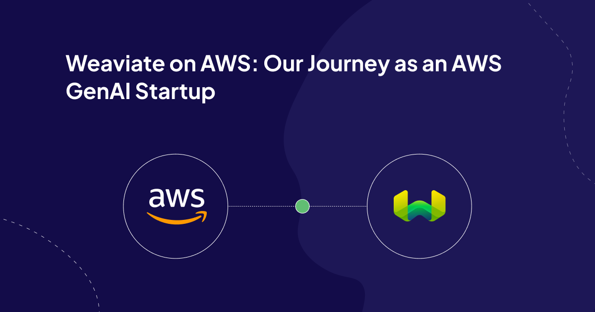

With AWS [re:Invent 2024 approaching](https://reinvent.awsevents.com/), we would like to reflect on our remarkable journey with Amazon Web Services (AWS) and share how our partnership has evolved over the past eighteen months. What began as initial integration discussions has developed into a comprehensive collaboration that continues to provide value to our customers.

From day one, we recognized that cloud hyperscalers would be critical to our go-to-market strategy. We strategically bet on AWS, seeing strong alignment in target market segments. While we compete with first-party cloud offerings like many ISVs, we've found that this healthy competition **drives innovation** and ultimately **benefits** and **gives choices to our customers**. Customers choose what is best for them, and this is a value that both the companies align on for the [ultimate customer centricity](https://aws.amazon.com/executive-insights/content/the-imperatives-of-customer-centric-innovation/).

## Embracing the Co-build, Co-market, Co-sell model

Establishing our partnerships on a solid foundation required us to invest upfront in key differentiators. We focused on taking the time to build these elements before scaling our go-to-market strategy. We aimed to invest wisely, create **strong differentiators**, and ensure our selling motions aligned with internal and external stakeholders. With this solid foundation, we are now fostering a win-win partnership and delighting our joint customers.

## Building on Solid Ground

The Weaviate core database runs natively on Amazon Elastic Kubernetes Service (EKS), providing enterprise-grade scalability and deployment flexibility. By leveraging Kubernetes, we can cater to our customers' needs, whether they require a serverless, multi-tenant solution managed by us or an enterprise-grade, single-tenant option. In the latter case, customers can use our managed services or deploy the same software directly within their environment, receiving enterprise support from Weaviate.

We have expanded our technical integration portfolio to include native support for both Amazon SageMaker, aimed at data engineers building applications from the ground up, and Amazon Bedrock, which caters to data scientists who prefer a straightforward, no-fuss approach to deploying generative AI applications with their chosen foundation models. This expansion continues our commitment to supporting all user personas we target.

Most of the Generative AI buzz is over GPUs and model training, but many production applications run fine on commodity hardware. With cost performance becoming a bigger and bigger issue for production-scale deployments, we are seeing a trend toward AWS Graviton-based deployments. Today, a handful of customers happily run their Knowledge Bases and Q&A apps running fully on gravitation SKUs. 

## Co-Marketing Success

We have focused on telling a compelling "better together" story with AWS from the beginning. Our account and partner marketing teams at AWS have provided exceptional support for early-stage startups like ours. Additionally, with the executive sponsorship at the AWS leadership level, we receive the necessary support to grow our early go-to-market strategy. So far, our co-marketing efforts have produced impressive results over the past year:

* Conducted four successful joint roadshows in San Francisco, Chicago, Seattle, and London.  
* Secured over 20+ customer wins with Morningstar, Instabase, Cisco, Bunq, and others  
* Established joint marketing campaigns, case studies, and webinars, generating significant results.  
* Utilized Marketing Development Funds (MDF) effectively, with a strategic focus on AWS MDF funds.  
* Implemented digital marketing initiatives, including co-branded content creation.  
* Developed success stories, case studies, and solution briefs.  
* Participated at re:Invent 2023 and in the partner showcase events like spotlight.

We have also achieved significant program milestones, such as AWS Generative AI Competency certification, and we are a top-tier participant in the ISV Accelerate program. This success could not have happened without the contributions from teams throughout Weaviate, especially the outstanding work of our partner marketing team.

## Meeting Customers Where They Are

We have focused on close collaboration with AWS sellers from the beginning, opening up new joint opportunities. Tapping into cloud commitment drawdown through private offers has been a significant accelerator.

Understanding that customers have varying needs and preferences, whether in deployment or procurement, we've structured our offerings to provide maximum flexibility. Whether through marketplace purchases, cloud commitment drawdowns, or direct engagement, we're committed to making Weaviate accessible through their preferred channels. Cloud marketplaces are essential to our customer journey. Whether customers are trying out SaaS serverless listings or testing Weaviate through its AWS Kubernetes marketplace listing, these marketplaces play a crucial role.

## Join us at re:Invent

As we prepare for AWS re:Invent in Las Vegas from December 2nd to December 5th, we can't wait to talk to you in person and hear about your generative AI journeys. We invite you to visit us at re:invent to learn more about how Weaviate and AWS work together to deliver the next generation AI-native stack.

We'll demonstrate our latest integrations, share customer success stories, and provide insights into our roadmap for 2024. If you're attending re:Invent, we'd love to connect and discuss how Weaviate and AWS can help accelerate your AI initiatives.

The past eighteen months have been transformative for our partnership with AWS, but we believe the best is yet to come. See you at re:Invent!

What you can expect to see when you visit our booth, **#1506**:

* A few demos showcasing hybrid search, Generative Feedback Loops (GFL), and Retrieval Augmented Generation (RAG)  
* Our new Weaviate comic book \- “The Vector Vault”  
* Limited edition stickers & hats  
* Weaviate's friendly experts

We will have daily prizes given to the lucky winners of our raffle. Visit our booth to get a ticket that is valid for the full week (and learn how to earn extra entries to double your chances of winning)\! The prizes you can win:

* 2 keychron keyboards (Monday)  
* 2 OLED Switches (1 Tuesday, 1 Wednesday)  
* OLED Steam Deck (Thursday)

You can book a meeting with us in our private meeting space to learn all about Weaviate, our integration with AWS, and more. [Book your slot today](https://calendly.com/events-weaviate/weaviate-aws-reinvent), space is limited.

