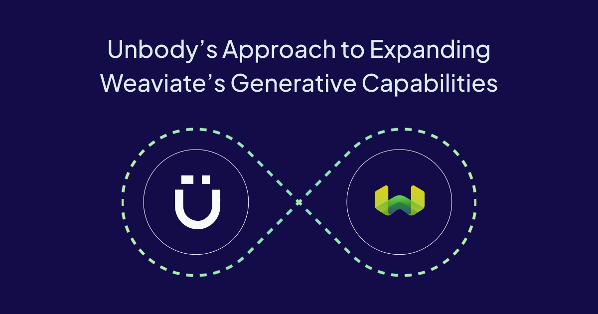

Two years ago, we faced a critical question at [Unbody](https://unbody.io/): how could we build a development stack that was not just AI-enabled but truly AI-native? Like many developers, we started with familiar tools like MongoDB, but we quickly realized that traditional databases weren’t designed to handle the demands of AI-driven workflows. That’s when we turned to [Weaviate](https://weaviate.io/), an AI-native vector database.

Unbody is an AI-native development stack designed to unify AI and product development into a single workflow. Weaviate fits perfectly into this vision, as [this blog post](/blog/unbody-weaviate) outlined. It became a core part of our stack, powering generative features and helping us deliver a flexible, AI-ready experience.

Fast-forward to today: while Weaviate has been a strong foundation, we’ve encountered limitations in its generative capabilities as our needs evolved. Instead of moving away, we decided to expand it. By building a custom extension to its generative endpoint, we tailored it specifically for Unbody’s requirements.

In this post, we’ll share how we extended Weaviate to create a more dynamic and adaptable generative API for our unique use case.

## Challenge

While Weaviate's [generative module (Retrieval Augmented Generation (RAG))](https://docs.weaviate.io/weaviate/configuration/modules#generative-model-integrations) initially met our user's needs, we encountered limitations as their requirements became more sophisticated. The [generative features](https://docs.weaviate.io/weaviate/search/generative) proved inflexible when dealing with evolving demands, especially for advanced scenarios.

### 1. Static Configuration at Project Creation

Weaviate's generative search module supported multiple generative providers, such as OpenAI, Cohere, PaLM, GPT4All, and others. However, at the project creation stage, users were required to lock in specific settings, including:

- Model name
- Temperature
- Top-k, max tokens, and other related parameters

While this setup worked well in the early stages, it presented significant challenges later. If a different generative provider or parameter was required, our users had to create a new project —a project in Unbody is an isolated data space— with the new settings. This meant deploying an entirely new Weaviate instance to accommodate the changes. This added friction when adapting to users' evolving needs and made the process inefficient.

:::info
This [feature was enabled](https://github.com/weaviate/weaviate/pull/6112) in Weaviate [`v.1.27.1`](https://github.com/weaviate/weaviate/releases/tag/v1.27.1)
:::

### 2. Limited Retrieval-Augmented Generation (RAG) Syntax

Another major issue was the limited flexibility in Weaviate’s support for Retrieval-Augmented Generation (RAG). While simple prompts combined with data retrieval from the database worked in some cases, more complex interactions often required:

- **Separation of System and User Prompts:** In scenarios where users interact with data, there’s often a need to distinctly separate the system’s instructions (system prompt) from the user’s input (user prompt). This becomes essential for use cases like chatbots or complex conversation flows. Without this, supporting advanced RAG functionalities or chat completions wasn’t feasible.
- **Simplistic Template Engine:** The built-in template engine was relatively basic. It allowed users to insert string-typed fields directly from the objects they were executing RAG on. However, many users required a more powerful templating system that could handle advanced scenarios like dynamic data injection, context creation, or flexible template structures. There was no built-in way to filter or transform data, which limited our ability to create custom structures needed for more sophisticated workflows.

### 3. Text-Only Input Limitation

A third challenge arose when it came to input types. The generative method within Weaviate only accepted textual content as input, regardless of the model being used. This posed a limitation for our users' projects where they needed to use images as input. Being restricted to text input limited our users’ ability to fully leverage the capabilities of multi-modal models, preventing them from building more interactive and media-rich applications.

## Solution

The challenges we faced with Weaviate’s built-in generative features led us to decouple the generative module from the database to achieve increased flexibility.

To address these needs, we developed a **Generative API** and created a custom module that integrates Weaviate into this API. This solution provides us with greater flexibility and scalability.

This solution provides the ability to dynamically select models and providers, ensuring that Unbody projects are no longer tied to the static configurations set during project creation. This flexibility allows developers to switch models or adjust parameters on the fly, without having to redeploy or set up new projects.

Additionally, the new generative module overcomes the limitations of text-only inputs, now supporting image-based prompts as well. This opens up multi-modal capabilities, enabling richer interactions and media-driven applications. We also introduced a more sophisticated templating engine that allows for advanced data manipulation and transformation, providing custom context creation and more complex workflows.

With these improvements, our solution now offers:

**Dynamic Model and Parameters**

Users can switch between models like GPT-4 or Cohere without the need for redeployment, ensuring adaptability for a range of generative tasks. Additionally, it's possible to customize generative requests further with various parameters such as max tokens and temperature. This ensures more control over the generated content.

```graphql
{
  Get {
    TextBlock {
      _additional {
        generate(
          groupedResult: {
            task: """
	            prompt...
            """
            properties: ["text"]
            options: { 
	            model: "gpt-4o",
	            maxTokens: 1024,
	            temperature: 0
            }
          }
        ) {
          groupedResult
        }
      }
    }
  }
}
```

**Multi-Modal Input Support**

The module allows image inputs alongside text, unlocking the potential of models like GPT-4 Vision for richer, interactive applications.

```graphql
await unbody.get.imageBlock
    .limit(2)
    .generate.fromMany({
    messages: [
        {
            content: 'Describe these images',
        },
        {
            type: 'image',
            content: '$..url',
        },
    ],
    })
    .exec()
```

**Enhanced Chat Completions**

The system supports conversation flows by distinguishing between system and user roles, making it ideal for building interactive chatbots and retrieval-augmented generation (RAG) scenarios.

```tsx
await unbody.get.textBlock
    .generate.fromMany({
    messages: [
        {
		        role: "system",
            content: 'System prompt...',
        },
        ...history,
        {
		        role: "user",
		        content: "user prompt"
        }
    ],
    })
    .exec()
```

**Advanced Data Transformation**

Our Generative API integrates JQ, a powerful JSON processor, to enable sophisticated data transformation directly within API calls. This integration allows developers to dynamically filter, manipulate, and transform JSON data on-the-fly, eliminating the need for separate data processing steps. Using the `vars` option, query results can be transformed into JSON-serializable data and injected into message content, providing a streamlined workflow for complex data handling.

```json
vars: [
  {
    "formatter": "jq",
    "name": "document",
    "expression": "{ originalName, text }"
  }
]

await unbody.get.googleDoc
    .generate.fromOne({
	    messages: [
	        {
	            content: "prompt... \n DOCUMENT: {document}",
	        }
	    ],
    })
    .exec()
```

## What's Next

As we continue to refine and expand our generative capabilities, we're focused on introducing several key features to enhance flexibility, performance, and functionality. Here's a glimpse of what's on our roadmap:

### 1. Structured Output

We plan to introduce structured output capabilities, allowing developers to enforce specific formats in model responses. By implementing output validation and schema support, we'll ensure that generated content follows predefined structures, making it seamless to integrate with existing systems and workflows.

### 2. Support for Streaming

To improve the responsiveness of our generative models, we are working on adding streaming support to both Unbody’s Generative API (REST) and the GraphQL API. This will enable users to receive partial outputs as they are generated, reducing latency and improving user experience, particularly for applications like real-time chat or large content generation tasks.

### 3. Tool/Function Calling

We’re exploring ways to integrate support for tool and function calling within the generative API. This feature would enable models to automatically trigger predefined functions or interact with external systems, enhancing their ability to handle complex workflows and dynamic tasks without manual intervention.

### 4. Broader Model and Provider Support

We plan to expand the range of supported providers and models, including fine-tuned models designed for specific tasks, such as coding. This will offer developers more options to tailor their generative models to specialized use cases, whether it’s code generation, legal document drafting, or other domain-specific applications.


import WhatNext from '/_includes/what-next.mdx';

<WhatNext />
