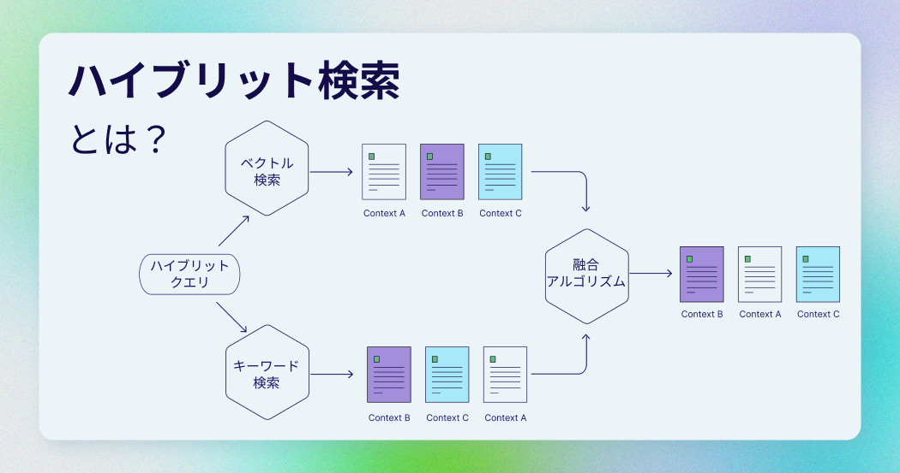

ハイブリッド検索は、複数の検索アルゴリズムを組み合わせることで、検索結果の精度や関連性を向上させる技術です。一般的に、ハイブリッド検索とはキーワード検索とベクトル検索を組み合わせた方法を指します。これら二つのアルゴリズムの強みを活用することで、ユーザーに効果的な検索体験を提供します。

Weaviate[ベクトルデータベース](/blog/what-is-a-vector-database)におけるハイブリッド検索では、スパースベクトルとデンスベクトルの両方が利用されます。スパースベクトルにはトークナイザーが必要ですが、Weaviate `v1.28` では日本語テキスト向けに新しいトークナイザー`KAGOME_JA`が導入されました。

このブログ記事では、ハイブリッド検索の基本を学び、日本語テキストで`KAGOME_JA`トークナイザーを使ったWeaviateのハイブリッド検索の方法を解説します。

## ハイブリッド検索の説明

Weaviateのハイブリッド検索は、デンスベクトルとスパースベクトルを統合して、それぞれの検索手法の利点を活かします。これら二つのベクトルは異なるアルゴリズムによって計算されます。


### キーワード検索

スパースベクトルは、主にゼロ値が多く一部に非ゼロ値を持つ構造をしており、デンスベクトルは主に非ゼロ値で構成されています。スパース埋め込みは、[BM25](https://en.wikipedia.org/wiki/Okapi_BM25) や [SPLADE](https://arxiv.org/abs/2107.05720). のようなアルゴリズムから生成されます。Weaviateにおける現在のハイブリッド検索実装では、BM25/BM25Fとベクトル検索が使用されています。

スパース埋め込みを生成するためには、トークナイザーが必要です。Weaviateでは、日本語テキスト向けに以下の[3つのトークナイザーが利用可能](/developers/academy/py/tokenization/options)です：

* `TRIGAM`  
* `GSE`  
* `KAGOME_JA`（Weaviate `v1.28`で導入）

| トークナイザー | `TRIGAM` | `GSE` | `KAGOME_JA` （Weaviate `v1.28`で導入） |
| :---- | :---- | :---- | :---- |
| メリット | 辞書不要<br/>部分一致 | 辞書＋Tri-gram<br/>部分一致 | 辞書にある単語<br/>不要な結果が出ない |
| デメリット | 不自然な単語<br/>単語が多い | 英単語が細切に<br/>不自然な単語も | 単語中の部分一致ができない<br/>辞書のサイズ |

*Source:  [Jun Ohtani](https://x.com/johtani)*

### ベクトル検索

デンス埋め込みは、[GloVe](https://text2vec.org/glove.html)や[Transformers](https://huggingface.co/docs/transformers/index)といった機械学習モデルから生成されます。これらのベクトルは情報が密に詰まっており、ほとんどが非ゼロ値で構成されています。ベクトルデータベースはこれらの埋め込みを保存し、二つのベクトル間の距離を計算します。この[距離メトリクス](/blog/distance-metrics-in-vector-search)により、二つのベクトル埋め込みがどれほど類似しているか、または異なるかがわかります。検索クエリもデータベクトルと同様にベクトルに変換され、その距離値によってベクトルの近さが決まります。

### 融合アルゴリズム

キーワード検索とベクトル検索の結果を単一のランキングリストに統合する方法はいくつかあります。Weaviate `v1.20`以降では、以下の2つのアルゴリズムが利用可能です：

* `rankedFusion`  
* `relativeScoreFusion`

これらの融合アルゴリズムについての詳細は、[こちらの記事](/blog/hybrid-search-fusion-algorithms#fusion-algorithms)で解説されています。

さらに、alphaパラメータを用いてキーワード検索とベクトル検索の結果の重み付けを調整できます：

* `alpha = 0`：キーワード検索のみ  
* `alpha = 1`：ベクトル検索の  
* `alpha = 0.5`：スパースとデンスのベクトルを均等に重み付け

## ハイブリット検索のメリット

ハイブリッド検索は、セマンティック検索の機能を活用しつつ、正確なキーワード一致も必要とする検索システムに理想的です。

例えば、「春のドレス」というクエリを考えてみましょう。通常のキーワード検索やセマンティック検索に比べて、ハイブリッド検索を使用する方がより良い結果を得られます。デンスベクトル表現では「春」が花柄や軽い素材を意味すると解釈され、スパースベクトル検索では「ドレス」という単語に正確に一致します。このように、ハイブリッド検索はスパースベクトルとデンスベクトルの両方の利点を活かします。

一般的に、デンスベクトルはクエリの文脈を理解するのに優れており、スパースベクトルはキーワード一致に優れています。

## Weaviateのハイブリッド検索 実装

これで、ハイブリッド検索の概要と日本語テキストへの応用がわかるようになったと思います。`KAGOME_JA`トークナイザーを活用して、Weaviateでさらに効果的な検索を実現しましょう！

```py
data = [
    ["スポーツ用レギンス", "吸湿速乾性に優れた素材で作られたレギンス。ジムやヨガ、ランニングに最適です。"],
    ["点線模様の長靴", "雨の日のおしゃれにぴったりの長靴。ユニークな点線模様が特徴です。"],
    ["トレンチコート", "クラシックなデザインのトレンチコート。春や秋の軽い羽織りに最適な一着です。"],
    ["ひまわりの模様のドレス", "明るいひまわり柄が夏らしい印象のドレス。軽やかで涼しい素材が魅力です。"],
    ["ライトカーディガン", "肌寒い日の重ね着に便利なライトカーディガン。軽量で持ち運びにも便利です。"],
    ["フローラルミニスカート", "春や夏にぴったりの花柄ミニスカート。華やかなデザインで女性らしさを引き立てます。"],
    ["ピンクのスカート", "柔らかなピンク色がかわいらしいスカート。シンプルなデザインでコーディネートしやすいです。"],
    ["カシミアセーター", "高級感のあるカシミア素材で作られたセーター。寒い冬に暖かさとスタイルを提供します。"],
    ["ライトウールスカーフ", "秋や冬にぴったりのウールスカーフ。軽量で肌触りが良く、暖かさをプラスします。"],
    ["ニットドレス", "柔らかく暖かい素材で作られたニットドレス。寒い季節のカジュアルスタイルに最適です。"],
    ["ミディプリーツスカート", "エレガントなシルエットが特徴のプリーツスカート。どんなトップスとも相性抜群です。"],
    ["花柄の傘", "雨の日を明るくしてくれる花柄デザインの傘。軽量で使いやすい構造です。"],
    ["長袖の紺色のドレス", "落ち着いた紺色がエレガントな長袖ドレス。フォーマルな場にも最適です。"],
    ["春の花柄ドレス", "春の装いにぴったりの鮮やかな花柄ドレス。柔らかい素材で着心地も抜群です。"],
    ["ボア付きデニムジャケット", "冬の寒さから守るボア付きデニムジャケット。カジュアルスタイルにぴったりです。"],
    ["レザーアンクルブーツ", "シックで洗練されたデザインのレザーアンクルブーツ。秋冬の装いにおすすめです。"],
    ["防水ジャケット", "雨の日の外出を快適にする防水ジャケット。軽量で動きやすいデザインが魅力です。"],
    ["シンプルな黒のタートルネック", "どんなスタイルにも合わせやすい黒のタートルネック。秋冬の重ね着に最適です。"],
    ["シフォンブラウス", "軽やかで女性らしいデザインのシフォンブラウス。春や夏のフォーマルな場にもおすすめです。"]
]
```

### 1. Weaviate データベース作成

日本語のKAGOMEトークナイザーを使用したハイブリッド検索をWeaviateで利用するには、Weaviate`v1.28`以降のバージョンを使用していることを確認する必要があります。以下の手順で、[Dockerを使用してWeaviateベクトルデータベースのインスタンスをローカル環境にセットアップ](/developers/weaviate/installation/docker-compose)できます：

```
docker run -p 8080:8080 -p 50051:50051 cr.weaviate.io/semitechnologies/weaviate:1.28.1
```

次は[Weaviate ClientのPythonライブラリ](/developers/weaviate/client-libraries)を準備します。バージョン4.9.6以上が必要です。

```
!pip install weaviate-client
```

### 2. Weaviateの接続情報をセットアップ

次に、Weaviate Clientを初期化します。Weaviateに接続するための設定では、Cohereの埋め込みモデルを使用するため、CohereのAPIキーが必要です。

```py
import weaviate, os

# Connect to your local Weaviate instance deployed with Docker
client = weaviate.connect_to_local(
  headers={
    "X-COHERE-Api-Key": os.environ["COHERE_API_KEY"] 
  }
)
```

### 3. データコレクションの定義

次に、ラスを作成して[Schema](developers/weaviate/config-refs/schema)を定義します。クラスは、オブジェクトを格納するデータコレクションです。クラスのSchemaには、Cohereの多言語（日本語対応）埋め込みモデル `embed-multilingual-v3.0` を定義します。また、`KAGOME_JA`トークナイザーを有効化します。

```py
import weaviate.classes.config as wc

client.collections.create(
    name="ClothingItems",
    vectorizer_config=wc.Configure.Vectorizer.text2vec_cohere(
        model="embed-multilingual-v3.0",    ),
    properties=[
        wc.Property(name="item", 
                    data_type=wc.DataType.TEXT,
                    tokenization=wc.Tokenization.KAGOME_JA
                    ), 
        wc.Property(name="description", 
                    data_type=wc.DataType.TEXT,
                    tokenization=wc.Tokenization.KAGOME_JA
                    ),
    ]
)
```

### 4. データ登録

次に、WeaviateのClientを使用してデータを登録します。

```py
# Get a collection object for "ClothingItems"
clothes = client.collections.get("ClothingItems")

with clothes.batch.dynamic() as batch:
    for d in data:
        batch.add_object({
            "item": d[0],
            "description" : d[1],
        })
```

### 5. クエリ方法

これでベクトルデータベースのセットアップが完了し、クエリを実行できる状態になりました。

まずは、シンプルなBM25クエリから始めましょう。

```py
response = clothes.query.bm25(
    query="ドレス",
    limit=3
)

for item in response.objects:
    print(f"{item.properties['item']}: {item.properties['description']}")
```

結果は以下の通りです。ご覧のとおり、検索結果には「ドレス」というキーワードに一致するアイテムのみが含まれています。

```
長袖の紺色のドレス: 落ち着いた紺色がエレガントな長袖ドレス。フォーマルな場にも最適です。
ニットドレス: 柔らかく暖かい素材で作られたニットドレス。寒い季節のカジュアルスタイルに最適です。
ひまわりの模様のドレス: 明るいひまわり柄が夏らしい印象のドレス。軽やかで涼しい素材が魅力です。
```


では、前の例で説明したハイブリッド検索クエリを試してみましょう。

```py
response = clothes.query.hybrid(
    query="春のドレス",
    alpha=0.8,
    limit=3
)

for item in response.objects:
    print(f"{item.properties['item']}: {item.properties['description']}")
```

結果は以下の通りです。ご覧のとおり、検索結果には「ドレス」というキーワードに一致するアイテムと、春に適した花柄のアイテムの両方が含まれています。最後のアイテムは「ドレス」というキーワードには一致していませんが、それでも花柄のスカートが含まれています。これは、alpha値を0.8に設定しており、キーワード検索よりもベクトル検索を優先しているためです。

```
春の花柄ドレス: 春の装いにぴったりの鮮やかな花柄ドレス。柔らかい素材で着心地も抜群です。
ひまわりの模様のドレス: 明るいひまわり柄が夏らしい印象のドレス。軽やかで涼しい素材が魅力です。
フローラルミニスカート: 春や夏にぴったりの花柄ミニスカート。華やかなデザインで女性らしさを引き立てます。
```


## まとめ

この記事では、ハイブリッド検索の概念について説明しました。Weaviateベクトルデータベースにおけるハイブリッド検索は、キーワード検索とセマンティック検索を組み合わせたものです。これら二つの検索を統合することで、セマンティック検索の強力な機能を活用しながら、製品名やブランド名など特定のキーワードの正確な一致も必要とするユースケースで、より関連性の高い結果を得ることができます。

日本語テキストに対して、Weaviateではキーワード検索およびハイブリッド検索のために3つの異なるトークナイザーを選択できるようになりました。上記のKAGOME\_JAトークナイザーを使用したハイブリッド検索の例について、コードは[このノートブック](https://github.com/weaviate/recipes/blob/main/weaviate-features/hybrid-search/hybrid_search_cohere_japanese.ipynb)で確認できます。

ハイブリッド検索の詳細については、[ドキュメント](/developers/weaviate/api/graphql/search-operators#hybrid)をご覧ください！

import WhatNext from '/_includes/what-next.mdx';

<WhatNext />
