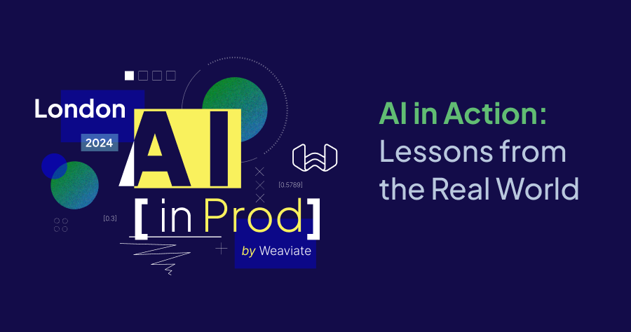

  

---

**AI in Action: Lessons from the Real World**

The Weaviate team was in London last month, where the presentations were packed with insights from the field, real-world use cases, and inspiration for what’s next in AI. From streamlining development to tackling challenges in nuclear energy, here’s a recap of the standout moments.

---
  
### **1. Mastering Vector Databases**

Our CTO & Co-Founder, Etienne Dilocker dove deep into two emerging use cases for large-scale projects:

- **E-commerce search** handling **1-10 billion embeddings** with sub-second queries, powered by HNSW indexing and smart optimizations.
- **Email RAG** using a multi-tenant setup to process hundreds of thousands of smaller datasets with sub-second speed.

Both examples proved there’s no one-size-fits-all solution—your approach should depend on the data and the problem you’re solving.

---

### **2. OLIVER’s AI Sandbox and Experimentation**

Andy Hoare, Senior Business Analyst, from the marketing agency **OLIVER** shared how the company scaled from 500 to 5,000 people in 10 years, while making AI experimentation a core part of their strategy. Their **AI Sandbox** has **1,250+ users**, generating **10,000 images a month** and powering **10 million chat interactions**.

He spoke about the following projects:

- **Slipstream** is changing how clients and agencies work together by empowering clients to create more comprehensive and efficient briefs and allowing agencies to work smarter and faster.
- **C2PA** is a transparency initiative for AI-generated content that enables OLIVER to maintain a duty of care to its clients and audiences and build trust as a content creator.
- **Share of Model,** with Jellyfish, measures brand perception within AI models.

Andy’s advice? Experiment often, fail fast, and find great tech partners to support your growth.

    <iframe src="//youtube.com/embed/49MgYZFaViI?si=Kz3YNGos-7rQWFyD" 
    frameBorder="0"
    width="700"
    height="400" 
    allowFullScreen>
    </iframe>

---

### **3. AI Meets Nuclear Decommissioning**

Willem van Asperen and Derek Van Gelderen from **PA Consulting** shared their innovative use of AI in the nuclear sector. At **Sellafield Limited**, they’re solving business-critical challenges, like:

- A wave of retirements shrinking their workforce by **20%** in the next five years.
- Document reviews that used to take **12 months**.

Their solutions included:

- **SLComply.ai**, which automates compliance and slashes administrative time by **90%**.
- **DANI**, a GenAI-powered assistant that processes documents in minutes instead of months.
- **Genie**, a system that connects LLMs, databases, and operational tools to make workflows seamless.

PA Consulting’s use of Weaviate to scale its document and compliance tools highlights the power of vector search and AI in transforming workflows. By integrating Weaviate, they’re achieving greater efficiency, accuracy, and scalability all while remaining user centric.

    <iframe src="//youtube.com/embed/Uke1dtRwVus?si=SUA2v_KMfXAd26Yp" 
    frameBorder="0"
    width="700"
    height="400" 
    allowFullScreen></iframe>

---

### **4. Building AI-Native Software with Unbody.io**

Amir Huieh, CEO & Co-Founder of **unbody.io**, shared his journey from running a computer vision and NLP to founding Unbody, an AI-first startup. He broke down the difference between **AI-native** apps (where AI is the core) and **AI-enhanced** ones (where AI is just a bonus).

Amir showed how integrating **Weaviate** helped his team streamline their development stack, cutting out unnecessary layers. Demos included:

- A **healthcare platform** that matches patients with therapists.
- An **AI blogging tool** that turns videos into full articles.
- A **desktop organizer** for simplifying digital clutter.

And the big news? **Unbody is going open source!** Amir invited the community to [jump in and contribute](http://unbody.io/blog/going-oss).

    <iframe src="//youtube.com/embed/HKqoTochBro?si=aZVFjANnD8hfQp1Q" 
    frameBorder="0"
    width="700"
    height="400" 
    allowFullScreen>
    </iframe>

---

### **Key Takeaways**

Across every session, a few key themes stood out:

- **Simplify where you can**: Merging AI and traditional stacks saves time and headaches.
- **Experiment boldly**: Whether it’s a sandbox or open source, trying new things (and failing fast) is the way to grow.
- **AI is solving real problems**: From nuclear compliance to blogging tools, the impact is tangible and exciting.

The future of AI is collaborative, creative, and just getting started. Let’s keep building, learning, and sharing!

import WhatNext from '/_includes/what-next.mdx';

<WhatNext />
