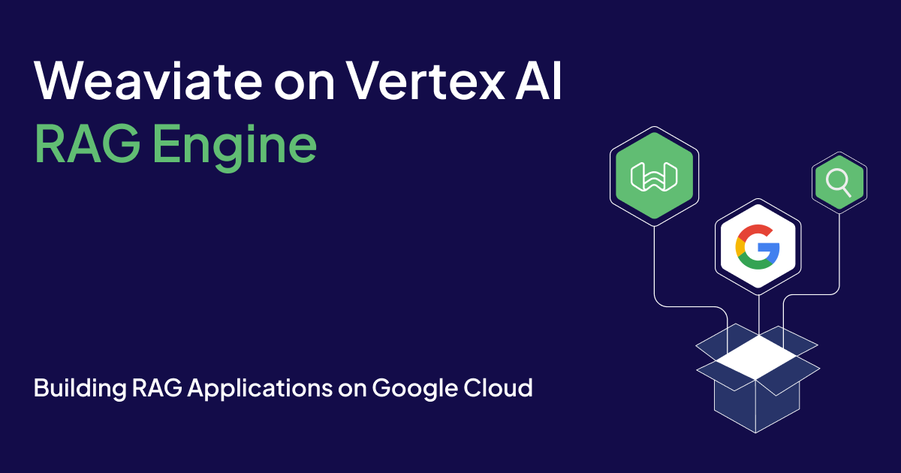

Large Language Models (LLMs) are rapidly shifting how we work and perform daily tasks. From drafting emails to summarizing meeting notes, language models have become essential in a variety of applications. Although LLMs are extremely powerful, they are **only as good as the data they were trained on**, meaning, they can be limited by biases or lack of specific knowledge. To address these limitations, we can either fine-tune the language model on more relevant data or implement Retrieval Augmented Generation (RAG). 

RAG is a technique that enhances language models by integrating external knowledge sources into the generation process. By retrieving relevant information from databases like [Weaviate](https://weaviate.io/) before generating an output, RAG enables models to produce more accurate and context-specific responses. LLM frameworks facilitate the orchestration of multiple language model calls by allowing developers to **chain requests together**. To further support developers, Google released a RAG framework called Vertex AI RAG Engine on top of Google Cloud’s infrastructure.

Vertex AI RAG Engine is a fully managed solution for RAG orchestration. Each process of the RAG pipeline is covered: 

* **Data Ingestion**: Ingest data from a variety of sources (local files, Cloud Storage, etc.)  
* **Data Transformation**: Prep the data and chunk it   
* **Embedding**: Convert the chunks into vector embeddings ([list](https://cloud.google.com/vertex-ai/generative-ai/docs/rag-overview) of supported models)  
* **Data Indexing**: Build an index in Weaviate to store the objects and embeddings  
* **Retrieval**: Retrieve chunks based on the query (vector and [hybrid](https://cloud.google.com/vertex-ai/generative-ai/docs/use-weaviate-db#hybrid-search) search are supported)  
* **Generation**: Pass the retrieved chunks to the language model for context-aware responses (integrate with [first and third-party models](https://cloud.google.com/vertex-ai/generative-ai/docs/rag-overview#supported-models))

[Weaviate is integrated](https://cloud.google.com/vertex-ai/generative-ai/docs/use-weaviate-db) with the Vertex AI RAG Engine. The Weaviate cluster is used for the storage, index management, and retrieval components. You can connect your Weaviate cluster to the RAG Engine by passing in your Weaviate cluster API key. 

## Weaviate’s Integration with Vertex AI RAG Engine

[Weaviate](http://www.weaviate.io) is an open-source, AI-native vector database. You will need to configure and deploy your Weaviate cluster by using [Weaviate Cloud](https://console.weaviate.cloud) as an option. The only requirement is that the Weaviate endpoint is accessible.

### Indexing

Once you’ve created your Weaviate cluster and defined your collection, you can now import your data into Weaviate. Since we’ve defined the vectorizer (`text2vec_palm`), Weaviate will automatically generate the embeddings and store it in an index. 

Weaviate supports [multiple indexes](https://weaviate.io/developers/weaviate/concepts/indexing) (vector and inverted index) for efficient storage and retrieval. The vector index is used for vector search queries and the inverted index is used for keyword and hybrid search. 

### Retrieval

Vertex AI RAG Engine supports Weaviate’s [vector and hybrid search](https://weaviate.io/developers/weaviate/concepts/search). Vector search is used to find semantically similar objects in your database. For example, if you search for 'seafood pasta' using vector search, a recipe about making lobster linguine will be returned because the model understands the semantic relationship between 'seafood pasta' and 'lobster linguine.' Conversely, running the same query with keyword search will only return recipes where the title explicitly includes the words 'seafood' or 'pasta,' potentially missing relevant dishes like lobster linguine.

Hybrid search on the other hand, combines vector and keyword search. It uses the best of both search methods to boost retrieval accuracy. The inverted index is built at import automatically unless you set a property to `indexSearchable=False` in your collection. The `alpha` parameter in hybrid search determines the weighting of the two search methods. `alpha=0` is pure keyword search, `alpha=1` is pure vector search, and `alpha=0.5` is an equal weighting of the two. [Here](https://cloud.google.com/vertex-ai/generative-ai/docs/use-weaviate-db#hybrid-grounded-generation) is an example of a hybrid search request sent to the Vertex AI RAG Engine. 

## Demo 

Let’s now jump into a demo on how you can use the RAG Engine with Weaviate as a vector database. 

You can follow along with the notebook [here](https://colab.research.google.com/github/GoogleCloudPlatform/generative-ai/blob/main/gemini/rag-engine/rag_engine_weaviate.ipynb).

### Deploying Weaviate

You’ll need to configure and deploy your cluster. You have a few options to spin up your Weaviate instance:

1. Subscribe to the [Weaviate Cloud Serverless listing](https://console.cloud.google.com/marketplace/product/weaviate-gcp-mktplace/weaviate?authuser=1&project=rag-api-test) on GCP marketplace and easily deploy a cluster  
2. Configure Weaviate on a [Kubernetes cluster](https://console.cloud.google.com/marketplace/product/weaviate-gcp-mktplace/weaviate?hl=en&project=clean-pen-427907-c5&invt=AbnfrQ&utm_source=website&utm_medium=button&utm_campaign=GCPMarketplace?authuser=1&project=rag-api-test) on GCP marketplace  
3. Create a cluster [directly on Weaviate Cloud](https://console.weaviate.cloud/) (WCD)  
4. Other installation options are listed [here](https://weaviate.io/developers/weaviate/installation)

### API Keys in Secret Manager

Now that we have our Weaviate cluster running, we’ll need to save our API keys in the Google Cloud Secret Manager. If you deployed your cluster through the serverless listing on GCP marketplace or directly on WCD, then you can grab your API keys from the [console](https://console.weaviate.cloud/). 

Go to the [Google Cloud console](https://console.cloud.google.com/) and navigate to the Secret Manager. You will need to store your cluster URL and the admin API key. For further documentation on the Secret Manager, refer to [this page](https://cloud.google.com/secret-manager/docs/overview).

### Define Weaviate Collection and Configure RAG Corpus

The [Weaviate collection](https://cloud.google.com/vertex-ai/generative-ai/docs/use-weaviate-db#create-collection) needs to match the properties stored in the RAG Engine corpus. Here is an example of a collection with the necessary properties:

```python
weaviate_client.collections.create(
    name="Documents",

    properties=[
            wc.Property(name="fileId", data_type=wc.DataType.TEXT),
            wc.Property(name="corpusId", data_type=wc.DataType.TEXT),
            wc.Property(name="chunkId", data_type=wc.DataType.TEXT),
            wc.Property(name="chunkDataType", data_type=wc.DataType.TEXT),
            wc.Property(name="chunkData", data_type=wc.DataType.TEXT),
            wc.Property(name="fileOriginalUri", data_type=wc.DataType.TEXT),
      ]
)

print("Successfully created collection: Documents")
```

The RAG Engine calls the embedding model directly so you don’t need to define the vectorizer in your Weaviate collection. Keep in mind that it has a [default rate limit of 1,000](https://cloud.google.com/vertex-ai/generative-ai/docs/use-weaviate-db#import_rag_files) calls per minute.

Now you can load the embedding model and configure the RAG corpus:

```python
embedding_model_config = rag.EmbeddingModelConfig(
    publisher_model="publishers/google/models/text-embedding-004" # configure the embedding model
)
DISPLAY_NAME = "Documents" # name your corpus

WEAVIATE_HTTP_ENDPOINT = "projects/7.../secrets/WEAVIATE_HTTP_ENDPOINT" # pass in the resource name from the secret manager

COLLECTION_NAME = "Documents"  # name of your Weaviate collection

API_KEY =  "projects/7.../secrets/API_KEY"  # pass in the resource name from the secret manager

vector_db = rag.Weaviate( # define the vector database
    weaviate_http_endpoint=WEAVIATE_HTTP_ENDPOINT,
    collection_name=COLLECTION_NAME,
    api_key=API_KEY,
)
```

Now we can configure the RAG corpus:

```python
rag_corpus = rag.create_corpus(
    display_name=DISPLAY_NAME, # name of your corpus
    embedding_model_config=embedding_model_config, # define the embedding model
    vector_db=vector_db,# connect to your Weaviate cluster
)
```

### Import Documents

You can now upload files to the corpus. You can import documents from Google Cloud Storage, Google Drive, and other sources. Here is an example on how you can import a `.txt` file:

```python
rag_file = rag.upload_file(
    corpus_name=rag_corpus.name,
    path="test.txt",
    display_name="test.txt",
    description="My test file",
)
```

### Generate Content with the RAG Retrieval Tool

We can now use the `GenerateContent` API to generate text from documents in our corpus:

```python
rag_resource = rag.RagResource(
    rag_corpus=rag_corpus.name,
)

rag_retrieval_tool = Tool.from_retrieval(
    retrieval=rag.Retrieval(
        source=rag.VertexRagStore(
            rag_resources=[rag_resource],  # Currently only 1 corpus is allowed.
            similarity_top_k=10, # optional: number of top k documents to retrieve 
            vector_distance_threshold=0.4, # optional: threshold for the retrieval
        ),
    )
)

rag_model = GenerativeModel("gemini-1.5-flash", tools=[rag_retrieval_tool])
```

You will pass in your query and generate the content with the `rag_model.generate_content` API:

```python
GENERATE_CONTENT_PROMPT = "Write a paragraph about hybrid search"

response = rag_model.generate_content(GENERATE_CONTENT_PROMPT)
response.text
```

Gemini will then generate an answer based on its knowledge and the context in your database. For example, here is the output from my query above:

> Hybrid search combines keyword and vector search for more accurate results.  Keyword search uses words to find relevant documents, while vector search uses mathematical representations of words to find documents with similar meanings. This combination allows for a more comprehensive and accurate search experience.

## Conclusion

This blog post showed you how to use Weaviate on the Vertex AI RAG Engine. The Vertex AI RAG Engine is a great way for developers to build generative AI applications on top of Google Cloud’s infrastructure. 

Generative AI applications are transforming a wide range of industries by providing innovative solutions and streamlining complex processes. From finance to manufacturing, these applications leverage language models and vector databases to automate tasks, generate insights, and enhance decision making. 

Additional resources:

* [Documentation on the Vertex AI RAG Engine](https://cloud.google.com/vertex-ai/generative-ai/docs/rag-overview)  
* [Using Weaviate on Vertex AI RAG Engine](https://cloud.google.com/vertex-ai/generative-ai/docs/use-weaviate-db)  
* [Weaviate Quickstart Guide](https://weaviate.io/developers/weaviate/quickstart)

import WhatNext from '/_includes/what-next.mdx';

<WhatNext />
