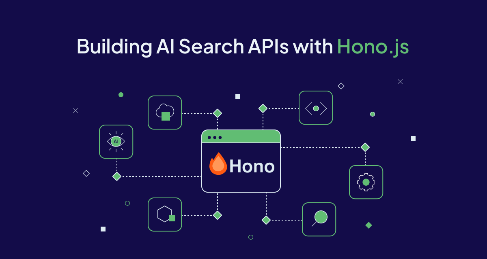
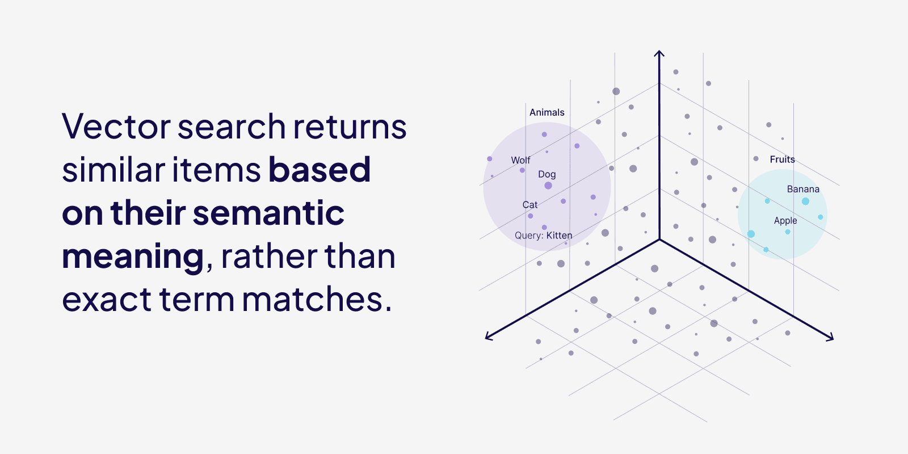
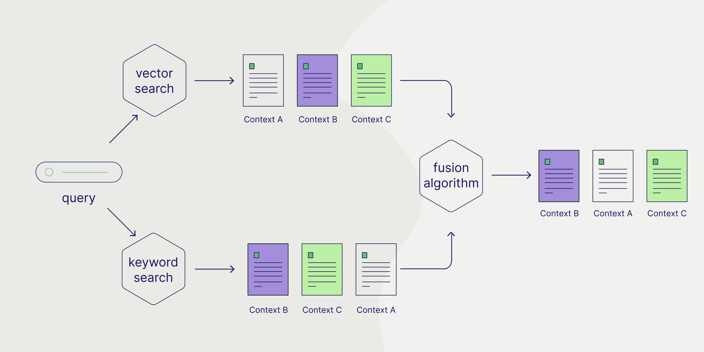
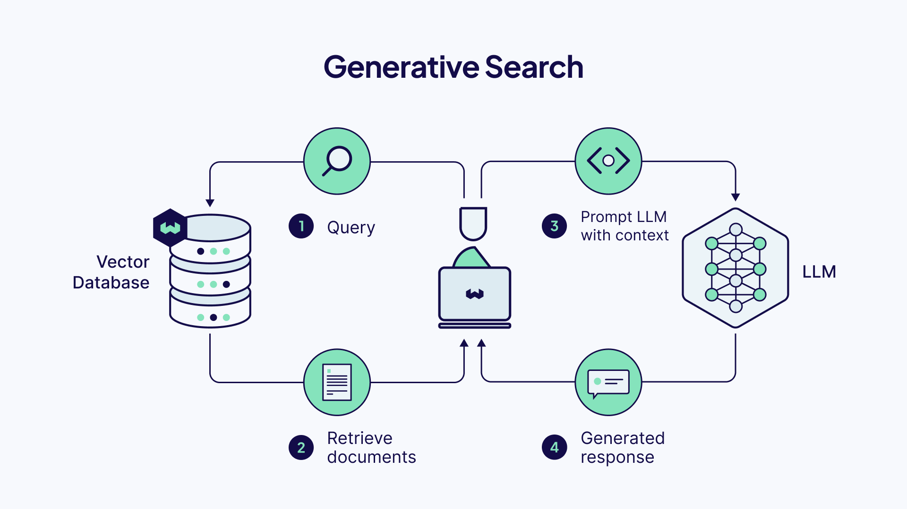

Search is an integral part of our experience using the internet. Information consumption is fuelled by our ability to search, and do so efficiently. Search is more than just finding a needle in a haystack - it's about understanding user intent, context, and delivering relevant results instantly. The rise of AI and vector databases has transformed what's possible with search, making previously complex and inaccessible features like semantic understanding and generative responses accessible to developers.

In this tutorial, we'll build a versatile search API using Hono.js that implements three powerful search paradigms: Vector, Hybrid, and Generative search. You'll learn how these different search types work.

## Prerequisites

Before we begin, make sure you have:
- Node.js 18+ installed
- Basic understanding of JavaScript 
- Familiarity with REST APIs
- A package manager (npm or yarn)
- Basic understanding of Vector Databases (we'll use [Weaviate](https://weaviate.io))

> ❓ Don't know what a Vector Database is? Here is a great [explainer](https://weaviate.io/blog/what-is-a-vector-database#vector-database-vs-vector-store)!

## Why Hono.js?

You might be asking, "Why Hono.js??" 

Hono is a fast, lightweight web framework that's changing how we build APIs. A big part of what makes Hono.js special is the fact it is built on [Web Standards](https://hono.dev/docs/concepts/web-standard) which makes it quicker than most frameworks because it has minimal overhead and ~ zero dependencies. 

With that, let's dive into search! 

## Understanding Modern Search Paradigms

### Vector Search

Vector search, also referred to as semantic search goes beyond [exact word matches](https://weaviate.io/developers/weaviate/concepts/search/keyword-search) to understand the meaning behind queries. When you search for "affordable holidays in Europe", it knows to include results about "budget-friendly getaways in Europe" even if those exact words aren't present.

Think of vectors as coordinates for meaning - just like how two locations can be close on a map, two pieces of text can be close in meaning.



### Hybrid Search

Hybrid search gives you the best of both worlds - the precision of traditional keyword search with the understanding of vector search. Behind a hybrid search are individual keyword and vector searches. It then uses a fusion algorithms to merge the two results, providing a balance between precision and semantic understanding. 



### Generative Search 

Generative search is where Generative AI really shines. Instead of just finding relevant content with a typical vector or hybrid search, it can create new, contextual responses based on the search results. Imagine asking not just "find nice sea-side vacation trips" but "summarize the best sea-side vacation trips to help me pick a holiday".



With our new knowledge, let's build some APIs!

## Building Search APIs

We're building a server application that exposes an API we can use to run the three searches we just learned about.

You can use the final [project repository](https://github.com/malgamves/weaviate-servers/tree/main/hono-server) as a reference should you need clarification as you go through the tutorial. 

### Step 1: Setup Hono.js

Set up your Hono.js application with the following command.

```bash
npm create hono@latest my-app
```
You will be asked which template you would like to use. Select *Node.js*.
After your application is initialized, you should have a nice new Hono.js application.

### Step 2: Inspect your API Root

Using the Node.js template will create a file called `index.ts` in your `src` directory.
It should look like this. 

```ts
// src/index.ts
import { serve } from '@hono/node-server'
import { Hono } from 'hono'

const app = new Hono()

app.get('/', (c) => {
  return c.text('Hello Hono!')
})

const port = 3000
console.log(`Server is running on http://localhost:${port}`)

serve({
  fetch: app.fetch,
  port
})
```

This file sets up a simple Node.js server that you can interact with on `localhost:3000`. If we make a get request to `http://localhost:3000/`, we will get a response from the server saying `"Hello Hono"`. 

### Step 3: Setup Weaviate

We'll start by creating a free sandbox account on [Weaviate Cloud](https://console.weaviate.cloud/). Follow [this guide](https://weaviate.io/developers/wcs/manage-clusters/connect) if you have trouble setting up a sandbox project.

You will need your Weaviate cluster URL and API key. If you don't already have one, you'll also need to create a Cohere [API key](https://dashboard.cohere.com/api-keys), we use Cohere as our [embedding model](https://weaviate.io/developers/academy/js/standalone/using-ml-models/embedding). When done, add all three to your `.env` file, as shown in your [`.env.example`](https://github.com/malgamves/weaviate-servers/blob/main/hono-server/.env.example) file.

In your terminal, run the following commands to install the [weaviate-client](https://www.npmjs.com/package/weaviate-client) and dotenv packages.

```bash
npm install weaviate-client dotenv
```

In your `config` folder, create a file called `weaviate.ts`. You can create the folder if it doesn't already exist. Paste the following code in it.

```ts
// config/weaviate.ts
import weaviate from 'weaviate-client';
import 'dotenv/config';

const weaviateURL = process.env.WEAVIATE_HOST_URL as string;
const weaviateKey = process.env.WEAVIATE_READ_KEY as string;
const cohereKey = process.env.COHERE_API_KEY as string;

export const connectToDB = async () => {
  try {
    const client = await weaviate.connectToWeaviateCloud(weaviateURL,{
          authCredentials: new weaviate.ApiKey(weaviateKey),
          headers: {
           'X-Cohere-Api-Key': cohereKey,
         }
        }
      )
      console.log(`We are connected! ${await client.isReady()}`);
      return client
  } catch (error) {
    if (error instanceof Error)
      console.error(`Error: ${error.message}`);
      process.exit(1);
  }
};
```

This code initializes a connection with Weaviate Cloud using the `connectToWeaviateCloud()` method. 


### Step 4: Import Data to Weaviate

To run some searches, we need to have data to search through. To get some data into your Weaviate instance, follow our [recipe on loading data](https://github.com/weaviate/recipes-ts/blob/main/generative-search/cohere/load.ts) into Weaviate. 

This is a script you can run that will create a new collection in Weaviate, setup an embedding model with Cohere and import 10 items into your Weaviate instance. For this tutorial, we'll be using part of the [Wikipedia dataset](https://huggingface.co/datasets/legacy-datasets/wikipedia).


### Step 5: Create Search Routes

With data imported, in `src`, create a folder called `search`. The files containing code for our search routes will go in there. 

#### Vector Search

Our first route will be for Vector search. In `src/search` create a file called `vector.ts` and paste the following code in it. 

```ts
// src/search/vector.ts
import { Hono } from 'hono'
import { logger } from 'hono/logger'
import { cors } from 'hono/cors'
import { connectToDB } from '../../config/weaviate.ts';

const app = new Hono()

// Middleware
app.use('*', logger())
app.use('*', cors())

app.get('/', async (c) => {
  const client = await connectToDB();
  const searchTerm = c.req.query("searchTerm");

  const wikipedia = client.collections.get("Wikipedia")

  if (searchTerm) {
    try {
      const response = await wikipedia.query.nearText(searchTerm, {
        limit: 5
      })

      return c.json(response)
    } catch (error) {
      if (error instanceof Error) {
        console.error(`Error: ${error.message}`);
        return c.json({
          error: error.message,
        })
      }
    }
  }
  return c.json({
    error: "Please add a query parameter to your request",
  })
})

export default app
```

In Weaviate, we use `query.nearText()` to make text Vector searches. We use `c.req.query("searchTerm")` to extract the `searchTerm` from a request. `searchTerm` represents the users query in our client application. We then return a response with `c.json(response)` containing our search results.

#### Hybrid Search

For our Hybrid search route, in `src/search` create a file called `hybrid.ts` and paste the following code in it.

```ts
// src/search/hybrid.ts
import { Hono } from 'hono'
import { logger } from 'hono/logger'
import { cors } from 'hono/cors'
import { connectToDB } from '../../config/weaviate.ts';

const app = new Hono()

// Middleware
app.use('*', logger())
app.use('*', cors())

app.get('/', async (c) => {
  const client = await connectToDB();
  const searchTerm = c.req.query("searchTerm");

  const wikipedia = client.collections.get("Wikipedia")

  if (searchTerm) {
    try {
      const response = await wikipedia.query.hybrid(searchTerm, {
        limit: 5
      })

      return c.json(response)
    } catch (error) {
      if (error instanceof Error) {
        console.error(`Error: ${error.message}`);
        return c.json({
          error: error.message,
        })
      }
    }
  }
  return c.json({
    error: "Please add a query parameter to your request",
  })
})

export default app
```

Similarly, we use `hybrid.nearText()` to make Hybrid searches. We use `c.req.query("searchTerm")` to extract the `searchTerm` from a request. `searchTerm` represents the users query in our client application. We then return a response with `c.json(response)` containing our search results.

#### Generative Search

For our Generative search route, in `src/search` create a file called `generate.ts` and paste the following code in it.


```ts
// src/search/generate.ts
import { Hono } from 'hono'
import { logger } from 'hono/logger'
import { cors } from 'hono/cors'
import { connectToDB } from '../../config/weaviate.ts';

const app = new Hono()

// Middleware
app.use('*', logger())
app.use('*', cors())

app.get('/', async (c) => {
  const client = await connectToDB();
  const searchTerm = c.req.query("searchTerm");
  const prompt = c.req.query("prompt")

  const wikipedia = client.collections.get("Wikipedia")

  if (searchTerm) {
    try {
      const response = await wikipedia.generate.nearText(
        searchTerm, {
        groupedTask: prompt
      }, {
        limit: 5
      })

      return c.json(response)
    } catch (error) {
      if (error instanceof Error) {
        console.error(`Error: ${error.message}`);
        return c.json({
          error: error.message,
        })
      }
    }
  }
  return c.json({
    error: "Please add a query parameter to your request",
  })
})

export default app
```

Similarly, we use `hybrid.nearText()` to make Hybrid searches. We use `c.req.query("searchTerm")` to extract the `searchTerm` from our request. `searchTerm` represents the users query in our client application. We then return a response with `c.json(response)` containing our search results.


Here we use `generate.nearText()` to make Generative searches.  We use `c.req.query` to extract both the `searchTerm` and `prompt` from a request. `searchTerm` represents the users query in our client application and `prompt` represents the instructions we want to send to the generative model. We're using `groupedTask` as this lets us prompt the language model with the entire set of search results.

### Step 6: Put it all Together

We have three routes for each type of search we want our server application to support. We have to make the routes we created accessible from application. To do this, paste the following into your `index.ts` file.

```ts
// src/index.ts
// imports ...

import hybrid from './search/hybrid.ts'
import vector from './search/vector.ts'
import generate from './search/generate.ts'

// root route 
app.route('/search/hybrid', hybrid)
app.route('/search/vector', vector)
app.route('/search/generate', generate)

// server port etc ...
```

We import the files we just created and use `app.route()` to create three routes, `localhost:3000/search/hybrid`, `localhost:3000/search/vector`, and `localhost:3000/search/generate`. Now, making a get request to any of them runs the code in their corresponding files, making a search. 

Start your server with `npm dev` and it's ready to test! 

## Step 7: Test Your API

You can use tools like [Thunder Client](https://www.thunderclient.com/), [Postman](https://www.postman.com/), or [curl](https://curl.se/) to test your endpoints.

For this tutorial, we'll use curl. In your terminal run these commands.

```bash
# Test Vector search
curl "http://localhost:3000/search/vector?searchTerm=olympic sports"

# Test Hybrid search
curl "http://localhost:3000/search/hybrid?searchTerm=volleyball"

# Test Generative search
curl "http://localhost:3000/search/generate?searchTerm=olympics&prompt=summarize these results for me a translate them to french"
```

With a quick, robust API now up and built, you can use this in whatever client side application you need to. 

## Conclusion

You've now built a fast and feature rich search API that combines traditional search of Hybrid search with modern AI capabilities in paradigms like Vector and Generative search. 

You can read our in-depth blog post on each of the search types we've mentioned
- [Vector Search](https://weaviate.io/blog/vector-search-explained#what-is-vector-search)
- [Hybrid Search](https://weaviate.io/blog/hybrid-search-explained#when-to-use-hybrid-search)
- [Generative Search](https://weaviate.io/blog/what-is-agentic-rag#what-is-retrieval-augmented-generation-rag)


I'd love to see what you build with this! If this is something you find interesting or would love to continue a conversation on, find me online at [malgamves](https://twitter.com/malgamves). Hopefully this also served as a lovely introduction to Hono.js

*You can also find the full project on it's [GitHub repository](https://github.com/malgamves/weaviate-servers/tree/main/hono-server).*
