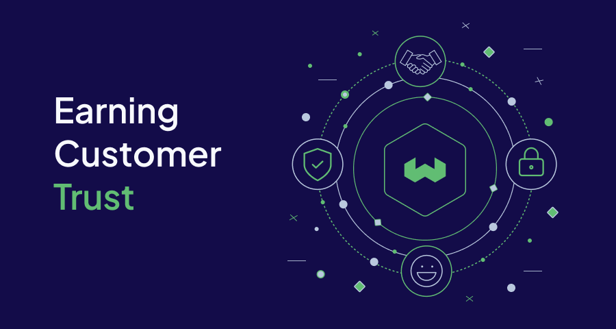

  
  
At Weaviate, we take the protection of your data seriously. Our information security measures continuously evolve and adapt to threats we see out there in the wilds of the internet.
We are delighted today to be launching our [Trust Portal](https://trust.weaviate.io), which allows all of our customers including those using our [Open Source product](https://github.com/weaviate/weaviate) to access our security certifications and documentation. 
In addition to our audit reports and test results, we are publishing a number of information security white papers detailing our methodologies, practices and procedures on topics such as zero trust networking, threat modelling and how our support teams access customer data in the cloud.

## Why a Trust Portal?
At Weaviate one of our core values is [Transparency](https://weaviate.io/company/playbook/how-a-values-driven-all-hands-helps-sustain-our-company-culture), and in the security team we believe that this means making our information security practices and results visible in a way that builds customer trust.
By launching a trust portal, we are demonstrating our commitment to information security, rather than simply ticking boxes for compliance. We are inviting our community to review and challenge our practices, suggest improvements and become part of our journey.

:::info 
While we're sharing our security documents and report, we'll still need you to sign a Non-disclosure agreement - don't worry though, you'll be guided through the steps when you register to access the portal.
:::

## I’m an OSS developer, how does this help me?
For large organisations using Weaviate’s OSS or Enterprise products, our SOC II report and Pen Test reports are important documents to validate our security posture as part of an enterprise compliance programme. 
But as a developer, we hope they will serve as evidence that you can rely on Weaviate to scale with you from hackathon, through to startup and beyond enterprise-scale.

## What’s next for the Trust Portal?
Our security programme is continually improving over time. This year we are expecting to certify our information security management system as compliant with the ISO 27001:2022 standard, and will make certification documents as well as details of our management system (such as our Statement of Applicability) available on the portal. Watch this space! 

import WhatNext from '/_includes/what-next.mdx';

<WhatNext />
