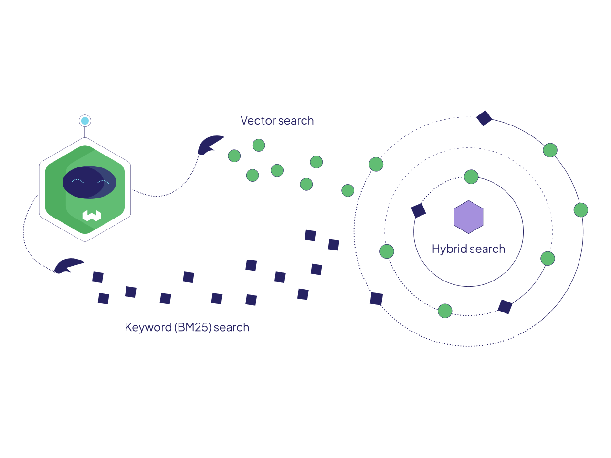

<!-- truncate -->

Hybrid search is a technique that **combines multiple search algorithms** to improve the accuracy and relevance of search results. It uses the best features of both keyword-based search algorithms with vector search techniques. By leveraging the strengths of different algorithms, it provides a more effective search experience for users.

The [hybrid search](/hybrid-search) feature was introduced in Weaviate `1.17`. It uses sparse and dense vectors to represent the semantic meaning and context of search queries and documents.
In this blog post, you will learn the definition of hybrid search, the role of sparse and dense vectors, when to use hybrid search, and more about the implementation of [hybrid search](https://docs.weaviate.io/weaviate/api/graphql/search-operators#hybrid) in Weaviate and how to use it.

## Sparse and Dense Vectors
Sparse and dense vectors are calculated with distinct algorithms. Sparse vectors have mostly zero values with only a few non-zero values, while dense vectors mostly contain non-zero values. Sparse embeddings are generated from algorithms like [BM25](https://en.wikipedia.org/wiki/Okapi_BM25) and [SPLADE](https://arxiv.org/abs/2107.05720). Dense embeddings  are generated from machine learning models like [GloVe](https://text2vec.org/glove.html) and [Transformers](https://huggingface.co/docs/transformers/index).

Note, the current implementation of hybrid search in Weaviate uses BM25/BM25F and vector search.

If you’re interested to learn about how dense vector indexes are built and optimized in Weaviate, check out this [article](/blog/vector-search-explained).

### BM25
BM25 builds on the keyword scoring method [TF-IDF](https://en.wikipedia.org/wiki/Tf%E2%80%93idf) (Term-Frequency Inverse-Document Frequency) by taking the [Binary Independence Model](https://en.wikipedia.org/wiki/Binary_Independence_Model) from the IDF calculation and adding a normalization penalty that weighs a document’s length relative to the average length of all the documents in the database.

The formula below presents the scoring calculation of BM25:

$$
score(D, Q) = \sum_\{i=1\}^\{n\} IDF(q_\{i\}) \frac\{f(q_\{i\}, D) \cdot (k_\{1\} + 1)\}\{f(q_\{i\}, D) + k_\{1\} \cdot (1 - b + b \cdot \frac\{|D|\}\{avgd_\{1\}\})\}
$$


<center>
Source: <a href="https://en.wikipedia.org/wiki/Okapi_BM25">Wikipedia page on Okapi BM25</a>
</center>

The score of the document, query pair is determined by weighing the uniqueness of each keyword in the query relative to the collection of texts. BM25 contains additional static parameters, k1 and b that may help calibrate performance to particular datasets.

### BM25F
BM25F was also implemented in Weaviate `1.17`. BM25F is a variant of BM25 that allows multiple text fields per object to be given different weights in the ranking calculation. These weights are important for when fields in a document are more important than others. For example, a title may be given more weight than the abstract, since the title is sometimes more informative and concise. This type of weighting makes BM25F more flexible and customizable than BM25.

### Dense Vector

Dense vectors represent information stored in a database; this includes text, images, and other types of data. These embeddings are generated from machine learning models that convert data to vectors. The vectors are densely packed with information and are mostly made up of non-zero values. The meaning of each value in the vector depends on the machine learning model that you used.

[Vector databases](/blog/what-is-a-vector-database), like [Weaviate](https://docs.weaviate.io/weaviate), store these embeddings and calculate the distance between the two vectors. [Distance metrics](/blog/distance-metrics-in-vector-search) show how similar or dissimilar two [vector embeddings](/blog/vector-embeddings-explained) are. The search query is converted to a vector, similar to the data vectors, and the distance value determines how close the vectors are.



## What is Hybrid Search?
Hybrid search merges dense and sparse vectors together to deliver the best of both search methods. Generally speaking, dense vectors excel at understanding the context of the query, whereas sparse vectors excel at keyword matches. Consider the query, “How to catch an Alaskan Pollock”. The dense vector representation is able to disambiguate “catch” as meaning fishing rather than baseball or sickness. The sparse vector search will match the phrase “Alaskan Pollock” only. This example query shows where hybrid search combines the best of both sparse and dense vectors.

## How does Hybrid Search Work?

Hybrid search works by combining the results of sparse vector search (e.g., BM25) and dense vector search into a single, ranked list. To achieve this, Weaviate first performs both a vector search and a keyword search in parallel. The results from these searches are then handed to a fusion algorithm, such as Reciprocal Rank Fusion (RRF), which combines and ranks the objects into a single list.

RRF ensures that relevant results from both search types are fairly represented, penalizing documents ranked lower in either list. [Benham and Culpepper](https://arxiv.org/abs/1811.06147) (2018) explored a variety of rank fusion techniques to improve search results. This paper analyzed seven strategies for combining the ranked results of two lists into a single ranking. Let’s dig into how the RRF score is calculated.

The RRF score is calculated by taking the sum of the reciprocal rankings that is given from each list. By putting the rank of the document in the denominator, it penalizes the documents that are ranked lower in the list.

$$
\sum_\{d \in D\} \frac\{1\}\{k + r(d)\}
$$

<center>
Source: Benham and Culpepper, 2018
</center>

Let's look at an example of this. We have three documents labeled `A`, `B`, and `C` and have run a BM25 and Dense search. In this example, we have set the constant *k* to 0.

| BM25 Ranking | Dense Ranking | Results |
| ----- | ----- | ----- |
| A | B | A: 1/1 + 1/3 = 1.3 |
| B | C | B: 1/2 + 1/1 = 1.5 |
| C | A | C: 1/3 + 1/2 = 0.83 |

The above table shows the ranked order of the BM25 and Dense search. To fuse the two lists together, we need to take the sum of the reciprocal ranks. Based on the results, the top document is `Document B` with a ranking of 1.5, then `Document A` at 1.3, and `Document C` at 0.83.

Weaviate supports two fusion algorithms, `rankedFusion` and `relativeScoreFusion`. `rankedFusion` is the default fusion algorithm, however you can change it in the `fusionType` parameter.

For a deep dive into how Weaviate's hybrid search combines sparse and dense vectors, you can read more on these [fusion algorithms in our blog post](/blog/hybrid-search-fusion-algorithms).

## When to Use Hybrid Search?
Hybrid search queries are ideal for a search system that wants to leverage the power of semantic search capabilities but still rely on exact keyword matches. For example, the example search query "How to catch an Alaskan Pollock" from before would lead to better results with a hybrid search query than with a common keyword search or even a semantic search query.

## Advantages of Hybrid Search
Hybrid search engines bring several advantages that make it a powerful approach for modern search systems, especially when both semantic understanding and exact keyword matching are essential. This dual approach excels in handling diverse user queries, whether they are domain-specific queries requiring exact matches or semantic queries that rely on context and meaning. For instance, in scenarios where users might include ambiguous phrases, domain-specific terms, or misspellings in their queries, hybrid search ensures relevant results by understanding the query's intent while still honoring exact matches for critical keywords.

In addition to its flexibility, hybrid search significantly improves the user experience by reducing the need for perfectly phrased queries. Dense vector embeddings capture the semantic meaning behind a search query, making it easier to handle multi-concept or even multilingual queries. Its ability to seamlessly integrate semantic relationships with precise keyword matches ensures more accurate and contextually relevant outcomes.

This makes hybrid search engines an ideal choice for applications in e-commerce, customer support, and other search-driven domains.

## A Simple Hybrid Search Pipeline in Weaviate
To use [Weaviate hybrid search](https://docs.weaviate.io/weaviate/search/hybrid) you only need to confirm that you’re using Weaviate `v1.17` or a later version. There are five parameters needed to run the hybrid search query (some are optional):

* `hybrid`: shows that you want to use a hybrid search query
* `query`: search query
* `alpha` (optional, default is `0.75`): weighting for each search algorithm
  * `alpha` = 0 -> pure keyword search
  * `alpha` = 0.5 -> equal weighing of keyword and vector search
  * `alpha` = 1 -> pure vector search
* `vector` (optional): optional to supply your own vector
* `score` (optional): additional information on how much the sparse and dense methods contributed to the result
* `fusionType` (optional, default is`rankedFusion`): choose the fusion algorithm

With just a few lines of code, you can start using hybrid search. The query is, “Fisherman that catches salmon” (similar to the example above). When we set the alpha to 0.5 it is equally weighing the dense and sparse vector results.

```python
response = article.query.hybrid(
query="fisherman that catches salmon",
alpha =0.5,
return_metadata=MetadataQuery(score=True, explain_score=True)
for o in response.objects:
    print(o.properties)
    print(o.metadata.score, o.metadata.explain_score)
```

You can find end-to-end notebooks on using hybrid search in [Weaviate Recipes](https://github.com/weaviate/recipes/tree/main/weaviate-features/hybrid-search)!

## Summary

This article explained the concept of hybrid search. In the context of the Weaviate vector database, hybrid search is a combination of keyword search and semantic search. By combining these two types of searches, hybrid search queries can lead to more relevant results in use cases where you want to leverage the power of semantic search but also rely on exact matches of certain keywords, such as product or brand names.

Check out the [documentation](https://docs.weaviate.io/weaviate/api/graphql/search-operators#hybrid) for more information on hybrid search\!

import WhatNext from '/_includes/what-next.mdx'

<WhatNext />
