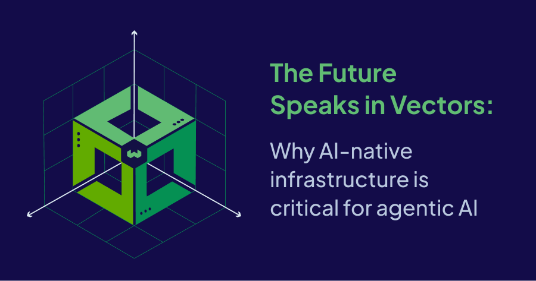

It was a beautiful fall morning in Orlando when I left the Grand Floridian, headed for the Gartner IT Symposium aboard the shuttle bus. I was eager to catch the keynote, though I hadn't studied who was speaking. Walking into the session, I found myself watching Jensen Huang, NVIDIA's CEO, in a fireside chat with Gartner's Daryl Plummer. Though I'd missed the first half, what I heard next made up for it: "Vectorize all of your data."

This statement resonated deeply, not just because of its simplicity but because it underscored a fundamental shift in how we think about data and AI in the enterprise. The rapid evolution of generative AI has ushered in a new era—one where traditional data infrastructures no longer suffice.

### The collapse of traditional, CRUD-based applications

Fast forward a few months. I'm sitting with Weaviate's co-founder, visionary and CEO [Bob van Luijt](https://www.linkedin.com/in/bobvanluijt/), discussing how the AI-native world will force every application to be rebuilt from the ground up. We shared a conviction that traditional CRUD-based apps would give way to AI-native agentic applications, with [vector databases](/blog/what-is-a-vector-database) like Weaviate at their core.

Shortly after, Satya Nadella, Microsoft’s CEO, made headlines with his own provocative statement on how traditional business applications are becoming obsolete. His vision aligned perfectly with what Bob and I had been discussing. His reasoning? In the AI-native era, business logic is migrating from hardcoded rules to autonomous AI agents capable of orchestrating operations across multiple systems. In this paradigm, traditional applications (reliant on static CRUD operations) are no match for agentic AI systems. 

### The Rise of Agentic AI: What it means for the enterprise 

Over the past few years, large language models and generative AI have completely changed how enterprises interact with their data, moving from static search results to systems that generate context-aware insights on demand. We’re now entering the age of Agentic AI—where AI doesn’t stop at giving answers; it continuously learns and takes action.

Just last week, OpenAI unveiled Operator, an AI agent that can take actions directly through a web browser, acting on behalf of users in real-world scenarios. In one demo, the agent found and made a reservation at a local restaurant based on user preferences. In another, it ordered groceries from a delivery service based on a recipe. 

These recent innovations offer a glimpse into AI's future, but what do they mean for enterprises looking to stay ahead of the curve? [Gartner recently predicted](https://www.gartner.com/en/articles/intelligent-agent-in-ai) that by 2028, 33% of enterprise software applications will include agentic AI, up from less than 1% in 2024, enabling 15% of day-to-day work decisions to be made autonomously.

There’s no doubt that the next three years will be transformative, but conversations with customers, analysts, and industry leaders reveal a clear consensus: general-purpose autonomous agents are still far from practical in the enterprise. This is due to both governance risks and technical limitations. The real opportunity in the near-term lies in deploying specialized AI agents for well-defined tasks and workflows. Use cases across customer support, software engineering, and data management and enrichment —where workflows are structured and early prototypes show strong potential—can deliver immense enterprise value and human productivity gains in the near-term.

### Why you need an AI-native vector database 

The ability to process, retrieve, and learn from unstructured and multimodal data at scale is a core requirement of agentic AI systems. Traditional databases were not designed for this complexity. Instead, AI-native vector databases have emerged as critical infrastructure for organizations seeking to enable these capabilities.

Weaviate is an open-source AI-native database that empowers AI builders with: 

* **Scalable AI-Native Architecture:** Designed specifically for AI workloads, Weaviate delivers unparalleled scalability and performance, handling billions of vectors with ease.  
    
* **Real-time Semantic Search:** Beyond basic vector similarity, Weaviate incorporates hybrid techniques to ensure relevant and precise results. Real-time ingestion and querying help AI agents quickly adapt to new information.   
    
* **Integration with Agentic Frameworks:** Weaviate works with popular LLMs and agent tools like [LangChain](https://weaviate.io/developers/integrations/llm-frameworks/langchain) and [LlamaIndex](https://weaviate.io/developers/integrations/llm-frameworks/llamaindex), making it easier to build and deploy agentic workflows. 

* **Weaviate Agents:** Integrate new insights directly into the database, transform existing data, and improve agentic application intelligence over time.

* **Governance, Compliance, and Security:** Flexible deployment, multi-tenancy, and strong security controls help you run agentic AI safely and meet enterprise standards without added complexity.

Jensen Huang's directive to "vectorize all your data" isn't just a passing trend – it's an imperative for survival in the AI era. As traditional business applications collapse and agentic AI becomes the new center of gravity for enterprise software, more organizations will adopt AI-native infrastructure for their use cases. 

Why Weaviate? Because true enterprise readiness requires more than just [vector search](/blog/vector-search-explained). It demands battle-tested reliability, scalable architecture that can handle billions of vectors, seamless model integration, and the ability to support complex agentic architectures. Weaviate delivers on all these fronts while maintaining the speed and flexibility that modern AI applications demand.

The future speaks in vectors, and that future runs on Weaviate. For enterprises looking to thrive in the AI-native era, Weaviate offers a foundation for innovation, adaptability, and scalable intelligence. Together, we’re not just building software—we’re redefining what it can do.

import WhatNext from '/_includes/what-next.mdx'

<WhatNext />
