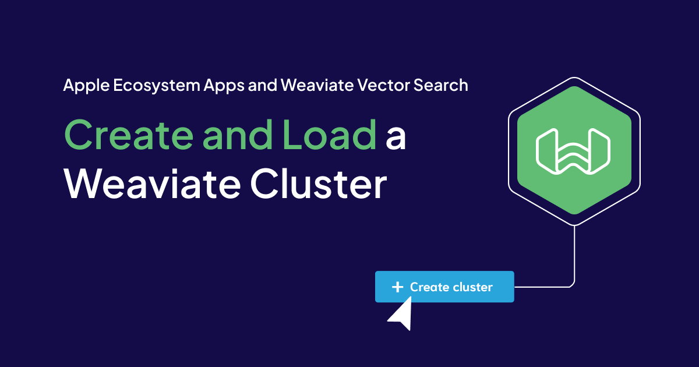
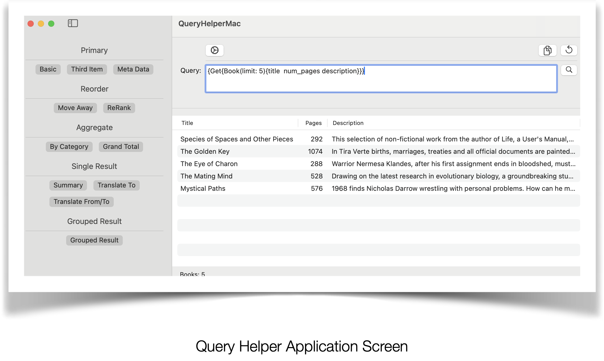
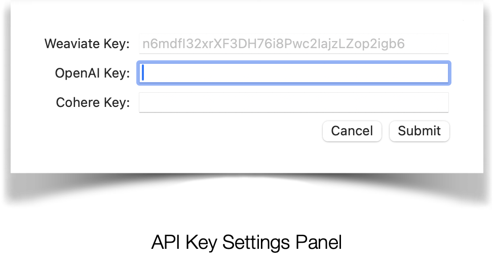
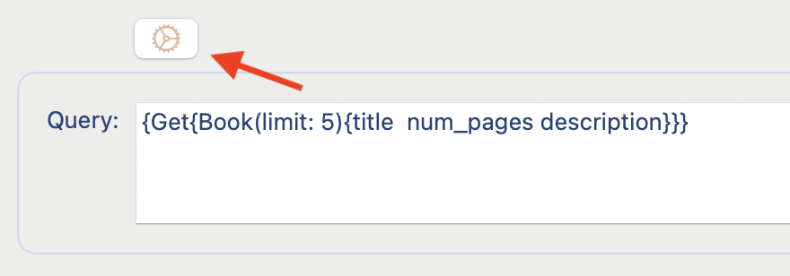
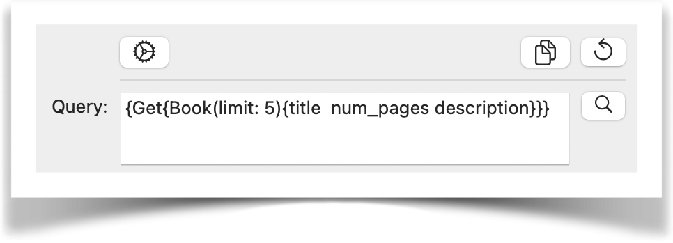
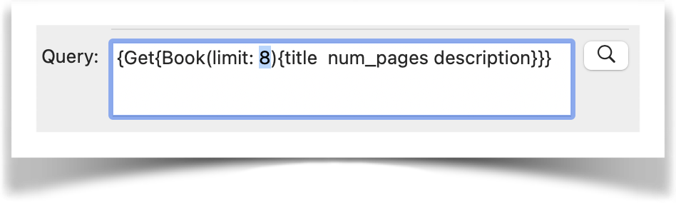

---
title: Weaviate Cloud (WCD) Queries - A Practical Guide

slug: apple-and-weaviate-2
authors: [randy, adam]
date: 2025-02-01
tags: ['how-to']
image: ./img/hero.png
description: "A practical guide on using Weaviate Cloud Queries."
---




## Overview

Understanding the capabilities of Weaviate Cloud (WCD) queries and implementing them practically in your applications is not always obvious. This article aims to help you bridge that gap by providing detailed explanations of common and easily implemented query types, along with a live tool to demonstrate the results.

Included is a downloadable application for Mac users to run live examples directly on their laptop. 

Feel free to copy and paste these queries into your own projects for use as a template for your own queries.

1. [Query App](#query_app). A working MacOS app that runs queries.

1. [Query Examples](#query_examples). Query prompt examples.


For IOS and Mac Developers looking to develop on Weaviate, check out this article. 

[https://weaviate.io/blog/apple-and-weaviate](https://weaviate.io/blog/apple-and-weaviate)

To get familiar with the data used and how the Weaviate Database was created you can reference. 

[https://github.com/weaviate/BookRecs](https://github.com/weaviate/BookRecs)


These articles are based on Adam Chan’s Book Recommendation project found at this Git repo [here](https://github.com/weaviate/BookRecs).


Without his collaboration and support these articles would not have been possible.

<a id="query_app"></a>

## Query Helper Application

**Weaviate Cloud (WCD) Queries: A Practical Guide** 

**Query Helper Application** 

An application you can use to perform a live test of Weaviate Queries.

The MacOS app is signed by Apple and can be [downloaded here](https://github.com/randallfonginc/weaviate-cloud-service-query-helper/releases).



Query Helper Application Screen

API Settings


The first order of business is to create the API keys needed to run the application as needed.



API Key Settings Panel

Of the 3 API Keys, the **Weaviate API key is already defined** for you and cannot be changed for this demo app.

An explanation of each key, how it is used, and a link to how to define your own appears below.

- **Weaviate API Key:** Access key to the Weaviate Vector DB that holds the domain data
- **OpenAI API Key:** Access key to OpenAI that Weaviate uses to access OpenAI Large Language Models to query embeddings. Create a key at: <https://openai.com/>
- **Cohere API Key:** Access key to Cohere that Weaviate uses for text embedding, generative AI and reranking. Create a key at: <https://cohere.com>/

Keys can be defined to the application by clicking on the settings icon to bring up the **API Key Settings Panel**.



Activating the API Key Settings Panel

Query Prompt Buttons



Query Prompt Features include:

- **Copy Prompt:** For use in your own apps.  
 
- **Reset Prompt to the Original One Selected:** Reset, if prompt was changed  manually. 
 
- **Search Prompt:** Begin Search using prompt.

Query Prompt

The Query Prompt can be changed manually in the query text box and run against a Weaviate Vector DB giving you the opportunity to experiment with your own ideas.



Query Menu

Preset query templates are accessed through the Query Menu by selecting the button of your choice.


<a id="query_examples"></a>

## Query Prompt Examples

**Weaviate Cloud (WCD) Queries: A Practical Guide** 

**Query Prompt Descriptions** 

The following queries prompt types are discussed.

All queries require a Weaviate API key that is already provided.

Depending on the type of query run, an OpenAI and/or Cohere API key may be required (see below).

**Primary:** Fundamental options for querying data. 

- **Basic:** A simple query that retrieves a limited amount of items
- **Third Item:**  Skip to the third item of a query
- **Meta Data:** Properties (eg. ID, creation date, last update date, etc) available that go beyond the original values loaded on to the vector database 

**Reorder:** Rearranging or prioritizing the data. 

- **Move Away:**  Allow users to prioritize similar terms/concepts and deemphasize others. (+Open AI Key)
- **ReRank:** Change the order in which data elements are displayed, perhaps based on specific criteria. (+Open AI Key, Cohere Key)

**Aggregate:** Summarizing count data. 

- **By Category:** Group counts based on specific attributes.
- **Grand Total:** Total count of the entire dataset.

**Single Result:** RAG processing resulting in a single result.

- **Summary:** Summary of a specific query.  (+Open AI Key, Cohere Key)
- **Translate To:** Translate data elements or results into different languages.  (+Open AI Key, Cohere Key)
- **Translate From/To:** Translate data elements or results from different languages to different languages.  (+Open AI Key, Cohere Key)

**Grouped Result:** Grouping or organizing data using RAG

- **Grouped Result:** Perform prompt on all records retrieved from another prompt. (+Open AI Key, Cohere Key)

### Primary

** Basic **

The basic building block for creating a query.

Example: Get the first 5 Books and list the title, number of pages and description.

```
{
  Get {
    Book(limit: 5) {
      title
      num_pages
      description
    }
  }
}
```


**Third Item**

Query starting from the third record.

Example: Using the Basic Query as a starter, skip the first two books and start from the book that follows. Example: Starting from the 3rd book: list the title, number of pages and description of the next 5.

```
{
  Get {
    Book(limit: 5, offset: 2) {
      title
      num_pages
      description
    }
  }
}
```


**Meta Data**

Show information that extends beyond the initial domain data loaded. This is data generated by the system.

Example: Include ID, creation date, last update date.

```
{
  Get {
    Book(limit: 5) {
      title
      _additional {
        id
        vector
        certainty
        score
        distance
        creationTimeUnix
        lastUpdateTimeUnix
      }
    }
  }
}
```

### Reorder

**Move Away**

Allow users to prioritize similar concepts and deemphasize others. Example: Emphasize “war” themes and deemphasize “romance”.

```
{
  Get {
    Book(
      limit: 5
      nearText: {
        concepts: ["Mysteries set in Western Europe"]
        distance: 0.6
        moveAwayFrom: { concepts: ["romance"], force: 0.45 }
        moveTo: { concepts: ["war"], force: 0.85 }
      }
    ) {
      title
      description
      num_pages
    }
  }
}
```


**Rerank**

Change the order in which data elements are displayed based on specific criteria. This is data generated by the system.

Example: The result is reranked to prioritize descriptions that discuss robots.

```
{
  Get {
    Book(nearText: { concepts: "science fiction" }, limit: 10) {
      title
      description
      num_pages
      categories
      _additional {
        distance
        rerank(property: "description", query: "robot") {
          score
        }
      }
    }
  }
}
```


### Aggregate

**By Category**

Group counts based on specific attributes.

Example: Show the number of books for each category.

```
{
  Aggregate {
    Book(groupBy: ["categories"]) {
      meta {
        count
      }
      groupedBy {
        value
      }
    }
  }
}
```

**Grand Total**

Total count of the entire dataset.

Example: Show the count of all books in the database.

```
{
  Aggregate {
    Book {
      meta {
        count
      }
    }
  }
}
```

### Single Result

**Summary**

Summary of a specific query.

Example: Summarize in 10 words books with a mystery theme that occur in Western Europe.

```
{
  Get {
    Book(
      nearText: { concepts: ["Search for mysteries set in WesternEurope"] }
      limit: 5
    ) {
      title
      description
      _additional {
        generate(
          singleResult: {
            prompt: "Describe the following as a short summary in 10 words:{description}"
          }
        ) {
          singleResult
          error
        }
      }
    }
  }
}

```


**Translate To**

Translate data elements or results into different languages.

Example: Search for Mexican books and translate the title into Spanish.

```
{
  Get {
    Book(nearText: { concepts: ["What books are Mexican"] }, limit: 5) {
      title
      description
      _additional {
        generate(
          singleResult: { prompt: "Translate the following in Spanish:{title}" }
        ) {
          singleResult
          error
        }
      }
    }
  }
}
```

**Translate From/To**

Translate data elements or results from different languages to different languages. Example: Ask a question in Spanish and translate the title into Spanish.

```
{
  Get {
    Book(nearText: { concepts: ["Que libros son mexicanos"] }, limit: 5) {
      title
      description
      _additional {
        generate(
          singleResult: { prompt: "Translate the following in Spanish:{title}" }
        ) {
          singleResult
          error
        }
      }
    }
  }
}
```

### Grouped Result

**Grouped Result**

Perform prompt on all records retrieved from another prompt. Example: Search for books about the governments in Europe.  

Summarize what the leaders of the result have in common.

```
{
  Get {
    Book(nearText: { concepts: ["Governments of Europe"] }, limit: 5) {
      title
      description
      _additional {
        generate(
          groupedResult: {
            task: "What do these leaders have in common, if anything?"
          }
        ) {
          groupedResult
          error
        }
      }
    }
  }
}
```


import WhatsNext from '/_includes/what-next.mdx';

<WhatsNext />
