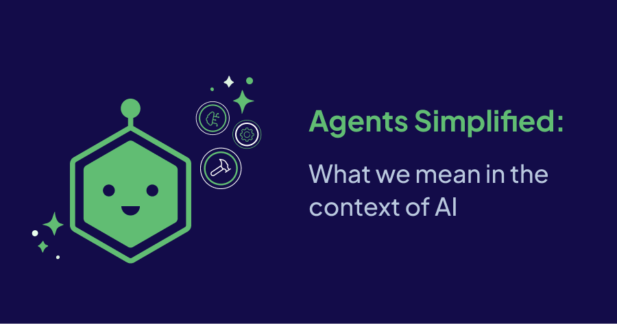

If you’re in the AI-osphere, you’ve probably heard the term ‘AI Agents’ being thrown around quite a bit recently. In this article, let’s boil down what we mean when we say ‘Agents’ in the context of large language models (LLMs) and artificial intelligence (AI).

Before we dive into the topic, one thing to remember is that the term ‘agents’ has existed long before we had todays performant LLMs. We could even say that AI agents have existed for a long time too, just not with today’s generative LLMs as the star. What has changed though is just how good and sophisticated they’ve become. So, in short, you’re not hearing more about agents because they’re a brand new technology. No, you’re hearing more about AI agents because things just got very, very interesting.

## What is an AI Agent

At a basic level, an AI agent today is a semi- or fully-autonomous system that uses an LLM as its ‘brain’ for critical decision making and solving complex tasks. Think of them as automated decision making engines so that you, the user, only have to come with your query. They operate and use a variety of tools available to them in their environment to get things done for you so that you can sit back and relax while it figures out how to solve your problem.

Agents autonomously direct their own processes and execution flow, choosing which tools to use based on the task at hand. These tools can include web search engines, databases, APIs, and more, enabling agents to interact with the real world.

## A Brief History on AI Agents

AI agents have technically existed for a long time. You can even see the authors of [this recent article on AI agents by Microsoft](https://news.microsoft.com/source/features/ai/ai-agents-what-they-are-and-how-theyll-change-the-way-we-work/) referring to AI agents they’d been working on back in 2005. However, the shape and abilities of our AI agents have significantly changed in the last couple of years largely thanks to the abilities of the latest LLMs. Now, we’re able to use LLMs as a core component when it comes to planning, reasoning and acting.

> Reader: This section was a pleasure for me (Tuana) to write and geek out on. But if history and research is not your thing, feel free to jump to the next section. I won’t take offense.

So, with that said, I’d like to highlight a few milestones in our _recent_ history of AI agents, and you can assume that from here on out we are only referring to the AI agents of today (2025). This is of course my own expecrience on the matter looking back over the last few years. But let’s turn back the clock to just before the release of ChatGPT. In 2020, there were 2 papers that were published that in my view could be viewed as the beginnings of current day AI agents that make use of LLMs as the core decision making component:

-   [MRKL Systems](https://arxiv.org/abs/2205.00445): Pronounced ‘miracle’ systems, this paper was largely centered around the shortcomings of language and studied the _reason_ as to why we were getting so many hallucinated responses. And in short, they highlighted what we now fully understand: Language models don’t _know_ everything, they’re designed to generate language. Think of it this way, we can’t expect people to know our birthday unless we tell them when it is. This paper introduces a way in which we can provide language models with external knowledge bases which can be referred to extract the relevant information from.
-   [ReAct](https://arxiv.org/pdf/2210.03629): Published slightly after MRKL systems, this paper introduced another crucial component into what makes an agent today. This paper introduced a process of prompting that we call “ReAct”, which stands for ‘reason and act’. In short, it highlighted a clever way we can structure our prompts which results in the LLM taking into account the question at hand, reasoning about its options on how to solve it, selecting the correct tools to use to solve the question, and acting on it. To keep things _very_ simple, take the following example. Instead of only asking the question, we’re also telling the model which resources it has access to and asking it to make a plan about how it would solve the query. In short, this paper introduced a way to start thinking about our LLM instructions to make the process of reasoning and acting more reliable:

> Note: The actual ReAct prompt recommended in the paper is a lot more involved than this, including instructions on how to generate thought, how to reason and so on.

In my view, these two papers highlight two very important findings and features that bring us to the AI agents of today: a good instruction, and external tools. That, and thousands of humans who started to tinker around with these LLMs and we’re now in a world where we’ve started to build more and more sophisticated AI agents (that no longer only use the ReAct prompting approach).

With that, let’s have a look into what makes up an AI agent of today.

### Core Components of an AI Agent

Although not every AI agent has to include _all_ of these components, when we build agents they include at least a few of the following components and processes: An LLM, access to tools (via function calling), some level of memory, and reasoning.

Let’s dive into what they each do:

-   **LLM:** Think of the LLM as the brain of the operation. Although not necessarily for _every step_, when we say ‘agents’ in 2025 a generative model is involved as the orchestrator of the operation to a great degree. Simply put, think of the example scenario in the section above: it’s the LLM that has decided that it’s best to first look up the `user_calendar` followed by looking up the weather.
-   **Tools:** A great feature of agents is that they interact with the environment through different tools. One can think of them as ‘add-ons’ that make agents better. These tools let agents go beyond the fixed training knowledge of the LLMs by providing highly relevant and real-time data (like to your personal database) and abilities (like sending emails). With function calling, LLMs can directly interact with a predefined set of tools, expanding the operational scope and efficiency of agents.
-   **Memory:** Agents often have some form of memory (both short-term and long-term), which allows them to store logs of their reasoning process, conversation histories, or information collected during different execution steps. We need memory both for ongoing conversations with our agents as well as conversations we want to come back to. Memory can be used to personalize the experience or plan future decisions
-   **Observation & Reasoning:** The LLM is at the heart of problem solving, task decomposition, planning, and routing. It’s the component that allows the agent to reason about a problem, break it down into smaller steps (if needed), and decide how & when to use the available resources/tools to provide the best solution. However, not every agent is built equally, sometimes we include reasoning as an explicit step of the process when we’re building our agents.

An important thing to remember is that there are various design patterns that result in an AI agent and these components can be used to varying degrees. The agents we see today exist on a spectrum, and the level of autonomy or ‘agentic’ behavior largely depends on how much decision making authority is delegated to the LLMs. In simpler terms: some agents are designed to operate more independently than others.

## How do AI Agents Work?

Most AI agents we see today use the LLM as the core decision maker/orchestrator of the operation. The level of autonomy this LLM has can of course vary, which we’ll talk more about in the ‘A look into the future’ section of this article. But let’s first start by discussing the basics of how an AI agent that uses an LLM for most of the decisions works.

Something I notice is that when people discuss LLMs and agents these days, it seems like there’s quite a lot of magic happening. So here, I’ll try to explain what is _actually_ going on behind the scenes of an AI agent that has access to some tools.

### Define the Prompt

At the heart of any system that uses an LLM is an instruction (a prompt) that sets the scene for the LLM as to what its core purpose is. The ReAct paper also clearly presented this by highlighting a complex prompt that defines a reasoning, thought-generating, observing agent. For example, an LLM could be given the instruction about how it’s a “helpful assistant that has access to my databases in order to answer my queries”.

### Provide Tools

Next, we need to provide a list of tools to the LLM. This is by far one of the most popular ways of creating AI agents today, although it’s not always necessary and we can still create agentic functionality without it having to be via tools and function calling. Most model providers today support ‘function calling’ which allows us to set up our interactions with an LLM with a list of tools that it knows it may access at any given time to resolve a query.

When we provide tools to an LLM, we tell the LLM about a few things. It uses these things to decide whether it’s time to use the tool or not:

-   **The name:** for example, a tool may have the name `technical_documentation_search`
-   **The description:** which is probably the most important piece of information the model has access to when reasoning about which tool to use. For example, for the tool `technical_documentation_search` we may provide the description “Useful for when you need to search the Weaviate technical docs for answers”
-   **The expected inputs:** Remember that tools are _external_ to the LLM. The LLM knows their name, it has a description for them too, but ultimately the job of a generative large language model is to produce language. So what can it do? Well, what it’s good at! It can probably produce some content which returns the name of a function (a tool), and the expected inputs for it to run. So, we also provide this information when we give a list of tools to an LLM. For example, for our tool `technical_documentation_search` tool, we may tell the LLM that it expects `query: str` to run.

If you’re interested in what this looks like in reality, you can check out the [Function Definition docs by OpenAI](https://platform.openai.com/docs/guides/function-calling) for example.

### Use Tools

So, we have an LLM, it knows that it may access some tools, how to run them, and what they’re useful for. However, an LLM doesn’t have an inherent ability to, for example, run a python script… Or search your documentation. What it can do though is provide a message that _explains_ that it intends to run a tool, and what inputs it wants to run it with.

Let’s take the following scenario as an example:

-   We have an AI agent using an LLM
-   We’ve provided `technical_documentation_search` as a tool with expected input `query: str`. We’ve said it’s “Useful for when you need to search the Weaviate technical docs for answers”
-   User asks: “Hey, how can I use Ollama with Weaviate?”

In this scenario, what actually happens is something like this:

-   The LLM produces a response that boils down to “Run tool `technical_documentation_search` with `query = "Using Ollama"` ”.

So, in reality, the LLM is making our AI agent application take a step outside of its own world. It instructs our system that there’s an external resource to be referenced.

### Observe Tool Responses

If all goes well, by this point your AI agent has run a tool. Remember that this tool could be _anything_. For example, our `technical_documentation_search` tool could in itself be a [RAG application (retrieval augmented generation)](https://www.notion.so/Phase-3-Assessment-3f326a243e2a4a8d8946ad2305fa8d70?pvs=21) that in itself uses yet another LLM to generate responses to queries. The point is, at the end of the day we’ve probably run the tool with the query “Using Ollama” and the response is “You can use Ollama by enabling the text2vec-ollama or generative-ollama modules, both for embedding models and generative modules”, or something along those lines. But that’s not the end of it, because the original LLM that makes up the core of our AI agent doesn’t know the response yet.

When a tool runs, the results of that tool are then returned back to the agent’s LLM. This is usually provided as a chat message where the role is set to “function call”. So our LLM knows that the response it’s seeing is not from the user, but a result of the tool it decided to run. The LLM then observes the results of the tool (or tools) to provide the user with the final answer.

Congratulations! By this point, you’ve learned the basics of what makes an AI agent! Especially those that rely on tools and function calling. The way I like to imagine it is that the LLM that is the core orchestrator of an AI agent is a bit like a wizard with a spell book but no wand. The LLM knows what it can do, and how, but it can do nothing more than say the magic word. The tools still have to run outside the LLM.

### What is “Agentic” AI

There’s a lot of new vocabulary to get used to, which can be confusing. But actually, when it comes to what’s “agentic AI” versus what an “AI agent” is, we can make our lives a lot easier. An AI agent is inherently _agentic_, but an AI agent usually refers to the an end application designed for a specific task. For example, an AI agent might be a documentation search assistant, or a personal assistant that has access to your email and slack.

When we say ‘Agentic AI’ however, we’re usually to a system that is designed with elements of agentic components such as a decision making LLM, a reasoning step, maybe some tools, self-reflection, and so on. For something to be deemed agentic, it doesn’t need to have all of components. Rather, it often showcases the features of some of them.

## Tools for Building AI Agents

Building an AI agent requires integrating many components and tools to create a system capable of autonomous or semi-autonomous decision-making, interaction, and task execution. While advanced agents can be highly complex, even the simplest ones need a few essential elements. Below are some resources that can help you get started with building your own AI agents:

### **1. Language Model Providers:**

The foundation of an AI agent is an LLM, which powers its entire reasoning. It allows the agent to understand different inputs and plan its actions effectively. It is also essential to look for an LLM that has built-in function-calling support so that we can connect it to external tools and APIs. Popular LLM providers include:

-   [OpenAI](https://platform.openai.com/docs/models): GPT 4o, o3-mini
-   [Anthropic](https://docs.anthropic.com/en/docs/about-claude/models): Claude 3.5 Sonnet, Claude 3.5 Haiku
-   [Google](https://ai.google.dev/gemini-api/docs/models/gemini): Gemini 2.0 Pro, Gemini 2.0 Flash
-   [Mistral](https://docs.mistral.ai/getting-started/models/models_overview/): Mistral Large, Mistral Small 3
-   Open-source models using [Hugging Face](https://huggingface.co/models) or [Ollama](https://ollama.com/search)

### 2. Memory and Storage:

Agents need some kind of persistent memory to retain context over time. The memory can be of two types:

-   Short-term Memory: To keep track of current conversation or the task at hand.
-   Long-term Memory: To remember past conversations, personalization, and experiences over time.

There are currently many variations and implementations of both types of memory for agents today, and we’re likely to see more as the technology progresses. For example, for short-term memory, we see implementations as simple as providing “conversation summaries” to the LLM at each iteration or message, so as to navigate context length limits. For long-term memory, we may choose to use a database to back up conversations. This may even start changing the role of vector databases like Weaviate, where they start being used as long-term memory which the AI agent can extract most relevant bits of prior conversation from.

### 3. Frameworks for AI Agent Orchestration:

Orchestration frameworks act as smart conductors, coordinating all components of an AI agent and even managing multiple agents in a multi-agent setup. They abstract away most of the complexities, handle errors/retries cycles, and ensure that the language model, external tools/APIs, and memory systems all work together smoothly.

There are several frameworks available that simplify the development of AI agents:

-   [Langgraph](https://www.langchain.com/langgraph): Provides a structured framework for defining, coordinating, and executing multiple agents.
-   [LlamaIndex](https://www.llamaindex.ai/): Enables the creation of complex, agentic systems with varying degrees of complexity.
-   [CrewAI](https://www.crewai.com/): Multi-agent framework for orchestrating autonomous AI agents having specific roles, tools, and goals.
-   [Hugging Face smolagents](https://huggingface.co/docs/smolagents/en/index): Library that enables you to run powerful agents in just a few lines of code.
-   [**Haystack](https://haystack.deepset.ai/):** End-to-end framework that allows you to build AI applications like agents, powered by LLMs.
-   [**OpenAI Swarm:](https://github.com/openai/swarm)** An educational framework exploring ergonomic, lightweight multi-agent orchestration.

### **4. Tools and APIs:**

An agent is only as powerful as the tools it can access. By connecting to various APIs and tools, the agent can interact with its environment and perform tasks such as web browsing, data retrieval, database queries, data extraction & analysis, code execution, etc.

Frameworks like LlamaIndex, offer pre-made tool integrations like data loaders for PDFs, websites, and databases, as well as for apps like Slack, and Google Drive via [LlamaHub](https://llamahub.ai/). Similarly, [Langchain](https://python.langchain.com/docs/integrations/tools/) offers a wide range of similar tools that agents can readily use. Also, developers can always build custom tools as per their needs by wrapping APIs to introduce entire new functionalities. Recent works like [**Querying Databases with Function Calling](https://arxiv.org/abs/2502.00032)** even hint at the promise of function calling for database queries.

In a nutshell, building AI agents is a lot like assembling pieces of a puzzle. You start off with a good language model, add the right set of tools and APIs, and then add in memory so that the agent remembers what’s important. An orchestration framework can be used to make things simpler and tie things together, making sure every piece plays its part perfectly.

## A look into the future of AI Agents: challenges and advances

The great thing about AI agents and agentic AI in general is that it’s still evolving every day. Although there’s a lot we didn’t discuss here from the challenges we see, to other core components of actually building AI agents for production, like observability, there are a few things that is probably worth highlighting when it comes to the future of AI agents.

For example, you may have already noticed that unless we take some time to intentionally design our agentic applications, it may seem that a lot (too much?) relies on an LLM making the right call, if you will. And in the case that the agent has access to search tools, or knowledge bases, maybe that’s ok. But what happens when the tool has access to your bank account and the agent can now buy you a very expensive one way ticket to Hawaii?

A debate I’ve really been enjoying listening to is whether the use of AI agents is mostly as “research assistants” or as the “executors of our will”. Which is a simple, but important debate, and probably one on which our opinions change over time as LLMs get better, and we have better regulations and guard rails in the field of AI in general.

### Levels of Autonomy & Human in the Loop

Now you understand how an AI agent in its most basic form operates. But it’s not _necessary_ (or advisable) to have the LLM be the orchestrator of _everything_. We’re already seeing more and more agents that delegate the process to simpler, more deterministic systems. And in some cases, to humans. For example, we’ll probably see more and more of the scenario in which a human is supposed to approve an action before it can take place.

We’re even seeing tools like [Gorilla](https://github.com/ShishirPatil/gorilla) implement agents with “undo” functionality that allows a human to decide whether an action should be back tracked, adding a layer of human intervention into the process.

### Multi-modal AI Agents

Multi-modality refers to the ability to make use of more than one modality, i.e. the ability to go beyond just language (text) and incorporate images, videos, audio and so on. In a way, the technology is for the most part there. So, we will probably start seeing more and more AI agents that can interact with a variety of mediums, either as part of their tooling, or inherently if they make use of a multi-modal LLM. Think of an AI agent which you can ask to “create a cute cat video and forward it to my email”!

### The role of vector databases

Another interesting topic, especially for us at Weaviate, is the potential for the role of [vector databases](https://weaviate.io/blog/what-is-a-vector-database) in AI to expand. So far, we’ve mostly been seeing vector databases used as knowledge sources which an agent can have access to. However, it’s not difficult to imagine a future in which we’re making use of vector databases, as well as other types of databases, as memory resources for our agent interactions.

# **Examples and Use Cases of AI agents**

AI agents are reshaping the way we work and this change is already visible across multiple industries. They shine brightest when we need a perfect blend of conversation with action. By automating repetitive tasks they not only increase the work efficiency but also improve the overall user experience. Here are some real-world examples of AI agents in action:

### **AI Research Agent**

AI research agents, or research assistants simplify the process of analyzing large amounts of data, spotting trend, and generating hypotheses. Today, we can already see people in academia or professionals at work using ChatGPT as a companion to help them gather information, to help them structure their thoughts and provide the first step in many tasks. In a way, ChatGPT in its bare form is in itself a research assistant agent. These types agents are also sometimes referred to as [“Agentic RAG”](https://www.notion.so/Phase-3-Assessment-3f326a243e2a4a8d8946ad2305fa8d70?pvs=21), where an AI agent has access to multiple RAG tools, each accessing different knowledge bases.

### Customer Service Agent

AI customer service agents provide 24/7 support, handling inquiries, troubleshooting, and offering personalized interactions. They reduce wait times and let human agents take on more complex tasks. They can both act as research assistants for customers, getting answers to their queries quicker, as well as completing tasks for them.

### Marketing & Sales Agent

These agents optimize marketing campaigns and sales processes by analyzing customer data, personalizing outreach, and automating repetitive tasks like lead qualification and email follow-ups.

### Code Assistant Agent

These agents help developers by suggesting code, debugging errors, resolving tickets/issues, and even building new features. This enables developers to save time and focus on creative problem-solving. Examples of this are already out there with Cursor and Copilot.

## Summary

This article gave a high level overview of what we mean when we say ‘AI agents’ in 2025, as well as giving a simple look into how they work. Although we did not go into all the technical details of different ‘agentic workflows’, another blog going into more technical detail is coming soon! We go through the components that help with the basic understanding of AI agents, such as prompts, tools, observing tool responses and reasoning about the final answer. Finally, we look into the future of AI agents, discuss the current short-comings and the advancements we could expect.

A lot of the historical overview mentioned in this blog was also my (Tuana’s) subjective view looking over the past few years. If you do think I’m missing a curcial step, do let me know (DMs open on X)

import WhatsNext from '/_includes/what-next.mdx'

<WhatsNext />