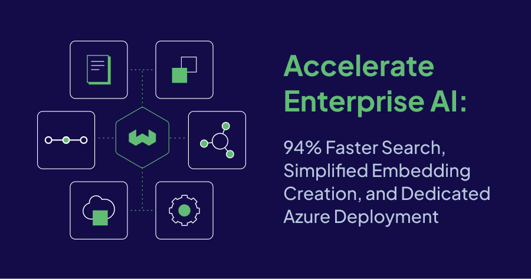

**TL;DR**

* **Weaviate Embeddings General Availability (GA)**: Now natively hosted in Weaviate Cloud, featuring Snowflake’s Arctic Embed 1.5 and 2.0 for multilingual, high-performance vector embeddings.  
* **94% Faster Keyword Search**: BlockMax WAND slashes BM25 query latency by up to 94%, making large-scale hybrid search more efficient.  
* **Enterprise Security with RBAC GA**: Our fully supported Role-Based Access Control is now generally available, giving enterprises the granular access controls they need.  
* **Multi-Vector Embeddings Preview:** Now enables both queries and objects to be represented by multiple vectors, unlocking more nuanced data understanding and improved search relevance.  
* **Dedicated Enterprise Deployment on Azure**: Simplifies deployments for customers deploying on Microsoft Azure, offering private clusters, IP whitelisting, and seamless cloud management.  
* **NVIDIA integrations:** Leverage NVIDIA's inference services and models directly within Weaviate.  
* **March 5 Release Event**: Join the Weaviate 1.29 deep dive for a live walkthrough of new features—recording available if you can’t attend live.

## What’s New in Weaviate?

We’re excited to share major enhancements across both Weaviate Cloud and the newly released Weaviate 1.29—our latest product launch packed with features that accelerate enterprise AI adoption without steep learning curves or costly overhead.

From boosting hybrid search performance to simplifying the creation of **vector embeddings**, Weaviate continues to blend innovation with practicality for teams building production-grade AI solutions. Have stringent security requirements? With **Role-Based Access Controls (RBAC)** and dedicated deployment in Microsoft **Azure,** organizations can more easily comply with enterprise standards. Below, you’ll find the highlights that make Weaviate a compelling choice for those looking to push the boundaries of AI-powered search, data ingestion, and security.

## 94% Faster BM25 Keyword Search with BlockMax WAND

Weaviate has proven billion-scale vector search with low latency, it now delivers the same high-performance level for BM25 keyword search. **BlockMax WAND** implementation supercharges Weaviate’s BM25 keyword search with up to a **94% reduction** in search latency**[^1]**, making large-scale keyword lookups faster and more efficient.

By organizing parts of the keyword index with pre-computed statistics, it can skip irrelevant documents and compress data far more effectively. For enterprises handling billions of records, this translates to dramatically lower latency and significantly reduced storage requirements—**elevenfold compression in some tests[^2]**. Whether you’re searching across product catalogs, customer communications, or internal knowledge bases, the new algorithm helps your teams find relevant insights faster **without extra hardware or infrastructure overhead**.

Best of all, once a user opts in, these performance gains work behind the scenes–applying only to data ingested after enabling–so there’s no need for developers to revamp existing applications. With **BlockMax WAND** in the **Weaviate 1.29** release, users gain a robust, future-proof search solution that scales to enterprise needs. For further insights into BlockMax WAND, explore our blog, "[BlockMax WAND: How Weaviate Achieved 10x Faster Keyword Search](/blog/blockmax-wand).”

## Weaviate Embeddings: Now Generally Available

**Weaviate Embeddings** is now generally available in **Weaviate Cloud**, taking a major leap forward from our initial [Preview](/blog/introducing-weaviate-embeddings). Designed to eliminate friction in AI data pipelines, it combines vector creation and storage into a single service. No more juggling external providers or hitting rate limits mid-project. You can ingest millions of data points at high throughput, all while co-locating models and vector indexes in Weaviate Cloud for optimal performance.

A key addition to this release is **Snowflake’s Arctic Embed 2.0**—an open-source text embedding model that goes beyond its 1.5 predecessor with better multilingual support and **impressive benchmark results** (including [MTEB](https://arxiv.org/html/2412.04506v1)). Simply put, it handles large-scale, high-fidelity document ingestion while delivering more accurate semantic search. By running these embeddings natively in Weaviate Cloud, developers can focus on building next-gen AI applications instead of wrestling with model hosting or unwieldy data pipelines.

For a deeper look at **Arctic Embed 2.0**’s journey, check out the latest [**Weaviate Podcast**](https://www.youtube.com/watch?v=Kjqv4uk3RCs&ab_channel=Weaviate%E2%80%A2VectorDatabase) featuring its creators from Snowflake. If you’re ready to get hands-on, visit our [**Quickstart tutorial**](https://docs.weaviate.io/wcs/embeddings#get-started), or get started with a free trial of [**Weaviate Cloud**](https://console.weaviate.cloud/).

## Raising the Bar on Enterprise Security & Compliance

Compliance is table stakes for enterprises, and it’s more vital than ever as AI-driven breaches are alarmingly on the rise. As industries like banking, insurance, and healthcare ramp up their AI use cases, the regulations around data privacy and security continue to tighten. That’s why Weaviate now provides **RBAC** as a fully supported, enterprise-grade feature in the **1.29 release**.

**RBAC** gives you granular permission settings to secure your collections and tenants—ensuring that sensitive data, such as customer records or key business information, is accessible only to authorized users without cumbersome workarounds or bottlenecks. With custom or predefined roles, security and compliance teams can ensure that every user gets the right level of access, no more, no less. This approach not only reduces the risk of unauthorized data access but also streamlines compliance reporting and auditing, eliminating costly manual procedures.

Executives, IT teams, and developers can now have more confidence to keep innovating, without compromising on compliance or risking data integrity.

## Dedicated Deployment on Microsoft Azure 

Many enterprises rely on **Microsoft Azure** for their core infrastructure. To meet these users where they are, Weaviate now offers an Azure Enterprise Provisioner for easy cloud deployment. This enables customers to have their Weaviate Cloud deployment (managed by Weaviate) run in an isolated Azure environment.

For businesses prioritizing security and compliance, the provisioner ensures full resource isolation via a private cluster and IP whitelisting, plus deep integration with Azure’s security and **role-based access controls**. It also manages essential infrastructure, like backups, logs, and metrics, so teams spend less time on DevOps overhead and more time building AI-driven applications.

For those operating on Azure, this opens the door for simpler procurement, reduced operational friction, and dedicated resource environments that match the strict requirements of heavily regulated sectors.

## Enhanced AI Performance: Multi-Vector Embeddings, NVIDIA Integrations, and Asynchronous Replication

With Weaviate 1.29, we’re taking innovation even further. **Multi-vector embeddings** now enable both queries and objects to be represented by multiple vectors, unlocking more nuanced data understanding and improved search relevance—especially for dense content like medical data or academic papers. Our integration with the **Jina AI ColBERT vectorizer** exemplifies this approach, supporting “late interaction” search techniques that deliver superior precision.

In addition, Weaviate 1.29 introduces robust **NVIDIA integrations** – including text2vec-nvidia, multi2vec-nvidia, generative-nvidia, and reranker-nvidia – that seamlessly bring NVIDIA’s powerful inference engine into Weaviate. These modules simplify embedding creation, semantic search, and Retrieval Augmented Generation (RAG), empowering you to build sophisticated AI applications faster and more efficiently.

Complementing these innovations, our new **asynchronous replication** feature seamlessly synchronizes data across nodes, further bolstering system reliability and performance in large-scale deployments.

Together, these enhancements further elevate Weaviate’s position as a leading enterprise-grade vector database. For a deeper dive into the technical details, check out the [Weaviate 1.29 Release Highlights](/blog/weaviate-1-29-release) blog.

## What’s Next

That wraps up our look at the **new additions to Weaviate Cloud and the 1.29 release**—but the excitement doesn’t stop here. [Mark your calendars for **March 5**](https://link.mail.beehiiv.com/ss/c/u001.7ph1bOQkPnwamO4cv9f9A8jeYYCfFv91aBjGm1l9ezWQ7PVH1EkZELJKK7fxa04bAOWbwJ2WYaaD136yiCTURqFbSQBejldEJqvIuDUo_6B-tD8pmJCXebuYJUx0NpviZQxynvPP4vitQpuZ-FAOu-PKwROV8cNcnbceaxbz3yeDwP7eJ970d5IHv583qMine1EFPLJmWl2sido3qgWBFTMhCOUEyAYu4cGxr9A2HCc3T9hBBRkgPiIYpFO7yTd7RvVKZlMIxCGrcG3E8tCgaQ/4dz/v3dtMN9ZSJaBYAUu0KBytA/h20/h001.TrgKKrLVHWSDrE7WMueG26GAoMG46biDXDrp0keR2fU), where our experts will deliver a deep dive into new features like **multi-valued vectors**, **RBAC**, and more. If you can’t make the live session, don’t worry—we’ll share a recording so you won’t miss a thing.

In the meantime, if you’re eager to get hands-on, check out the [**Quickstart tutorial**](https://docs.weaviate.io/wcs/embeddings#get-started), or explore [**Weaviate Cloud with a free trial**](https://console.weaviate.cloud/)—and experience for yourself how Weaviate can supercharge your AI applications. We’re excited to see what you build\!

[^1]:  [BlockMax WAND: How Weaviate Achieved 10x Faster Keyword Search](/blog/blockmax-wand) (Fever dataset–5.4M documents): reduced search time from 517ms to 33ms. 

[^2]:  [BlockMax WAND: How Weaviate Achieved 10x Faster Keyword Search](/blog/blockmax-wand) (MS Marco dataset–8.6M documents): from 10.53 GB to 0.92 GB, 77% fewer documents scored, 79% fewer blocks decompressed.

import WhatsNext from '/_includes/what-next.mdx'

<WhatsNext />