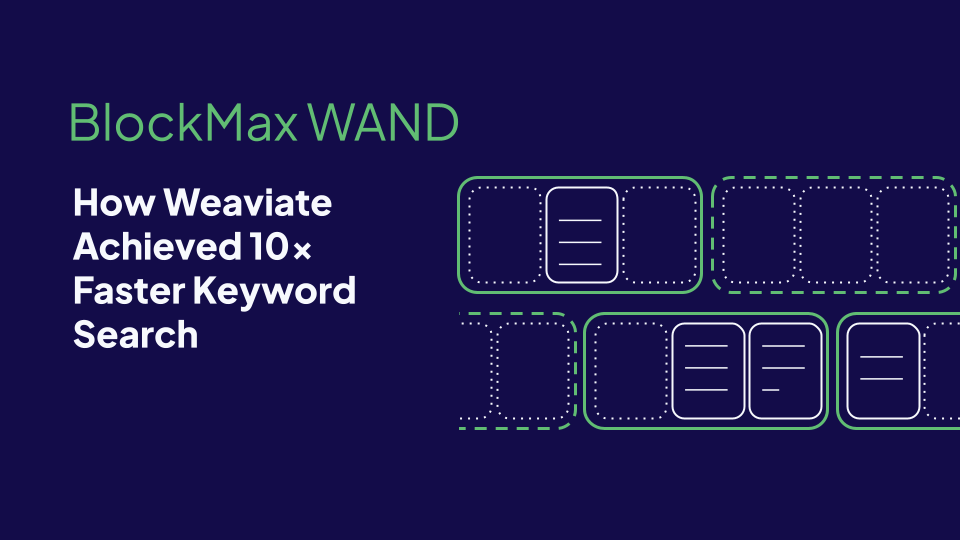

Keyword search is an integral part of Weaviate’s [hybrid search](https://weaviate.io/blog/hybrid-search-explained), designed to [best of both](https://weaviate.io/blog/hybrid-search-fusion-algorithms) vector and keyword search. 

In this blog post, you will learn how we improved Weaviate’s inverted index, how to avoid scoring all documents that have the query terms, how we compress the inverted index and more about the improvements from using BlockMax WAND in Weaviate.

## Inverted Index and tokenization

Keyword search works by comparing the terms in your queries to the terms in your database documents, giving higher scores to rarer terms and terms that show up more often in your documents.

Keyword search requires us to first define what words we want to search. A big part of this process is [tokenization](https://weaviate.io/developers/academy/py/tokenization/basics). It splits the input documents into [tokens](https://en.wikipedia.org/wiki/Lexical_analysis#Token) (i.e. terms, numbers or anything else one would consider important to be searched individually).  
In this simple example, consider a dataset made of three documents with a single property, title, composed of a single sentence and a *whitespace* tokenizer that lowercases the terms and splits them by whitespace. 

| Doc Id | Document title | Tokenization result |
| :---- | :---- | :---- |
| 1 | A Web Developers Guide to Hybrid Search | \[“a”, “web”, “developers”, “guide”, “to”, “hybrid”, “search”\] |
| 2 | Unlocking the Power of Hybrid Search | \[“unlocking”, “the”, “power”, “of”, “hybrid”, “search”\] |
| 3 | Vector Library versus Vector Database | \[“vector”, “library”, “versus”, “vector”, “database”\] |

Now we have turned documents into a [bag-of-words](https://en.wikipedia.org/wiki/Bag-of-words_model) model, where we can find for individual query terms in the sentences. But having to go through all documents to find the ones that have query terms isn’t effective.   
This is where the *inverted* part of the [inverted index](https://en.wikipedia.org/wiki/Inverted_index) comes from: instead of going document \-\> term, create an index that does from term \-\> documents. It works like the indexes at the end of books, but instead of mapping terms to book pages, we map terms to documents.

| hybrid | (Doc 1, TF: 1); (Doc 2, TF 1\) |
| :---- | :---- |
| search | (Doc 1, TF: 1); (Doc 2, TF 1\) |
| vector | (Doc 3, TF: 2\) |
| … |  |

In the inverted index, we need to store: doc id (to identify which documents have the term), [term frequency (TF)](https://en.wikipedia.org/wiki/Tf%E2%80%93idf), which represents the number of times the term is part of the property. For example, TF(“vector”) for doc 3 is 2, as it shows up twice.

Thus, if you want to search for “Hybrid search or Vector search”, we get the terms \[“hybrid”, “search” , “or”, “vector”\] and inspect the matching entries in the inverted index.

## TF-IDF and BM25

In keyword search, not all terms are equally important.   
*vector*, *hybrid*, *search*, *database* are more descriptive of the contents of the documents than words like *a*, *to*, *of*, *power*, and thus, should have be scored higher,

[IDF (Inverse Document Frequency)](https://en.wikipedia.org/wiki/Tf%E2%80%93idf) is a measure of this importance, based on the amount of documents a term shows up compared to the total number of documents. Higher values mean rarer words that will contribute more to the score of a document. Combined with the TF, it becomes the cornerstone of keyword search, [TF-IDF](https://en.wikipedia.org/wiki/Tf%E2%80%93idf).

[BM25](https://weaviate.io/blog/hybrid-search-explained#bm25) further refines TF-IDF by applying property length and frequency saturation normalization

## Exhaustive Search 

The exhaustive way of computing the [BM25](https://weaviate.io/blog/hybrid-search-explained#bm25) scores we use at Weaviate would be to check all the documents that have at least one of the query terms and score them. 

But this is quite resource intensive; most searches are  for the top 10-100 results, and even with pagination, at most, only \-100 documents end up being shown to the user for each search. This means that if 100 000 documents have at least one of the query terms (very normal for queries with common words in databases with 1 million documents), this is 0.1% of the documents, many of which are completely irrelevant to the query, wasting a lot of CPU and I/O resources.

## WAND

[WAND (Weak AND)](https://dl.acm.org/doi/abs/10.1145/956863.956944) takes the inverted index and IDF to greatly reduce the number of documents we need to inspect when searching for the top-*k* documents that match a query.  
It relies on two step search, to avoid ranking all documents for top-k search.

* Approximate evaluation over query term postings in parallel to identify candidate docs with max impact heuristics (based on IDF);  
* Promising candidates are fully evaluated, their exact scores are computed and they are added to the top-*k* results if the scores are higher than the lowest score.

Max impact is the maximum score a term can contribute to the score.  
Its upper bound is the IDF, e.g. a document with only the word *vector* will have a max impact equal to vector’s IDF. 

* As we start to rank, we add enough documents to fill the top-*k* list;  
* When we get *k* candidates, the list is full and we have a **lower bound** to beat, which is the score of the lowest ranked document;  
* As we move forward, we can then start skipping documents where the sum of the max impacts of its terms is lower than the lower bound.

WAND is what powers keyword search at Weaviate. The following section will show how effective it is.

## BlockMax WAND

While WAND works well and is already able to greatly reduce the number of documents that we need to inspect, it still has some limitations: it relies on a single global value of IDF for all documents in a term, which relies on the assumption that there may be a single document that just has that term.  
[BlockMax WAND (BMW)](https://dl.acm.org/doi/10.1145/2009916.2010048) is WAND on steroids:

* Divides posting lists into blocks with local max impact  
* Skips and avoids decoding doc ids in blocks

| WAND | BlockMax WAND |
| :---- | :---- |
|  |  |

BMW is a type of *meta*\-WAND, where we perform document skips at block level using max impact (shallow advances), and use the combination of max doc ids from blocks to even avoid loading whole blocks from disk.

A block is a mini posting list (list of doc ids and TFs) with extra metadata: Max doc id: highest doc id that shows up in the block Max impact: max TF of a document within the block (norm TF equals TF/prop length)

Comparing document skipping efficiency of Weaviate 1.29.0 on standard [beir datasets](https://github.com/beir-cellar/beir). Exhaustive search would always need to examine 100% of the document query terms with at least one query term.

| Dataset | avg. % of doc query terms scored  |  |
| :---- | ----- | ----: |
|  | WAND | BlockMax WAND |
| MS Marco (8.6M docs) | 15.1% | 6.7% |
| Fever (5.4M docs) | 20.8% | 8.4% |
| Climate Fever (5.4M docs) | 29.3% | 12.2% |

The experimental results show that BlockMax WAND is able to further halve the number of documents inspected from the already remarkable 15-30% number of terms scored to 5-15%

## Varenc doc id and term frequency compression

In the examples we’ve seen so far, we have two components that we need to score a document for each term, term frequency and doc ids. This is a lot of information to load from disk into memory for each query. Can we compress this information?

Term frequencies are usually in the 1-100 range, with no hard ceiling. Let’s assume they may grow all the way to 2^32. Storing them as-is would take 32 bits \* number of documents with for each term.

Consider this set of four term frequencies: 12, 3, 100, 1\. The largest number on this posting list is 100, which can be represented in binary as floor(log2(100))+1 = 7 bits, instead of the full 32 bits. What if we just store the values as 7 bits instead of 32 bits , keeping an extra 6 bits (enough to store all possible bit counts) to store the per value bit count. This process can be described as a type of [variable-length coding](https://en.wikipedia.org/wiki/Variable-length_code) we’ll call varenc.

| 32 bit term freqs | Compressed data |
| :---- | :---- |
| 12, 3, 100, 1 (4 \* 32 bits = 128 bits) | (7), 12, 3, 1, 3  (6 \+ 4 \* 7 bits = 79 bits) |

Even with the extra 6 bits to store the bit count, we are still able to reduce the number of bits needed from 128 to 79 bits. The compression gains translate directly to larger lists, but one needs to be mindful, as a single high value will increase the bit count 

What if we apply the same logic to doc ids? Internal Doc ids are implemented as 64 bit unsigned integers that uniquely identify documents. They are associated with the external facing doc UUID, and simplify internal data management.  
   
Doc ids are monotonically increasing; so they are in the same order of magnitude of the size of your data.  
Consider the following set of doc ids from a million scale index: 1000000, 1000003, 1000004, 1000007\.   
Using the logic from before, floor(log2(1000000))+1 = 20, meaning that we’ll need 20 bits to store the ids. Following the previous process, 6+4\*20 = 86 bits.

Better than the full 4\*64 = 256 bits needed to store them uncompressed, but there are some properties we can take advantage of to improve compression efficiency.  
Doc ids are always stored in ascending order for WAND and BlockMax WAND to work. This property means that we can use [delta encoding](https://en.wikipedia.org/wiki/Delta_encoding) and store the differences between consecutive ids, instead of the ids themselves.

| Raw data (64 bit doc ids) | Delta encoding |
| :---- | :---- |
| 1000000, 1000003, 1000004, 1000007 | 1000000, (1000003-1000000), (1000004-1000003), (1000007-1000004) = 1000000, 3, 1, 3 |

1000000, 3, 1, 3 looks more compressible, but the first value of the list will still be larger than the differences. So, we store the first value uncompressed as 64 bit, and compress only the diffs values with the same process as before.

| Delta encoded | Compressed data |
| :---- | :---- |
| 1000000, 3, 1, 3 (64 \* 4 = 256 bits) | **1000000**, (*2\)*,  3, 1, 3  \- 1000000: encode fully as 64 bits  \- encode number of bits needed to represent: 6 bits \- remaining values: encode as floor(log2(3))+1 = 2 bits 64 \+ 6 \+ 2\*3 = 76 bits |

Even with the extra 6 bits to store the bit count and encoding the full value of the first value, we are still able to reduce the number of bits needed from 256 to 76 bits, which is better than doing without delta encoding at 86 bits.  
Larger lists will have a better compression ratio, as the proportion of the bits needed to store the first value is already taken into account, and we’ll only need to store the compressed deltas.

The last efficiency gain comes from the block index: as posting lists are sorted and divided into blocks of documents, we will avoid most scenarios where we would have to encode document 1 and document 1000000 together and save a lot of bits in the process. 

At Weaviate, this is done for blocks of 128 documents:

* doc ids are packed together using delta encoding \+ varenc compression  
* TFs are packed together using varenc compression  
* block metadata (max impact \+ max doc ids) is stored in a separate structure. During BlockMax WAND, we use this separate metadata to check if we even need to load a block from disk by checking the max impact and id. If not, we avoid expensive disk reads and provide a more memory, CPU and I/O effective keyword search.   

Combined with a new way of representing deleted documents and more efficient property length storage, we are able to reduce the size of the inverted indices on disk by **between** **50 and 90%** (2-10x smaller files), depending on the data distribution (longer properties with fewer unique terms will compress better).

| Dataset | WAND | BlockMax WAND |
|:--------|------:|--------------:|
| MS Marco (8.6M docs) | 10531 MB | 941 MB |
| Fever/Climate Fever (5.4M docs) | 9326 MB | 1175 MB |

Comparing the size of \_searchable folders of Weaviate 1.29.0 on standard [beir datasets](https://github.com/beir-cellar/beir). 

These auxiliary structures and compression techniques mean that we cannot use BlockMax WAND to its full potential without changing the way data is represented. Thus, as of version 1.29, Weaviate only supports BlockMax WAND search for new collections and with the proper env vars enabled. We are working on a way to transparently migrate existing databases.

## Results

The compression ratios and reduced number of documents scored look impressive, but how does it translate into performance?   
Our experiments show that average p50 (median) query time was reduced to 10-20% of the original query time. 

| Dataset | WAND | BlockMax WAND |
|:--------|------:|--------------:|
| MS Marco (8.6M docs) | 136 ms | 27 ms |
| Fever (5.4M docs) | 517 ms | 33 ms |
| Climate Fever (5.4M docs) | 712 ms | 87 ms |

Average p50 query time in ms for Weaviate 1.29.0 on standard [beir datasets](https://github.com/beir-cellar/beir) using the test queries. Experiments performed on a Apple M3 Max 36 GB. Similar gains observed on x86-64 cloud machines

On internal tests with 100M documents, we were able to increase from 1 to 50 QPS, while maintaining a p50 between 100-200 ms and p99 at 1000 ms. 

## Demo

TODO [Demo comparing exhaustive search, WAND and BlockMax WAND is available here](https://andremourao.com/wand/).

## Summary

BlockMax WAND significantly improves Weaviate's document scoring speed by optimizing the inverted index and using advanced compression techniques. It reduces the number of documents inspected during keyword searches, leading to faster query times and reduced disk space usage.

Key improvements include:

* **BlockMax WAND:** Divides posting lists into blocks with local max impact, enabling more efficient skipping and avoiding unnecessary data loading.  
* **varenc Compression:** Compresses term frequencies and doc IDs, reducing storage requirements by 50-90%. Delta encoding further enhances doc ID compression.  
* **Performance Gains:** Reduces p50 query times to 10-20% of the original, and significantly increases Queries Per Second (QPS).

These optimizations make keyword searches in Weaviate faster and more resource-efficient.

BlockMax WAND is in preview as of version 1.29. [Instructions on how to enable it are available here.](https://weaviate.io/developers/weaviate/concepts/indexing#blockmax-wand-algorithm)

import WhatsNext from '/_includes/what-next.mdx'

<WhatsNext />
