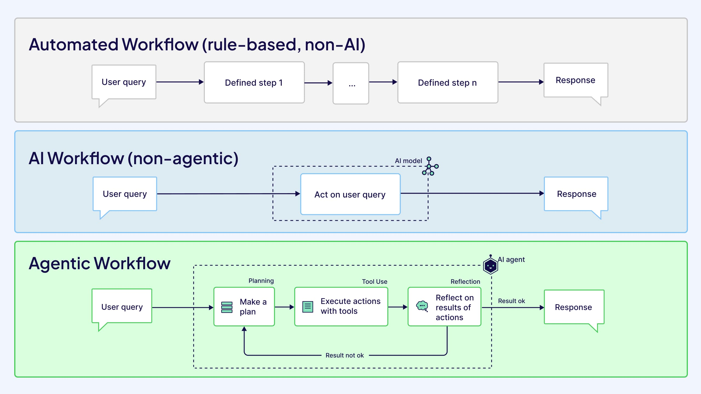
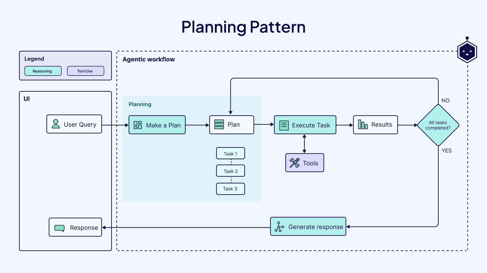

AI agents. Agentic AI. Agentic architectures. Agentic workflows. Agents are everywhere. But what are they really? And can they actually do anything?

New technology brings with it a muddled mixture of confusing terminology, wild expectations, and self-proclaimed online experts. In this article, we cut through the noise and hype surrounding AI agents to explain and illustrate a critical tenet of agentic AI: agentic workflows.

Agents, completely on their own, can’t do much. They need to be given roles, goals, and structure to achieve their goals. This is where workflows come in.

What makes agentic workflows powerful is not just reasoning or tool use, but memory—the ability for agents to retain context, learn from past actions, and adapt over time.

In practice, this means combining short-term context with long-term agent memory that persists across steps and sessions.

Understanding agentic workflows allows you to understand how and why AI agents operate as they do. To help you get there, we’ll go through the key components of AI agents, give you a concise definition of agentic workflows, explain what makes a workflow agentic, elaborate on key recurring patterns in agentic workflows, detail real-world examples and use cases, and give an honest overview of the benefits and challenges to using agentic workflows.

## What are AI agents?

**AI agents** are systems that combine LLMs for reasoning and decision-making with tools for real-world interaction, enabling them to complete complex tasks with limited human involvement. Agents are assigned specific roles and given varying degrees of autonomy to accomplish their end goal. They are also equipped with agent memory, allowing them to learn from past experiences, retain context across steps, and improve performance over time.

For a more in-depth explanation of AI agents, their history, and tools for building them, check out our recent blog post, [Agents Simplified: What we mean in the context of AI](/blog/ai-agents).

To better understand how AI agents fit into agentic workflows, we’ll explore the core components of AI agents.

### Components of AI Agents

Although AI agents are designed for semi-autonomous decision-making, they rely on a larger framework of components to function properly. This framework consists of LLMs that enable the agent to reason effectively, tools that help the agent complete its tasks, and memory that allows the agent to learn from past experiences and improve responses over time.

#### Reasoning

Part of what make AI agents so effective is their capacity for iterative reasoning, essentially allowing the agent to actively “think” throughout the entire problem-solving process. The reasoning capabilities of an AI agent stem from its underlying LLM and serve two primary functions: planning and reflecting.

In the **planning** phase, the agent performs **task decomposition**, the process of breaking down a more complex problem into smaller, actionable steps. This technique allows for agents to approach tasks systematically and allows them to use different tools for different tasks. It also allows for **query decomposition**, in which complex queries are broken down into simpler queries, which improves the accuracy and reliability of responses from the LLM.

Agents also reason through **reflecting** on the outcomes of their actions. This allows them to evaluate and iteratively adjust their plan of action based on results and data pulled from external sources.

#### Tools

LLMs possess static, parametric knowledge, meaning their understanding is confined to the information encoded during training. To expand their capabilities beyond their original dataset, agents can leverage external **tools**, like web search engines, APIs, databases, and computational frameworks. This means that the agent has access to real-time external data to guide its decision-making and accomplish tasks that require it interact with other applications.

Tools are often paired with permissions, such as the ability to query APIs, send messages, or access specific documents or database schemas. The table below outlines several common tools for AI agents along with the tasks they perform.

| **Tool** | **Task** |
| --- | --- |
| Internet search | Retrieve and summarize real-time information. |
| Vector search | Retrieve and summarize external data. |
| Code interpreter | Iteratively run code generated by agents. |
| API | Retrieve real-time information and perform tasks with external services and applications. |

When the LLM selects a tool to help achieve a task, it engages in a behavior called **function calling**, extending its capabilities beyond simple text generation and allowing it to interact with the real-world.

The choice of which tool to use can be predetermined by the end user or be left to the agent. Letting the agent dynamically select tools can be helpful for solving more complex tasks but can add unnecessary complexity for simpler workflows, when predefined tools would be more efficient.

#### Memory

Learning from past experiences and remembering the context in which actions take place are part of what set agentic workflows apart from purely LLM-driven workflows. **Agent memory** is a key component that enables the capture and storage of context and feedback across multiple user interactions and sessions. Agents have two main types of memory: short-term memory and long-term memory.

This is often referred to as AI agent memory or LLM agent memory in modern agentic systems.

**Short-term memory** stores more immediate information like conversation history, which helps the agent determine which steps to take next to complete its overall goal. **Long-term memory** stores information and knowledge accumulated over time, throughout multiple sessions, allowing for personalization of the agent and improved performance over time. Long-term memory is sometimes called persistent memory, as it survives beyond a single interaction or session. This memory system, combining short-term and long-term storage, is what transforms a stateless LLM into a persistent, learning agent.

## What are Agentic Workflows?

In general, a **workflow** is a series of connected steps designed to achieve a specific task or goal. The simplest types of workflows are deterministic, meaning they follow a predefined sequence of steps and are unable to adapt to new information or changing conditions. For example, an automated expense approval workflow could look like this: “if expense is tagged as ‘Food and Meals’ and is less than $30, automatically approve.”

Some workflows, however, leverage LLMs or other machine learning models or techniques. These are often referred to as **AI workflows**, and can be agentic or non-agentic. In a non-agentic workflow, a LLM is prompted with an instruction and generates an output. For example, a text summarization workflow would take a longer passage of text as its input, prompt a LLM to summarize it, and simply return the summary. However, just because a workflow uses a LLM, doesn’t necessarily mean that it’s agentic. Persistent agent memory is what allows these workflows to evolve, personalize behavior, and improve across executions.

An **agentic workflow** is a series of connected steps *dynamically executed by an agent*, or series of agents, to achieve a specific task or goal. Agents are granted permissions by their users, which  give them a limited degree of autonomy to gather data, perform tasks, and make decisions to be executed in the real-world. Agentic workflows also leverage the core components of AI agents including, their capacity for reasoning, ability to use tools to interact with their environment, and persistent memory to completely transform traditional workflows into responsive, adaptive, and self-evolving processes.

### What makes a workflow agentic?

An AI workflow becomes agentic when one or more agents guide and shape the progression of tasks. Adding agents to an existing non-agentic workflow creates a hybrid approach that combines the reliability and predictability of structured workflows with the intelligence and adaptability of LLMs. Agentic workflows are defined by their ability to:

- **Make a plan.** An agentic workflow starts with planning. The LLM is used to break down complex tasks into smaller sub-tasks through task decomposition and then determines the best execution route.
- **Execute actions with tools.** Agentic workflows use a set of predefined tools paired with permissions in order to accomplish tasks and carry out their generated plan.
- **Reflect and iterate.** Agents can assess results at each step, adjust the plan if needed, and loop back until the outcome is satisfactory.
- **Retain and recall memory.** Agentic workflows store outcomes, decisions, and relevant context so agents can reuse what they’ve learned instead of starting from scratch. 

As you can see, we need to differentiate between three types of workflows: traditional non-AI workflows, non-agentic AI workflows, and agentic workflows. The difference between a traditional, rule-based workflow and an AI workflow is the use of predefined steps vs. the use of AI models to accomplish a task. Second, the difference between non-agentic and agentic AI workflows is the use of static AI models vs. dynamic AI agents. This makes the agentic workflow more adaptive an dynamic than a non-agentic workflow.

### The difference between agentic architectures and workflows

With any emerging technology, comes a flood of new terminology. While some may use the terms “agentic architectures” and “agentic workflows” interchangeably, they actually have an important distinction. 

An **agentic workflow**, is the *series of steps* taken by an agent to achieve a certain goal. These steps may include using LLMs to create a plan, break down tasks into subtasks, using tools like internet search to accomplish tasks, and using LLMs to reflect on the outcomes of tasks and adjust their overall plan.

An **agentic architecture,** on the other hand, is the technical framework and *overall system design* used to achieve a given task. Agentic architectures are diverse and creative but always contain at least one agent with decision-making and reasoning capabilities, tools the agent can use to accomplish its goals, and systems for short-term and long-term memory.

:::note

Explore the most powerful agentic architectures, visually illustrated for instant understanding. Download the free e-book [here](http://weaviate.io/ebooks/agentic-architectures?utm_source=agentic_workflows_blog&utm_medium=post&utm_campaign=agentic_architectures&utm_content=cta1).

:::

## Patterns in Agentic Workflows

Recall that an agentic workflow is the structured series of steps taken to complete a specific task, also known as a final target. So when we talk about agentic workflows, we talk about specific patterns of behavior that enable agents to achieve their final target. The core components of AI agents, as we mentioned earlier, play a key role in agentic workflow patterns. The capacity for agents to reason facilitates both the planning and reflection patterns, while their ability to use tools to interact with their environment underlies the tool use pattern.

### Planning Pattern

The planning design pattern allows agents to autonomously break down more complex tasks into  series of smaller and simpler tasks, a process known as **task decomposition**. Task decomposition leads to better results because it reduces the cognitive load on the LLM, improves reasoning, and minimizes hallucinations and other inaccuracies.

Planning is especially effective when the method to achieve a final target is unclear and adaptability in the problem solving process is paramount. For instance, an AI agent instructed to fix a software bug would likely use the planning to pattern to break down the task into subtasks like reading the bug report, identifying the relevant code sections, generating a list of potential causes, and finally selecting a specific debugging strategy. If the first attempt to fix the bug doesn’t work, the agent can read the error messages after execution and adapt its strategy. 

While planning can help agents better tackle more complex tasks, it can also lead to less predictable results than more deterministic workflows. As a result, it’s best to only use the planning pattern with tasks that require intense problem-solving and multi-hop reasoning.

### Tool Use Pattern

A significant constraint of generative LLMs is their reliance on pre-existing training data, meaning they cannot retrieve real-time information or verify facts beyond what they have previously learned. As a result, they may generate non-factual responses or “guess” when they don’t know the answer. [Retrieval Augmented Generation (RAG)](/blog/introduction-to-rag) helps mitigate this limitation by providing the LLM with relevant, real-time external data, enabling more accurate and contextually grounded responses.

Tool use, however, goes beyond naive RAG by allowing the LLM to *dynamically interact* with the real world, as opposed to simply retrieving data from it. In agentic workflows, the **tool use** pattern expands the capabilities of agents by allowing them to interact with external resources and applications, real-time data, or other computational resources.

Common tools include APIs, information retrieval (e.g. vector search), web browsers, machine learning models, and code interpreters. These tools are used to perform specific tasks, like searching the web, retrieving data from an external database, or reading or sending emails that help the agent achieve their target. 

### Reflection Pattern

Reflection is a powerful agentic design pattern that is relatively simple to implement and can lead to significant gains in improvement for agentic workflows. The **reflection pattern** is a self-feedback mechanism in which an agent iteratively evaluates the quality of its outputs or decisions before finalizing a response or taking further action. These critiques are then used to refine the agent's approach, correct errors, and improve future responses or decisions.

Reflection is particularly useful when the agent is unlikely to succeed in accomplishing its target goal on the first attempt, such as writing code. In this case, an agent may generate a code snippet, run it in a sandbox or execution environment, and iteratively feed errors back into the LLM with instructions to refine the code until it executes successfully. 

These reflections are often written into agent memory, improving performance both within the current task and across future workflows.

The power of reflection lies in the agent’s ability to critique its own outputs and dynamically integrate those insights into the workflow, enabling continuous improvement without direct human feedback. These reflections can be encoded in the agent’s memory, allowing for more efficient problem-solving during the current user session and enabling personalization by adapting to user preferences and improve future interactions.

## Agentic Workflows Use Cases

Atomic design patterns, like planning and tool use, can be combined in creative ways to effectively leverage agentic AI for a variety of tasks across diverse domains. In addition to combining design patterns, AI agents can be provided with different combinations of tools and even be granted the ability to dynamically select tools as needed. They can also be integrated with human feedback loops and given varying levels of autonomy and decision-making powers. 

These diverse configurations allow agentic workflows to be tailored for a wide range of tasks across industries. To demonstrate this, we outline two especially powerful use cases: agentic RAG and agentic research assistants.

### Agentic RAG

[Retrieval-Augmented Generation (RAG)](/blog/introduction-to-rag) is a framework that augments the knowledge of a LLM by providing it with relevant data retrieved from an external data source. [Agentic RAG](/blog/what-is-agentic-rag) incorporates one or more agents into the RAG pipeline, turning retrieval into a form of long-term memory for the agent. This is sometimes described as an LLM RAG pipeline with agent memory. 

During the planning phase, an agent can break down complex queries into smaller subqueries through query decomposition or determine whether it needs to ask the user for additional information to complete the request.

An AI agent can also be used to evaluate the relevance and accuracy of retrieved data and responses before it’s passed on to the user. If the response is not satisfactory, the agent can reformulate the query, revisit the query decomposition step, or even create a new plan for responding to the query.

:::note

Agentic workflows like this one can be built with different agentic architectures. If you are curious about potential architectures for the above workflow, download our [free e-book](http://weaviate.io/ebooks/agentic-architectures?utm_source=agentic_workflows_blog&utm_medium=post&utm_campaign=agentic_architectures&utm_content=cta2) on agentic architectures! 

:::

### Agentic Research Assistants

Agentic research assistants, also referred to as “deep research” by some AI companies, generate in-depth reports and detailed insights on complex topics by scouring the web and all sorts of external data. These leverage agentic RAG to retrieve information from the web and other external sources in response to user queries. What sets these assistants apart from traditional RAG, however, is their ability to *synthesize and analyze* information, as opposed to simply retrieving relevant data from external sources to enhance the output generated by a LLM. 

This unique ability is attributed to a few features. First, agentic research assistant generally use LLMs that have been fine-tuned specifically for web browsing, task decomposition, and dynamic planning. Second, agents in these workflows actively seek user guidance, requesting additional information or clarification to better understand the final goal. Third, these agents are able to adapt their plans and change course depending on the information they retrieve. This means that they can pursue new, interesting angles when synthesizing novel information and query multiple data sources consecutively until they get the necessary data.

As a result, agentic research assistants are able to gain deeper insights, identify trends over time, and compile full reports on topics as opposed to simply retrieving existing knowledge. At the time of writing, [OpenAI](https://openai.com/index/introducing-deep-research/), [Perplexity](https://www.perplexity.ai/hub/blog/introducing-perplexity-deep-research), and [Google](https://blog.google/products/gemini/google-gemini-deep-research/) all have their own version of Deep Research publicly available.

### Agentic Coding Assistants

Agentic coding assistants can generate, refactor, refine, and debug code with minimal human intervention. Non-agentic coding assistants, like the first version of GitHub Copilot, are powered by generative LLMs fine-tuned to generate code, but are limited to doing just that — generating code. 

What makes a coding assistant agentic is its ability to interact with its environment by executing generated code and iteratively refine it based on execution results, errors, or feedback. These assistants can also be enabled with permissions to make changes to an existing code base by creating commits and PRs, like Anthropic’s [Claude Code](https://docs.anthropic.com/en/docs/agents-and-tools/claude-code/overview), an important step in automating the software development process. Agentic coding assistants can also be used to suggest terminal commands and other code changes and additions and wait for explicit human approval before execution, like Cursor’s [Agent](https://docs.cursor.com/agent), allowing humans to be fully in control of the agent. Additionally, and importantly, agentic coding assistants can learn from their mistakes by encoding them in long-term memory, allowing them to grow smarter over time.

## Agentic Workflow Examples

Now that we’ve outlined some use cases for agentic workflows, we’ll take a more detailed look at the individual steps of the workflows of two real-world agents: [Claygent](https://www.clay.com/claygent) and [ServiceNow AI Agents](https://www.servicenow.com/products/ai-agents.html). Each workflow uses its own unique combination of patterns and tools, gives its agents varying degrees of autonomy and decision-making capabilities, and relies on different levels of human feedback and involvement.

### Claygent (Clay)

Lead research and data enrichment can be a tedious task for growth and sales teams. [Clay](https://www.clay.com/), a data enrichment and outreach automation company, streamlines this process with [Claygent](https://www.clay.com/claygent)—an AI-powered research agent that continuously scans the web and internal databases to deliver real-time, actionable insights.

Say you want to use Claygent to enrich a LinkedIn profile based on a list of names and email addresses and then send a personalized introduction message. First, you specify the fields of data you’re looking for (e.g. work experience, education, skills), which is injected into a pre-configured prompt template. The agent’s LLM processes the query, uses a web scraping tool to scour the web for a LinkedIn URL, and extracts the desired data from the LinkedIn profile. This data can then be sent to another LLM that you can instruct to summarize or analyze the enriched data however you want. The same LLM (or a different one) can then be used to create a personalized outreach message for each profile.

Claygent is an example of a relatively flexible agentic workflow that can be customized in creative ways, while still providing guidance to agents through pre-configured prompt templates for specific tasks.

### ServiceNow AI Agents

[ServiceNow](https://www.servicenow.com/) is a cloud-based platform that streamlines and automates workflows across IT, operations, HR, and customer service domains. Their ServiceNow Platform now includes access to AI agents, intended to automate repetitive tasks and pre-existing workflows, while still leaving humans in full control of making decisions.

Here’s an example of how an agentic workflow can help resolve a technical support case. The workflow is triggered when a customer submits a ticket for technical support. The information from the ticket is then passed to one or more agents that perform RAG on an internal IT support knowledge base. The agent summarizes the findings, analyzes similar cases, and generates a summary for the IT support specialist. Finally, it generates a recommendation for how to proceed, which the specialist can either approve or deny. 

ServiceNow AI Agents represent an innovative but more cautious approach to deploying agents in production, giving them strict roles and tasks to accomplish and limited, if any, autonomy to make decisions that affect the end user or customer.

:::note

Want to build your own agentic workflow? Check out [Building Agentic Workflows with Inngest](/blog/inngest-ai-workflows), where we show how to create an agentic dinner planner.

:::

## Benefits and Limitations of Agentic Workflows

AI agents have rapidly moved beyond the machine learning community and into the mainstream. Given all the excitement, anticipation, and expectations around agentic AI, it can be difficult to separate hype from reality and understand its true capabilities and limitations. In this section, we give you a balanced view of the benefits, challenges, and limitations of agentic workflows.

### Benefits of Agentic Workflows

Agentic workflows go beyond traditional automation by enabling AI agents to plan, adapt, and improve over time. Unlike deterministic workflows, which follow fixed rules, agentic workflows can dynamically respond to complexity, refine their approach through feedback, and scale to handle more advanced tasks. This adaptability makes them particularly valuable in scenarios where flexibility, learning, and decision-making are essential. 

Let’s take a closer look at the benefits of agentic workflows:

- **Flexibility, adaptability, and customizability.**
Static, deterministic workflows struggle to adapt to evolving situations and unexpected difficulties. Agentic workflows, on the other hand, offer the flexibility to adjust and evolve based on the task difficulty, ensuring they always stay relevant and give the best solution. They can also be customized by combining different patterns, enabling a modular design that allows iterative upgrades as needs and complexity grows.
- **Improved performance on complex tasks.**
By breaking down complex tasks into smaller manageable steps (through task decomposition and planning), agentic workflows significantly outperform deterministic, zero-shot approaches.
- **Self-correcting and continuous learning.**
The reflection pattern allows agentic workflow to evaluate their own actions, refine strategies, and improve outcomes over time. Utilizing both short-term context and long-term agent memory, they learn from past experiences to become more effective and personalized with each iteration.
- **Operational efficiency and scalability.**
Agentic workflows can automate repetitive tasks with high accuracy (if built right), reducing manual effort and operational costs in specific scenarios. They can also scale easily, making them ideal for handling larger workloads or complex systems.

Keep in mind that AI agents are still an emerging technology, and that this list of benefits is likely to expand as researchers and users discover novel ways of incorporating agents into workflows. 

### Challenges and Limitations of Agentic Workflows

Despite their benefits and innovative features, AI agents also come with a number of challenges and limitations. Because of their probabilistic nature, AI agents inherently add complexity to workflows. And just because agents *can* be used to automate processes, doesn’t mean that they *should* be used. Here are a few of the most notable challenges and limitations of agentic workflows:

- **Unnecessary complexity for simple tasks.**
    
    AI agents can add overhead when used for straightforward workflows like form entry or basic data extraction. In cases where deterministic, rules-based automation is sufficient, introducing agents may lead to inefficiencies, extra expense, and possibly reduced performance.
    
- **Reduced reliability as a result of increased autonomy.**
    
    As agents gain more decision-making power within a workflow, their probabilistic nature can introduce unpredictability, making outputs less reliable and harder to control. Implementing and actively maintaining guardrails for agents and continually reviewing their granted permissions is critical.
    
- **Ethical and practical considerations.**
    
    Not all decisions should be delegated to AI systems. Using agents in high-stakes or sensitive areas requires careful oversight to ensure responsible deployment and prevent unintended consequences.
    

Given these limitations, we recommend taking time to reflect on whether using an agent is truly necessary in a given workflow. Some questions to help you determine this may include:

- Is the task complex enough to require adaptive decision-making, or would a deterministic approach suffice?
- Would a simpler AI-assisted tool (such as RAG without an agent) achieve the same outcome?
- Does the workflow involve uncertainty, changing conditions, or multi-step reasoning that an agent could handle more effectively?
- What are the risks associated with giving the agent autonomy, and can they be mitigated?

## Summary

Agentic workflows are powerful tools to help automate the completion of complex tasks that require decision-making and reasoning. In this article, we reviewed the core components of AI agents, including, memory, tools, and reasoning capabilities and how they contribute to agentic workflows. We also discussed common workflow patterns, like planning, tool use, and reflection that can be used in isolation or combination to create dynamic workflows. Furthermore, we outlined two particularly effective use cases, [agentic RAG](/blog/what-is-agentic-rag) and agentic research agents, and described the workflows behind two agents already on the market, Clay’s Claygent and ServiceNow’s AI Agents. Finally, we touched on the benefits of agentic workflows as well as their limitations and challenges. At their core, agentic workflows are systems that combine reasoning, tools, and agent memory to move beyond static automation.

The technology behind AI agents is continuously evolving, as is our understanding of them. This article is intended to give you a basic understanding how AI agents function in workflows but is by no means an exhaustive exploration of the topic. 

For a more detailed view and explanation of specific agentic architectures, download our free [e-book](http://weaviate.io/ebooks/agentic-architectures?utm_source=agentic_workflows_blog&utm_medium=post&utm_campaign=agentic_architectures&utm_content=cta3).

### Resource guide

📃 [A Survey on the Memory Mechanism of Large Language Model based Agents](https://arxiv.org/abs/2404.13501) (arXiv paper)

📃 [Agent Design Pattern Catalogue: A Collection of Architectural Patterns for Foundation Model Based Agents](https://arxiv.org/pdf/2405.10467) (arXiv paper)

🎬 [Advanced AI Agents with RAG](https://www.youtube.com/watch?v=UoowC-hsaf0&list=PLTL2JUbrY6tVmVxY12e6vRDmY-maAXzR1&ab_channel=Weaviate%E2%80%A2VectorDatabase) (YouTube)

📝 [What is Agentic RAG](/blog/what-is-agentic-rag)

📝 [Agentic Design Patterns Part 2, Reflection](https://www.deeplearning.ai/the-batch/agentic-design-patterns-part-2-reflection/?ref=dl-staging-website.ghost.io) (Blog post)

import WhatsNext from '/_includes/what-next.mdx'

<WhatsNext />

