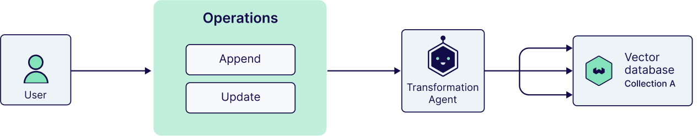
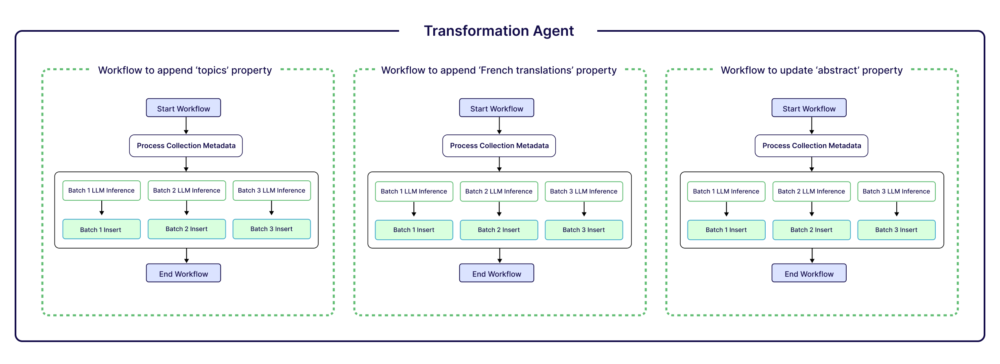
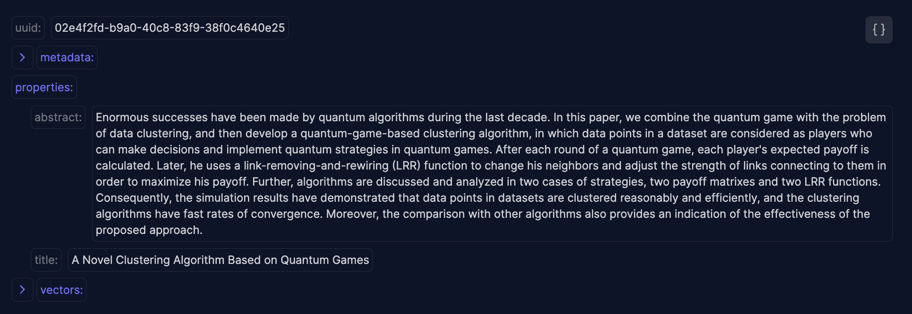
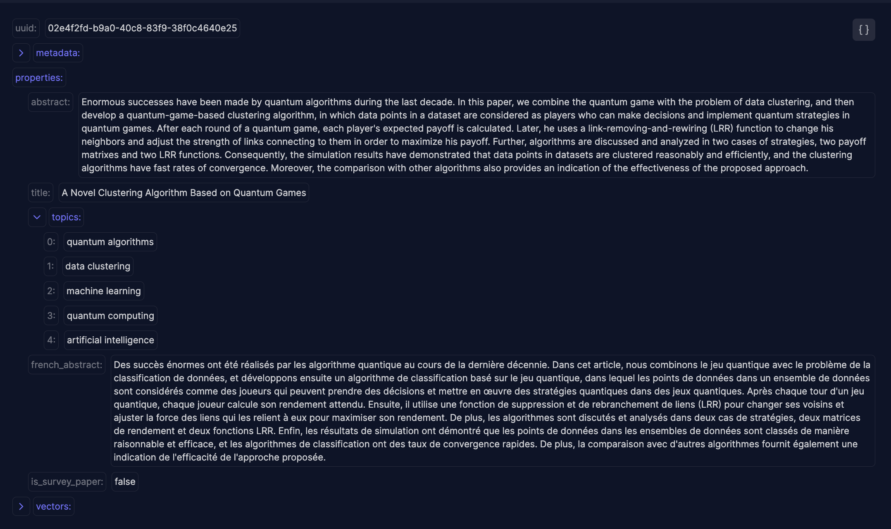

Following our introduction of the [**`QueryAgent`**](/blog/query-agent) last week, we’re back with yet another one: The **`TransformationAgent`** is now ready in public preview for all [Weaviate Serverless Cloud](/deployment/serverless) users (including free Sandbox users)!


When we talk about AI agents, we often discuss them in the context of advanced information retrieval, assistants in our research if you will. But, agentic AI has so much more to offer. What if we could create agents that not only do research for us, but also take actions or complete tasks for us? The Transformation Agent is an example of one of these agentic workflows. Simply put, it’s an agentic database management application which uses natural language instructions and LLMs to transform data in Weaviate collections.

:::note 
This blog comes with an accompanying [recipe](https://colab.research.google.com/github/weaviate/recipes/blob/main/weaviate-services/agents/transformation-agent-get-started.ipynb#scrollTo=Uiu5C8n7v-Xp) that you can use to get started.

⚠️ Since this service is currently in preview, please do not demo it on production collections.
:::

## What is the Transformation Agent

This is our first step into a future of database management where we can start to leave the tedious task of designing updates and changes for our database to an LLM.

You can configure the `TransformationAgent` to access any given collection in Weaviate Cloud and provide it with a list of transformation operations you’d like to perform on it.

For example, think of a scenario where you may have quarterly reports from teams in your company in a collection. With the transformation agent, you can define new properties such as “team” or “quarter” with the instructions “Based on the contents of the report, identify what team it’s from” or “Based on the report, identify what quarter the report belongs to”. The agent will take care of 2 of the most important steps in this scenario:

1.  It will determine the team and quarter of the report with the use of an LLM
2.  It will also then create the additional properties and write them to each report object in Weaviate.

Not only that, the agent will do this for all objects in our collection. While these may seem like simple steps, it completely removes the burden of creating the right API calls to add the new property from the maintainer of the database, not to mention the step for generating the summaries in the first place.

:::note 
❗️ For our first preview release of this agent, each Weaviate organization is limited to 10000 object transformations per day. This limit will be incremented over time.
:::



We know the stakes are higher with such inherent access over your collections. So, we have provided templates in the form of the Operations which specify intended behavior. The agent is only able to act within those specific parameters, and for now, only supports operations that modify existing objects in Weaviate. Let’s start by looking at the transformation operations.

### Transformation Operations

For the first preview version of the `TransformationAgent`, we support two transformations:

-   **Append Property:** Which allows you to add a new property to all of the objects within your collection. This transformation expects:
    -   An instruction: Describing what the LLM should do to create this new property
    -   The property name: The name of the new property to create
    -   The properties to view: The name(s) of the existing properties in the object that the LLM may use as context when generating the new property
    -   The data type: Which is the data type that the new property will be written to Weaviate as. (e.g. text, text array, integer..)
-   **Update Property:** Which allows you to update the contents of a property for all objects within your collection. This transformation expects
    -   The property name: The name of the (existing) property we want to update
    -   An instruction: Describing what the LLM should do to update the property
    -   The properties to view: The name(s) of the existing properties in the object that the LLM may use as context when updating property



A Transformation Agent may be given multiple operations to run. For example we may ask for 3 operations that append new properties, and 1 operation that updates an existing one. When we run the agent, this will spin up their own workflows for each operation.

Weaviate will manage the task queue, as well as ensuring that each operation completes without ever running on the same property at the same time.

Let’s have a look at an example.

### Our Vision for the Future of Transformation Agents

As we iterate on and improve the `TransformationAgent`, our vision is to provide a service that will allow you to do so much more than currently possible:

-   Prepare data cleaning processes with simple natural language.
-   Deduplicate your data.
-   Add new objects to your collection.
-   Extract metadata, images, dates and other key information out into their own properties.

In short, we are aiming to significantly simplify the process of maintaining your database and its contents with a simple natural language interface.

## Creating Transformation Agents

> 👩‍🍳 For this announcement, we’ve also released an accompanying [recipe](https://colab.research.google.com/github/weaviate/recipes/blob/main/weaviate-services/agents/transformation-agent-get-started.ipynb#scrollTo=Uiu5C8n7v-Xp) to help you get started. For questions or feedback, you can [join the ‘Agents’ topic in the Weaviate Forum](https://forum.weaviate.io/c/agents/10).

As an example scenario, think of a collection called “ArxivPapers” which has objects with just two properties:

-   title: A title of a research paper
-   abstract: The abstract of a research paper

In the accompanying recipe, you can get access to this dataset and write it to a collection in Weaviate Cloud. Using the Explorer tool in the console, you can take a look at the contents. For example, an object in this collection looks like this:



We can use the `TransformationAgent` to add more properties to this collection such as “topics”, which lists the topics covered in the paper, “french_abstract”, which is a translation of the abstract, and more.

To get started, we need to install the Weaviate Python client. The `TransformationAgent` (as well as the `QueryAgent`) is now ready to preview via the Weaviate Python client, for all Serverless Weaviate Cloud users (including free Sandboxes).

```bash
pip install weaviate-client[agents]  

```

### Define Transformation Operations

The best way to get started with using the `TransfomationAgent` is by starting to think about what kind of transformation operations you’d like to execute. For our demo example, let’s say we’d like to do a few things:

1.  Create a list of topics based on the abstract.
2.  Translate the abstract to French.
3.  Have a boolean flag indicating wether it’s a survey paper or not

Take the example of creating a list of topics. We first would define this operation:

```python
from weaviate.agents.classes import Operations
from weaviate.collections.classes.config import DataType

add_topics = Operations.append_property(
    property_name="topics",
    data_type=DataType.TEXT_ARRAY,
    view_properties=["abstract", "title"],
    instruction="""Create a list of topic tags based on the title and abstract.
    Topics should be distinct from eachother. Provide a maximum of 5 topics.
    Group similar topics under one topic tag.""",
)

```

As you can see, while we provide the bulk of the information of what has to happen in the `instruction`, we still provide the new `property_name`, `data_type` and `view_properties` explicitly. This ensures that the new property being generated can be consistent across all of our objects.

### Initializing and Running the Agent

Once we have our operations, we can initialize a `TransformationAgent`. For example, below we have an agent that has the `add_topics` as well as the additional operations on our wish list.

:::note
Follow the recipe to create all the operations.
:::

```python
from weaviate.agents.transformation import TransformationAgent

agent = TransformationAgent(
    client=client,
    collection="ArxivPapers",
    operations=[
        add_topics,
        add_french_abstract,
        is_survey_paper,
    ],
)

agent.update_all()

```

Once we’ve updated all the objects using our new `agent` the same object we saw above looks like the following:



## Summary

The Transformation Agent represents a significant leap forward in database management, offering a natural language interface for Weaviate Cloud users to modify and enhance their collections. By combining LLM capabilities with structured database operations, it simplifies complex tasks like property creation or updates. This preview release, featuring append and update operations, marks our first step toward a future where database transformations become more intuitive and accessible, reducing the technical barriers traditionally associated with database management.


import WhatsNext from '/_includes/what-next.mdx'

<WhatsNext />