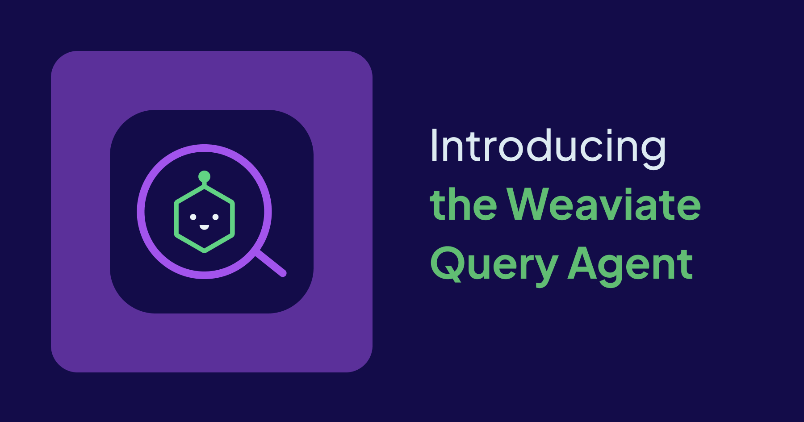

We’re incredibly excited to announce that we’ve released a brand new service for our [Serverless Weaviate Cloud](https://weaviate.io/deployment/serverless) users (including free Sandbox users) to preview, currently in Alpha, : the _**Weaviate Query Agent!**_ Ready to use now, this new feature provides a simple interface for users to ask complex multi-stage questions about your data in Weaviate, using powerful foundation LLMs. In this blog, learn more about what the Weaviate Query Agent is, and discover how you can build your own!

Let’s get started.

> Note: this blog comes with an accompanying [recipe](https://github.com/weaviate/recipes/tree/main/weaviate-services/agents/query-agent-get-started.ipynb) for those of you who’d like to get started.

## What is the Weaviate Query Agent

AI Agents are semi- or fully- autonomous systems that make use of LLMs as the brain of the operation. This allows you to build applications that are able to handle complex user queries that may need to access multiple data sources. And, over the past few years we’ve started to build such applications thanks to more and more powerful LLMs capable of function calling, frameworks that simplify the development process and more.

> To learn more about what AI Agents are, read our blog [”Agents Simplified: What we mean in the context of AI”](https://weaviate.io/blog/ai-agents).

**With the Query Agent, we aim to provide an agent that is inherently capable of handling complex queries over multiple Weaviate collections.** The agent understands the structure of all of your collections, so knows when to run searches, aggregations or even both at the same time for you.

Often, AI agents are described as LLMs that have access to various tools (adding more to its capabilities), which are also able to make a plan, and reason about the response.

Our Query Agent is an AI agent that is provided access to multiple Weaviate collections within a cluster. Depending on the user’s query, it will be able to decide which collection or collections to perform searches on. So, you can think of the Weaviate Query Agent as an AI agent that has tools in the form of Weaviate Collections.

In addition to access to multiple collections, the Weaviate Query Agent also has access to two internal agentic search workflows:

-   Regular semantic search with optional filters
-   Aggregations

In essence, we’ve released a multi-agent system that can route queries to one or the other and synthesise a final answer for the user.

![Query Agent][./img/query-agent.png]

### Routing to Search vs Aggregations

Not all queries are the same. While some may require us to do semantic search using embeddings over a dataset, other queries may require us to make [aggregations](https://weaviate.io/developers/weaviate/api/graphql/aggregate) (such as counting objects, calculating the average value of a property and so on). We can demonstrate the difference with a simple example. Think of two queries assuming we have a dataset containing the [Weaviate Blog](https://weaviate.io/blog):

1.  What are the components of an AI agent discussed in the “Agents Simplified” blog?
2.  How many blog posts has Leonie published?

For question 1, we may need to filter to the “Agents Simplified” blog and search for “AI agent components”. Whereas for question 2, the task is closer to a counting task. We have to count how many blogs appear for the author Leonie.

Weaviate is a vector database, meaning for case 1, we have embeddings stored on which we can perform regular semantic search on. However, for case 2, we need to create an [Aggregation Query](https://weaviate.io/developers/weaviate/api/graphql/aggregate).

The good news is, the Weaviate Query Agent is capable of handling both. Depending on the user query, the agent will generate a search query, or an aggregation query, or in some cases both.

## Creating Query Agents

> 👩‍🍳 For this announcement, we’ve also released an accompanying [recipe](https://colab.research.google.com/github/weaviate/recipes/blob/query-agent-starter/weaviate-services/agents/query-agent-get-started.ipynb) to help you get started. Read on for key points on how to use the Query Agent, or alternatively follow along with the recipe itself. For questions or feedback, you can [join the ‘Agents’ topic in the Weaviate Forum](https://forum.weaviate.io/c/agents/10).

The `QueryAgent` and all upcoming agents we will release for preview will be available via the Weaviate Python Client:

```bash
pip install weaviate-client[agents] 

```

To initialize a new `QueryAgent`, we have to take a few simple steps:

-   We give it access to our serverless cluster via `client`.
-   We provide it with a list of `collections` which we grant it access to perform searches on.
-   Optionally, we may also provide our own custom `system_prompt` to provide it instructions on how to generate responses.

> For the time being, the `QueryAgent` is freely available to all Weaviate Cloud Serverless and Sandbox users, however there is a rate limit of 100 queries per day on an organization basis.

### Giving Access to Collections

For this intro, we’ve created a recipe which uses 2 collections (and we’ve added an extra 2 for you to optionally play around in the recipe).

-   E-commerce: A collection that has a list of clothes, their brands and prices.
-   Brands: A collection that lists more information on brands, their country of origin, parent brands and so on.

We’ll use these datasets to create an ‘e-commerce assistant’ agent

```python
from weaviate.agents.query import QueryAgent

agent = QueryAgent(client=your_client, collections=["ecommerce", "Brands"])

```

### Running the Query Agent

Once initialized, the `QueryAgent` can accept user queries. The response is then returned within a `QueryAgentResponse` object which includes information on what searches or aggregations were performed, which collections were used, and even whether the agent has concluded if the answer is complete or not.

```python
response = agent.run("I like the vintage clothes, can you list me some options that are less than $200?")

```

The example above may return the following `QueryAgentResponse`:

```bash
original_query='I like the vintage clothes, can you list me some options that are less than $200?' 
collection_names=['Ecommerce'] 
searches=[[QueryResultWithCollection(queries=['vintage clothes'], filters=[[IntegerPropertyFilter(property_name='price', operator=<ComparisonOperator.LESS_THAN: '<'>, value=200.0)]], filter_operators='AND', collection='Ecommerce')]] 
aggregations=[]
sources= [Source(object_id='5e9c5298-5b3a-4d80-b226-64b2ff6689b7', collection='Ecommerce'), Source(object_id='48896222-d098....', collection='Ecommerce')...]
usage=Usage(requests=3, request_tokens=7689, response_tokens=1488, total_tokens=9177, details=None) 
total_time=13.9723
aggregation_answer=None 
has_aggregation_answer=False 
has_search_answer=True 
is_partial_answer=False 
missing_information=[] 
final_answer="Here are some vintage-style clothing options under $200 that you might like:\\n\\n1. **Vintage Philosopher Midi Dress** -..."

```

The `QueryAgentResponse` aims to be as interpretable as possible. We include the `searches` and `aggregations` so that you can understand the actions carried out. You can check `sources` to see which exact objects were used to generate answers from. We also include `missing_information` to allow the agent to inform you when it’s incapable of answering the original query.

For example, with the response above we can see that the `QueryAgent` has performed a search on the Ecommerce collection. Not only that, but we’re also able to see what the search is, as well as what filters were used:

```bash
searches=[[QueryResultWithCollection(queries=['vintage clothes'], filters=[[IntegerPropertyFilter(property_name='price', operator=<ComparisonOperator.LESS_THAN: '<'>, value=200.0)]], filter_operators='AND', collection='Ecommerce')]] 

```

### Running a Follow Up Query

Optionally, you may also chose to provide the response from the previous interaction as context to the next one. This way, you’re always able to ask follow up questions and the `QueryAgent` is able to infer what some of the missing information might be. For example, as a follow up to the previous question we may run the code below:

```python
new_response = agent.run("What about some nice shoes, same budget as before?", context=response)

```

In this case, you can observe that the `new_response` includes the following `searches` and `final_answer`. Notice that although we didn’t provide the budget in the query, the agent was able to infer that we still want to adhere to the budget of $200.

```bash
searches=[[QueryResultWithCollection(queries=['nice shoes'], filters=[[IntegerPropertyFilter(property_name='price', operator=<ComparisonOperator.LESS_THAN: '<'>, value=200.0)]], filter_operators='AND', collection='Ecommerce')]]
final_answer="Here are some nice shoe options under $200 - 1. **Parchment Boots by Nova Nest** - $145 ..."

```

### Modifying the System Prompt

In addition to deciding which of your collections the `QueryAgent` has access to, you may also chose to provide a custom `system_prompt`. This allows you to provide the agent with instructions on how it should behave. For example, below we provide a system prompt which instructs the agent to always respond in the users language:

```python
multi_lingual_agent = QueryAgent(
    client=client, collections=["ecommerce", "Brands"],
    system_prompt="You are a helpful assistant that always generated the final response in the users language."
    " You may have to translate the user query to perform searches. But you must always respond to the user in their own language."
)

```

## Summary

The Weaviate Query Agent represents a significant step forward in making vector databases more accessible and powerful. By combining the capabilities of LLMs with Weaviate's own search and aggregation features, we've created a tool that can handle complex queries across multiple collections while maintaining context and supporting multiple languages. The resulting agent can be used on its own, as well as within a larger agentic or multi-agent application.

Whether you're building applications that require semantic search, complex aggregations, or both, the Query Agent simplifies the development process while providing the flexibility to customize its behavior through system prompts. As we continue to develop and enhance this feature, we look forward to seeing how our community will leverage it to build even more powerful AI-driven applications.

Ready to get started? Check out our [recipe](https://colab.research.google.com/github/weaviate/recipes/blob/main/weaviate-services/agents/query-agent-get-started.ipynb), join the discussion in our forum, and start building with the Weaviate Query Agent today!