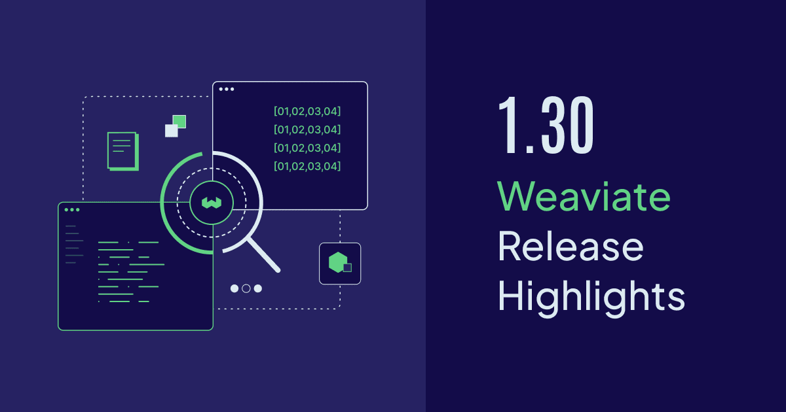

Weaviate `v1.30` includes a host of new features and improvements. It introduces API-based database user management, runtime RAG configurations, multi-vector (ColBERT-like) embedding quantization.

It also brings BlockMax WAND and multi-vector embeddings to general availability (GA), indicating their readiness for production use. There are other enhancements, including xAI model integrations and runtime configuration management, and more.

Here are the release ⭐️*highlights*⭐️!

- [BlockMax WAND in GA](#blockmax-wand-in-ga)
- [Multi-vector embeddings - GA & quantization](#multi-vector-embeddings)
- [API-based user management](#api-based-user-management)
- [Generative (RAG) capability improvements](#generative-capability-improvements)
- [xAI model integration](#xai-model-integration)
- [Other enhancements](#other-enhancements)

## BlockMax WAND in GA

BlockMax WAND [significantly speeds up keyword and hybrid searches](/developers/weaviate/concepts/indexing#blockmax-wand-algorithm) in Weaviate. Originally introduced as a technical preview in `1.28`, it is now generally available in `v1.30`. In fact, it is now the default indexing algorithm for all new Weaviate instances from this version onwards.

At a high level, BlockMax WAND is an algorithm that optimizes the scoring of documents in a search index for lexical (keyword) queries. This can be especially useful for large datasets, for example large e-commerce catalogs or a library of complex (legal/medical/domain-specific) documents.

It does this by pre-computing statistics for blocks of documents in the index, allowing it to quickly skip over blocks that are unlikely to contain relevant documents. We have seen up to a 10x speedup in keyword searches due to BlockMax WAND.

Existing instances' data can be migrated to use BlockMax WAND by following [this guide](TODO - add blockmax wand migration guide). This is a one-time operation, and once completed, the instance will use BlockMax WAND for all future searches.

If you are going to create a new Weaviate instance, you do not need to do anything - BlockMax WAND will be used by default.

Enjoy the speedup! 🚀🚀🚀

:::info Related resources
- [BlockMax WAND blog](/blog/blockmax-wand/)
- [Concepts: Indexing - BlockMax WAND](/developers/weaviate/concepts/indexing#blockmax-wand-algorithm)
- [Migration Guide: BlockMax WAND](TODO - add guide link)
:::

## Multi-vector embeddings

ColBERT or ColPali-like [multi-vector embeddings](/developers/weaviate/tutorials/multi-vector-embeddings) are now generally available in Weaviate for production use. Here is an illustration showing the difference between single-vector and multi-vector embeddings.

import useBaseUrl from '@docusaurus/useBaseUrl';
import ThemedImage from '@theme/ThemedImage';

<ThemedImage
  alt="DBPedia OpenAI Benchmark results"
  sources={{
    light: useBaseUrl('/img/benchmark/dbpedia-openai-1000k-angular-light.svg'),
    dark: useBaseUrl('/img/benchmark/dbpedia-openai-1000k-angular-dark.svg'),
  }}
/>

Multi-vector embeddings allow you to store and query multi-vector embeddings such as those from ColBERT, ColPali and ColQwen models. This approach enables more precise searching through "late interaction" - a technique that matches individual parts of texts rather than comparing them as whole units.

This was introduced in `v1.29` as a technical preview, and is now generally available in `v1.30`. This means that the feature is considered stable and ready for production use.

In addition to this, we are very pleased to announce that multi-vector embeddings can now be quantized in Weaviate for reduced memory footprint.

Quantization is a technique that reduces the size of the vectors by approximating them with lower precision representations. Multi-vector embeddings are typically larger than single-vector embeddings. So quantization may be even more important than for single-vector embeddings.

We know this would be a welcome feature for those of you looking to go to production with multi-vector embeddings. Quantization is available for all multi-vector embeddings, regardless of what model it came from.

:::info Related resources
- [Multi-vector embeddings tutorial](/developers/weaviate/tutorials/multi-vector-embeddings)
- [How-to Configure: Vector Quantization](/developers/weaviate/configuration/compression)
:::

## API-based database user management

User management is a whole lot more flexible from `v1.30`. Weaviate now supports API-based management of database users in addition to environment variable-based database users, and OIDC users.

Administrators can now create and delete database users using the Weaviate client libraries, or the REST API. Even better, changes to the set of API-based database users will take effect without restarting the Weaviate instance.

You can create, delete, and even rotate these database users' API keys without restarting Weaviate. This is a big improvement over the previous method of managing database users, which required restarting Weaviate to apply changes.

Individual users' access can be granted, revoked or made secure again in real-time without the need for downtime. It can be combined with role-based access control (RBAC) to provide a powerful and flexible access control system.

## Generative capability improvements

Weaviate's retrieval-augmented generation (RAG) capabilities are now easier to use and more powerful, with runtime options for model providers, and the ability to add images to the input.

From `v1.30`, you can specify at query time which model provider (e.g. Cohere, Google,OpenAI, etc.) to use for generative capabilities, as well as a specific model and other types. This means that you can have a default provider & model for your Weaviate collection, and also override at query time for specific requests.

Additionally, you can now add images to the input of the generative model as context. This can help you to get more out of modern vision language models from providers such as Anthropic, Google, and OpenAI, for example.

## xAI model integration

Weaviate's suite of [model integrations](/developers/weaviate/model-providers/) now includes support for xAI's generative AI models.

## Other enhancements

### Runtime config management

Some system configuration options can now be set and changed at runtime, where they were previously only available at startup.

Weaviate will now periodically look for the presence of a configuration file to read settings for enabling async replication and autoschema, as well as the maximum number of collections that can be created.

This means that you can now change these settings without restarting Weaviate, which can be useful for managing Weaviate instances in production.

### Collection count limits

There is now a default limit on the number of collections that can be created in each Weaviate instance. This has two benefits.

One, it prevents a user from creating too many collections, which can slow down the system. Two, it acts as a trigger to consider whether the architecture of the system is correct, and whether a multi-tenant approach might be more appropriate.

### Tokenizer concurrency limits

Weaviate's non-English tokenizers now have a concurrency limit to prevent them from consuming too many resources. By default, the limit is set to Go's CPU core count (`GOMAXPROCS`) - but you can adjust this limit to suit your needs.

- [Runtime config management](#runtime-config-management)
- [Collection count limits](#collection-count-limits)
- [Tokenizer concurrency limits](#tokenizer-concurrency-limits)

### RBAC updates

Tenant filtering added in 1.30

## Summary

Ready to Get Started?

Enjoy the new features and improvements in Weaviate `1.29`. The release is available open-source as always [on GitHub](https://github.com/weaviate/weaviate/releases/tag/v1.28.0), and will be available for new Sandboxes on [Weaviate Cloud](https://console.weaviate.cloud/) very shortly.

For those of you upgrading a self-hosted version, please check the [migration guide](/developers/weaviate/more-resources/migration#general-upgrade-instructions) for detailed instructions.

It will be available for Serverless clusters on Weaviate Cloud soon as well.

Thanks for reading, see you next time 👋!
