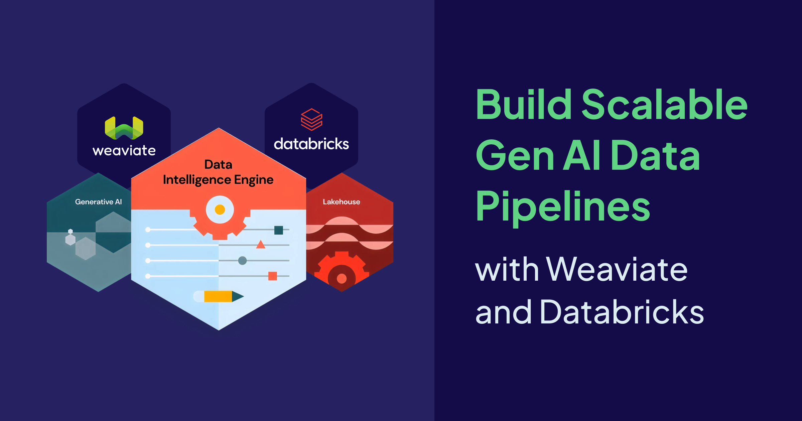
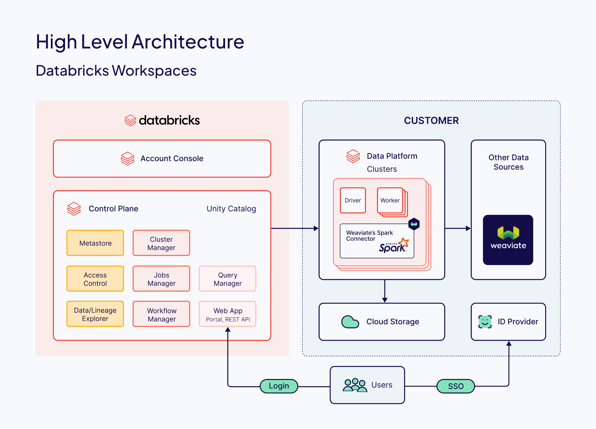
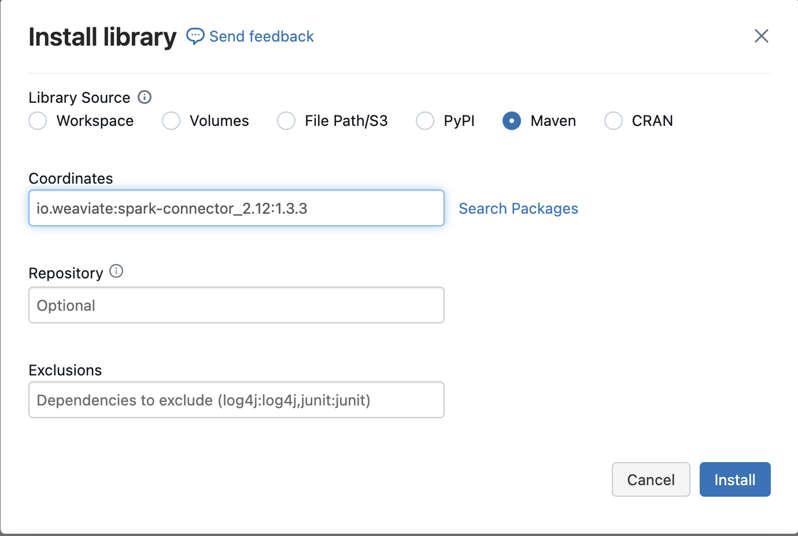
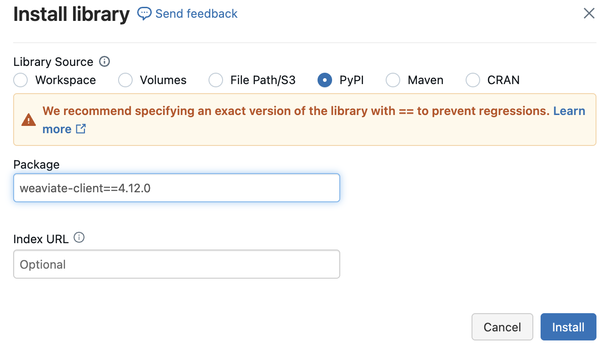

Building generative AI applications at large enterprises requires data pipelines that integrate data from numerous sources and ensure optimized performance. With [Weaviate](https://weaviate.io/), the vector database built for Gen AI applications, and [Databricks](https://www.databricks.com/), an industry-leading data platform, we’ve created a powerful suite of integrations designed to streamline AI workflows and deliver an exceptional developer experience. From calling models hosted on Databricks to efficient data handling, Weaviate provides a tightly integrated, end-to-end solution. 

The Weaviate [Spark Connector](https://github.com/weaviate/spark-connector)—developed in collaboration with our partners at [SmartCat](https://smartcat.io/)—is the latest addition to this suite, enabling seamless data ingestion into Weaviate through the Apache Spark™s DataFrame API. This post will guide you through incorporating our Spark Connector into your Databricks workflows. We’ll start with a brief walkthrough for setting up your Databricks cluster, defining a Weaviate collection, ingesting data, and running your first hybrid and generative search queries.

You can find the notebook in the Weaviate recipe repository [here](https://github.com/weaviate/recipes/blob/main/integrations/data-platforms/databricks/databricks-spark-connector.ipynb).

## Architecture 

The Spark Connector is a jar library that implements Spark’s DataWriter interface. This means that writing data to Weaviate is as simple as calling Spark’s `write` method on a DataFrame. You don’t have to worry about tedious technical details like batching or data partitioning; the Spark runtime and connector handle these efficiently under the hood.



## Installation

To get the demo notebook running on your Databricks cluster, we’ll go over a couple of quick setup steps starting with installing libraries and then setting environment variables. 

### Installing the Spark Connector 

The `spark-connector` jar is available on [Maven Central](https://central.sonatype.com/artifact/org.apache.spark/spark-connect_2.13), and you can add it to your cluster as a cluster scoped library. Use the coordinate `io.weaviate:spark-connector_2.12:1.3.3`. Head to your cluster settings, open the `Libraries` tab, and select `Install New` → `Maven`. Drop in the coordinate, and you’re all set.



### Adding the Weaviate Client

Since we’re working in Python, you’ll also need the weaviate-client package from [PyPI](https://pypi.org/project/weaviate-client/). You can install this through your cluster's Libraries tab, similar to the spark-connector:



### Setting Environment Variable

For a secure connection, configure the following environment variables as Secrets in Databricks: 

* `DATABRICKS_TOKEN`:  Your Databricks personal access token   
* `EMBEDDINGS_ENDPOINT` and `LLM_ENDPOINT`: The serving endpoints for your models served through the Databricks Foundation Model API—one for Embedding task and one for Chat task.   
* `WEAVIATE_URL` and `WEAVIATE_API_KEY`:  For connecting to your Weaviate instance, especially if using Weaviate Cloud.

## Connect to your Weaviate Cluster

For this demo, we’ll connect to our [Weaviate Cloud](https://console.weaviate.cloud/) cluster and use the Databricks module to vectorize our data and connect to a language model.

```python
client = weaviate.connect_to_wcs(
    cluster_url=WEAVIATE_URL,
    auth_credentials=weaviate.auth.AuthApiKey(WEAVIATE_API_KEY),
      headers={ "X-Databricks-Token": DATABRICKS_TOKEN}
)

print(client.is_ready())
```

## Preparing the Dataset to Ingest 

To keep things simple, we’ll use a sample dataset readily available from the Databricks Marketplace. We are using a dataset which provides a variety of products on Amazon.

`bright_data_amazon_best_seller_products_reviews_products_dataset`

For this tutorial, we’ll focus on just two columns: 

`title`:  Title of the product

`description`:  Description of the product

```python
table_name = "bright_data_amazon_best_seller_products_reviews_products_dataset.datasets.amazon_best_seller_products"

df = spark.table(table_name).select("title", "description").limit(10)
display(df)
```

To uniquely identify each row, we’ll also add a uuid column, and we’ll keep it light by using only the first rows. 

Here’s a quick code snippet showing how to load and transform the dataset to include a `uuid`:

```python
def create_uuid(title, description):
    obj = {
        "title": title,
        "description": description
    }
    return str(generate_uuid5(obj))

create_uuid_udf = udf(create_uuid, StringType())

df = df.withColumn("uuid", create_uuid_udf(df["title"], df["description"]))\
        .select("uuid", "title", "description")

display(df)
```

With this simple transformation, our data is prepped and ready for ingestion into Weaviate. 

## Creating the Weaviate Collection 

We need to create a Weaviate collection that matches the DataFrame we just defined. To do this, we define the following: 

```python
if client.collections.exists("AmazonProducts"):
    client.collections.delete("AmazonProducts")

collection = client.collections.create(
    name="AmazonProducts",
    vectorizer_config=[
        wvcc.Configure.NamedVectors.text2vec_databricks(
            name="default", 
            endpoint=EMBEDDINGS_ENDPOINT
        )
    ],
    generative_config=wvcc.Configure.Generative.databricks(
        endpoint=LLM_ENDPOINT, 
        max_tokens=8092
    ),
    properties=[
        wvcc.Property(
            name="title",
            data_type=wvcc.DataType.TEXT
        ),
        wvcc.Property(
            name="description",
            data_type=wvcc.DataType.TEXT
        )
    ]
)
    
collection = client.collections.get("AmazonProducts")
```

We’ve created an AmazonProducts collection with two properties, title and description, which aligns with the columns in our DataFrame. Additionally, the collection is using the [Databricks module](/developers/weaviate/model-providers/databricks) to: 

* Vectorize Objects (`vectorizer_config`): The `text2vec_databricks` configuration enables Weaviate to generate embeddings for the Amazon products using the Databricks endpoint specified in `EMBEDDINGS_ENDPOINT`.   
* Generative Model (`generative_config`): The `generative_databricks` configuration connects to a Databricks hosted large language model at `LLM_ENDPOINT`, to enable generative search.

## Ingesting the Data 

We can now ingest data into our `AmazonProducts` collection:

```python
df.write.format("io.weaviate.spark.Weaviate") \
    .option("batchSize", 200) \
    .option("scheme", "https") \
    .option("host", WEAVIATE_URL.replace("https://","")) \
    .option("apiKey", WEAVIATE_API_KEY) \
    .option("header:X-Databricks-Token", DATABRICKS_TOKEN) \
    .option("className", "AmazonProducts") \
    .option("id", "uuid") \
    .mode("append") \
    .save()
```

In this code snippet, the options used are: 

* `batchSize`: Specifies the number of rows ingested per batch for optimal performance   
* `host`, `apiKey`, `header:X-Databricks-Token`: Connect securely to your Weaviate instance and authenticate with Databricks   
* `className`: Points to the `AmazonProducts` collection we created earlier   
* `id`: Tells Weaviate to use the uuid column as the unique identifier for each entry 

## Search Time

With the data now in Weaviate, we’re all set to run a few queries. We’ll first retrieve the `AmazonProducts` collection so we can use it for each query.

```python
products = client.collections.get("AmazonProducts")
```

### Hybrid Search

The alpha parameter determines the weight given to the sparse and dense search methods. `alpha = 0` is pure sparse (bm25) search, whereas `alpha = 1` is pure dense (vector) search.

Alpha is an optional parameter. The default is set to `0.75`.

Let’s find products that can be used to stay dry in the rain:

```python
response = products.query.hybrid(
    query="stay dry in the rain",
    query_properties=["title"],
    alpha=0.7,
    limit=2
)

for item in response.objects:
    print(json.dumps(item.properties, indent=2), "\n")
```

### Vector Search

Vector search returns the objects with most similar vectors to that of the query. We’ll run a vector search query to find products that are needed in a home.

```python
response = products.query.near_text(
    query="home essentials",
    limit=2
)

for item in response.objects:
    print(json.dumps(item.properties, indent=2), "\n")
```

### Generative Search (RAG)

We can take it a step further and leverage generative search to explain why each product is needed in my home.

```python
generate_prompt = "Explain why each product is needed in my home."

response = products.generate.near_text(
    query="home essentials",
    return_properties=["title", "description"],
    grouped_task=generate_prompt,
    limit=2
)

print(response.generated)
```

The output is:

```txt
Here's why each product is needed in your home:

1. **Bare Home 100% Organic Cotton Queen Sheet Set**: This product is needed in your home for a comfortable and healthy sleep. The sheet set is made of 100% organic cotton, which is breathable, soft, and gentle on your skin. It's also free of toxic chemicals, ensuring a safe and healthy sleep environment. Additionally, the sheet set is machine washable and becomes softer with every wash, making it a practical and durable choice for your bedroom.

2. **ESOW Paper Towel Holder with Shelf Storage**: This product is needed in your home for convenience and organization. The paper towel holder with shelf storage provides a compact and space-saving solution for storing paper towels, spices, cleaning supplies, and other essentials in your kitchen, bathroom, or other rooms. The adhesive wall mount design makes it easy to install, and the stainless steel construction ensures durability and rust-resistance. The shelf storage also helps keep your countertops clutter-free, making it easier to clean and maintain your home.

In summary, the sheet set is essential for a comfortable and healthy sleep, while the paper towel holder with shelf storage is necessary for convenience, organization, and decluttering your home. Both products can contribute to a more comfortable, practical, and enjoyable living space.
```

## Looking Ahead 

The Spark Connector integration is just the first of many planned collaborations with Databricks, aimed at giving Weaviate users direct access to scalable ETL pipelines and adopting data engineering best practices. Here’s a glimpse of what’s coming: 

* **Deploy and Monitor RAG Agents on Databricks**: For those focused on Retrieval-Augmented Generation (RAG) applications, our upcoming integration with the Databricks Mosaic AI Agent Framework will bring the power of observability and monitoring tools, giving you full control and insight into your AI agents directly on the Databricks Data Intelligence Platform.

* **Data Governance with Unity Catalog**: Our future support for Unity Catalog on Databricks will allow users to manage data access, lineage, and permissions for data stored within Weaviate—all directly through the Databricks Platform. With Unity Catalog, you’ll have comprehensive control over your data, ensuring security and compliance across your workflows and teams. 

These planned integrations are designed to make Weaviate and Databricks a powerful, interconnected ecosystem, empowering Weaviate users to incorporate the Databricks Data Intelligence Platform into their Gen AI stack. Stay tuned—there’s much more to come.

Ready to dive deeper? Learn more about [Weaviate’s partnership with Databricks](https://weaviate.io/partners/databricks) and [our integration](https://weaviate.io/developers/integrations/data-platforms/databricks)! 


import WhatsNext from '/_includes/what-next.mdx'

<WhatsNext />