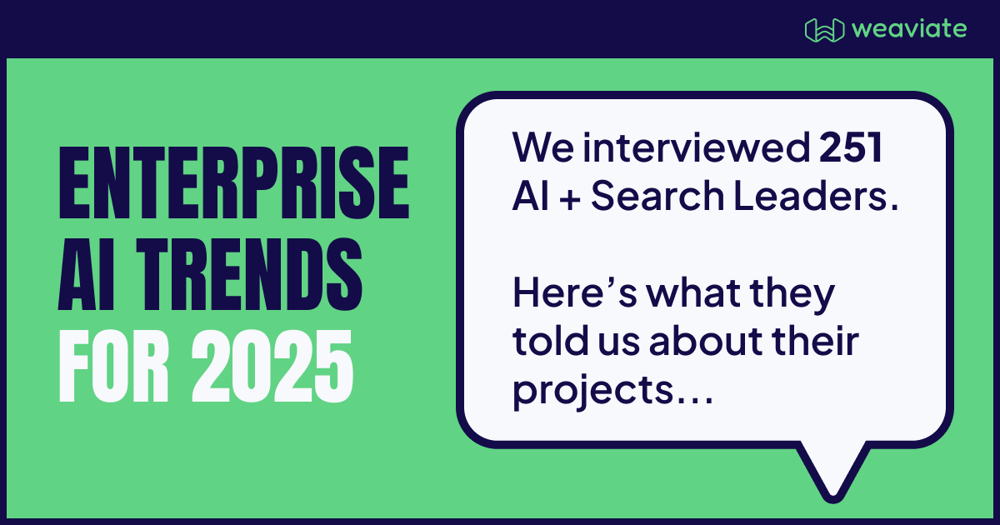
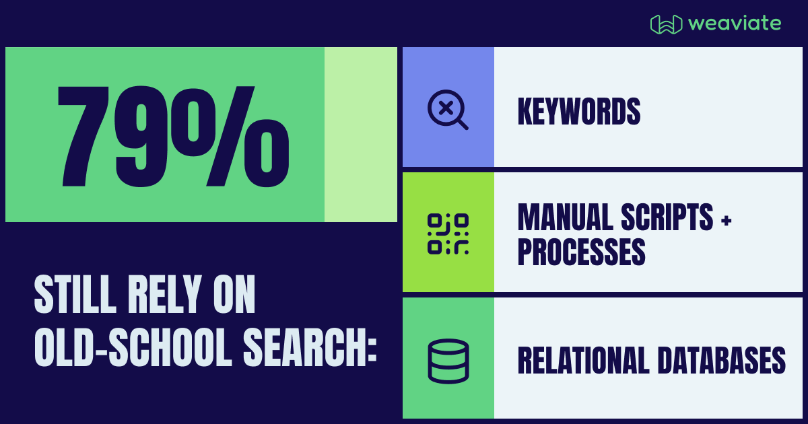
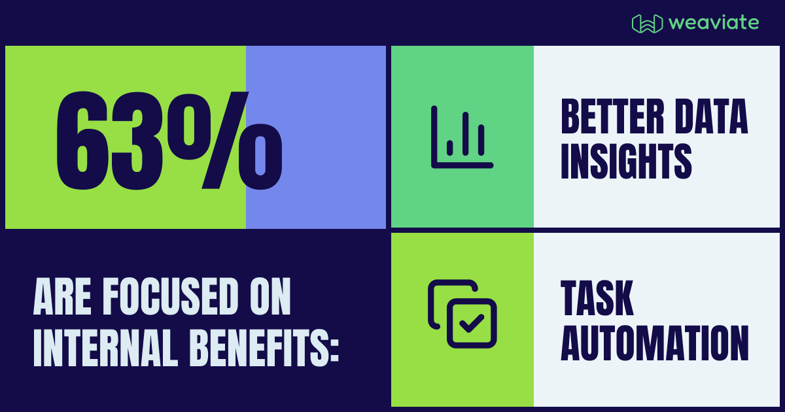
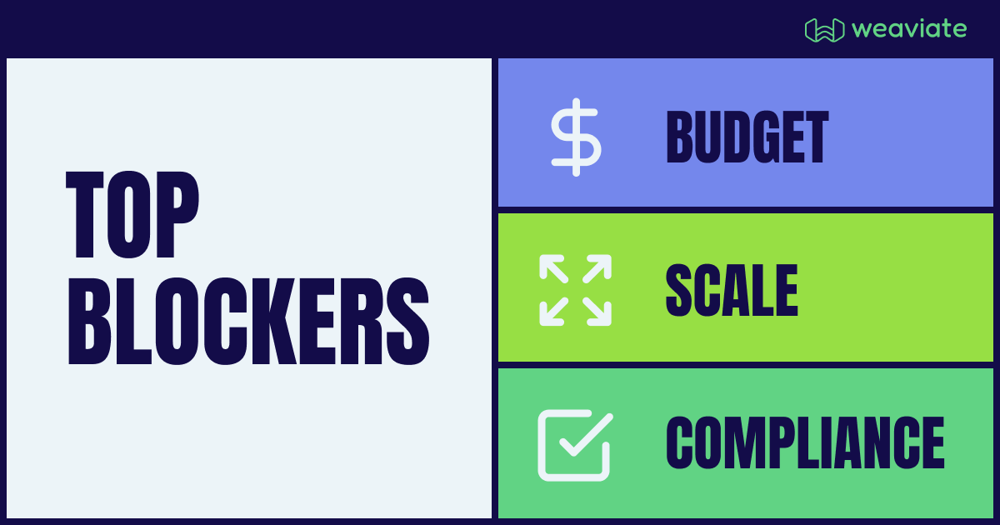

Weaviate recently conducted a survey of 250+ technology leaders at enterprises with 1000+ employees. We saw a common pattern: while AI adoption is accelerating, organizations are taking a thoughtful, strategic approach to implementation rather than rushing to adopt every new advancement.

Let’s explore some of our findings and what it means for your business.

## Traditional Search Still Dominates

Despite the AI hype cycle, 79% of organizations continue to rely on traditional search methods. This reflects a pragmatic approach to technology adoption, driven by several key factors:

- The rapidly evolving AI landscape makes strategic decision making even more complex.
- Organizations, especially those that are building AI applications for the first time, are carefully evaluating ROI potential before significant investments.
- Many enterprises face skill gaps in AI implementation.

This measured pace of adoption is an opportunity for organizations to build sustainable AI strategies. We’ve noticed that organizations who have successfully implemented AI in production often prioritize giving their engineering teams access to developer-first tools and [online communities](https://weaviate.slack.com/).

## Strategic Focus on Internal Implementation

Our research shows that 63% of organizations are prioritizing internal AI use cases before developing customer-facing applications. This data aligns with what we hear across conversations with our open source and enterprise users. Advantages to this approach include:

- Providing a controlled environment for testing and refinement
- Allowing teams to build expertise and establish best practices
- Creating opportunities to demonstrate ROI through internal efficiency gains

This internal-first strategy helps organizations build confidence and capabilities before extending AI implementations to customer-facing applications.

## Key Implementation Challenges

Organizations identified three primary roadblocks in their AI adoption journey:

### 1. Budget and Resource Constraints

While AI investments can lead to significant returns, teams must learn to balance costs with expected benefits. We’ve found that AI leaders who evaluate their projects to ensure organizational alignment on business use cases, resource allocation, and strategic timing tend to move through these challenges more easily.

### 2. Performance and Scaling Challenges

As organizations transition from proof-of-concept to production, delivering consistent performance at scale becomes crucial. This requires careful architectural planning and ongoing optimization. Teams who aren’t seasoned AI experts can benefit from the partnership of a vendor that can guide them in [scaling best practices](https://weaviate.io/ebooks/choosing-the-right-database-for-ai) to avoid unnecessary stumbles in their AI journey.

### 3. Compliance and Security Requirements

Enterprises must navigate complex regulatory landscapes while ensuring robust security measures as they progress in AI adoption. We’ve found that organizations who involve compliance and security teams early on in their AI vendor evaluation tend to expedite this part of the procurement process.

## The Path Forward

As enterprise AI adoption matures, a few key trends are emerging. Organizations are moving beyond the proof-of-concept phase — there’s a growing emphasis on production-ready infrastructure that can scale reliably. We’re also seeing an expansion into more sophisticated use cases as more advanced models become available, including wider adoption of [multimodal search](/blog/multimodal-rag).

A notable shift is also occurring in _who_ builds AI applications. Traditionally non-technical domains, like law or eCommerce, are now requiring AI capabilities. We’re seeing an increasing demand for more accessible development tools and frameworks, enabling companies across industries to build AI applications without requiring engineers to have deep machine learning expertise. Still, it’s still difficult to find talent with practical experience building these new types of AI applications.

It’s also important to recognize that AI is becoming the default expectation for tomorrow's customers. Organizations that take a thoughtful approach to AI implementation are positioning themselves for sustainable success in an AI-native future.

The key to successful adoption isn’t in racing to implement every new feature, but in efficiently building a foundation that aligns with organizational capabilities and objectives. Focusing on sustainable implementation and clear value creation is proving to be the winning strategy for enterprise AI adoption.

👉Want to see our entire report? [Download our 2025 Enterprise AI Trend report here](https://events.weaviate.io/2025-enterprise-ai-trends).

import WhatsNext from "/_includes/what-next.mdx";

<WhatsNext />
