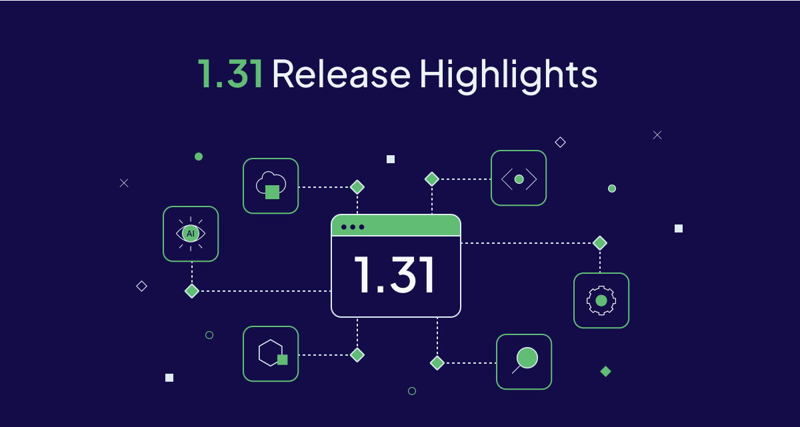

import ThemedImage from '@theme/ThemedImage';

Weaviate `v1.31` is now available with some really exciting new features as always. It introduces MUVERA encoding for multi-vector embeddings, new BM25 operators for more customizable keyword searching, the ability to add new vectors to existing collections, just to name a few.

This release also adds support for a bunch of new models (`model2vec`, VoyageAI's v3.5 models, Cohere v3.5 reranker & V4 embed models), and a HUGE list of performance improvements. (Honestly, take a look at the [full release notes](https://github.com/weaviate/weaviate/releases/tag/v1.31.0) for the list of changes, and give our engineering team a high five for all the hard work they put in!)

Here are the release ⭐️*highlights*⭐️!



- [MUVERA for multi-vector embeddings](#muvera-for-multi-vector-embeddings)
- [New BM25 keyword search operators](#new-bm25-keyword-search-operators)
- [Add new vectors to existing collections](#add-new-vectors-to-existing-collections)
- [HNSW snapshotting](#hnsw-snapshotting)
- [More model integrations](#more-model-integrations)
- [A HUGE list of performance improvements](#a-huge-list-of-performance-improvements)
- [Community contributions](#community-contributions)

## MUVERA for multi-vector embeddings

ColBERT or ColPali-like [multi-vector embeddings](https://docs.weaviate.io/weaviate/tutorials/multi-vector-embeddings) went generally available in Weaviate `v1.30`. As a reminder, here is an illustration showing the difference between single-vector and multi-vector embeddings.

import MVEmbeddingVizLight from './img/single_multi_vector_comparison_light.png';
import MVEmbeddingVizDark from './img/single_multi_vector_comparison_dark.png';

<ThemedImage
  alt="Single vs Multi-vector embedding comparison visualization"
  sources={{
    light: MVEmbeddingVizLight,
    dark: MVEmbeddingVizDark,
  }}
  width="600"
/>

Multi-vector embeddings enable more precise searching through "late interaction", but they have a drawback meaning that they can be much larger than single-vector embeddings.

This is where MUVERA comes in. It flattens variable-length multi-vector embeddings into fixed-length single-vector embeddings. In a majority of cases, this will reduce the size of the embeddings - more so for larger embeddings such as those from long text sources (many tokens) or images (many patches).

import MuveraHighlevelLight from './img/muvera_highlevel_light.png';
import MuveraHighlevelDark from './img/muvera_highlevel_dark.png';

<ThemedImage
  alt="MUVERA - a high-level overview"
  sources={{
    light: MuveraHighlevelLight,
    dark: MuveraHighlevelDark,
  }}
  width="600"
/>

There are additional benefits to using MUVERA, such as the general speed-up at import time given that only one vector needs to be inserted into the database (and the vector index). The trade-off is that the simplified vector may reduce the quality of the search.

You can mitigate some of this by changing your vector index settings, such as to set higher `ef` values.

We'll get into more details on this in a future blog post, coming within the next week or so.

:::info Related resources
- [Collection configuration with multi-vector embeddings](https://docs.weaviate.io/weaviate/manage-data/collections#define-multi-vector-embeddings-eg-colbert-colpali)
- [How-to Configure: Vector Compression - Multi-vector embeddings](https://docs.weaviate.io/weaviate/configuration/compression/multi-vectors)
- [Multi-vector embeddings tutorial](https://docs.weaviate.io/weaviate/tutorials/multi-vector-embeddings)
:::

## New BM25 keyword search operators

Keyword search is a key (sorry, couldn't resist) part of Weaviate's search capabilities. A keyword search will match documents that contain the exact terms (i.e. tokens) in the query, ranked by a BM25 algorithm score that captures the relevance of the match.

The default BM25 algorithm includes documents that contains at least one of the terms in the query. This is a good default for most use cases, but it may not be the best for all use cases.

For example, if you are searching for a specific product (e.g. "noise cancelling microphone"), you may want to only include documents that contain all the terms in the query. Or, if you are searching for technical literature (e.g. "vector embedding quantization technique"), you may want to include documents that contain at least some (e.g. 3) of the terms contained in the query.

Previously, you could sort of do this by combining a BM25 query with a filter. But now, you can use the new `And` or `Or` operators to create more complex queries.

import BM25OperatorsLight from './img/bm25_operators_light.png';
import BM25OperatorsDark from './img/bm25_operators_dark.png';

<ThemedImage
  alt="BM25 operators"
  sources={{
    light: BM25OperatorsLight,
    dark: BM25OperatorsDark,
  }}
/>

### Examples

For example, the following query will ONLY match documents that contain all the terms `("australian", "mammal", "cute")` in the query, ranked by BM25 score:

```python
from weaviate.classes.query import BM25Operator

jeopardy = client.collections.get("JeopardyQuestion")
response = jeopardy.query.bm25(
    query="Australian mammal cute",
    operator=BM25Operator.and_(),
    limit=3,
)

for o in response.objects:
    print(o.properties)
  ```

While this one will match documents that contain at least two of the terms `("australian", "mammal", "cute")` in the query, ranked by BM25 score:

```python
from weaviate.classes.query import BM25Operator

jeopardy = client.collections.get("JeopardyQuestion")
response = jeopardy.query.bm25(
    query="Australian mammal cute",
    operator=BM25Operator.or_(minimum_match=2),
    limit=3,
)

for o in response.objects:
    print(o.properties)
```

This is a really powerful feature that allows you to customize your keyword search to your use case. Along with our recent indexing performance improvements (see [BlockMax WAND blog](/blog/blockmax-wand/)), Weaviate's keyword search capabilities keep getting better and better.

In case you are wondering - yes, this is available with Weaviate's [hybrid search](https://docs.weaviate.io/weaviate/concepts/search/hybrid-search) as well. 😉 So you can granularly control the keyword search part of your hybrid search even more.

:::info Related resources
- [How-to: Keyword search: Operators](https://docs.weaviate.io/weaviate/search/bm25#search-operators)
- [How-to: Hybrid search: Keyword search operators](https://docs.weaviate.io/weaviate/search/hybrid#keyword-search-operators)
- [Concepts: Keyword search](https://docs.weaviate.io/weaviate/concepts/search/keyword-search#keyword-search-operators)
:::

## Add new vectors to existing collections

Vectors are, obviously, the core of Weaviate's search capabilities. They are the "fingerprint" of the data that you are storing in Weaviate.

Each object can have multiple vector representations in Weaviate. So a single object, say `Movie`, can have a vector for its title and one for its description.

While you can plan for these vectors at collection creation time, sometimes your needs change. And that's where this new feature comes in.

From `v1.31`, you can add new vectors to an existing collection. This is particularly useful if you find that you want to do things like:

- Use a different embedding model for a collection (e.g. multi-vector embeddings with MUVERA 😉)
- Generate vectors from different parts of the data
- Add a new modality to an existing collection (e.g. add a vector for the poster image)

:::info Related resources
- [How-to: Manage collections: Add new vectorizer](https://docs.weaviate.io/weaviate/manage-data/collections#add-new-named-vectors)
:::

## HNSW snapshotting

HNSW is Weaviate's default vector index type, as it is efficient and scalable as the size of your collection grows.

You already know that Weaviate includes a ton of great optimizations for HNSW, such as quantizations for in-memory index size, and async indexing for import efficiency.

Now, `v1.31` introduces HNSW snapshotting. The `tl;dr` is that Weaviate can now create *snapshots* of your HNSW index, instead of having to re-build the index from its [write-ahead log (WAL)](https://docs.weaviate.io/weaviate/concepts/storage#write-ahead-log).

Just how much of a difference can this make? Well, it depends on the size of your index of course - but: we've seen around a 10-15x speedup in start-up time for large HNSW indexes.

**For a 10 million object index, we've seen it go from 70+ seconds to 5 seconds!**

This is enabled by default, so you don't need to do anything to get the benefits. If you want to customize the snapshotting behavior, you can do so as well.

Try it out and watch your instance go 🚀🏎️ .

:::info Related resources
- [Concepts: Storage: HNSW snapshots](https://docs.weaviate.io/weaviate/concepts/storage#hnsw-snapshots)
- [How-to: Configure: HNSW snapshots](https://docs.weaviate.io/weaviate/configuration/hnsw-snapshots)
:::

## More model integrations

Our list of model integrations keep growing. In `v1.31`, we add support for:

- `Cohere` - Added support for Cohere's v3.5 reranker model and v4 Embed model. The v4 Embed model is multimodal, too, meaning they can be used for both text and image embeddings.
- `VoyageAI` - Added new set of models from VoyageAI, including `voyage-3.5`, `voyage-3.5-lite` and `voyage-3-large` models.
- `model2vec` - A state of the art *static* embedding model, meaning it does not use attention mechanisms, making it much faster to run. Use this model where you may have used something like our `text2vec-contextionary` model.

:::info Related resources
- [Model integrations](https://docs.weaviate.io/weaviate/model-providers/)
:::

## A HUGE list of performance improvements

In these blogs, we tend to talk about the visible new features and improvements - for good reason. But there is a lot of work that you don't necessarily see, all of which adds up to huge improvements in performance over time.

Just as an example, here is a selection of some of the performance improvements that were made in `v1.31`.

import PerformanceImprovements from './img/131_improvements_list.png';

<Figure>
  
    <figcaption><small>Just a selection of items from the <a href="/blog/blockmax-wand/">Weaviate 1.31 release notes</a>. (Yes, we realise the font is very small - but we just wanted to convey how many improvements there are!)<br/><br/></small></figcaption>
</Figure>

Ultimately, these all add up to a much faster and more efficient Weaviate instance over time.

Which - by the way - is why we always recommend you run the latest version of Weaviate, if possible 😉.

So here's a shout-out to our amazing engineering team for all the hard work they put in to make this release (and every other release) possible. 🚀🚀🚀

:::info Related resources
- [Weaviate 1.31: GitHub release notes](https://github.com/weaviate/weaviate/releases/tag/v1.31.0)
:::

## Community contributions

Weaviate is an open-source project. And while of course, much of the work is done by our amazing engineering team, we are always excited to see contributions from the community.

For this release, we are super excited to shout-out the following contributors for their contributions to Weaviate. 🎉🎉🎉

- [@alingse](https://github.com/alingse) contributed [#7682](https://github.com/weaviate/weaviate/pull/7682)
- [@crewone](https://github.com/crewone) contributed [#7641](https://github.com/weaviate/weaviate/pull/7641)
- [@cryo-zd](https://github.com/cryo-zd) contributed [#7615](https://github.com/weaviate/weaviate/pull/7615)
- [@mohamedawnallah](https://github.com/mohamedawnallah) contributed [#7779](https://github.com/weaviate/weaviate/pull/7779)

If you are interested in contributing to Weaviate, please check out our [contribution guide](https://docs.weaviate.io/contributor-guide/), and the list of open issues on [GitHub](https://github.com/weaviate/weaviate/issues). Filtering for the `good-first-issue` label is a great way to get started.

:::info Related resources
- [Contribution guide](https://docs.weaviate.io/weaviate/more-resources/contributing)
:::

## Summary

Ready to Get Started?

Enjoy the new features and improvements in Weaviate `1.31`. The release is available open-source as always [on GitHub](https://github.com/weaviate/weaviate/releases/tag/v1.31.0), and will be available for new Sandboxes on [Weaviate Cloud](https://console.weaviate.cloud/) very shortly.

For those of you upgrading a self-hosted version, please check the [migration guide](https://docs.weaviate.io/weaviate/more-resources/migration#general-upgrade-instructions) for detailed instructions.

It will be available for Serverless clusters on Weaviate Cloud soon as well.

Thanks for reading, see you next time 👋!
