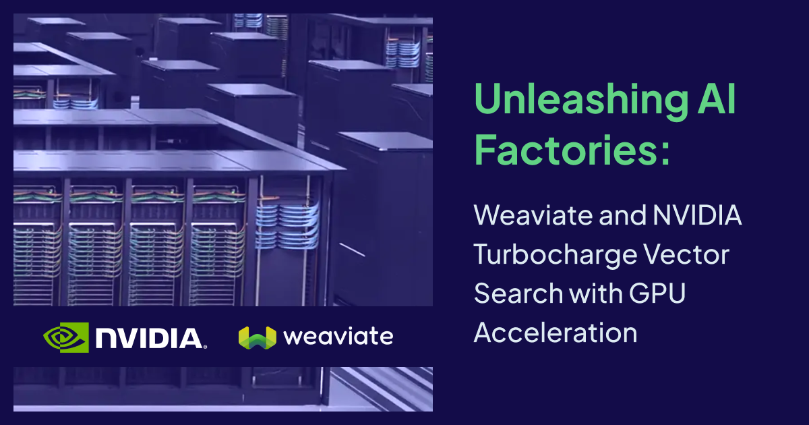
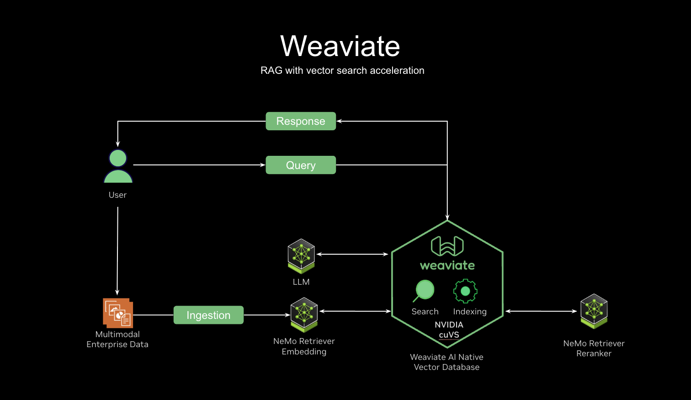

The AI landscape is evolving at an unprecedented pace. From intelligent search to retrieval augmented generation (RAG) and autonomous AI agents, the demands on underlying infrastructure are rapidly growing. NVIDIA is pioneering the development of [AI Factories](https://blogs.nvidia.com/blog/ai-factory/), specialized data centers designed to manufacture intelligence at scale.

At Weaviate, we are focused on innovation and empowering developers to build and reliably deploy AI-native applications. In March at GTC, [we presented our early work with NVIDIA and the integration of the NVIDIA cuVS library](https://www.nvidia.com/gtc/session-catalog/?search=Weaviate&tab.catalogallsessionstab=16566177511100015Kus#/session/1725741930792001U8IR) to enhance vector search performance. Today, we're excited to share another exciting news with support for [NVIDIA B200](https://www.nvidia.com/en-us/data-center/dgx-b200/) to build on-premises Agentic applications. 

## Weaviate: The AI-Native Vector Database

Weaviate is an open-source, AI-native vector database. Unlike traditional databases that might bolt on AI features, Weaviate is designed from the ground up for the Agentic era. 

It supports [vector search](https://weaviate.io/developers/weaviate/search/similarity) for semantic retrieval, [hybrid search](https://weaviate.io/developers/weaviate/search/hybrid) that combines keyword and vector search, [reranking](https://weaviate.io/developers/weaviate/search/rerank) to improve search relevance, and [generative search](https://weaviate.io/developers/weaviate/search/generative) to connect your private data to language models. These features power applications like product search, RAG, and customer chatbots. Organizations across various industries use Weaviate to build production ready AI solutions. 

## The Growing Need for Speed: Addressing Performance Bottlenecks

As AI applications scale from prototypes to production systems handling billions of objects, performance becomes critical. While [Weaviate's native HNSW](https://weaviate.io/developers/weaviate/concepts/vector-index#hierarchical-navigable-small-world-hnsw-index) (Hierarchical Navigable Small Worlds) algorithm performs well on CPUs, a large-scale index presents significant challenges:

* Datasets in the billion-object range can take hours or even days to build, hindering rapid iteration.  
* Long re-indexing times prevent developers from quickly updating their systems with the latest, most performant embedding models.  
* The extended feedback cycles stifle innovation and agility in a fast-moving AI landscape.

This is where the **power of GPUs becomes indispensable**.

## NVIDIA cuVS: GPU-Accelerated Vector Search

[CAGRA](https://arxiv.org/abs/2308.15136) is a GPU-native vector search algorithm designed from the ground up for the parallel processing capabilities of GPUs. At GTC we talked about the impact of these optimizations and our initial benchmarks revealed significant improvements:

* 1 Million Vectors: We saw a 4.7X faster index build time and a 2.6X faster end-to-end query time compared to HNSW on a 16-core CPU.  
* 8.7 Million Vectors (Large Dataset): The gains were even more pronounced, with 5.4X faster index builds and 3.5X faster end-to-end query times.

These numbers aren't just theoretical; they translate directly into potentially reduced operational costs, faster model updates, and dramatically accelerate development lifecycle.

### The Best of Both Worlds: Hybrid GPU-Build, CPU-Serve

One of the most innovative aspects of this collaboration is the introduction of a new feature in cuVS: the ability to convert a CAGRA-built index to an HNSW index. This enables a powerful hybrid architecture:

* GPU for Speed: Leverage the GPU's immense parallel processing power for ultra-fast, high-volume index builds.  
* CPU for Efficiency: Once built, convert the index to HNSW and serve queries on cost-effective CPUs, especially for scenarios not requiring extreme query throughput.  
* No GPU Dependency: Crucially, after conversion, the served HNSW index has no dependency on GPUs or cuVS, offering maximum flexibility and cost control.

This "right tool for the right job" approach allows users to optimize for both build speed and serving cost, a critical consideration for production-grade AI systems.

To further enhance performance, Weaviate now runs on the [NVIDIA DGX B200](https://www.nvidia.com/en-us/data-center/dgx-b200/) platform, purpose-built for AI workloads. By combining the hybrid indexing capabilities of cuVS with the advanced hardware of the DGX B200, Weaviate offers a scalable and efficient solution for building AI-native applications, and **we are seeing more than 3x improvement to the above numbers**. It’s truly an awe inspiring piece of infrastructure for AI Factories of the future. 

### Beyond Performance: A Holistic AI-Native Experience

Our partnership with NVIDIA is about more than just speed improvements. We've focused on delivering an end-to-end, AI-native developer experience:

* We've contributed directly to cuVS, implementing pooled memory (pre-allocating GPU memory for frequent small allocations) and pinned memory (ensuring host memory isn't paged out to disk for faster DMA transfers). These granular optimizations significantly reduce overhead and improve query latency.  
* Weaviate intelligently batches incoming queries to fully exploit the GPU's high parallelism, particularly during peak loads, maximizing throughput without requiring manual batching from the user.  
* We're proud to be contributing Go bindings and memory optimizations back to the open-source cuVS repository, fostering a collaborative ecosystem where everyone benefits.  
* Weaviate seamlessly [integrates with NVIDIA NIM](https://weaviate.io/developers/weaviate/model-providers/nvidia) to support various models from the NVIDIA Model Garden and [NeMo Retriever](https://developer.nvidia.com/nemo-retriever/?sortBy=developer_learning_library%2Fsort%2Ffeatured_in.nemo_retriever%3Adesc%2Ctitle%3Aasc&hitsPerPage=12) for embedding and re-ranking. We're also working on blueprints to easily spin up entire AI pipelines powered by Weaviate and NVIDIA AI Enterprise for on-premises, enterprise supported workloads.

## The Future is Agentic: Scaling Parallel Queries

Agentic AI enables language models to autonomously interact with vast amounts of data and systems, while reasoning through decisions and actions. These agents often employ techniques like query re-writing, where a single raw query is expanded into dozens or even hundreds of sub-queries that need to be executed in parallel. This leads to an explosion in the number of queries hitting the vector database.

Weaviate's integration with NVIDIA cuVS is perfectly positioned to handle this query amplification. By combining our AI-native architecture with GPU-accelerated indexing and query capabilities, we can support the massive parallel query loads demanded by sophisticated AI agents, enabling real-time context and decision-making at unprecedented scales.

## Get Started Today!

We invite you to experience the power of Weaviate and NVIDIA cuVS for yourself. Start with  Weaviate embedding and generative models [here](https://weaviate.io/developers/weaviate/model-providers/nvidia).

Together, Weaviate and NVIDIA are accelerating the development and deployment of production-grade, AI-native applications, empowering developers to build the future of AI.  

import WhatsNext from '/_includes/what-next.mdx'

<WhatsNext />
