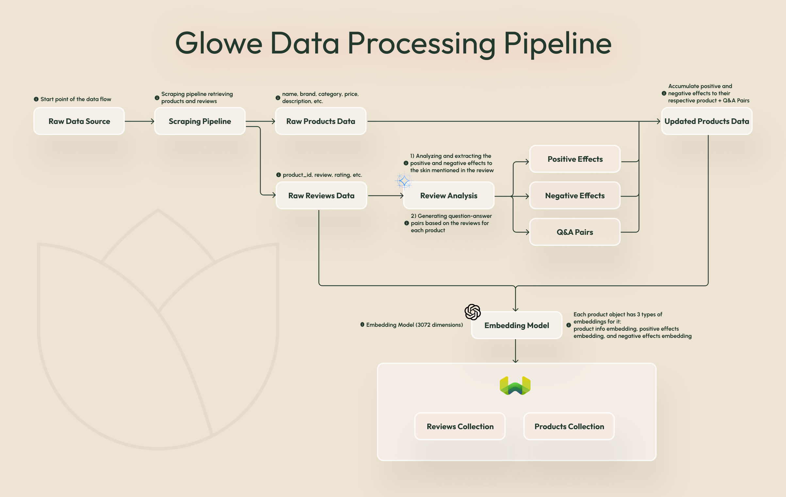
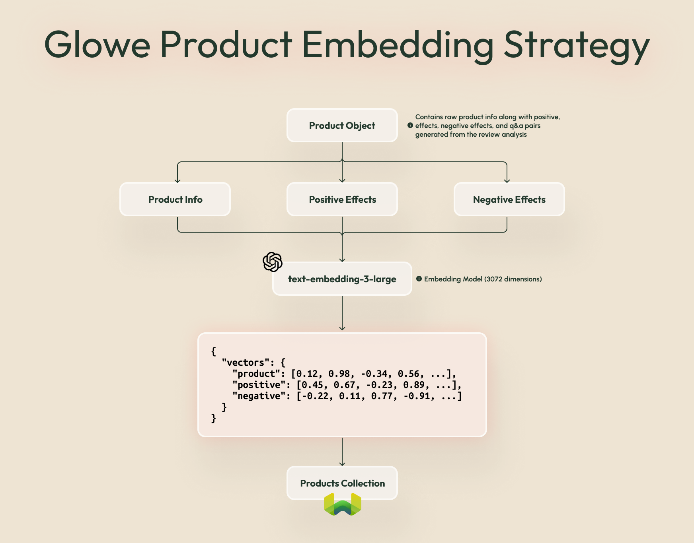
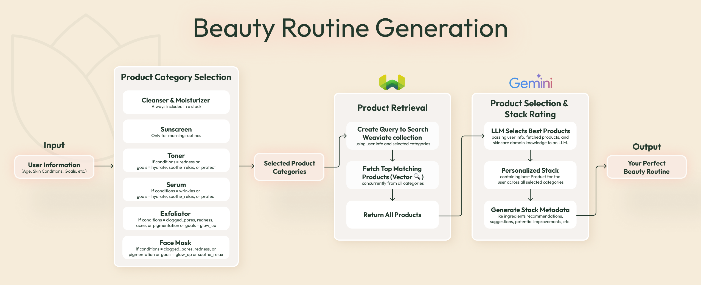
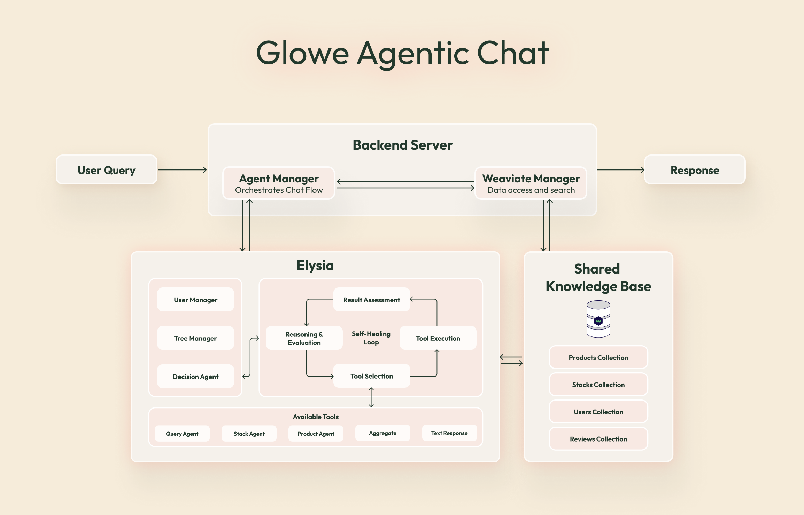

Skincare is deeply personal, and finding the right products to build an effective routine can feel overwhelming and impossible. The skincare industry generates thousands of products with millions of reviews annually, yet most recommendation systems fail to capture the nuanced relationships between ingredients, user experiences, and skincare outcomes based on *actual user data*. That's why we built **Glowe,** a Korean beauty recommendation app that demonstrates how domain knowledge agents, custom embedding strategies, and vector search can create genuinely intelligent product recommendations.

Whether you're aiming for intense hydration, a radiant glow, or targeting specific concerns like acne or redness, Glowe leverages Agentic AI to recommend effective and safe product combinations based on your skin profile. It considers positive and negative effects, ingredient compatibility, and your own personal skin goals to create your very own skincare stack. Glowe also features an agentic chat interface, allowing you to engage naturally with its domain-specific knowledge and receive personalized skincare guidance in real time.

:::info Try it out!

Glowe is available to use here: [www.glowe.app](https://www.glowe.app/)
:::

**‼️ TODO:** 
**Glowe App demo video gif (dynamic, fast-paced, screenstudio style)**

## Why Domain Knowledge Agents Matter in Skincare

At the heart of Glowe's personalized experience is a **skincare domain agent**. 

Unlike general-purpose AI that tries to cover everything, a domain agent is deeply focused on one area. In this case, that means it truly understands skincare. It uses advanced techniques like smart retrieval, tailored prompts, and expert-level instructions to offer advice that goes beyond the surface.

Why does that matter for skincare? Because real solutions require more than just popular products! They require understanding your unique skin type, goals, conditions, and how different ingredients interact. A skincare domain agent should:

- Decode what each ingredient actually does for your skin
- Spot potential product conflicts or interactions
- Interpret your skin profile with depth and accuracy
- Give advice that’s not just reasonable, but genuinely helpful, safe, and rooted in skincare science

Once logged into Glowe, you get access to an intelligent, agentic chat interface alongside your personalized skincare routine. You can ask it questions, get tailored recommendations, tweak your product lineup, or find safe alternatives, all while it remembers your skin type, concerns, and what you’re already using.

It’s like having your own skincare expert, available 24/7.

## Glowe Data & Embedding Pipeline: From Reviews to Recommendations

Most skincare apps just throw products at you without really understanding what works together. We wanted to do something different with Glowe, so we built a system that actually knows how skincare routines work in the real world.

For this, we started with a healthy dataset of around 1,440 curated Korean skincare products and over 94,500 user reviews. But unlike most recommendation systems that treat products and reviews as separate, isolated pieces, we looked at the bigger picture of how products would work together in real user routines. Because let’s be honest: your morning routine can’t also be your evening routine, and some ingredients just don’t get along. 

So, we ran every review through an LLM (Gemma 3 12B) to pull out the real effects, good and bad, that people experienced based on the review's text. 
The result? Enhanced reviews that show what works (and what doesn’t):

```json
{
  "text": "Helped calm my redness and hydrate my skin, though I broke out a little at first.",
  "positive_effects": ["Reduced redness", "Hydration"],
  "negative_effects": ["Initial breakouts"]
}
```

This way, we're not just guessing or using marketing-tailored descriptions; we actually know what each product actually does based on real experiences.



### The Embedding Challenge

A common approach in product recommendation is to embed the entire product object (name, brand, description, ingredients) into a single vector. However, for skincare, this can be problematic. Generic fields might dominate the vector space, diluting the importance of specific skincare effects like "hydration," "glowing skin," or "acne reduction." As a result, important effects could get buried, and we'd lose the ability to prioritize products based on how *strongly* they're associated with specific outcomes, which is the basis for building effective skincare routines.

### Solution: A Dual Embedding Strategy

We separate the concept of a product into two distinct embeddings:

1. **Product Embedding:**
    - Captures descriptive metadata: name, brand, category, ingredients, etc.
    - **Use Case:** Primarily for general browsing and product search, where users might look for a specific brand or product type.
2. **Effect Embedding (Positive and Negative):**
    - Captures the *skincare benefits* of a product, primarily extracted and weighted from actual user reviews.
    - **Use Case:** Matching products to user skin profiles and building personalized skincare stacks (which helps in effective routine generation).

### Effect Embedding

This is where it gets interesting. When building a user's curated skincare stack, we need to understand *how strongly* a product is linked to certain effects. To reflect that, we use a **TF-IDF-weighted embedding** based on review mentions. 

As discussed already, we’ve analyzed each review and extracted the reported skin effects in the LLM processing step. We then clustered them to 250 total effects to merge aliases and semantically similar wording (”hydrated skin”, “skin hydration”, “hydration” → “hydration” )

In short, we don't just care that a product helps with "hydration", we want to know **HOW MUCH** it helps compared to everything else.

#### **What's TF-IDF?**

Think of it like this: if everyone's talking about something (like hydration), it's probably not that special. But if only a few products are great at something rare (like reducing redness), that's gold.

TF-IDF gives us two numbers:

- **TF (Term Frequency):** How often an effect is mentioned for this product
- **IDF (Inverse Document Frequency):** How rare this effect is across all products



Now, let’s explore the effect embedding process step by step:

#### **Step 1: Define Effect Embeddings**

Each skincare effect (like `hydration`, `soothing`, `redness`) has a static vector:

$$
\begin{aligned}
V_{\text{hydration}} &= (0.2, 0.1, 0.7) \\
V_{\text{soothing}} &= (0.9, 0.5, 0.3) \\
V_{\text{redness}} &= (0.3, 0.9, 0.8)
\end{aligned}
$$


---

#### **Step 2: Calculate IDF (Inverse Document Frequency)**

Rarer effects carry more weight.

- Hydration: Appears in 600 of 1000 products → IDF ≈ 0.51  (here $df_{hydration}=600,N=1000$)
- Similarly, Soothing: 300 → IDF ≈ 1.20 and Redness: 75 → IDF ≈ 2.60.

$$
IDF_i = log(\frac {N} {df_i})
$$

---

#### **Step 3: Calculate TF (Term Frequency)**

Count how often each effect appears in *this* product’s reviews:

- Hydration (12 mentions): TF ≈ 2.56  ( $c_{hydration}=12$)
- Similarly, Soothing (5): TF ≈ 1.79 and Redness (9): TF ≈ 2.30

$$
TF_i = {log({c_i}+1)}
$$

---

#### **Step 4: Combine TF × IDF into Effect Weights**

We give more weight to rare but strongly mentioned effects:

$$
w_i = \frac {TF_i \cdot IDF_i} {\sum_{j}[TF_j \cdot IDF_j]}
$$

$$
w_{hydration} ≈0.14 ; w_{soothing} ≈0.23 ; w_{redness}≈0.63
$$

$$
w_{hydration} + w_{soothing} + w_{redness} = 1
$$

---

#### **Step 5: Build Final Effect Vector**

We blend the static vectors using those weights:

$$
v_{effect} = v_{hydration} \cdot w_{hydration} + v_{soothing} \cdot w_{soothing} + v_{redness} \cdot w_{redness}
$$

---

#### **Step 6: (Optional) Add Description Diversity**

To avoid duplicates, we lightly mix in the product’s description vector:

$$
vector = v_{effect} + γD
$$

Where $D$ is the description embedding and $γD$ is a small tuning weight.

---

### The Payoff

The dual embedding strategy allows us to rank products by the *strength* of their relevant effects. This ensures rare but meaningful effects aren't drowned out by common ones. And, we get a rich, weighted `effect_vector` that reflects **how a product actually performs, not just what it says on the label.** Perfect for building effective, personalized skincare routines!

## Weaviate & Gemini: Powering Beauty Routine Generation

In this part, we’ll go through how we turn a few questions about your skin into fully personalized skincare routines. Short answer? It all comes down to two powerful tools working behind the scenes: Weaviate and Gemini 2.5 Flash language model. 
Now, let’s look at the process step by step in detail:

### Collecting User Information

The journey begins with a short, targeted questionnaire designed to understand your skin’s current condition, goals, age, and any sensitivities. From this, we build a structured `user_information` dictionary like:


```python
user_information = {
    "goals": {
        "firmer_skin": False,
        "hydrate": False,
        "glow_up": False,
        "repair_renew": False,
        "soothe_relax": False,
        "protect": False
    },
    "conditions": {
        "acne": False,
        "clogged_pores": False,
        "redness": True,
        "wrinkles": True,
        "pigmentation": True,
        "rough_texture": False
    },
    "skin_type": 67,  # if <33: 'Dry'; elif >66: 'Oily'; else: 'Normal'
    "sensitive_skin": False,
    "age": 30,
    "additional_concerns": "My skin doesn't work well with retinol"
}
```

This data is the foundation for everything that follows.

### Product Category Selection

Every routine starts with a cleanser and moisturizer as a base. If it’s a morning routine, we also add sunscreen. 
Then, based on your specific skin conditions and goals, we layer in other categories like toners, serums, exfoliators, or face masks. For example, if you’re dealing with pigmentation and redness, we will include a face mask and a toner in your routine.

### Product Retrieval with Weaviate

Once we know which types of products you need, it’s time to find the actual products.

That’s where **Weaviate** comes in! If you recall from the previous section on **Effect Embedding**, each product in our collection has an `effect_vector`, which basically is a fingerprint of what it’s good at (hydrating, soothing, exfoliating, etc.). 
Weaviate uses these vectors to run a similarity search against your skin needs and goals. This is done concurrently across all selected categories, resulting in a shortlist of top-matching products for each step in your routine.

### Assembling Your Routine with Gemini 2.5 Flash

Once we have the best product options, it’s time to assemble your actual skincare stack using Gemini 2.5 Flash.

Gemini reviews your full profile and selects the single best product from each category, making sure they work well together, respect any sensitivities (like avoiding retinol), and avoid ingredient conflicts (e.g., layering multiple strong acids or harsh exfoliants).

> **This is where smart prompting makes all the difference ✨**
> 
> 
> Just like many top AI apps use detailed system instructions to get great responses from LLMs, we use rich, skincare-specific (domain knowledge) to guide Gemini’s decisions.
> 

Gemini also generates metadata like ingredient notes, suggestions, and potential improvements, so that you get to know your routine better and why it’s right for you.



By the end of this process, you’ll have a complete morning and evening skincare routine, personalized down to the ingredient level, and built to work with your skin, not against it!

## The Glowe Agentic Chat: Powered by Elysia

We wanted Glowe to do more than just routine generation and suggestions; we envisioned it as a smart companion that can talk to you in natural, conversational language.

That’s why we built an awesome agentic chat assistant right into Glowe, powered by **Elysia!**

### **What is Elysia?**

Elysia is an open-source agentic platform (soon to be released) from Weaviate for calling custom tools via a decision agent LLM. It has inbuilt functionality for searching and retrieving data in Weaviate. 

Think of it as the brain behind Glowe’s agentic chat. Unlike other agent-based packages, Elysia is pre-configured to run a wide range of tools and has a lot of capabilities straight away and is specially designed for complex, context-aware interactions. Key features include:

- **Decision-Tree Logic:** Elysia operates on a decision-tree structure, allowing for guided conversations and task execution based on user input and context. This means it can follow different paths in the conversation based on what you say, making sure it stays on track and understands your needs.
- **Context Awareness & User Management:** Elysia is great at keeping track of things. It has a "User Manager” that keeps track of all the users and their conversation histories, along with the functionality to save and retrieve chats.
- **Custom Tool Creation & Integration:** One of Elysia's best features is its **flexibility**. It allows us to easily define and integrate custom tools, which the decision agent can then effortlessly use. In our setup, we’ve added a bunch of custom tools targeting specific functionalities, like the **Stack Agent** and **Product Agent**.
- **Self-Healing/Correction Loops:** This feature, part of its core decision-making cycle, involves result assessment for every tool execution. The aim is to enable the decision agent to identify potential misunderstandings or errors and attempt to recover, leading to more robust chat interactions.

We are excited to announce that Elysia will soon be **released as an open-source project**. Our goal is to empower developers to build their own sophisticated, domain-specific intelligent agents, similar to what powers Glowe.

:::info

You can try out the public preview of the Elysia app here: [elysia.weaviate.io](https://elysia.weaviate.io) 
:::




### Weaviate Query Agent: A Specialized Tool within Elysia

One of Elysia's most useful tools is the **Weaviate Query Agent**. This agent is activated when Glowe needs to find specific products from our extensive Weaviate Products collection. 

:::info

The Weaviate Query Agent is a pre-built agentic service designed to answer natural language queries based on the data stored in Weaviate Cloud. The user simply provides a prompt/question in natural language, and the Query Agent takes care of all intervening steps to provide an answer. [Learn more](/developers/agents/query).
::: 

For example, if you ask something like, "Find me a hydrating serum for sensitive skin," the Agent Manager hands your request to Elysia, which then will decide to call on the Weaviate Query Agent. Here’s how it works:

- **Natural Language to Structured Query:** You can ask complex, multi-stage questions in natural language, and the query agent interprets your intent and translates it into precise searches (with the necessary filters) or aggregations across your Weaviate collections, removing the need for custom query pipelines.
- **Agentic Retrieval:** The query agent generates and executes the appropriate search or aggregation queries on the selected Weaviate collections. This uses Weaviate’s vector search, filtering, and aggregation capabilities to retrieve the most relevant data objects.
- **Synthesize and Return the Answer:** The query agent collects the results, synthesizes a final answer, and returns a detailed response. This includes the answer itself, information about which collections and filters were used, and the sources of the data, making the process transparent and interpretable.

The final products are then displayed to the user through the Glowe chat interface. 
To put simply, think of Elysia as the conductor or the main tree, and the Weaviate Query Agent as a specialized musician or a leaf node, handling specific data retrieval tasks with high precision.

**‼️ TODO:
Add a screenshot of products being displayed in the chat interface**

## Conclusion: The Future is Specialized and Agentic

We built Glowe to demystify skincare and empower users to build effective, personalized routines based on sound principles and real-world user experiences. The journey involved diving deep into data processing, exploring nuanced embedding strategies, and architecting an intelligent agent capable of understanding and acting within the specific domain of Korean skincare.

This project highlights several key trends we believe will shape the future of AI applications:

- **Domain Knowledge Agents:** As LLMs become more powerful, their true value in specialized applications will be unlocked by fine-tuning them or integrating them into systems that possess deep domain-specific knowledge and rules. Generic intelligence is useful, but specialized intelligence drives targeted solutions.
- **The Power of Query Agents:** Interfacing LLMs with structured and unstructured data sources via "query agents" (like our Weaviate Query Agent) is crucial. This allows LLMs to ground their responses in factual data, retrieve specific information, and act as more effective assistants.
- **Vector Databases as a Cornerstone:** For applications relying on semantic search, recommendation, or matching based on nuanced similarities, vector databases like Weaviate are becoming indispensable. They provide the infrastructure to efficiently store, index, and query the high-dimensional embeddings that capture complex relationships, building the foundation of AI applications.

Glowe is just one example of what's possible when these technologies converge. We envision a future where highly specialized, agentic systems can provide expert-level assistance in countless domains, from personal finance and legal advice to complex scientific research and, of course, helping you achieve that perfect skincare glow.

import WhatsNext from '/_includes/what-next.mdx'

<WhatsNext />
