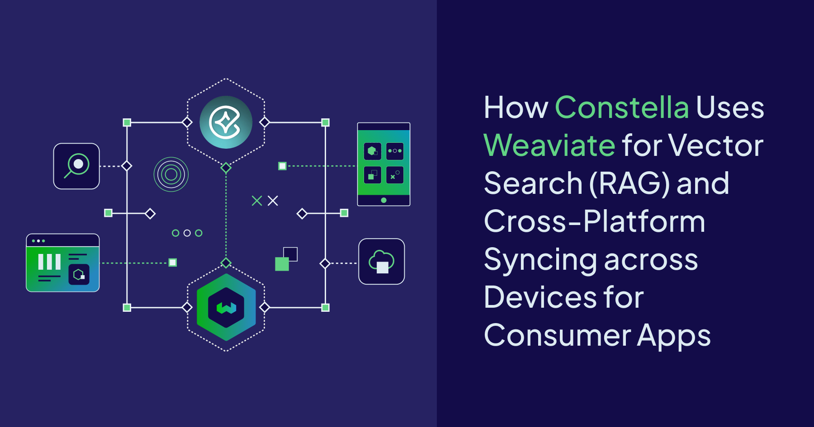
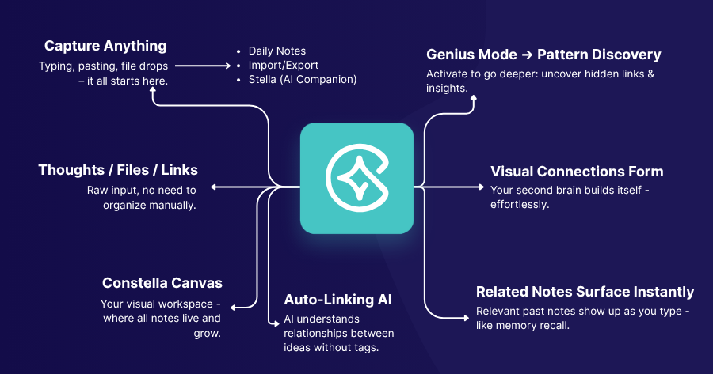
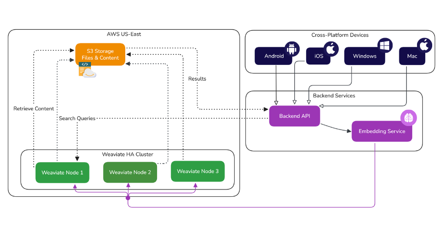
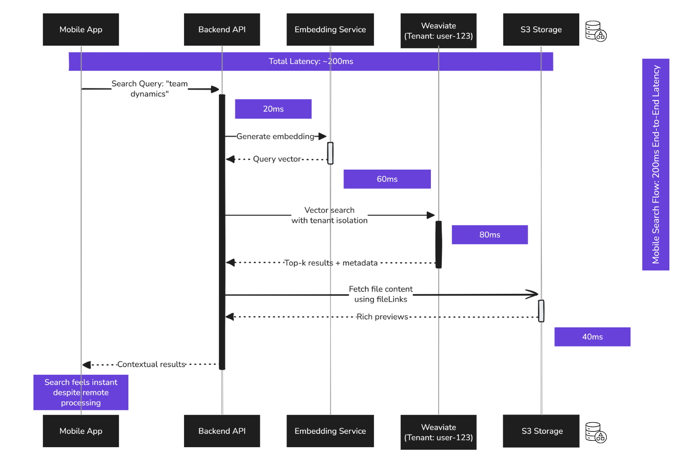

At Constella, we’re building a revolutionary new infinite AI canvas. One where personal knowledge base feels like an extension of your brain, instant, effortless and useful. That meant enabling users to instantly capture thoughts across platforms \- Mac, Windows, iOS, Android \- and retrieve them instantly when needed. But not just retrieve. Contextually recall, link, and synthesize. Think with their notes, not just store them. Vector search became a no-brainer for us and is the differentiating factor between Constella and older apps from the pre-AI era.

To do that, we needed a fast, scalable way to make vector search feel local, even when it wasn't. And to make it work across devices, users, and platforms, we had to solve syncing, multi-tenancy, and latency without sacrificing privacy or context.

Here's how we did it with Weaviate.

## The Problem We Were Solving

Constella isn’t just for taking notes - it’s built for thinking. We designed it to help you remember what matters, connect ideas over time, and actually use what you’ve captured. Instead of just collecting and storing information in folders, it gives you fast, contextual recall the moment you need it. 

Whether you're at your laptop or out on a walk with your phone, search and recall should feel local, even if the data lives in the cloud.  



We didn’t want to just search with keywords. We wanted real [semantic search](/blog/vector-search-explained) - “vector search” - that actually understands the meaning of what you wrote. RAG-style workflows where you type a thought or question, and we bring back meaningful, context-aware results: notes, PDFs, voice memos, diagrams, links - whatever you've added to your graph.

But here's the hard part: it has to feel instant. It has to work across devices - desktop, mobile, online, offline - with results that reflect your context, not just global relevance.

So we needed:

* A vector store that could scale across thousands of users (multi-tenancy).  
* Fast vector search accessible from mobile (without a huge local footprint).  
* Cross-platform syncing of notes, context, and embeddings.  
* Metadata-rich storage with access controls per user.  
* High availability and data durability.

That’s what led us to Weaviate.

## Requirements We Had to Meet

To undertake this ambitious quest, we had a stern set of requirements. Here is everything we were looking for in a vector database.

### 1. Multi-tenancy at Scale

We’re in public beta with thousands of users and growing. From day one, we needed to isolate each user’s data to avoid cross-contamination and simplify access controls.

[Weaviate supports true multi-tenancy](https://docs.weaviate.io/weaviate/manage-collections/multi-tenancy) at the collection level. Each tenant has its own namespace within a class, with full CRUD capabilities. This meant we didn’t have to spin up separate clusters or databases per user \- we just define tenants and assign data accordi

```
POST /v1/schema
{
  "class": "Note",
  "multiTenancyConfig": {
    "enabled": true
  },
  "properties": [
    {"name": "content", "dataType": ["text"]},
    {"name": "title", "dataType": ["text"]},
    {"name": "tags", "dataType": ["string[]"]},
    {"name": "fileLink", "dataType": ["text"]},
    {"name": "timestamp", "dataType": ["date"]}
  ]
}
```

Once this is set up, every CRUD operation is tenant-aware:

```
curl -X POST \
  -H "X-Weaviate-Tenant: user-123" \
  -H "Content-Type: application/json" \
  -d '{"title": "Note 1", "content": "AI + Mindmaps"}' \
  https://<your-cluster>/v1/objects
```

### 2. Centralized Vector Database With Metadata

Our mobile apps don’t run local vector search. Too slow. Too heavy. Instead, we send embeddings to a centralized Weaviate instance and search remotely.

Each vector object contains not just the embedding, but metadata: tags, links, timestamps, and a pointer to the actual file or note in S3.

We don’t store files in the vector database. That bloats the index and adds cost. Instead, we keep all content in S3 and link via metadata.

```
{
  "class": "Note",
  "vector": [/* custom embedding */],
  "properties": {
    "title": "Quick Capture",
    "content": "Journaling about team dynamics",
    "tags": ["team", "reflection"],
    "fileLink": "s3://bucket/user-123/note-789.md",
    "timestamp": "2025-05-30T15:03:00Z"
  }
}
```

We generate our own embeddings via a proprietary service and send those directly to Weaviate using the `vector` field.

Another limiting factor when researching other databases was the size of the metadata. Some of our users may upload large amounts of words, and storing this in a separate database would increase complexity and maintenance.

With Weaviate, there was no such limit; however, it does impact the retrieval latency performance if a large number of records with large metadata is queried.

For this reason, we store file data in S3 buckets, and for large contents of notes, we only selectively retrieve them when necessary (i.e. when doing a vector notes search, only getting the titles and then lazy loading in the contents).

### 3. Syncing and Data Flow

Notes originate across devices, but all semantic search happens on the centralized vector database. That means syncing is critical.

When a note is created or updated:

1. The device sends the raw content to our backend.  
2. We generate or update the embedding.  
3. We push the vector and metadata to Weaviate under the user's tenant.

Searches from mobile send a semantic query to Weaviate and retrieve results (plus fileLinks to pull in rich previews). This lets us keep mobile apps lightweight and fast.

## Building Cross-Platform Syncing Backend with Weaviate: Our Setup

Here is a visual representation of the architecture behind such a setup. Our frontend consists of four platforms (Android, iOS, Windows & Mac), our backend (the FastAPI server as well as the embedding service). 

We run a high-availability Weaviate cluster in US-East. We went with the [serverless HA managed cloud offering](https://docs.weaviate.io/cloud) to keep ops light.  



### Ingestion Flow

When we need to take in notes from a user, the following process is followed (as seen in the diagram):

* Our backend receives notes/files from clients  
* Content gets pre-processed (OCR, voice-to-text, etc.)  
* Embeddings are generated using our in-house model  
* We send the vector and metadata to Weaviate

If the note changes later, we patch the object in Weaviate using `PATCH /v1/objects/{id}` and update the vector.

### Read/Search Flow

Now the user has a populated database of notes. When they want to find their notes, here is the flow we follow:

* Mobile or desktop sends a semantic query.  
* Weaviate performs nearest neighbor vector search within that tenant's namespace.  
* We pull top-k results and use metadata to fetch additional context or file content from S3.

### S3 Offloading

Large PDFs, images, or audio notes aren’t stored in Weaviate. Instead, we use `fileLink` metadata that points to an S3 object.

That way, the index stays lean, search stays fast, and users still get previews from their actual files.

## Mobile Vector Search: The Real Bottleneck

While on desktop, we can do local first search, on mobile due to limited hardware (especially on older devices), we had to implement a performant cloud search.



Originally, we tried running vector search locally on mobile. It broke down fast:

* Indexes were too big.  
* Embedding computation drained battery.  
* Search was slow and inconsistent.


Weaviate solved this. Now, mobile only computes query embeddings and sends those to the centralized database.

```python
from weaviate import Client

client = Client("https://<your-cluster>")

results = client.query.get("Note", ["title", "fileLink"])
    .with_near_vector({"vector": query_embedding})
    .with_tenant("user-123")
    .with_limit(10)
    .do()
```

We get fast, accurate results, no matter where the notes came from.

## What We Liked About Weaviate Beyond Just the Database

Managing a database service requires a lot of effort beyond just the technicals. These are some points about our experience with Weaviate so far.

1. **Support That Shows Up:** When we ran into edge cases (e.g., multi-tenant schema mutations), their team responded quickly with examples and suggestions.  
2. **Useful Docs:** The [developer documentation](https://docs.weaviate.io/weaviate) made it easy to set up classes, schemas, and mutations. No guesswork.  
3. **Python + gRPC \= Speed:** We started with REST, but moved to the [gRPC-based Python client](/blog/grpc-performance-improvements) for faster throughput during batch ingest. It made a noticeable difference for onboarding large user datasets.  
4. **High Availability That Just Works:** One node going down didn’t impact search latency. The HA cluster kept things smooth.

## Takeaways: Patterns That Apply Elsewhere

If you're building:

* A consumer app with semantic search  
* Multi-device syncing  
* RAG-style UX with fast retrieval


Then, vector search isn't just a backend feature. It's part of the user experience.

Here’s what we learned:

1. **Don’t put the vector database on mobile**. Offload to a central service and design around metadata.  
2. **Multi-tenancy is non-negotiable**. Weaviate’s tenant support is real, not bolted on.  
3. **Store content elsewhere**. Link it in vector metadata. It keeps search fast and storage cheap.  
4. **Use your own embeddings if needed**. Weaviate lets you bring your own vector.  
5. **Invest in syncing logic**. The real UX win is seamless recall across devices.

We’re still tuning and scaling, but so far, Weaviate’s given us a foundation that feels reliable and developer-friendly.

If your app needs to think with the user, not just store their thoughts, it might be worth exploring this stack. And if [Constella](https://www.constella.app/) (or our related product, [Horizon](https://www.onhorizon.ai/)) allures you, feel free to give it a whirl!

import WhatsNext from '/_includes/what-next.mdx'
<WhatsNext />