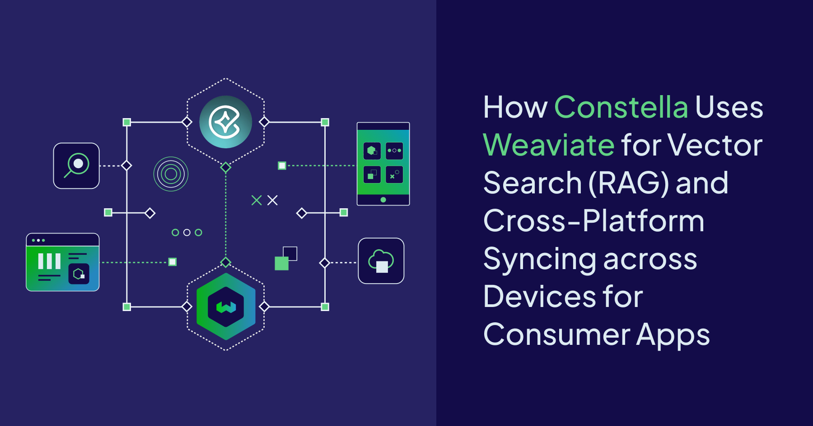

I’ve been working in the world of vector embeddings for over a decade. In that time, I’ve seen their role shift and expand in some fascinating ways. What started as a way to represent single words has evolved into something far more powerful—capturing the relationships between words in a sentence, the interplay between pixels in an image, or even patterns across modalities. However, at its core, the concept remains unchanged: vector embeddings remain a foundational element of machine learning, and now AI more broadly.

As context windows grow and architectures evolve, AI use cases are rapidly expanding across industries. Through it all, vector embeddings haven’t faded; they’ve become more central than ever. To extend your model’s knowledge, Weaviate has become the essential integrated foundation: not just for storing and retrieving embeddings, but for powering every layer of an AI-native application. That includes [generating embeddings with managed services](docs.weaviate.io/wcs/embeddings), [reasoning over data with intelligent agents](https://weaviate.io/product/query-agent), and [scaling effortlessly](/blog/scaling-and-weaviate), whether you're building your first prototype or operating at global scale. Weaviate brings it all together so you can focus on building, not stitching systems together.

To be more than just a vector store, a developer needs the ability to store, retrieve, and manipulate the data associated with vectors. Weaviate delivers on this promise—and much more. You can store billions of vectors or [full data objects](docs.weaviate.io/weaviate/concepts/data), [represent them with multiple embeddings](docs.weaviate.io/weaviate/tutorials/multi-vector-embeddings), and store them in [memory](docs.weaviate.io/weaviate/config-refs/schema/vector-index#hnsw-indexes), on [local disk](docs.weaviate.io/weaviate/config-refs/schema/vector-index#flat-indexes), or in cloud [storage like S3](docs.weaviate.io/weaviate/configuration/tenant-offloading#offload-s3-module). Even the [vectorization process can be handled fully automatically](docs.weaviate.io/weaviate/model-providers/weaviate), saving you time and effort. Retrieve your data with low-latency hybrid search, all without additional setup or complexity. All of this is possible with just a few lines of code. 

With thousands of managed customer instances and hundreds of millions of downloads, we're thrilled to be delivering a product that sits at the heart of how modern AI applications are developed and run.

Whether you're indexing a thousand or a trillion objects, we've got you covered, with all the functionality you need.

## The Day Zero, Day One, Day Two Mindset

At Weaviate, we view the journey our customers and open-source users take when building AI-native applications in three phases: **Day Zero, Day One, and Day Two**.

* **Day Zero** is where the exploration begins, designing, experimenting, and imagining what’s possible.  
* **Day One** is when you move from idea to implementation, moving from building to deploying into production.  
* **Day Two** is where things get serious, as we scale, maintain, and run reliably at real-world scale.

### Day Zero: Design AI applications with Confidence

At Day Zero, we believe that enablement and developer experience are paramount, which we tackle through [events](https://weaviate.io/community/events), [education](docs.weaviate.io/academy), and [documentation](https://docs.weaviate.io/weaviate). And yes, that even includes enabling the vibe-coders.

Our mission is to empower developers and product teams to build AI-native applications with minimal friction and maximum functionality. That means giving you the ability to [use the models you want](docs.weaviate.io/weaviate/model-providers), work with your data as needed, and scale in whatever direction your vision takes you. And you don’t have to start from scratch—we support a rich ecosystem of [integrations](docs.weaviate.io/integrations) and [partners](https://weaviate.io/partners) so you can bring your existing data with you. Whether it’s via APIs, frameworks, connectors, streaming pipelines, Spark, or even no-code tools, Weaviate makes it easy to get productive fast.

Weaviate isn’t just a vector store. It’s a **general-purpose vector database**, designed from the ground up to support your application from prototype to planetary scale. You don’t need separate systems, bolt-ons, or complex data pipelines to stitch things together. With Weaviate, everything is under one roof.

We do this through:

* A **feature-rich AI-native database** that scales with you;  
* Easy-to-use and comprehensive [**documentation**](docs.weaviate.io/weaviate);  
* A wide range of [**educational content and guides**](docs.weaviate.io/academy);  
* Support for models from [OpenAI](docs.weaviate.io/weaviate/model-providers/openai) to [Gemini](docs.weaviate.io/weaviate/model-providers/google), and from [Anthropic](docs.weaviate.io/weaviate/model-providers/anthropic) to [open source](docs.weaviate.io/weaviate/model-providers/transformers), across all modalities and ready to run out of the box on your preferred cloud;  
* Easy-to-use [Embedding Services](docs.weaviate.io/wcs/embeddings). And;  
* Powerful [Database Agents](docs.weaviate.io/agents)

And importantly, the tooling and features you explore during Day Zero are **the same ones** that will carry you through production and beyond.

That’s by design, and it's part of our commitment to you.

### Day One: Go to Production, Anywhere

When you’re ready to launch, we’ve got you covered too, wherever and however you want to deploy.

Whether you start with:

* Our [**open source offering**](https://github.com/weaviate/weaviate)**;* 
* **Managed cloud** deployments on [shared](https://weaviate.io/deployment/serverless) or [dedicated](https://weaviate.io/deployment/enterprise-cloud) infrastructure;  
* [**Bring-your-own-cloud (BYOC)**](https://weaviate.io/deployment/byoc) setups for full control.   
* Or even the [embedded version](docs.weaviate.io/weaviate/installation/embedded) of Weaviate, you can run directly in a notebook.

### Day Two: Scale Without Limits

Day Two is all about scale, and Weaviate is uniquely built for use cases both **scaling up** and **scaling out**.

This means that you can:

* **Scale up** with large in-memory indices for ultra-fast retrieval across massive datasets.  
* **Scale out** with thousands or even millions of smaller indices for multi-tenant environments, with storage on [disk](docs.weaviate.io/weaviate/config-refs/schema/vector-index#flat-indexes), in [memory](docs.weaviate.io/weaviate/config-refs/schema/vector-index#hnsw-indexes), or [offloaded to object stores](docs.weaviate.io/weaviate/configuration/tenant-offloading#offload-s3-module) like S3.

You can mix and match your storage and retrieval strategies, depending on what your use case demands. It’s your architecture—Weaviate just makes it easy to operate and evolve. The same handful of lines of code you write on Day Zero will still work on Day Two—even when you're operating at the scale of trillions of objects.

And last but not least, we’ve pioneered a new way to build AI-native applications by bringing code and prompts together. With [Weaviate Agents](docs.weaviate.io/agents), you can embed reasoning, extend logic, and orchestrate complex behaviors—all within a single environment. It’s a seamless blend of declarative and generative approaches, giving you the power to go beyond retrieval and build truly intelligent, dynamic systems.

That’s our commitment: to provide you with a **simple, powerful, and scalable system** to build AI-native applications—without ever needing to worry about where it runs, how big it gets, or what direction you grow.

We’re excited to welcome you into our community, and we’re here to help. [Get in touch](https://weaviate.io/contact) with our team to discuss your project or [start building](https://auth.wcs.api.weaviate.io/auth/realms/SeMI/login-actions/registration?client_id=wcs-frontend&tab_id=IhrawaWAEMs) with Weaviate Cloud today.  

import WhatsNext from '/_includes/what-next.mdx'
<WhatsNext />