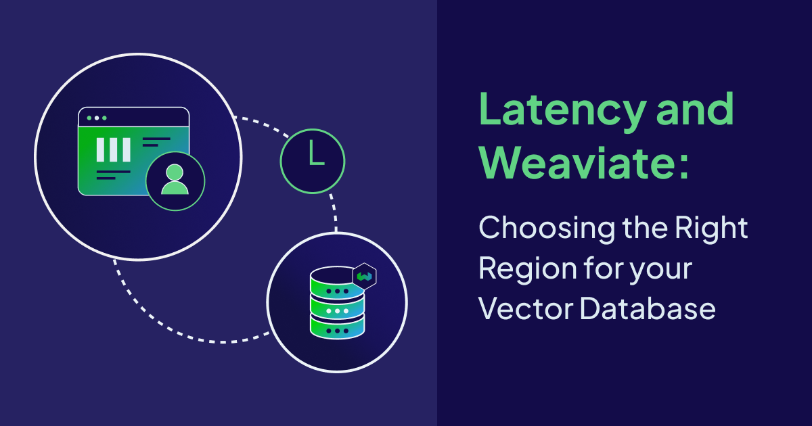
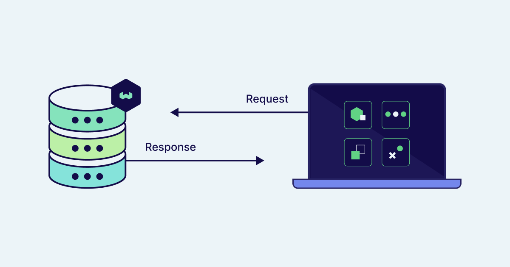
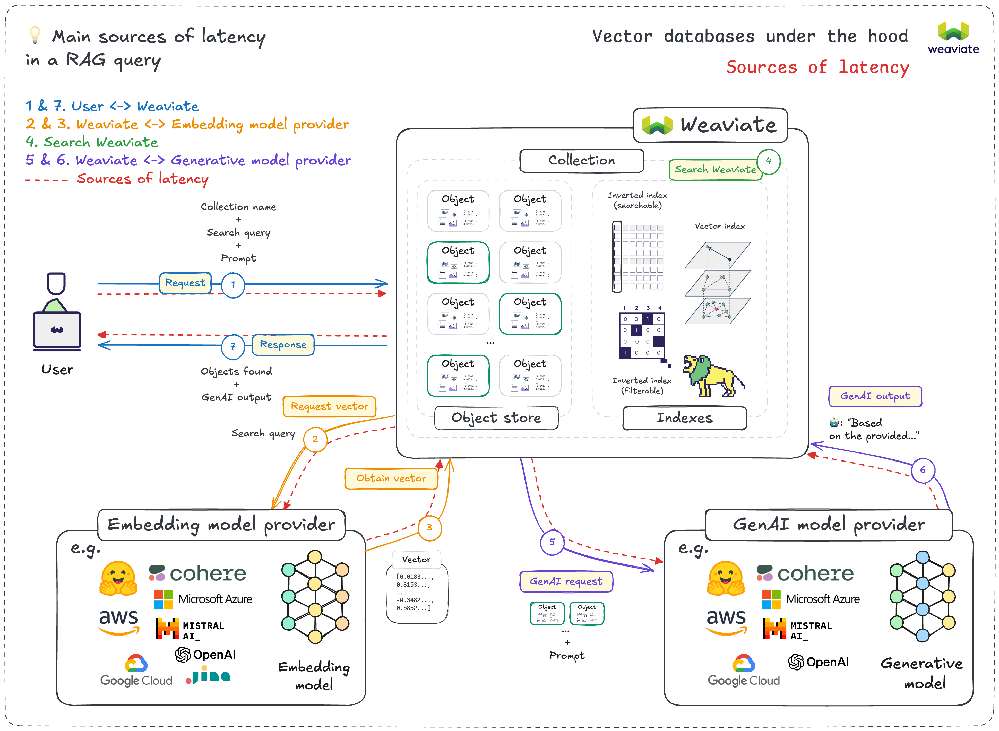

Latency is the time it takes for a request to travel from an application and for a response to be returned. The lower the latency, the faster the interaction; conversely, the higher the latency, the more noticeable the delay. In a vector database, low latency is critical for user-facing applications. If your Weaviate instance is hosted using a cloud provider, the region that you select can make a noticeable difference in the performance of your database and each cloud provider offers an abundance of distributed regions to choose from. But how do you determine the right region for your vector database?

## Latency in Vector Databases Explained

Understanding latency in vector databases requires a shift in thinking from traditional databases. In a traditional database, network latencies between the user ↔ application ↔ database need to be optimized, but in a vector database additional components need to be optimized. Vector operations carry a processing cost that makes geographic latency optimization critical for maintaining responsive user experiences.

In networking, round-trip time, or RTT, is the time it takes to receive a response after initiating a network request and it is fundamental in user experience. When using a vector database, the total latency includes RTT, the time taken by an application, and the time it takes a model. 

### Latency Types

At the minimum these are the potential sources of latency:

- Database processing latency
- Network latency (your application ↔ Weaviate)

If an **embedding model is being used**, you’ll have these additional kinds of latency:

- Embedding model inference latency
- Network latency (Weaviate ↔ the embedding model provider)

If it is a **RAG query**, then you will have these kinds of latency in addition to the above:

- Generative AI model inference latency
- Network latency (Weaviate ↔ Generative AI model provider)

In networking, round-trip time, or RTT, is the time it takes to receive a response after initiating a network request and it is fundamental in user experience. When using a vector database, the total latency includes RTT, the time taken by an application, and the time it takes a model.

## How to Optimize a Vector Database for Low Latency with Strategic Region Selection

Deciding where to host your vector database instance should take into account the above considerations to minimize the total latency for as many users as possible. To this end, there are a few considerations that should be made when making your decision.

### Consider your base

If your application serves a global audience, it will be crucial to choose a cloud region for your vector database that reduces latency for the majority of your users. This could mean that you are selecting a region geographically central to your user base.

### **Consider network infrastructure and performance**

While latency is one part of the photo of performance, it is only one piece of it. Throughput is another key consideration as it is the volume of data that can be transferred over the network in a given time. If your application expects a high volume of concurrent queries, then even a low latency region can fall short if there is insufficient bandwidth. Some regions have extensive infrastructure, huger bandwidth, and lower congestion, which can directly influence RTT and, subsequently, latency. Cloud providers generally provide performance metrics and network latency information for each region, which can help guide your decision. Regions with low network congestion can offer better performance.

**Infrastructure and performance considerations**

- If **real-time responsiveness** is key, then prioritize low latency with a region that is geographically close to the application or to the end users.
- If **high data volume** is expected, then assessing regional bandwidth capacity and throughput limits will be the best course of action.

### **Leverage edge computing and CDNs**

If your application requires global reach low latency, then leveraging edge computing or Content Delivery Networks (CDNs) could be the solution. A CDN caches frequently accessed data closer to the user, while edge computing moves processing tasks closer to the data source, which reduces distance and latency. Using a tool like CloudFront in AWS ensures that your data can be 

## Conclusion

Every latency measurement also contains a human experience. In abstract terms, a 100-millisecond delay may seem insignificant but it represents the difference between an instantaneous search and one that can potentially compound into user frustration and abandoned sessions. Your region selection represents more than a technical configuration decision; it symbolizes the relationship that your application will have with its users. By intentionally aligning your application host, Weaviate instance, and provider regions, you are not just optimizing for speed but also for presence. The alignment helps to reduce friction and foster immediacy and the result is an application that is both thoughtful and performant. 

To create a responsive experience, architects must align three regions: **the host application region, the Weaviate region, and the model provider region.** The goal is to minimize the RTT and latency between these components as a coordinated system, this means colocating services where possible, selecting model providers with regional endpoints and choosing a Weaviate deployment that sits nearest to your application. 

Successful region selection recognizes that latency optimization serves the human experience instead of simply serving technical metrics. Region selection forces an explicit consideration of where the application’s value resides, and understanding this provides clarity that will guide the long-term evolution of your application.

### Additional Resources

- [Weaviate Best Practices](https://weaviate.io/developers/weaviate/best-practices)

- [Indexes and Performance](https://weaviate.io/developers/weaviate/more-resources/performance)

- [ANN Benchmarks](https://weaviate.io/developers/weaviate/benchmarks/ann#what-is-the-difference-between-latency-and-throughput)

import WhatsNext from '/_includes/what-next.mdx'

<WhatsNext />