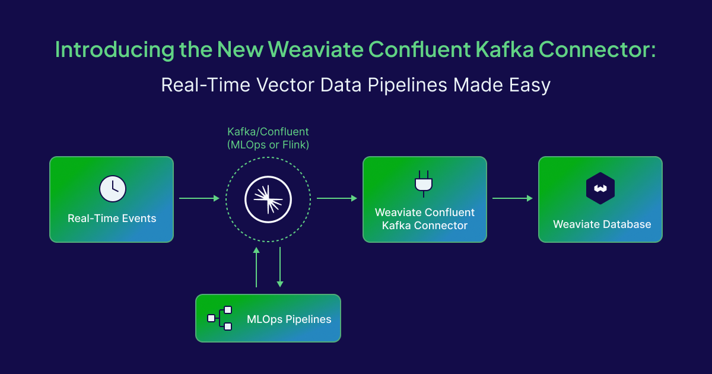

Whether it's powering search engines, recommendation systems, or AI applications, keeping your vector database in sync with your data sources is crucial. That’s why we're excited to introduce the new [Weaviate Sink Confluent Apache Kafka Connector](https://www.confluent.io/hub/Weaviate/kafka-connect-weaviate), a streamlined, production-ready solution that bridges the gap between Kafka and Weaviate’s powerful vector database.

# What is the Weaviate Sink Confluent Kafka Connector?

The Weaviate Sink Kafka Connector is a Kafka Connect plugin designed to ingest data from Kafka topics and push it into Weaviate, automatically transforming Kafka messages into structured objects ready for retrieval and generative AI.

It’s built to simplify real-time data ingestion, whether you're working with product catalogs, news feeds, user interaction logs, or any stream of data that benefits from vector-based indexing and retrieval.

## Key Features

* **Real-Time Streaming:** Keep your Weaviate collections updated in real-time as new events are published to Kafka.

* **Full CRUD support:** Automatically upsert or delete data in Weaviate for each Kafka message using a customizable configuration.

* **Integrated Vectorization:** Rely on Weaviate's built-in vectorizer or Bring Your Own Vectors with incoming data.

* **Error Handling & Retry Logic:** Production-grade resilience with configurable backoff and dead-letter queues within the Kafka Connect framework.

* **Support for JSON, Avro, and Protobuf:** Easily parse structured messages in your preferred serialization format.

* **Secure & Scalable:** Built by Weaviate and verified by Confluent.

## When Do You Need This Connector?

Weaviate already offers one of the most advanced and developer-friendly vector database experiences. But integrating it into existing pipelines often requires stitching together custom code.

Let’s say you're running a real-time personalization engine for an e-commerce store. User events like clicks, searches, and purchases are streamed into Apache Kafka. With the Weaviate Kafka Connector, these events can now be vectorized and indexed in Weaviate instantly, enabling live personalization powered by vector similarity, all without writing custom ingestion logic.

## Under the Hood: How It Works

The sink connector subscribes to Kafka topics and processes messages using a configurable pipeline:

1. **Parse Message:** Support for objects with or without schema.

2. **Transform Payload:** Transform the Kafka Messages into a Weaviate object. Optionally, extract document ID and vectors from the source message. Further transformations can be performed via Kafka Connect Single Message Transform (SMT) API.

3. **Push to Weaviate:** Use the gRPC API to upsert or delete objects, with support for batching and gRPC for optimal performances.

Configuration is done by a JSON configuration, making it easy to configure without touching the code.

## Getting Started

### Preprequisites

To leverage the Weaviate connector, you need to have Apache Kafka, Kafka Connect and Weaviate clusters running. The connector does not create the collections automatically, so ensure that your target collections are already created before creating the connector. 

For a free and easy Weaviate cluster, you can create a Sandbox cluster in [Weaviate Cloud](https://console.weaviate.cloud/) and it’s available for at least 14 days. For Apache Kafka, you can rely on the [free trial of Confluent Cloud](https://www.confluent.io/confluent-cloud/tryfree/) and receive $400 in credits for the first 30 days.

### Step 1: Install the Connector plugin:

Installation can be done manually, or by leveraging the confluent-hub CLI. The connector is available in [Github](https://github.com/weaviate/kafka-connect-weaviate/releases) and in [Confluent Hub](https://www.confluent.io/hub/Weaviate/kafka-connect-weaviate/). 

```shell
$> confluent-hub install Weaviate/kafka-connect-weaviate:latest
```

### Step 2: Create the connector configuration:

Kafka Connect connector configuration is a JSON file containing all the generic configuration for Kafka Connect connectors and the specific configuration for the Weaviate connector.

All properties are documented in [Github](https://github.com/weaviate/kafka-connect-weaviate/blob/main/CONFIGURATION.md) and you can also find examples of configuration [here](https://github.com/weaviate/kafka-connect-weaviate/tree/main/examples).

Example of configuration for Weaviate Cloud:

```json
{
  "connector.class": "io.weaviate.connector.WeaviateSinkConnector",
  "topics": "test",
  "weaviate.connection.url": "$WEAVIATE_REST_URL",
  "weaviate.grpc.url": "$WEAVIATE_GRPC_URL",
  "weaviate.grpc.secured": true,
  "weaviate.auth.scheme": "API_KEY",
  "weaviate.api.key": "$WEAVIATE_API_KEY",
  "collection.mapping": "Weaviate_test",
  "document.id.strategy": "io.weaviate.connector.idstrategy.FieldIdStrategy",
  "document.id.field.name": "id",
  "value.converter": "org.apache.kafka.connect.json.JsonConverter",
  "value.converter.schemas.enable": false
}
```

### Step 3: Create the connector on Kafka Connect

Start the connector on Kafka Connect, you can rely on Confluent Cloud UI or by leveraging the Kafka Connect API.

Example of curl command to create the connector: 

```shell
$> curl -i -X PUT https://<KAFKA_CONNECT_URL>/connectors/weaviate/config -H 'Content-Type:application/json' --data @connector.json
```

## Conclusion

The Weaviate Kafka Connector is a powerful enabler for teams that want real-time, scalable, and intelligent data pipelines or organizations that are already using Apache Kafka. It removes the friction from ingesting and vectorizing data, helping you go from stream to semantic search in minutes.

Ready to accelerate your pipeline? Check out the [full documentation](https://github.com/weaviate/kafka-connect-weaviate/tree/main) to get started.

import WhatsNext from '/_includes/what-next.mdx'
<WhatsNext />