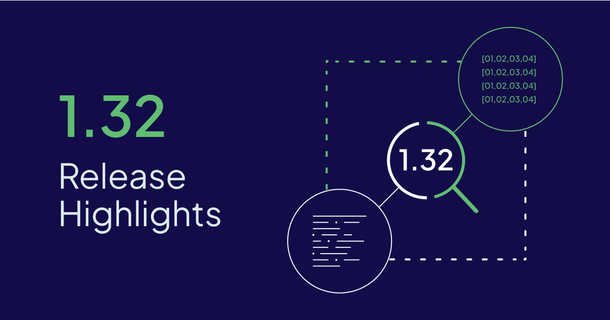
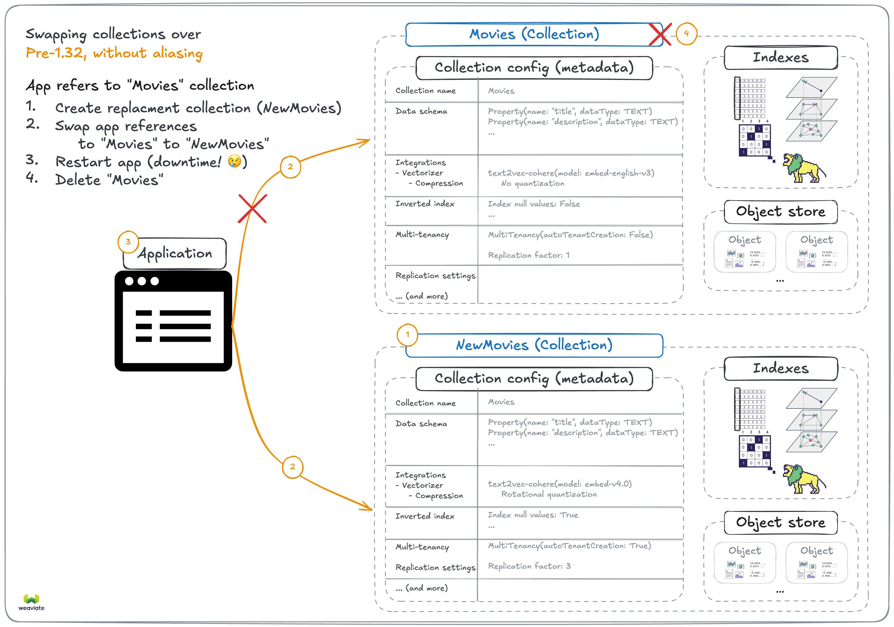
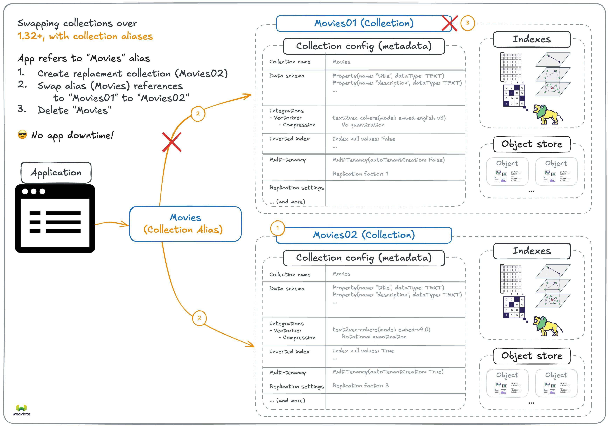
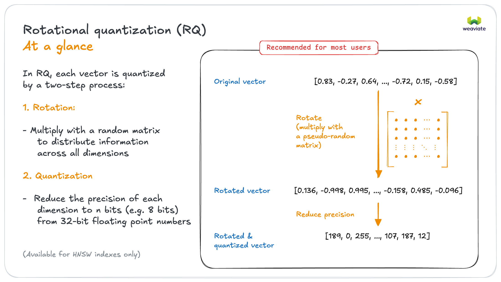
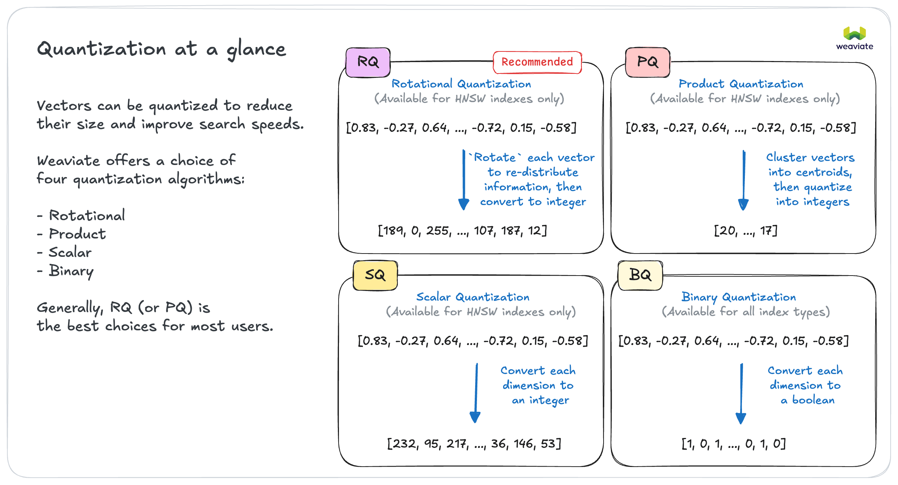
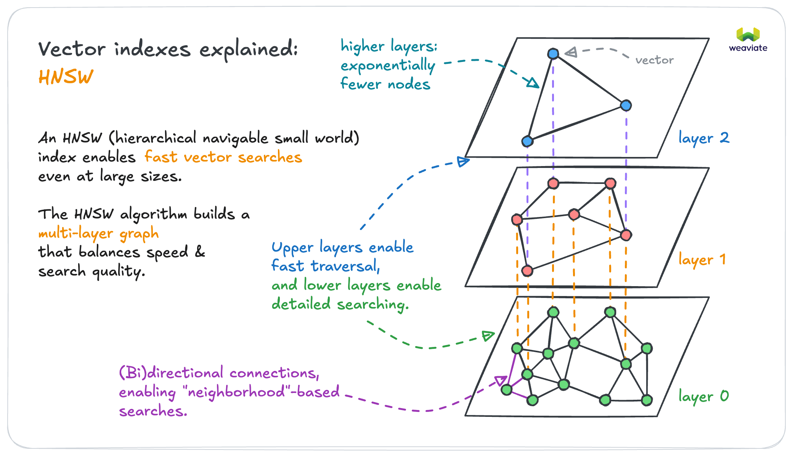

import ThemedImage from '@theme/ThemedImage';

Weaviate `v1.32` is now available open-source and on [Weaviate Cloud](https://console.weaviate.cloud). It introduces **collection aliases** for seamless collection migrations under the hood, powerful & efficient **rotational quantization (RQ)**, memory reduction with **compressed HNSW connections** and the **replica movement** feature becomes generally available (GA).

There's also other significant performance improvements, such as **cost-aware sort**, other indexing efficiency and performance improvements.

Here are the release ⭐️*highlights*⭐️!



- [Collection aliases](#collection-aliases)
- [Rotational quantization (RQ)](#rotational-quantization-rq)
- [Optimized HNSW connections](#optimized-hnsw-connections)
- [Replica movement goes GA](#replica-movement-goes-ga)
- [Cost-aware sorting](#cost-aware-sorting)
- [Community contributions](#community-contributions)

## Collection aliases

Collections are the core of how Weaviate organizes data. They not only define the data schema and store the objects, but also define how Weaviate works with the data. That set of configuration includes index settings, vectorizer and generative model configurations, replication settings and so on.

Because these settings define how Weaviate works, many of them are not changeable after the collection is created. This means that if you want to change any of these settings, you needed to create a new collection and migrate the data from the old collection to the new one.



With the introduction of **collection aliases**, there is now an easy solution to this problem. You can now create an alias for a collection, which is a simple reference to a collection.

An alias can be created like this:

```python
client.alias.create(alias_name="Movies", target_collection="Movies01")
```

Then, it can be used just like a collection in basically all operations:

```python
movies = client.collections.get("Movies")
movies.query.near_text("The Matrix")
```

This means that you can now change the target collection of an alias without any downtime, like this:

```python
client.alias.update(alias_name="Movies", new_target_collection="Movies02")
```



This is particularly useful for collection migrations, where you can create a new collection with the desired settings, migrate the data to the new collection, and then change the alias to point to the new collection.

Aliases are bound to improve your production workflow with Weaviate.

:::info Related resources
- [How-to: Collection aliases](https://docs.weaviate.io/weaviate/manage-collections/collection-aliases)
:::

## Rotational quantization (RQ)

[Vector quantization](https://docs.weaviate.io/weaviate/concepts/vector-quantization) is a powerful technique to reduce the memory footprint of vectors, while still allowing for high-quality similarity search.

In Weaviate `1.32`, we introduce **rotational quantization (RQ)**, which can significantly reduce the memory footprint of vectors, while only having negligible impact on the quality of similarity search.

RQ works in two major steps:
1. *Rotate the vector* by multiplying it with a rotation matrix, which is a random orthogonal matrix.
    - This step works to distribute the amount of meaningful information across all dimensions of the vector, allowing for full use of each dimension.
2. *Quantize the rotated vector* by reducing the number of bits used to represent each dimension of the vector.
    - This step is similar to traditional scalar quantization, but it is applied to the rotated vector.

Here is a visual explanation of how RQ works:



As a result, Weaviate now supports rotational quantization, product quantization, scalar quantization and binary quantization.



Our internal testing has found that RQ can reduce the memory footprint significantly (~75% reduction) with negligible impact on search quality (i.e. recall). As a result, we generally recommend using RQ in most use cases for the HNSW index.

In some cases, other types may be more useful:

- For flat indexes, only binary quantization available. This can speed up search performance significantly.
- For HNSW indexes where further customization of parameters are needed, product quantization may be a good choice.

:::info Related resources
- [Concepts: Quantization](https://docs.weaviate.io/weaviate/concepts/vector-quantization)
- [How-to: Configure Quantization](https://docs.weaviate.io/weaviate/configuration/compression)
:::

## Optimized HNSW connections

A majority of Weaviate's memory usage is due to the HNSW index, which is the vector index type that allows fast similarity search.



In Weaviate `1.32`, we introduce **optimized HNSW connections**, which can significantly reduce the memory footprint of the HNSW graph structure. This is achieved by optimizing the precision of the connections between the nodes in the HNSW graph, based on the number of objects on that particular HNSW layer.

From a user perspective, this is a completely transparent change. It works out-of-the-box, without any configuration needed. Even better, you don't need to re-index your data, either. Once you upgrade to Weaviate `1.32`, the HNSW index will automatically start using the optimized connections.

How much memory reduction can you expect? Well, it depends on a number of factors.

Generally, you will see the most benefit if you are using ColBERT, or ColPali-type multi-vector embeddings, which are made up of many, smaller vectors. In this case, you could get up to 20% memory reduction for the HNSW index, as the HNSW graph structure takes up a larger relative share of the total memory usage.

## Replica movement goes GA

We introduced a shard replica movement features in Weaviate `1.31`, which allows you to move shard replicas between nodes in a cluster. This is useful for balancing the load on the nodes, or for moving replicas to nodes with more resources.

In Weaviate `1.32`, this feature is now generally available (GA), which means that it is fully supported and ready for production use.

Along with this comes support in the client libraries. Moving a replica can be done in Python like this:

```python
from weaviate.cluster.models import ReplicationType

operation_id = client.cluster.replicate(
    collection=collection_name,
    shard=shard_name,
    source_node=source_node_name,
    target_node=target_node_name,
    replication_type=ReplicationType.COPY,  # For copying a shard
    # replication_type=ReplicationType.MOVE,  # For moving a shard
)
print(f"Replication initiated, ID: {operation_id}")
```

This is a significant features that will ease the burden for the DevOps teams managing Weaviate clusters, as it allows for more flexibility in managing the resources of the cluster.

Check out the [Configuration: Replica movement docs](https://docs.weaviate.io/deploy/configuration/replica-movement) for more details on how to use this feature.

:::info Related resources
[Configuration: Replica movement](https://docs.weaviate.io/deploy/configuration/replica-movement)
[Concepts: Consistency: Replica movement](https://docs.weaviate.io/weaviate/concepts/replication-architecture/consistency#replica-movement)
:::

## Cost-aware sorting

Introduction of cost-aware sorting delivers dramatic speed improvements of 2-200x for filtered and sorted queries.

Previously, Weaviate's sorting implementation needed to load every object matched by a filter, making it O(n) where n is the number of matches. This could be extremely expensive for queries with many matches.

The new cost-aware sorting implementation is much smarter. It leverages Weaviate's existing inverted indexes to read data sequentially and can stop early when the limit is reached. An intelligent query planner automatically estimates the cost of both the old and new approaches, then picks the most efficient strategy for each query.

This improvement will significantly speed up many use cases that previously couldn't efficiently use sorting, making Weaviate even faster for your production workloads.

Keep an eye out for a future blog post that will go into more detail on this feature, including internal test results and examples.

## Performance improvements

As is often the case, Weaviate `1.32` also includes a number of performance improvements that will benefit all users. These include performance improvements to HNSW indexing, LSM store performance, and more.

## Community contributions

Weaviate is an open-source project. And while of course, much of the work is done by our amazing engineering team, we are always excited to see contributions from the community.

For this release, we are super excited to shout-out the following contributors for their contributions to Weaviate. 🎉🎉🎉

- [@vojtechtoman](https://github.com/vojtechtoman) contributed [#8346](https://github.com/weaviate/weaviate/pull/8346)
- [@jormeijer](https://github.com/jormeijer) contributed [#7641](https://github.com/weaviate/weaviate/pull/7641)

If you are interested in contributing to Weaviate, please check out our [contribution guide](https://docs.weaviate.io/contributor-guide/), and the list of open issues on [GitHub](https://github.com/weaviate/weaviate/issues). Filtering for the `good-first-issue` label is a great way to get started.

:::info Related resources
- [Contribution guide](https://docs.weaviate.io/weaviate/more-resources/contributing)
:::

## Summary

Ready to Get Started?

Enjoy the new features and improvements in Weaviate `1.32`. The release is available open-source as always [on GitHub](https://github.com/weaviate/weaviate/releases/tag/v1.32.0), and is already available for new Sandboxes on [Weaviate Cloud](https://console.weaviate.cloud/).

For those of you upgrading a self-hosted version, please check the [migration guide](https://docs.weaviate.io/deploy/migration#general-upgrade-instructions) for any version-specific notes.

It will be available for Serverless clusters on Weaviate Cloud soon as well.

Thanks for reading, see you next time 👋!
