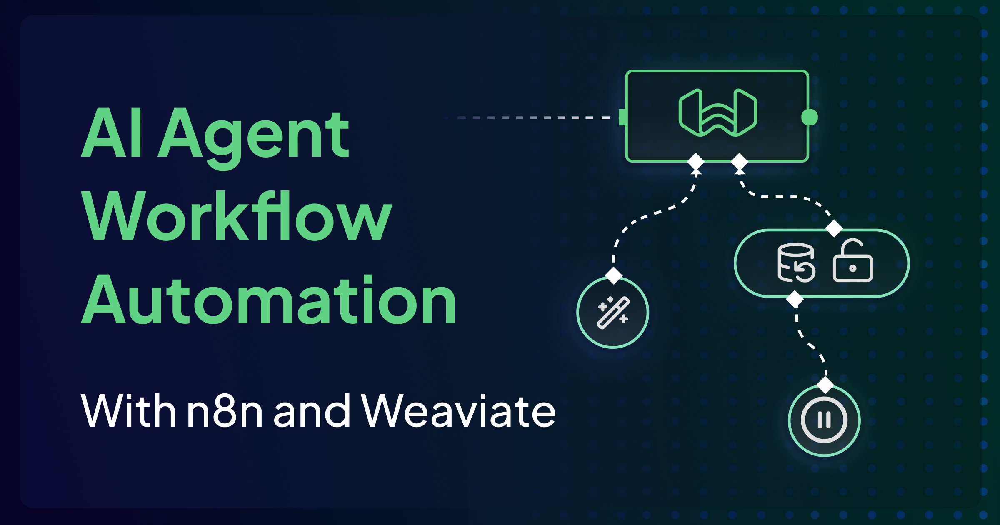
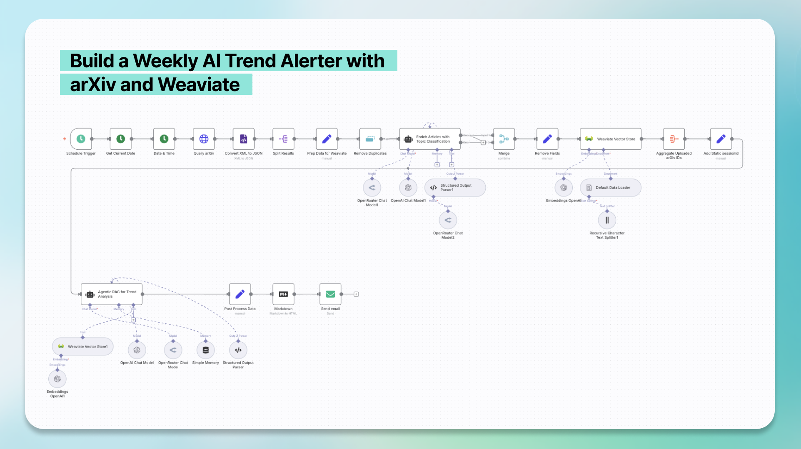
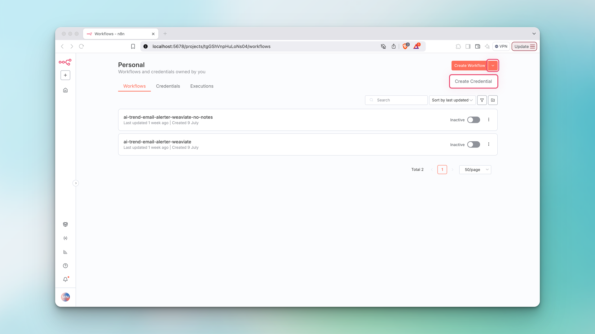
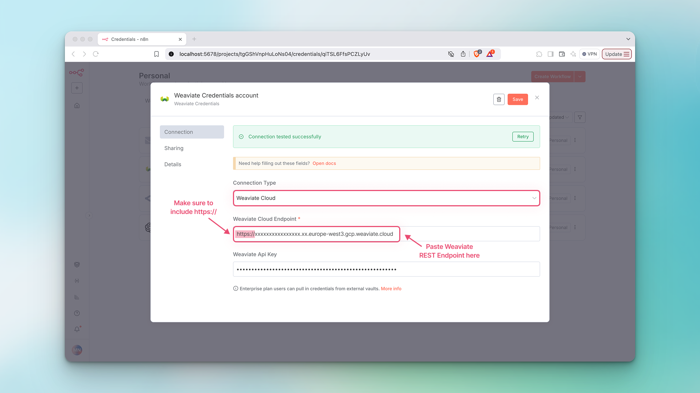
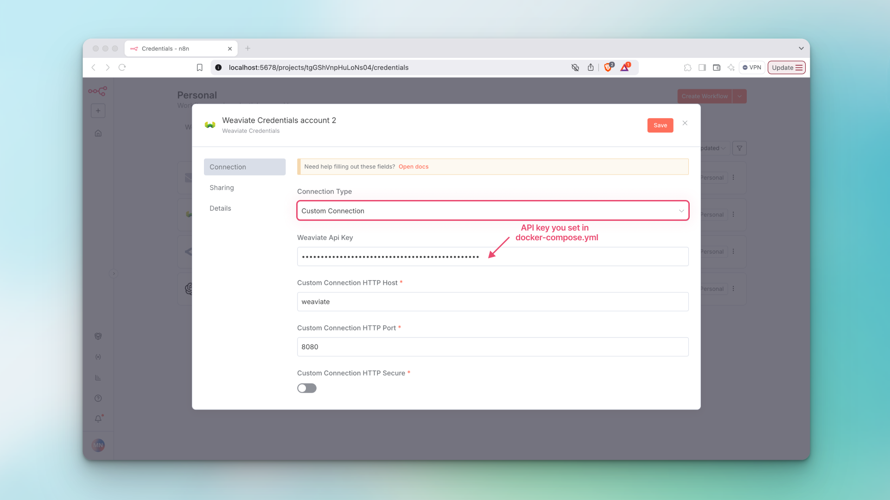
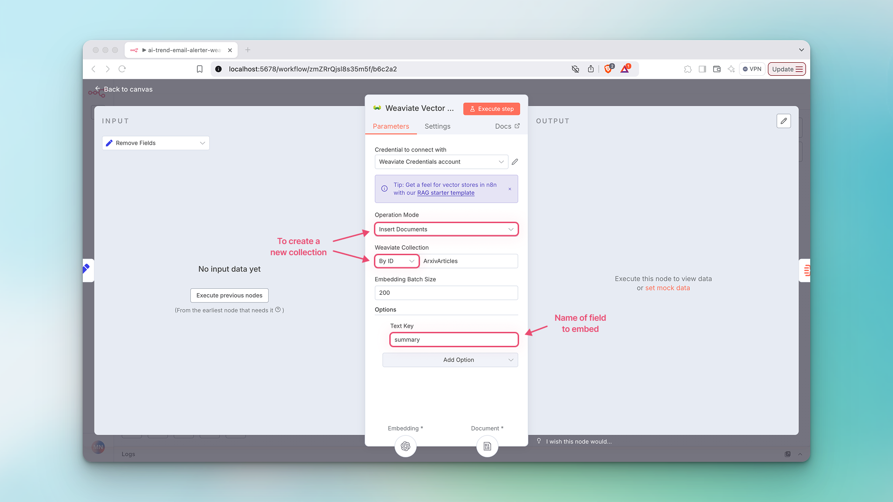
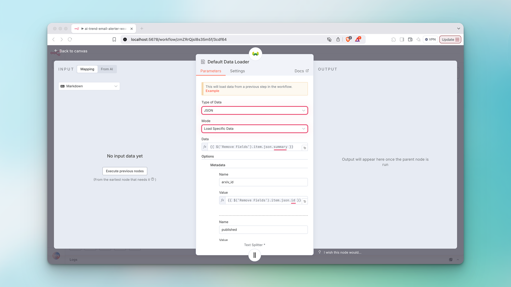
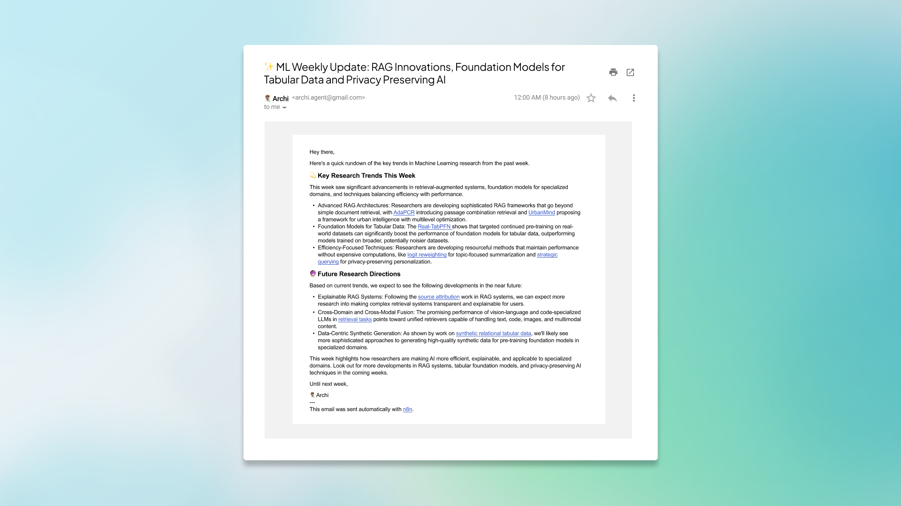

No code Weaviate is here. But even if you can code already, you need to see it.

The new [Weaviate Community node](https://docs.n8n.io/integrations/builtin/cluster-nodes/root-nodes/n8n-nodes-langchain.vectorstoreweaviate/) allows you to use a Weaviate vector store with n8n's no-code automation platform.

With [n8n](https://n8n.partnerlinks.io/blog), you can create workflows that let you connect different applications, services, and data sources. n8n’s AI and AI agent nodes and integrations with LLM providers like OpenAI, Google, Anthropic and Cohere allow you to build sophisticated AI and agentic workflows without writing a single line of code. 

So why do you need a vector database when using n8n? Using a vector store in n8n allows you to reference an entire knowledge base when performing AI-related tasks, rather than relying on few-shot prompting or context windows, which can be unreliable for niche topics. Vector stores provide LLMs and AI agents with context to ground their answers, making outputs more accurate and reliable. This means that the easiest way to improve your retrieval pipelines in n8n might be to add a vector store to your workflow.

## The Weaviate Community Node for n8n

The Weaviate Vector Store community node means that no code Weaviate is here. Our node has four core functionalities that allow you to work seamlessly with AI and AI agent nodes:

1. **Get Many:** Query a Weaviate vector store to get multiple ranked documents.
2. **Insert Documents:** Insert documents into a Weaviate vector store.
3. **Retrieve Documents (As Vector Store for Chain/Tool):** Retrieve documents from a Weaviate vector store to be used as a tool with AI nodes.
4. **Retrieve Documents (As Tool for AI Agent):** Retrieve documents from a Weaviate vector store to be used as tool with [AI agent](https://docs.n8n.io/integrations/builtin/cluster-nodes/root-nodes/n8n-nodes-langchain.agent/) nodes.

And Weaviate’s commitment to open source means that you can use our n8n community node with a [local version of Weaviate](https://docs.weaviate.io/deploy/installation-guides/embedded) or [Weaviate Cloud](https://docs.weaviate.io/cloud/quickstart). 

To help you get the hang of using Weaviate in n8n, we’ve created an [example template](https://n8n.io/workflows/5817-build-a-weekly-ai-trend-alerter-with-arxiv-and-weaviate/) that we’ll guide you through in this article.

## Building an Agentic Workflow with Weaviate and n8n to Keep Up with AI Trends

In this [template](https://n8n.io/workflows/5817-build-a-weekly-ai-trend-alerter-with-arxiv-and-weaviate/), we create a workflow that scrapes AI and machine learning article abstracts from [arXiv](https://arxiv.org/), enriches them with a LLM, embeds them in Weaviate, and feeds them to an AI agent to perform automated trend analysis on a weekly basis. The result is a short email that summarizes the week’s key research trends and predicts future research directions, linking directly to the most interesting and impactful arXiv papers.



This workflow is divided into two parts:

1. Fetch, clean, enrich and insert arXiv abstracts into Weaviate.
2. Use agentic RAG to identify research trends and send them in a weekly email.

### Prerequisites

1. **An existing Weaviate cluster.** You can view instructions for setting up a **local cluster** with Docker [here](https://weaviate.io/developers/weaviate/installation/docker-compose#starter-docker-compose-file) or a **Weaviate Cloud** cluster [here](https://docs.weaviate.io/cloud/quickstart).
2. **API keys** to generate embeddings and run Google Gemini. Feel free to switch out the models as you like!
3. **An email address with STMP privileges**. This is the address the email will come from.
4. **Self-hosted n8n instance.** See this [video](https://www.youtube.com/watch?v=kq5bmrjPPAY&t=108s) for how to get set up in just three minutes.

### Setting Up Weaviate Credentials in n8n

Setting up your [Weaviate credentials in n8n](https://docs.n8n.io/integrations/builtin/credentials/weaviate/?utm_source=n8n_app&utm_medium=credential_settings&utm_campaign=create_new_credentials_modal) is quick and easy.

1. Navigate to your n8n homepage, click the downward arrow next to the Create Workflow button and click Create Credential.



2. For adding Weaviate Cloud credentials, under `Connection Type` select `Weaviate Cloud`. After creating [a new cloud cluster](https://docs.weaviate.io/cloud/quickstart), follow these [instructions](https://docs.weaviate.io/cloud/quickstart#13-connect-to-your-weaviate-cloud-instance) to get the following parameters from your Weaviate Cloud cluster:
    - `Weaviate Cloud Endpoint` (in the Weaviate Cloud console this is called the `REST Endpoint` )
    - `Weaviate Api Key`



3. For adding credentials when using Weaviate locally, under Connection Type select Custom Connection. All the fields should pre-populate except for `Weaviate Api Key`. If you’re running Weaviate using Docker, you can enable API key authentication and set your own API key right in your `docker-compose.yml` file like this:

```yaml
services:
  weaviate:
    ...
    environment:
      ...
      AUTHENTICATION_APIKEY_ENABLED: 'true'
      AUTHENTICATION_APIKEY_ALLOWED_KEYS: 'your-api-key-here'
      AUTHENTICATION_APIKEY_USERS: 'your-username' 
```



## Part 1: Fetch, Clean, Enrich and Insert arXiv Abstracts into Weaviate

In the first part of this workflow, we activate a [Schedule Trigger](https://docs.n8n.io/integrations/builtin/core-nodes/n8n-nodes-base.scheduletrigger/) node to fetch AI and ML abstracts (along with their metadata like article title, authors, publication date, etc.) on a weekly basis. We clean the data and then enrich it with a LLM that will label it with topic categories and predict each article's potential impact in the field. Finally, we upload the enriched and cleaned data into a Weaviate collection and verify that the data has been uploaded. 

Here are the steps for part one:

1. **Specify date range for weekly automation.** This date range is set to include the last seven days, as this is a weekly automation. However, you can set this to any date range by editing the `Duration` parameter in the [Date & Time](https://docs.n8n.io/integrations/builtin/core-nodes/n8n-nodes-base.datetime/) node.
2. **Fetch weekly articles from arXiv.** We make a GET request with our search query to the arXiv API to fetch the abstracts and their metadata. The search query, that we formulate based on the [arXiv API](https://info.arxiv.org/help/api/user-manual.html#search_query_and_id_list), contains includes articles published in the [cs.LG](https://arxiv.org/list/cs.LG/recent) or [stat.ML](http://stat.MLhttps://arxiv.org/list/stat.ML/recent) categories and selects the first 200 articles. You can increase the number of articles fetched by adjusting `max_results=200` in the query field.

```
https://export.arxiv.org/api/query?search_query=cat:cs.LG+OR+cat:stat.ML&sortBy=submittedDate&sortOrder=descending&start=0&max_results=200&last_update_date_from={{ $('Date & Time').item.json.startDate.toDateTime().toFormat("yyyyMMdd") }}
```

3. **Pre-process fetched data.** The arXiv API returns our results in XML, so we need to convert the XML to JSON. Then, we parse the JSON file and extract our desired fields, format the data for Weaviate, and remove duplicates (if they exist). Specifically, we need to merge fields that have multiple entries like author or category into a single array of strings so that it can be passed intro Weaviate as metadata. Here’s an example of what this looks like:

```json
# ❌ Before preparing data for Weaviate
  {
    "category": [
      {
        "term": "cs.CR"
      },
      {
        "term": "cs.LG"
      }
    ]
  }
    
 # ✅ After preparing data for Weaviate
  {    
    "category": "["cs,CV", "cs.LG"]"
  }
```

4. **Enrich arXiv articles with topic classifications and potential impact predictions.** In this part of the workflow, we feed the title and abstract to the LLM and prompt it to enrich our articles by assigning each of the articles primary topic category from a list of pre-defined categories. Each article also gets assigned up to two different secondary categories, and is given a score from 1-5 that predicts its potential impact in the field. You can see the system prompt we use below:

```Text
You are an expert AI agent designed to classify academic research papers. Your task is to analyze the provided arXiv paper data and categorize it based on its content.

Input Data Schema:
The input data will be a JSON object with the following structure:

{
  "title": "string",
  "summary": "string"
}

You MUST respond with a JSON object containing the following fields:

"primary_category": (string) The single most relevant primary category for the paper. You MUST choose one category from the following predefined list. Do NOT use any category not on this list.

"secondary_categories": (array of strings) Up to two additional relevant secondary categories. These are optional; if no secondary categories apply, provide an empty array []. If chosen, they MUST also be from the predefined list.

"potential_impact": (integer) An integer score from 1 to 5, judging the paper's potential impact based on these criteria:

1: Papers with no new existing information or limited results.

2: Papers with minor incremental contributions or limited novelty.

3: Papers with solid contributions, good results, and clear utility, but not groundbreaking.

4: Papers with significant advancements, novel approaches, or strong potential to influence the field.

5: Papers that are potential game-changers, representing paradigm shifts, or opening entirely new research directions.

Predefined Categories and Definitions:

Foundation Models: Models trained on broad data at scale, designed to be adaptable to a wide range of downstream tasks (e.g., large language models, large vision models, multi-modal models).

LLM Fine-tuning: Techniques and methodologies for adapting pre-trained Large Language Models (LLMs) to specific tasks or datasets.

Parameter-Efficient Fine-tuning (PEFT): Methods that enable efficient adaptation of large pre-trained models to new tasks with minimal computational cost, by updating only a small subset of parameters (e.g., LoRA, Prompt Tuning).

Retrieval-Augmented Generation (RAG): Architectures or systems that combine generative models (like LLMs) with information retrieval mechanisms to enhance the factual accuracy and relevance of generated outputs by referencing external knowledge bases.

Model Quantization: Techniques for reducing the precision of model parameters (e.g., from float32 to int8) to decrease model size, memory footprint, and computational requirements, often for efficient deployment on edge devices.

Agentic AI / AI Agents: Systems designed for autonomous decision-making, planning, and action in dynamic environments, often involving reasoning, memory, and tool use.

Multimodality: Models capable of processing, understanding, and generating content across multiple data types or modalities (e.g., text and images, audio and video).

Reinforcement Learning: A paradigm where an agent learns to make decisions by performing actions in an environment to maximize a cumulative reward, often through trial and error.

Computer Vision (Specific Techniques): Papers focusing on particular computer vision tasks or methodologies that are not primarily about foundation models (e.g., 3D reconstruction, object detection, image segmentation, pose estimation).

Natural Language Processing (Specific Techniques): Papers focusing on particular NLP tasks or methodologies that are not primarily about foundation models or LLM fine-tuning (e.g., text summarization, machine translation, sentiment analysis, named entity recognition).

Ethical AI / AI Safety: Research addressing the societal implications of AI, including fairness, bias detection and mitigation, interpretability, transparency, privacy, and alignment with human values.

Efficient AI / AI Optimization: Techniques aimed at improving the computational efficiency, speed, or resource usage of AI models beyond just quantization, including architecture search, inference optimization, and hardware-aware design.

Data-centric AI: Approaches that prioritize improving the quality, quantity, and organization of data used to train AI models, rather than solely focusing on model architecture improvements.

Other: A catch-all category for articles that don't fall into one of the classes mentioned above.

Focus solely on the content of the paper's title, summary, and categories to make your classification. Do NOT include any conversational text or explanations in your response, only the JSON object.
```

:::note

The purpose of this step is to eventually give our agent more structured data about the articles to aid in its analysis and reduce the computational load of performing the classifications at the same time as the trend analysis.

:::

5. **Post-process enriched data.** In this step, we simply merge the output from the LLM to the existing article metadata to upload all of them in Weaviate.
6. **Create a new Weaviate collection (in an existing cluster).** Double click on the [Weaviate Vector Store](https://docs.n8n.io/integrations/builtin/cluster-nodes/root-nodes/n8n-nodes-langchain.vectorstoreweaviate/) node to configure these settings.
    - Connect to your Weaviate Cloud or local credentials.
    - Set `Operation Mode` to `Insert Documents`.
    - To insert new data into a **new** `Weaviate Collection`, select `By ID` and give your collection a name in SnakeCase format.
    - To insert data into an **existing** `Weaviate Collection`, select `From List` and choose your existing collection from the drop down menu.
    - Under `Options`, click `Add Option` and select `Text Key`. This is the field for which embeddings will be generated. In this example, we are embedding the `summary` field in our data, as this is the abstract text for the articles.



7. **Configure components for embeddings.** Double click on the `Embeddings OpenAI` node.
    - Select your embedding provider and model connect it to your credentials.
8. **Configure components for the data loader.** Double click on the `Default Data Loader` node.

    - The `Type of Data` we're loading is `JSON`.
    - If you are including metadata (we are), set `Mode` to `Load Specific Data`.
    - The `Data` field represents the data we want to generate embeddings for.
    - Under `Options` we define our metadata schema.

9. **Configure the text splitter.** 
    - We're using the Recursive Character Text Splitter and setting our `Chunk Size` to `2000` to get one chunk per abstract (but feel free to experiment!).
10. **Confirm that articles and embeddings have been uploaded.** These steps serve as verification that the new weekly articles have been successfully embedded and uploaded into Weaviate before proceeding to run the AI Agent node. The list of articles will generate a static `session_id` that serves as that verification.

```json
# ID's of successfully uploaded article abstracts
[
	{
		"arxiv_id": [
				"http://arxiv.org/abs/2506.20668v1",
				"http://arxiv.org/abs/2506.20651v1",
				"http://arxiv.org/abs/2506.20650v1",
				...
				]
		}
	]
```
 - First, we get a list of all the arXiv ID's just uploaded into Weaviate.
 - If there ID’s in the list, we generate a static `session_id` that will serve as a trigger for the AI Agent node.

Finally, the data collection and embedding generation is complete and we’re ready to configure our AI agent.

## Part 2: Use Agentic RAG to Identify Research Trends and Send Them in an Email.

In this part of the workflow, we configure an AI Agent node to use Weaviate as a tool. The entire collection of embedded article abstracts, along with their metadata, are at the disposal of the agent. We instruct the agent to use Weaviate as a tool, describe available input data, and give directions for how to identify trends and structure the summary email. Finally, we clean up the data and then send it off via email. 

Here are the steps for part two:

1. **Configure the AI Agent node (with Weaviate as a *TOOL*)*.*** First, we set up the agent with a short user prompt and a much longer, more descriptive system prompt.
    - Set `Source for Prompt (User Message)` to `Define below`.
    - In `Prompt (User Message)`, give a short explanation of the retrieval and analysis tasks to be performed.
    - Under `Options`, click `Add Option` to add the `System Message`, also known as the system prompt. Provide specific instructions for the agent, including:
        - Instructions on how to query the Weaviate vector store
        - An explanation of the schema of our data in Weaviate
        - Instructions on how to determine trends
        - Specified output format
        - Example of real output

2. **Configure Weaviate Vector Store.**
    - Select the same credentials (cloud or local) to connect with as earlier.
    - Set `Operation Mode` to `Retrieve Documents as Tool for AI Agent`.
    - Add a `Description` to the tool that tells the LLM how to use the Weaviate vector store.

    ```text
    This tool allows you to query the Weaviate Vector Store1 to retrieve arXiv article titles, summary and other metadata to be used as the sole data source performing a trend analysis. You must query the database to get information for the trend analysis.
    ```

    - Connect to existing vector store by selecting `By ID` and type in the same collection name as above: `ArxivArticles`.
    - Turn on `Include Metadata`, as publication dates, titles, and arXiv URLs are all critical to the agent's response.
    - Select OpenAI as the embedding provider for the query.

:::note

The tool description for n8n agents is very important! A poor tool description can result in the agent not using the tool. A good description includes an explanation how the agent should use the tool and what the tool is capable of doing. You can be forceful in your tone, here.

:::

3. **Add model, memory, and output parser.** 
    - We're using the OpenRouter Chat Model node so that we can use Google Gemini for the agent.
    - Add simple (short-term) memory to the agent, setting `Session ID` to `Define Below` and `Key` to `sessionId` (which is our static session ID because we are only using short-term memory and not storing the agent output for future use.
    - Add the `Structured Output Parser` node and set `Schema Type` to `Generate from JSON Example`.
    - In `JSON Example`, we define the format of the output for the agent, which will be a subject line and body text for the resulting summary email we want to generate:

```json
{
  "subject": "...",
  "body": "..."
}
```

4. **Post-process agent response.** Here, we clean up the response from the agent and convert the body text of the email from markdown format to HTML.
5. **Send the output as an email.** Finally, we select our `STMP Account` credential (the account where the email will be sent from), enter the address to send the email to and format the `Subject` and `HTML` fields with the data from the previous node.

## Workflow Output

Our final output for this workflow is a brief email that highlights key research trends and anticipates future research directions within the AI and machine learning domain. Each trend is summarized succinctly in a single sentence and includes the link to the original paper on arXiv.



This template can be customized, extended, and optimized in countless ways. All without a single line of code.

## Conclusion

In this post, we showed you how to use the Weaviate Vector Store Community Node in an agentic n8n workflow. We specifically demonstrated how to create a new Weaviate collection, generate and store embeddings in it, and use it as an agentic tool to perform agentic RAG. 

This is just one of many possible ways to use the Weaviate Community Node in n8n and we encourage you to experiment with using different embedding models, chunking strategies, prompt engineering, and even incorporating multiple agents into your workflow.

If you come up with a cool template using Weaviate, [let us know](grow@weaviate.io) and maybe we’ll share it with our community. 💚

## Resource Guide

🔗  [Create an n8n account](https://n8n.partnerlinks.io/blog)

📺. [How To Set Up N8N Self Hosting In 3 Minutes (6 Ways)](https://www.youtube.com/watch?v=kq5bmrjPPAY&t=108s) (YouTube)

🧑‍💻  [arXiv Trend Analysis Template](https://n8n.io/workflows/5817-build-a-weekly-ai-trend-alerter-with-arxiv-and-weaviate/) (n8n Template)

📋  [Setting up a local Weaviate cluster with Docker](https://weaviate.io/developers/weaviate/installation/docker-compose#starter-docker-compose-file) (Docs)

📋  [Setting up a Weaviate Cloud cluster](https://weaviate.io/developers/wcs/quickstart) (Docs)

📝  [What Are Agentic Workflows? Patterns, Use Cases, Examples, and More](https://weaviate.io/blog/what-are-agentic-workflows) (Blog)

📝  [What is Agentic RAG](https://weaviate.io/blog/what-is-agentic-rag) (Blog)