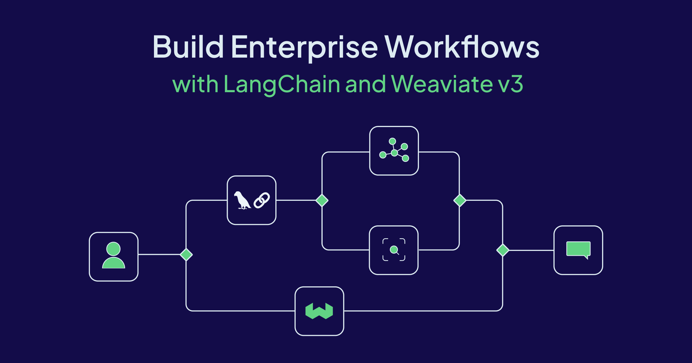

As demand for generative AI applications grows, so does the complexity of the infrastructure needed to support them. Developers today are no longer working with a single database or a single data source. They need flexible, robust, and scalable tools that can streamline their AI workflows and enhance their ability to innovate.

The synergy between **[LangChain’s](https://js.langchain.com/docs/introduction/) flexible interface** and **Weaviate’s powerful vector storage and search** makes them a compelling combo for building modern, scalable, and intelligent applications. Whether you’re prototyping a chatbot, developing a knowledge base, or scaling enterprise AI workloads, these tools provide the flexibility and performance you need.

By abstracting infrastructure complexity and focusing on developer experience, both LangChain and Weaviate are lowering the barrier to entry for AI application development—without compromising on capability or scale. Weaviate supports a wide range of search capabilities, enabling developers to conduct basic similarity searches and more advanced queries with metadata filtering. The real power for Enterprise workflows, however, emerges when you **combine LangChain's orchestration layer with Weaviate’s storage and search capabilities**.

### Example Architecture

Let’s consider a pipeline that ingests customer support tickets, enriches them with embeddings, and enables a retrieval-augmented chatbot to respond to user queries.

1. **Data Ingestion**:
    - Preprocess and embed text using OpenAI or Cohere modules
2. **Storage**:
    - Store the embedded documents in Weaviate with metadata tags for filtering
    - Use Weaviate hybrid search to combine vector and keyword retrieval
    - Use Weaviate RAG to generate chatbot responses
3. **Application Layer**:
    - LangChain orchestrates the search, summarization, and answer generation
    - Use LangChain agents to handle follow-up questions or route to other tools

This workflow is incredibly flexible. If you want to switch from OpenAI to Hugging Face for embeddings, LangChain’s abstractions make it as simple as changing a few lines of code. To enable Hybrid search and RAG via Weaviate, you need to migrate to the Weaviate v3 typescipt client.

### Why migrate to Weaviate typescript v3?

With v3, the typescript client provides full type safety and clear compile-time checks, significantly improving the developer experience by reducing runtime errors. Importantly, the client uses gRPC transport, offering [better performance over previous versions](https://weaviate.io/blog/grpc-performance-improvements) using REST. To understand the differences between version v2 and v3 in detail, check [documentation](https://docs.weaviate.io/weaviate/client-libraries/typescript). 

| **Feature** | **v2 client** | **v3 client** |
| --- | --- | --- |
| Transport | REST + GraphQL | **gRPC (with REST fallback)** |
| Type safety | Minimal | **Full generics & schema inference** |
| Multi‑tenancy helpers | ❌ | 🟢 |
| Streaming results | ❌ | 🟢 |
| RAG | ❌ | 🟢 |
| Hybrid search | ❌ | 🟢 |

### Installing Dependencies

Install the required npm packages. 

```python
npm install weaviate-client @langchain/core @langchain/weaviate openai dotenv -D
```

### Initiating Weaviate store in Langchain

To initiate Weaviate store in Langchain, we need to first create an instance of Weaviate client. Use one of the connection helper functions to connect to a weaviate instance. 

- `connectToWeaviateCloud`
- `connectToLocal`
- `connectToCustom`

If connecting to Weaviate cloud, you’d need both an API key and a url. Configure the necessary environment variables, as shown below. If your model needs an API key to access it, include them too. To learn more how to configure and use the v3 client, visit [this page](https://weaviate.io/developers/weaviate/client-libraries/typescript/typescript-v3).

```python
export WEAVIATE_URL="https://[url]:8080"
export WEAVIATE_API_KEY="<YOUR-API-KEY>"
export OPENAI_API_KEY="<YOUR-OPENAI-KEY>"
export COHERE_API_KEY="<YOUR-COHERE-KEY>"
```

If using a model that requires an API key, pass these in the headers param, as shown below.

```python
import weaviate, { ApiKey } from 'weaviate-client';

const weaviateClient = weaviate.connectToWeaviateCloud(
		clusterURL: process.env.WEAVIATE_URL!,
		options : {
				authCredentials: new weaviate.ApiKey(process.env.WEAVIATE_API_KEY || ""),
				headers: {
						"X-OpenAI-Api-Key": process.env.OPENAI_API_KEY || "",
						"X-Azure-Api-Key": process.env.AZURE_OPENAI_API_KEY || "",
				},
		}
);
```

Next, use Weaviate client to initiate a vector store in Langchain. `indexName` is the name of the collection, while `metadataKeys` are the other fields for the collection. If [auto-schema](https://docs.weaviate.io/weaviate/config-refs/schema#auto-schema) is enabled, Weaviate can infer missing elements and add them to the collection definition. 

```python
import { OpenAIEmbeddings } from '@langchain/openai';
import { WeaviateStore } from '@langchain/weaviate';

const weaviateStore = new WeaviateStore(
		new OpenAIEmbeddings(), 
		{
				client: weaviateClient,
				indexName: "Langchainjs_test",
				textKey: "text",
				metadataKeys: ["source"],
		}
);
```

It is a best practice to manually define as much of the data schema as possible since manual definition gives you the most control. Following is a simple example of a collection/schema definition. To learn more configuration options, visit the [collection](https://docs.weaviate.io/weaviate/starter-guides/managing-collections#collection-definitions-in-detail) docs. 

```python
import { OpenAIEmbeddings } from '@langchain/openai';
import { WeaviateStore } from '@langchain/weaviate';

const weaviateStore = new WeaviateStore(
		new OpenAIEmbeddings(), 
		{
				client: weaviateClient,
				schema: {
				    name: "Simple",
				    description: "A simple dataset",
				    properties: [
				      {
				        name: "title",
				        dataType: dataType.TEXT,
				      },
				      {
				        name: "foo",
				        dataType: dataType.TEXT,
				      },
				    ],
				    multiTenancy: weaviate.configure.multiTenancy({enabled: true})
				},
		}
);
```

If `schema` is provided, the values within it’s definition (collection name, metadata/properties etc.) will take precedence. 

### Indexing Data

Documents can be indexed in bulk efficiently, with embeddings generated via providers such as OpenAI.

```python
const weaviateStore = await WeaviateStore.fromTexts(
		["hello world", "hi there", "how are you", "bye now"],
		[{ foo: "bar" }, { foo: "baz" }, { foo: "qux" }, { foo: "bar" }],
		new OpenAIEmbeddings(),
		{
				weaviateClient,
				schema
		}
);
```

### Search - Semantic and Hybrid

Semantic search is done by comparing the vector embeddings of the items in the database. 

```python
const results = await weaviateStore.similaritySearch(
			"hello world", 
			1
));
```

**Using Filters**

The `Filter` helper class makes it easier to use filters with conditions. The v3 client streamlines how you use `Filter` so your code is cleaner and more concise. Check [this page](https://weaviate.io/developers/weaviate/api/graphql/filters) on more ways to use filters

```python
const results = await weaviateStore.similaritySearch(
			"hello world", 
			1, 
			weaviateClient.collections.get(collectionName).filter
						.byProperty("foo").equal("baz")
));
```

### Hybrid search

Blend vector, keyword, and multimodal techniques to deliver accurate, contextual search with less complexity. `Hybrid` search combines the results of a vector search and a keyword (BM25F) search by fusing the two result sets. To change the relative weights of the keyword and vector components, set the `alpha` value in your query (default value of alpha is `0.75` )

Check [docs](https://docs.weaviate.io/weaviate/search/hybrid) for all the options you can use with hybrid search. 

```python
const results = await weaviateStore.hybridSearch(
		"greeting", 
		{
	      limit: 1,
	      rerank: {
		        property: "title",
		        query: "greeting",
	      },
	      targetVector: ["title"],
		}
);
```

For hybrid search to work, you need to provide a vectorizer when defining the schema. Below is an example with named vectors. Learn more about [vectorizers](https://docs.weaviate.io/weaviate/manage-collections/vector-config) and [named vectors](https://docs.weaviate.io/weaviate/search/multi-vector) in the docs. 

```python
import { OpenAIEmbeddings } from '@langchain/openai';
import { WeaviateStore } from '@langchain/weaviate';

const schemaWithNamedVectors = {
    name: "Simpler",
    description: "A simple dataset",
    properties: [
      {
        name: "title",
        dataType: dataType.TEXT,
        vectorizePropertyName: true, // (Optional)
        tokenization: tokenization.LOWERCASE, // (Optional)
      },
      {
        name: "foo",
        dataType: dataType.TEXT,
      },
    ],
    vectorizers: [
      vectorizer.text2VecOpenAI({
        name: "title",
        sourceProperties: ["title"], // (Optional) Set the source property
      }),
    ],
  };
  
const weaviateStore = new WeaviateStore(
		new OpenAIEmbeddings(), 
		{
				client: weaviateClient,
				schema: schemaWithNamedVectors,
		}
);
```

### RAG

Retrieval augmented generation (RAG) is a way to combine the retrieval capabilities of semantic search and the generation capabilities of large language models. To use RAG, define a generative module in your schema as shown below.

```python
import { OpenAIEmbeddings } from '@langchain/openai';
import { WeaviateStore } from '@langchain/weaviate';

const schema = {
    name: "Generative",
    properties: [
      {
        name: "title",
        dataType: dataType.TEXT,
      },
      {
        name: "foo",
        dataType: dataType.TEXT,
      },
    ],
    generative: weaviate.configure.generative.openAI(),
  };
  
const weaviateStore = new WeaviateStore(
		new OpenAIEmbeddings(), 
		{
				client: weaviateClient,
				schema: schema,
		}
);
```

A 'single prompt' generation will perform RAG queries on each retrieved object. This is useful when you want to transform each object separately, with the same prompt.

```python
const results = await weaviateStore.generate("hello world",
    {           
      singlePrompt: {prompt: "Translate this into German: {title}",},
    },
    {
      limit: 1,  // search options
    }
);
      
results.generated: "Hallo Welt";
```

A 'grouped task' generation will perform RAG queries on the set of retrieved objects. This is useful when you want to transform the set of objects as a whole, with one prompt.

```python
const results = await weaviateStore.generate("all greetings",
    {           // generate options
      groupedTask: {prompt: "Translate these into German",},
    },
    {
      limit: 5,  // search options
    }
);
```

---

## Future Directions

Looking ahead, the ecosystem around LangChain and Weaviate is only going to get more powerful. Below are some additional exciting integrations

- **Evals and Guardrails Integration**: Using tools like [Weights & Biases](https://wandb.ai/site/) for traces, guardrails and evaluations of LLMs. We shall see more of this in an upcoming post.
- **Event-driven Architectures**: Combining LangChain and Weaviate with [streaming platforms (e.g., Kafka)](https://weaviate.io/blog/weaviate-apache-kafka-connector) for real-time, AI-powered reactions.

import WhatsNext from '/_includes/what-next.mdx'

<WhatsNext />