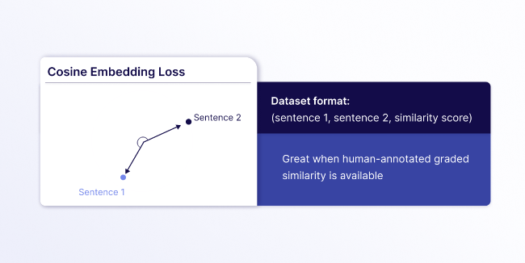

Embedding models are at the core of many natural language processing (NLP) tasks, including retrieval-intensive generative AI systems. However, off-the-shelf embedding models are often limited to general knowledge and not company- or domain-specific knowledge. Customizing an embedding model through fine-tuning can improve the retrieval performance and thus the end-to-end performance of your [Retrieval-Augmented Generation (RAG)](/blog/introduction-to-rag) system.

This article explains why, when, and when not to fine-tune an embedding model and its key considerations, including best practices and common pitfalls. Note that this blog focuses on text embedding models, although many concepts apply to multimodal models as well.

## Why You Should Fine-Tune an Embedding Model

Fine-tuning an embedding model can improve the performance of your retrieval pipeline when off-the-shelf models fail to effectively capture domain-specific nuances. Embedding models power modern vector search pipelines. When the performance of your vector search pipeline isn’t meeting your performance requirements, there are many different root causes for it. (see "When (and When Not) to Fine-Tune an Embedding Model") For example, if the model misses domain-specific semantic relationships, fine-tuning it can potentially improve the retrieval performance.

Pre-trained embedding models are typically trained on large, general-purpose datasets like [books](https://huggingface.co/datasets/bookcorpus/bookcorpus), [Wikipedia](https://huggingface.co/datasets/wikimedia/wikipedia), or [web-crawl data](https://huggingface.co/datasets/Skylion007/openwebtext). This limitation can lead to suboptimal performance when using these pre-trained embeddings for specialized tasks or domains, such as legal, medical, or technical domains.

Embedding models specialized in dealing with financial, legal, or healthcare documents are already available. You can refer to the MTEB leaderboard to see if there is already a domain-specific model for your purposes, but note that the leaderboard performance doesn’t always translate to use case-specific performance.

However, even those domain-specific models can be insufficient if you work in a specialized niche or require the model to understand your domain- or company-specific terms.

Thus, if your off-the-shelf embedding model does not sufficiently capture domain- or company-specific contextual relationships, fine-tuning it on a custom dataset can have the following advantages:

- Improve retrieval performance and thus improve performance of downstream tasks (e.g., RAG system performance)
- Potentially lower cost and latency because smaller fine-tuned embedding models can sometimes outperform larger general-purpose alternatives for domain-specific tasks

## When (and When Not) to Fine-Tune an Embedding Model

Should you always fine-tune an embedding model when your retrieval performance is not satisfactory? No.

Vector search can lead to bad performance for many different reasons. Here are some questions to help you debug why your retrieval pipeline might not be meeting your performance requirements:

- Do you have many queries requiring exact keyword matches? Then, you might want to explore [keyword](https://docs.weaviate.io/weaviate/concepts/search/keyword-search) or [hybrid search](https://docs.weaviate.io/weaviate/concepts/search/hybrid-search) techniques before spending time and computing resources fine-tuning an embedding model.
- Are you using the right chunking technique? Maybe the chunking technique you’re currently using is either resulting in chunks with too little context, oddly split chunks, or too large chunks. Look at a few chunks and evaluate if you might need to experiment with another chunking technique, such as [late chunking](/blog/2024-09-05-late-chunking/).
- Is your embedding model capturing enough contextual nuances? If it does not understand semantic relationships in general and domain knowledge, try a model with more dimensions or a [late-intreaction model](/blog/2025-04-09-late-interaction-overview/) first.
- Is your embedding model only failing to capture domain- or company-specific semantic relationships? Then fine-tuning might be the right choice.

As you can see, before blindly fine-tuning an embedding model, it is important to evaluate whether your use case can benefit from domain-specific fine-tuning.

## Key Considerations for Fine-tuning Embedding Models

This section explains key considerations for fine-tuning embedding models. It covers computational requirements, choosing the right base model, creating a fine-tuning data set, how fine-tuning works, and evaluating its effect on the retrieval quality.

### Cost and Computational Requirements for Fine-Tuning

Fine-tuning a pre-trained embedding model usually does not require as many computational resources as pre-training one:

- Fine-tuning pipelines of smaller models with smaller datasets can even be run on consumer-grade GPUs or the free tier of Google Colab.
- If you want to scale your fine-tuning pipeline, you may need to adapt the training pipeline to run on larger GPUs or suitable cloud platforms like AWS or Google Cloud.

Since fine-tuning can be done with fewer computational resources than pre-training and often only requires training for a few epochs, the total cost of fine-tuning a model can be as little as [a few dollars](https://www.philschmid.de/fine-tune-embedding-model-for-rag#4-fine-tune-embedding-model-with-sentencetransformerstrainer) for simpler tasks.

### Choosing a Base Embedding Model for Fine-Tuning

First, you need to decide which model you will use as your starting point. The [Massive Text Embedding Benchmark (MTEB)](https://huggingface.co/spaces/mteb/leaderboard) is a great source for finding the right embedding model for your purpose. [We recommend starting with a light-weight model.](/blog/how-to-choose-an-embedding-model) The general assumption is that a smaller, fine-tuned model can outperform a larger, general-purpose one on domain-specific tasks.

Note that your choice of model will impact how you can customize it:

- Open-weight pre-trained models with permissive licenses, like `all-MiniLM-L6-v2` or `BAAI/bge-base-en-v1.5` can be fine-tuned using Hugging Face's `sentence-transformers` Python library.
- For proprietary embedding models from providers like OpenAI or Cohere, check beforehand whether fine-tuning is offered through an API.

### Evaluating a Base Embedding Model for Fine-Tuning

We recommend setting up an evaluation pipeline to see if fine-tuning improves retrieval for your task. This lets you compare the baseline model's performance to the fine-tuned model's.

Changing the embedding model affects downstream results and requires extra work, such as re-embedding and re-indexing all data. You should only change the model if it improves performance enough to justify the cost.

Therefore, it is important to first evaluate the performance of the base model on your use case to determine if your use case could benefit from customizing the embedding model. This evaluation will also serve as the baseline model to compare the fine-tuned model against.

To evaluate retrieval performance, we will first need to prepare an evaluation dataset. Note that retrieval performance is evaluated using a dataset of queries and their corresponding relevant documents from a corpus of documents. The structure of the evaluation dataset is thus different from that of the fine-tuning dataset (see "Preparing and Curating a Fine-Tuning Dataset"). Similar to other machine learning training, make sure your training dataset is separate from the evaluation dataset to avoid overfitting and data leakage.

During evaluation, the top-k most similar documents according to the embedding model are evaluated against the ground truth relevant documents for each query with a [retrieval metric](/blog/retrieval-evaluation-metrics), such as:

- Mean Reciprocal Rank (MRR),
- Recall@k and Precision@k,
- Mean Average Precision (MAP), and
- Normalized Discounted Cumulative Gain (NDCG).

If you are already working with the Hugging Faces `sentence-transformers` library, you can use the `InformationRetrievalEvaluator`. Alternatively, there are other libraries, such as `pytrec_eval`, available.

### Preparing and Curating a Fine-Tuning Dataset

The quality of your training dataset will greatly impact the quality of your fine-tuned embedding model. Therefore, carefully curating a high-quality dataset is an important step in the fine-tuning process, similar to training other machine learning models.

There are three different ways you can obtain a training dataset for fine-tuning an embedding model:

- Use an already available dataset from Hugging Face, Kaggle, or similar
- Manually create a dataset
- Generate a synthetic dataset

The number of samples you will need to fine-tune a text embedding model depends on the task's complexity:

- For simpler tasks like binary classification, a few high-quality samples are a good starting point.
- You will likely need more samples for more complex tasks, where the model needs to capture nuanced semantic relationships between terms.

A good practice is to start with a baseline of around 1,000 to 5,000 high-quality samples for narrow domains with good vocabulary overlap and evaluate the performance on a validation set. If the results plateau, incrementally add more data. Plan for 10,000+ samples for complex domains with specialized terminology.

Note that - depending on your loss function - it is also important to make sure you don't have duplicate data points. Some loss functions like Multiple Negatives Ranking Loss treat other samples in the batch as negative pairs (see next section).

### How Does Fine-Tuning an Embedding Model Work?

In simple terms, fine-tuning an embedding model adjusts the distance of specific texts in vector space. Unlike fine-tuning large language models (LLMs), fine-tuning embedding models uses different contrastive methods. These differ in training data format and loss function based on your goal.

Unlike traditional supervised learning, which requires explicit labels, contrastive fine-tuning leverages the inherent structure in the training data. The core principle is that the model learns vector representations by answering the question, “Given this anchor data point, which of the candidates is most similar?”

The loss function plays a critical role in the fine-tuning process because it measures how well the embedding model performs on a given batch of data and guides the optimization process accordingly. The choice of the loss function depends on your target task and impacts the required dataset format.

Let's explore a few approaches to give you a better intuition:

- **Multiple Negatives Ranking Loss:** Requires simple text pairs of related sentences (`query`, `context`). It doesn’t require you to explicitly provide negative samples because it treats all other examples in the batch as negatives, which makes it a popular technique. Many modern embedding models use variants of this loss for tasks like semantic search.
    
    
    
- **Triplet Loss:** Requires text triplets consisting of (`anchor`, `positive`, `negative`) with careful data preparation to find meaningful triplets. This is great for cases when you need precise control over what is similar or dissimilar, but it can be difficult to curate a good dataset because you need to find meaningful hard negatives to avoid trivial triplets. Hard negatives are examples that are similar to the anchor but should be ranked lower than the positive example.
    
    
    
- **Cosine Embedding Loss:** Requires sentence pairs with a similarity score indicating how related they are (`sentence_A`, `sentence_B`, `score`). This is ideal for cases where you have different grades of similarity rather than binary relevant/irrelevant judgments.
    
    
    

During training, the optimization process adjusts the model's parameters to pull positive pairs closer together in the embedding space while pushing negative pairs further apart. This creates a representation space where semantically similar content naturally groups together, enabling effective retrieval and similarity search.

### Best Practices for the Fine-tuning Process

Like common machine learning fine-tuning, hyperparameter tuning through extensive experimentation is recommended to avoid challenges like overfitting. Running hyperparameter sweeps over key hyperparameters like number of epochs, learning rate, batch size, etc., can help you find the best hyperparameter configuration that leads to the best retrieval performance. Make sure you have a robust cross-validation strategy in place.

Additionally, using a model registry to track your embedding models can be helpful, especially if you plan on regularly updating them with fresh data.

## How to use a custom embedding model with a Weaviate vector database

You can use any custom fine-tuned dense embedding model with a Weaviate [vector database](/blog/what-is-a-vector-database) instance by using the [Bring Your Own Vectors (BYOV) approach](https://docs.weaviate.io/weaviate/starter-guides/custom-vectors) of specifying the vectors at import and query time manually.

However, for some custom models, you have the option to use them through one of Weaviate’s vectorizer modules. This section explains how you can use a custom fine-tuned embedding model as a vectorizer with Weaviate to automatically generate embeddings at import and query time without manual overhead.

This blog post assumes you have fine-tuned an embedding model and pushed it to the Hugging Face hub. Once an embedding model is available on the Hugging Face hub, you can use it as a vectorizer either through the [Hugging Face integration](https://docs.weaviate.io/weaviate/model-providers/huggingface/embeddings) or through the [AWS integration](https://docs.weaviate.io/weaviate/model-providers/aws/embeddings) after deploying the model as an Amazon SageMaker endpoint (make sure you have at least version [v1.31.2](https://github.com/weaviate/weaviate/releases/tag/v1.31.2) for this option).

### Option 1: Vectorize with Hugging Face module

Weaviate tightly integrates with Hugging Face. You can use any dense, single-vector embedding model hosted on the Hugging Face hub with your Weaviate vector database instance easily through the [Hugging Face integration](https://docs.weaviate.io/weaviate/model-providers/huggingface/embeddings).

To use the Hugging Face integration, you will need to provide your Hugging Face API key in addition to the Weaviate Cloud API key and URL when you connect to your Weaviate client.

```python
import os
import weaviate
from weaviate.classes.init import Auth

weaviate_url = os.environ["WEAVIATE_URL"]
weaviate_api_key = os.environ["WEAVIATE_API_KEY"]
hf_token = os.environ["HF_TOKEN"]

headers = {
    "X-HuggingFace-Api-Key": hf_token,
}

client = weaviate.connect_to_weaviate_cloud(
    cluster_url=weaviate_url,
    auth_credentials=Auth.api_key(weaviate_key),
    headers=headers
)
```

With the Hugging Face integration, using a custom fine-tuned embedding model is as simple as passing the model name as your vectorizer when defining your collection.

```python
from weaviate.classes.config import Configure

client.collections.create(
    name="DemoCollection",
    vector_config=[
        Configure.Vectors.text2vec_huggingface(
            name="title_vector",
            source_properties=["title"],
                model="<custom_embedding_model_name>",
    ),
    # Additional parameters not shown
)
```

### Option 2: Vectorize with Amazon SageMaker module

Weaviate tightly integrates with Amazon SageMaker. Through the AWS SageMaker integration, you can easily use any dense, single-vector embedding model deployed as an Amazon SageMaker endpoint with your Weaviate vector database instance.

Once you have [deployed your embedding model from the Hugging Face hub to a SageMaker endpoint](https://github.com/huggingface/notebooks/blob/main/sagemaker/31_deploy_embedding_models/sagemaker-notebook.ipynb), verify that your endpoint was deployed successfully and can be used for inference. For this, you can check the AWS Management Console for SageMaker. Under “Inference” from the navigation pane, you can select “Endpoints” and verify that your embedding model is deployed successfully.


To use the Amazon SageMaker integration, you will need to provide your [access key based AWS credentials](https://docs.aws.amazon.com/IAM/latest/UserGuide/id_credentials_access-keys.html) in addition to the Weaviate Cloud API key and URL when you connect to your Weaviate client.

```python
import os
import weaviate
from weaviate.classes.init import Auth

weaviate_url = os.environ["WEAVIATE_URL"]
weaviate_api_key = os.environ["WEAVIATE_API_KEY"]
aws_access_key = os.environ["AWS_ACCESS_KEY"]
aws_secret_key = os.environ["AWS_SECRET_KEY"]

headers = {
    "X-AWS-Access-Key": aws_access_key,
    "X-AWS-Secret-Key": aws_secret_key,
}

client = weaviate.connect_to_weaviate_cloud(
    cluster_url=weaviate_url,
    auth_credentials=Auth.api_key(weaviate_key),
    headers=headers
)
```

With the AWS SageMaker integration, you can use a custom fine-tuned embedding as your vectorizer by defining the `service` as `"sagemaker"`, you specific AWS `region` and your SageMaker endpoint name (e.g., “TEI-…”).

```python
from weaviate.classes.config import Configure

client.collections.create(
    "DemoCollection",
    vector_config=[
        Configure.Vectors.text2vec_aws(
            name="title_vector",
            source_properties=["title"],
            region="eu-north-1",
            service="sagemaker",
            endpoint="<custom_sagemaker_url>",
        )
    ],
    # Additional parameters not shown
)
```

Note, don’t forget to delete it once you’re done using the SageMaker endpoint.

## Summary

This article walked you through the process of determining whether your application can benefit from fine-tuning a text embedding model to improve the retrieval performance in your RAG system and how to achieve it. People often overlook fine-tuning embedding models when building RAG applications or recommender systems. This article gave an overview of key points for fine-tuning embedding models. It covered how to create a custom fine-tuning dataset and how to check if your fine-tuned model is worth changing to.

You can find the recipe notebooks for how to use the Hugging Face and Amazon SageMaker modules in Weaviate’s recipes GitHub repository:

- [Hugging Face notebook](https://github.com/weaviate/recipes/blob/main/weaviate-features/similarity-search/similarity_search_huggingface.ipynb)
- [AWS SageMaker notebok](https://github.com/weaviate/recipes/blob/main/weaviate-features/similarity-search/similarity_search_aws_sagemaker.ipynb)

import WhatsNext from '/_includes/what-next.mdx'

<WhatsNext />