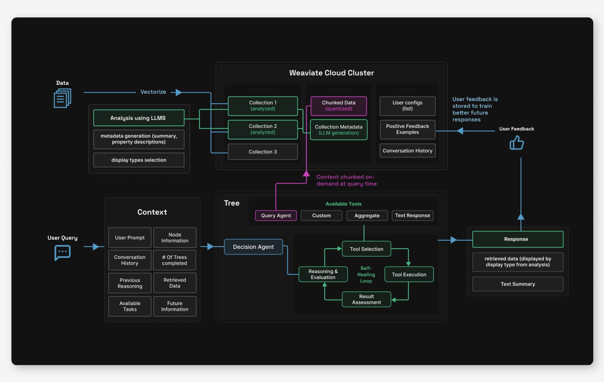
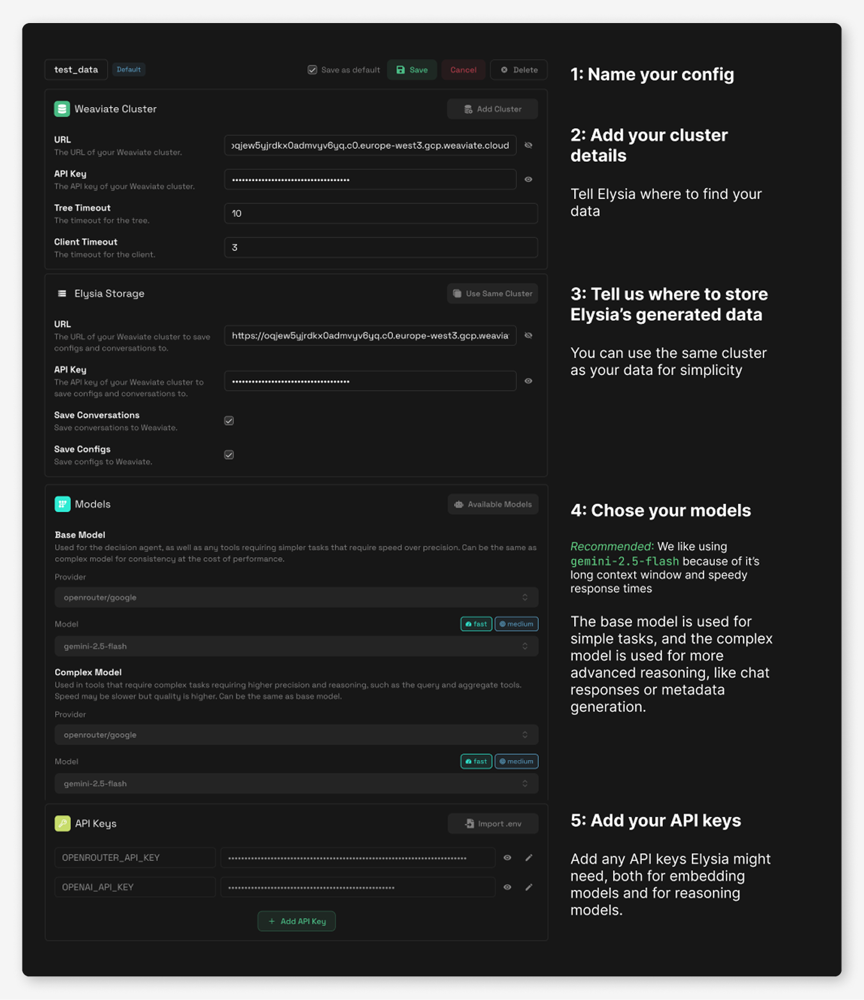
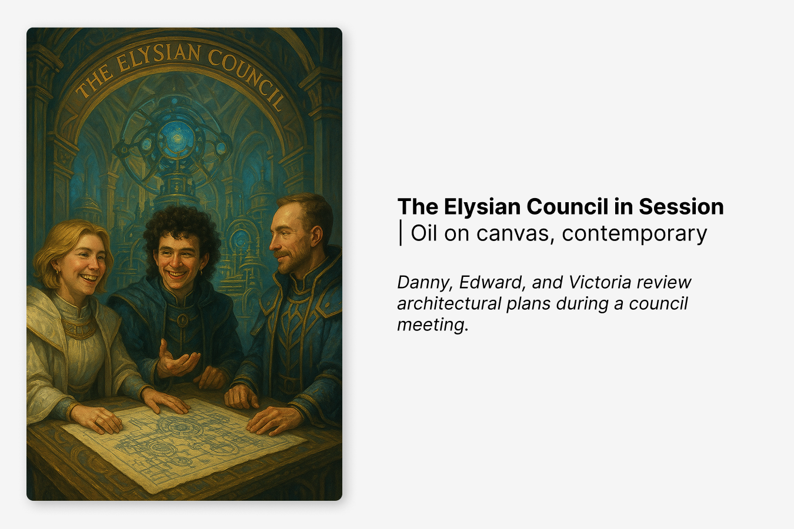

## Introduction: What is Elysia?

In a world where AI chatbots are increasingly common, most still suffer from the same limitation: they're text in, text out. But what if your AI could dynamically decide not just what to say, but how to show it? What if it could learn from your preferences, intelligently categorize, label, and search through your data, and provide complete transparency into its decision-making process?

Enter [Elysia](https://github.com/weaviate/elysia) – our open-source, agentic RAG framework that represents a fundamental rethink of how we interact with our data through AI.

Elysia is a decision tree based agentic system which intelligently decides what tools to use, what results have been obtained, whether it should continue the process or whether its goal has been completed. It offers both a **full frontend interface** and an easily **pip-installable** **Python package.**

Out of the box, the Elysia app can connect to your [Weaviate cluster](https://console.weaviate.cloud/) and perform smart searches - automatically generating unique filters and search parameters based on just natural language from the user - and display the results dynamically on the frontend.

The entire project is open source and designed with customization in mind. You can use it as-is, for effective searching of your data, or you can install the python package and easily create tools to use Elysia for whatever purposes you need an agentic AI for.

import elysia from './img/elysia.mp4';

<video width="100%" autoplay loop controls>
  <source src={elysia} type="video/mp4" />
Your browser does not support the video tag.
</video>

## How Does It Work?

Elysia is architectured as a modern web application with a full-featured frontend for a responsive, real-time interface and a FastAPI backend serving both the web interface and API. The core logic is written in pure Python – what we call "blood, sweat, and tears" custom logic – with [DSPy](https://docs.weaviate.io/integrations/llm-agent-frameworks/dspy) handling LLM interactions for flexible, future-proof implementations. 

We’ve aimed to make [getting started](#getting-started) as easy as possible - everything comes in a single pip-installable package. To use Elysia as an app, you need a [Weaviate Cloud](https://console.weaviate.cloud/) instance with your data. Once installed with `pip install elysia-ai`, you can either run the full web interface with `elysia start` or use it as a Python library by importing it and initializing the tree object for programmatic queries.

```bash
pip install elysia-ai
elysia start
```

:::info

You can sign up for a free 14-day sandbox in Weaviate Cloud with this link: [https://console.weaviate.cloud](https://console.weaviate.cloud) 

:::

To get started in the web application, simply head over to the “Settings” tab to create your first config, add your Weaviate Cluster details and your chosen model provider and keys, give it a name, and click save. Then, you can go to the “Data” tab to analyze your collections, and tada! Agentic RAG ready to go. Users are also able to create multiple configs that allow you to switch between data clusters or model providers easily. 

Behind the scenes of this pretty web app and easy-to-use python library, there’s actually quite a bit going on. Mainly, there are three components of Elysia’s design that we haven’t seen combined in **any other** open source agentic framework: a customizable decision-tree architecture, dynamic data display types, and AI data analysis and awareness.



## The Three Pillars of Elysia

### 1. Decision Trees and Decision Agents

At the heart of Elysia is its decision tree architecture. Unlike simple agentic platforms which have access to all possible tools at runtime, Elysia has a pre-defined web of possible nodes, each with a corresponding action. Each node in the tree is orchestrated by a decision agent with global context awareness about its environment and its available options. The decision agent evaluates its environment, available actions, past actions and future actions to strategize the best tool to use.

The decision agent also outputs reasoning, which is handed down to future agents to continue working towards the same goal. Each agent will be aware of previous agents' intentions.


The tree structure also enables advanced error handling mechanisms and completion conditions. For example, the agents can set an "impossible flag" during a tree step when they determine a task cannot be completed with available data. So, if you ask about trouser prices in an e-commerce collection but only have a jewelry collection available, the agent will recognize this mismatch and report back to the decision tree that the task is impossible. Likewise, if Elysia queries and finds irrelevant search results, this won't constitute a failure. Upon returning to the decision tree, the agent can recognize it should query again with different search terms, or less strict filters.

Additionally, when tools encounter errors - perhaps due to connection issues or typos in generated queries - these are caught and propagated back through the decision tree. The decision agent can then make intelligent choices about whether to retry with corrections or try a different approach entirely. To prevent infinite loops, there's a hard limit of passes through the decision tree.

This whole structure enables a lot flexibility for developers. Users can [add custom tools](https://weaviate.github.io/elysia/creating_tools/) and branches, making the tree as complex or simple as needed. Tools can be configured to run automatically based on specific criteria – for instance, a summarization tool might activate when the chat context exceeds 50,000 tokens. Other tools can remain invisible until certain conditions are met, only appearing as options when they're relevant to the current state.

Real-time observability is one of the things that we feel sets Elysia apart from other black-box AI systems. The frontend displays the entire decision tree as it's traversed, allowing you to watch the LLM's reasoning within each node as it processes your query. This transparency helps users understand exactly why the system made particular choices and fix issues when they arise.


  

### 2. Displaying data sources in dynamic formats

While other AI assistants are limited to text responses (or sometimes image and text), Elysia can **dynamically choose how to display data** based on what makes the most sense for the content and context. The system currently has seven different display formats: generic data display, tables, e-commerce product cards, (GitHub) tickets, conversations and messages, documents, and charts.

import displaytypes from './img/displaytypes.mp4';

<video width="100%" autoplay loop controls>
  <source src={displaytypes} type="video/mp4" />
Your browser does not support the video tag.
</video>

###

But how does Elysia know what display type to use for your specific data?

In advance of any Weaviate tool usage, Elysia will analyze your collections. An LLM examines the data structure by sampling it, checking fields, creating summaries, and generating metadata. Based on this analysis, it recommends the most appropriate display formats from the available options. Users can also manually adjust these display mappings to better suit their needs.

In the future, we also see this structure enabling us to build features that allow different displays to do different follow-up actions. A hotel display might include booking capabilities, a Slack conversation display could enable direct replies, and a product card might offer add-to-cart functionality. This could be one step further in transforming Elysia from a passive information retriever into an active assistant that helps users take action based on their data.

We’ll continue adding more display types to increase the level of customizability possible, allowing Elysia to adapt to virtually any use case or industry-specific need.

:::info

We would love to see the open source community contribute their own custom display types! Submit a PR here: [https://github.com/weaviate/elysia/pulls](https://github.com/weaviate/elysia/pulls)

:::

### 3. Elysia is an automatic expert on your data

Naive RAG systems, like our very own [Verba](https://github.com/weaviate/Verba), can deeply struggle with complex data, multiple data types or locations, or data that is repeated or similar, because **they don't have the full picture of the environment they're working with**. After seeing the community struggling with this (and struggling ourselves 😅), we decided this was one of the main things that Elysia needed to help with.

As mentioned above, after connecting your Weaviate Cloud instance to Elysia, an LLM analyzes your collections to examine the data structure, create summaries, generate metadata, and choose display types. This isn't just useful information for users to see - it significantly enhances Elysia's ability to handle complex queries and provide knowledgeable responses. This capability was lacking in previous systems like Verba, which often failed with ambiguous data due to it’s blind search approach.

Generating metadata actually proved pretty essential for handling complex queries and tasks within the tree. The other traditional RAG and querying systems we’ve seen often perform blind vector searches without knowing the overall structure and meaning of the data they're searching through, and just hope for relevant results. But with Elysia, we built the system to **understand and take into account the structure and content of your particular data** before performing actions like querying. 

The web platform also features a comprehensive data explorer with BM25 search, sorting, and filtering capabilities. It automatically groups unique values within fields and provides min/max ranges for numeric data, giving both Elysia and users a clear understanding of what's available.

The data dashboard provides a high-level overview of all available collections, while the collection explorer allows detailed inspection of individual datasets. When viewing table data, we give you a full object view for selected entries, so that that large and nested data objects can be displayed in a structured, readable format. Additionally, within the metadata tab, users can edit the LLM-generated metadata, display types, and summaries because, as we all know, LLMs are *far* from perfect.


import elysiadatatab from './img/elysiadatatab.mp4';

<video width="100%" autoplay loop controls>
  <source src={elysiadatatab} type="video/mp4" />
Your browser does not support the video tag.
</video>


## Other Cool Features We Built

### The Feedback System: AI That Learns From You

The feedback system we’ve implemented goes *way* beyond simple ratings. Each user maintains their own set of feedback examples stored in within their Weaviate instance. When you make a query, Elysia first searches for similar past queries you've rated positively using vector similarity matching.


The system can then use these positive examples as a **few-shot demonstration**, enabling better responses with smaller models. If you've been using larger, more expensive models for complex tasks and rating the outputs positively, Elysia can use those high-quality responses as examples for smaller, faster models on similar queries. Over time, this reduces costs and improves response speed while still maintaining quality.

Keeping the interactions independent to single users ensures that individual preferences don't pollute others' experiences, and that data stays secure. The feature activates with a simple configuration checkbox and operates transparently in the background, continuously improving the entire system simply based on your interactions.

### Chunk-On-Demand: Smarter Document Processing

Traditional RAG systems pre-chunk all documents, which can increase storage requirements by a *lot*. This is another thing we saw the community struggling with, and so the solution we came up with was to **chunk at query time**, instead of having to deal with pre-chunking strategies. Initial searches use document-level vectors, which provide a good overview of the main points of a document, but not the relevant sections within. When documents exceed a token threshold and prove relevant to the query, Elysia will step in and dynamically chunk them.

The system stores these chunks in a parallel, quantized collection with cross-references to the original documents. This means subsequent queries for similar information can leverage previously chunked content, making the system more efficient over time. This approach reduces storage costs while maintaining or even improving retrieval quality.

Looking ahead to future versions, this architecture could also enable flexible chunking strategies. Different document types could use different chunking methods - code might be chunked by function or class boundaries, while prose might use semantic or simply fixed-size chunking.

### Serving Frontend Through Static HTML

One of the other problems we wanted to solve is how we could serve a NextJS frontend without having to spin up both a backend *and* a frontend server. We figured out that we could serve Elysia’s frontend as static HTML through FastAPI, eliminating the need for a separate Node.js server. This architectural change means everything can run from a single Python package, helping to simplify the deployment process and reducing operational complexity. A simple pip install provides a complete, production-ready application that can be deployed anywhere Python runs. Pretty cool, right?

### Multi-Model Strategy

In addition to the feedback system allowing for the interchange between small and large models without quality loss, Elysia intelligently **routes different tasks to appropriate model sizes based on task complexity**. Small, lightweight models handle decision agents and simple tasks, while larger, more powerful models are reserved for complex tool operations requiring deeper reasoning. We’ve defaulted to Gemini while building because of it’s super good performance while also having a super large context window, fast speeds, and cost-effectiveness. 

However, one of the main parts we love about the Weaviate ecosystem and development is always being flexible in which providers, tools, and integrations we can choose. So of course, all model choices remain fully customizable through a configuration file, supporting almost any provider, including local models. Going deeper, users can also configure different models for different parts of the system, optimizing for their specific performance, security, cost, and latency requirements.

### Customize your blob

Personalization of the whole app UI is one of the features we’ll continue to work on for future versions, but for now, you can get a taste of it by customizing your own Elysia blob that’s saved persistently in your app! In the future, these customization features will allow users to rebrand Elysia to fit their own company.

import customizeblob from './img/customizeblob.mp4';

<video width="100%" autoplay loop controls>
  <source src={customizeblob} type="video/mp4" />
Your browser does not support the video tag.
</video>

## The Technical Stack

The technical stack behind Elysia is relatively simple. Elysia's retrieval is powered exclusively by Weaviate - it uses agents to build custom queries or aggregations, as well as using Weaviate's fast vector search for quick retrieval of similar past conversations as well as storing conversation histories. Additionally, we use DSPy, NextJS, FastAPI, and Gemini for our go-to testing model. 

Weaviate provides all the features we needed to build a robust app, like [named vectors](https://docs.weaviate.io/weaviate/manage-collections/vector-config#define-named-vectors), different [search types](https://docs.weaviate.io/weaviate/search) (vector, keyword, hybrid, aggregation), and [filters](https://docs.weaviate.io/weaviate/search/filters). Its native support for [cross-references](https://docs.weaviate.io/weaviate/manage-collections/cross-references) was the basis for the chunk-on-demand feature, so Elysia could maintain relationships between original documents and their dynamically generated chunks. Weaviate's [quantization options](https://docs.weaviate.io/weaviate/configuration/compression) also helped to manage storage costs for the data in our Alpha testing phase release, and the cloud collection setup allows us to easily store generated metadata and user information. 

DSPy serves as the LLM interaction layer. The team (well, really our backend wizard Danny) chose DSPy because it provides a flexible, future-proof framework for working with language models. Beyond basic prompt management, DSPy makes it straightforward to implement few-shot learning, which powers Elysia's feedback system. The framework would also support prompt optimization capabilities that could maybe be included in future releases. 

But, the core logic of Elysia is written in pure Python (and blood, sweat, and tears). Doing this gave us complete control over the implementation and kept the tools we had to work with to a minimum. While the pip install does bring in (a lot of) dependencies from DSPy and other libraries, the core Elysia logic is (in our humble opinions) lean and comprehensible.

## Real-World Example: Powering Glowe's Chat

In order to test whether Elysia actually worked as a flexible agentic framework the way we envisioned it, we decided to use it to power the chat interface in our AI-powered skincare ecommerce app, [Glowe](/blog/glowe-app). 


For the Glowe-Elysia tree, we created three custom tools specifically for the app’s needs: 

1. A query agent tool for finding the right products with complex filters (powered by the [Weaviate Query Agent](https://docs.weaviate.io/agents/query))
2. A stack generation tool that creates product collections specific to a user through natural language
3. A similar products tool that provides recommendations based on the current context and individual user

All the complex functionality – text responses, recursion, self-healing, error handling, and streaming – came built-in with Elysia. We could focus entirely on implementing the logic specific to the app, rather than building all the boring AI infrastructure. 

## Getting Started

Getting up and running with Elysia requires minimal setup. Here’s a step by step:

### Web app

**Step 1: Install dependencies and start app**

Run these commands to launch the web interface

```bash
python3.12 -m venv .venv
source .venv/bin/activate
pip install elysia-ai
elysia start
```

**Step 2: Get some data**

If you don’t already have a Weaviate Cloud cluster with some data in it, head over to the [Weaviate Cloud console](https://console.weaviate.cloud/) and [create a free Sandbox cluster](https://docs.weaviate.io/cloud/quickstart#11-create-a-cluster). 

Then, you can either add data to your cluster by following [the quickstart tutorial](https://docs.weaviate.io/weaviate/quickstart) or by coping this prompt into your favorite vibe coding LLM chat. 


    You are helping a user create a custom Python script to import their data into Weaviate. Follow these steps exactly and **DO NOT modify any code except where explicitly marked with `# LLM TODO:`**.

    ## Step 1: Gather Requirements and Setup Environment

    Ask the user to provide the following information AND complete the environment setup:

    ### Part A: Requirements

    1. **Embedding Model Provider**: What embedding model provider would you like to use?
        - Available options: [https://docs.weaviate.io/weaviate/model-providers](https://docs.weaviate.io/weaviate/model-providers)
        - If unsure, recommend `text2vec-weaviate` (built-in, no API key required)
    2. **Data Location**: Where is your data located?
        - Local file path (e.g., `/path/to/data.json`)
        - URL endpoint
        - Other source
    3. **Data Schema**: Please provide an example object from your data. This will be used to define the property schema.
        - Example: `{"title": "Sample Title", "content": "Sample content text", "category": "example"}`

    ### Part B: Environment Setup

    Please also complete this setup:

    **Create Environment File**
    Create a `.env` file in your project directory with these variables:

    ```
    WEAVIATE_URL=
    WEAVIATE_API_KEY=
    EMBEDDINGS_PROVIDER_API_KEY=

    ```

    **Setup Instructions:**

    - Sign up for a free Weaviate Cloud account: [https://console.weaviate.cloud/](https://console.weaviate.cloud/)
    - Create a free Sandbox cluster
    - Copy your cluster URL and API key to the `.env` file
    - If using `text2vec-weaviate`, leave `EMBEDDINGS_PROVIDER_API_KEY` empty
    - If using another provider, add your API key for that provider

    **WAIT for the user's response to Part A and confirmation that they have completed Part B before proceeding to Step 2.**

    ## Step 2: Virtual Environment Setup

    Check if the user has a virtual environment. If not, instruct them to create one:

    ```bash
    python -m venv .venv
    source .venv/bin/activate  # On Windows: .venv\\Scripts\\activate

    ```

    ## Step 3: Install Dependencies

    Install required packages:

    ```bash
    pip install -U weaviate-client python-dotenv

    ```

    ## Step 4: Generate Custom Import Script

    Create a file called `import_data.py` with the following code. **CRITICAL: Only modify sections marked with `# LLM TODO:`**

    ```python
    import weaviate
    from weaviate.classes.init import Auth
    from weaviate.classes.config import Configure, Property, DataType, Tokenization
    import os
    import json
    from dotenv import load_dotenv

    # Load environment variables
    load_dotenv()

    weaviate_url = os.environ["WEAVIATE_URL"]
    weaviate_api_key = os.environ["WEAVIATE_API_KEY"]
    embeddings_provider_api_key = os.environ.get("EMBEDDINGS_PROVIDER_API_KEY", "")

    # Connect to Weaviate Cloud
    if embeddings_provider_api_key:
        client = weaviate.connect_to_weaviate_cloud(
            cluster_url=weaviate_url,
            auth_credentials=Auth.api_key(weaviate_api_key),
            headers={"X-xx-Api-Key": embeddings_provider_api_key}  # LLM TODO: Replace 'xx' with correct provider header name (e.g., "X-OpenAI-Api-Key", "X-Cohere-Api-Key")
        )
    else:
        client = weaviate.connect_to_weaviate_cloud(
            cluster_url=weaviate_url,
            auth_credentials=Auth.api_key(weaviate_api_key)
        )

    print(f"Weaviate client ready: {client.is_ready()}")  # Should print: True

    # Create collection
    collection = client.collections.create(
        name="YourCollectionName",  # LLM TODO: Replace with appropriate collection name based on user's data
        vector_config=[
            Configure.Vectors.text2vec_weaviate(  # LLM TODO: Replace with user's chosen provider (e.g., text2vec_openai, text2vec_cohere)
                name="default",
                source_properties=["property1", "property2"],  # LLM TODO: Set source properties for vectorization based on user's data schema
            ),
        ],
        properties=[
            # LLM TODO: Define properties based on user's example data
            # Example:
            # Property(name="title", data_type=DataType.TEXT),
            # Property(name="content", data_type=DataType.TEXT),
            # Property(name="category", data_type=DataType.TEXT, skip_vectorization=True),
        ]
    )

    # LLM TODO: Load data based on user's specified location
    # For local JSON file:
    # with open("FILE_PATH", "r") as f:
    #     data = json.load(f)

    # For URL endpoint (note make sure to pip install and import requests library:
    # response = requests.get("YOUR_URL")
    # data = response.json()

    # For other formats, adjust accordingly

    # Import data in batches
    with collection.batch.fixed_size(batch_size=200) as batch:
        for i, item in enumerate(data):
            batch.add_object({
                # LLM TODO: Map user's data properties to collection schema
                # Example:
                # "title": item["title"],
                # "content": item["content"],
                # "category": item["category"],
            })

            if batch.number_errors > 10:
                print("Batch import stopped due to excessive errors.")
                break

            # Progress indicator
            if i % 100 == 0:
                print(f"Imported {i} objects...")

    # Check for import errors
    failed_objects = collection.batch.failed_objects
    if failed_objects:
        print(f"Number of failed imports: {len(failed_objects)}")
        print(f"First failed object: {failed_objects[0]}")
    else:
        print("All objects imported successfully!")

    print(f"Total objects in collection: {collection.aggregate.over_all(total_count=True).total_count}")

    client.close()


    ### LLM TODO Instructions Summary:

    1. **Line with headers**: Replace 'xx' in header name with correct provider (only if not using text2vec-weaviate)
    2. **Collection name**: Choose appropriate name based on user's data type
    3. **Vector config**: Replace with user's chosen embedding provider
    4. **Source properties**: Set which properties should be vectorized
    5. **Properties schema**: Define all properties from user's example data
    6. **Data loading**: Implement correct data loading method based on user's data location
    7. **Object mapping**: Map user's data fields to the defined schema

    ## Step 5: Error Handling

    If there are any errors during execution:

    1. First consult the Weaviate documentation: [https://docs.weaviate.io/weaviate/quickstart](https://docs.weaviate.io/weaviate/quickstart)
    2. Check the specific error message and troubleshoot accordingly
    3. Verify the `.env` file is properly configured
    4. Ensure the data schema matches the actual data structure

    ## Step 6: Execute the Script

    Run the import script:

    ```bash
    python import_data.py

    ```

    Upon successful completion, inform the user that their data has been imported to Weaviate and provide next steps for querying their data.

    ---

    ## Important Reminders:

    - **Only modify code sections marked with `# LLM TODO:`**
    - **Wait for user responses at Steps 1 and 2**
    - **If using `text2vec-weaviate`, no external API key is needed**
    - **Preserve all existing code structure and imports**


:::info

If you’re looking for some datasets to test with, check out these here: [https://huggingface.co/datasets/weaviate/agents](https://huggingface.co/datasets/weaviate/agents)

:::

**Step 3: Add your configuration settings**

In the config editor, you can add your Weaviate Cluster URL and API key and set your models and model provider API keys. You can also create multiple configs that allow you to switch between data clusters or model providers easily. 



In the left menu bar, you can also [customize your very own blob](#customize-your-blob)!

**Step 4: Analyze your data**

Under the `Data` tab in the menu bar on the left hand side, you can analyze your collections, which will prompt an LLM to generate property descriptions, a dataset summary, example queries and select display types for each collection. 

When you click on a data source, you can view all the items in the collection and edit any of the metadata, including choosing additional display types or configuring the property mappings. 

**Step 5: Start chatting**

It’s time to start asking questions! Head over to the `Chat` tab to create a new conversation and chat with your data. If you want to view the decision tree, click the green button on the top left of the chat view to switch to the tree view, and hover over any of the nodes to get the description of the node, instructions for the LLM, and then LLM’s reasoning. Each new user query will generate a new decision tree within this view. 


Settings are also configurable on a per chat level. You can add more detailed Agent instructions, or change up your model settings. 

### As a Python Library

Simply install with:

```bash
pip install elysia-ai
```

And then in Python, using Elysia is as easy as:

```python
from elysia import tree, preprocess
preprocess("<your_collection_name>")

tree = Tree()
tree("What is Elysia?")
```

Using Elysia requires access to LLMs and your Weaviate cloud details, which can be set in your local environment file or configuring directly in Python. The [full documentation](https://weaviate.github.io/elysia/) provides detailed configuration options and examples.

## What's Next?

We’re still cooking 🧑‍🍳

We’ve got several features planned and in progress, including custom theming similar to Verba that will allow users to match Elysia's appearance to their brand. But beyond that, you’ll have to wait and see 👀

## Conclusion: The Future of Agentic RAG

Elysia is more than just another RAG implementation - we built it to show a new approach to what AI applications can be. By combining transparent agent decision-making, dynamic displays, and over-time personalization and optimization, we think we’re on track to creating an AI assistant that understand not just what you're asking, but how to actually present the answer effectively.

 Elysia is eventually going to replace Verba, our original RAG application, as our next step developing cutting-edge applications with vector databases as their core. Going beyond simple Ask-Retrieve-Generate pipelines, we’ve created an infrastructure for developing sophisticated, agentic AI applications while keeping the developer and user experiences simple and straightforward.

Whether you're building an e-commerce chatbot, a internal company knowledge expert, or something entirely new, Elysia provides the foundation for AI experiences that extend beyond just text generation. We can’t wait to see what you build!

So, ready to get started? Visit the [demo](https://elysia.weaviate.io/), check out the [GitHub repository](https://github.com/weaviate/elysia), or dive into the [documentation](https://weaviate.github.io/elysia/) to start building.




---
import WhatsNext from '/_includes/what-next.mdx'

<WhatsNext />