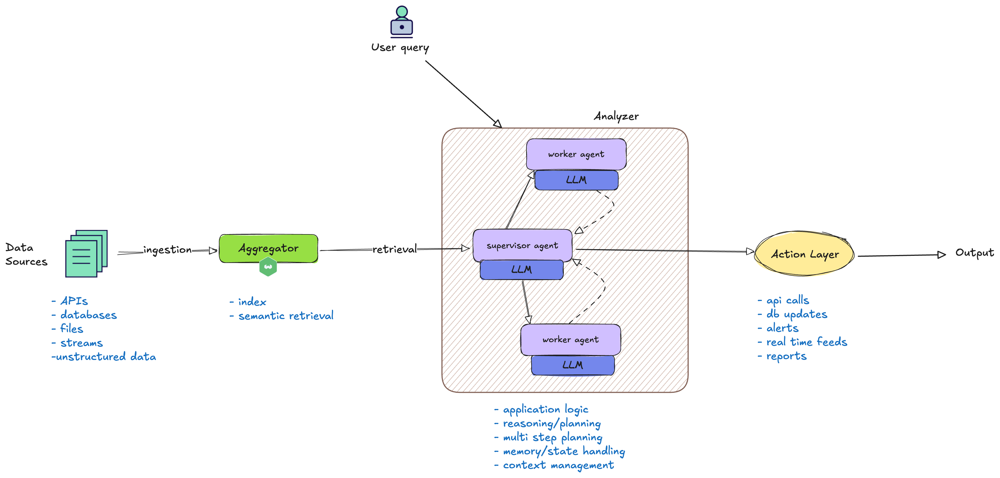
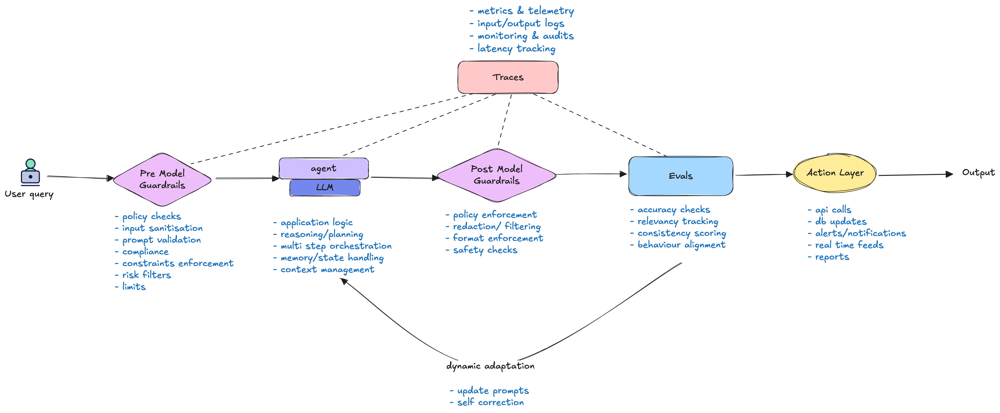

It's the underlying power of **AI models** that can truly transform enterprise workflows. The sophisticated algorithms, trained on vast datasets, are the engine behind the intelligence and automation that modern businesses desperately need. Without the integration of robust AI models, enterprise workflows stand to lose out on crucial capabilities, leaving organizations vulnerable to inefficiencies and missed opportunities.

---
### Consequences of Operating Without AI Models in the Enterprise

#### 1. **Eroded Competitive Edge**
- **Slower Time to Market:** Without AI driven insights and optimization, organizations become slower to develop new products, respond to market shifts, and deliver innovative services.
- **Subpar Customer Experiences:**  Lack of deep behavior analysis and personalization means less engaging and satisfying customer journeys, leading to churn.
- **Higher Operational Costs:** Manual processes, inefficient analysis, and suboptimal decisions directly inflate operating expenses.
- **Lack of Predictive Power:** Workflows lack the ability to anticipate future trends, customer behaviors, or potential risks. This reactive stance leads to missed opportunities, suboptimal resource allocation, and a constant state of "playing catch-up."

#### 2. **Stagnant and Inflexible Automation**
- **Rule-Bound Limitations:** Traditional automation (RPA) is effective for repetitive, rule-based tasks. It can’t handle variability, judgment, or context.. Without AI models, automation cannot adapt or learn.
- **No Self-Optimization:** Workflows cannot autonomously learn from outcomes and improve over time. They remain static, requiring constant manual adjustments and reconfigurations to maintain relevance and efficiency.
- **Inability to Scale Intelligence:** AI models can scale their intelligence and processing power exponentially, enabling organizations to grow without proportional increases in human resources for data processing and decision support.

#### 3. **Diminished Decision-Making Acuity**
- **Manual/Heuristic-Based Decisions:** Without AI models, decisions remain largely reliant on human intuition, historical data aggregated manually, or rigid, pre-defined rules. This approach is prone to human error, cognitive biases, and is insufficient for the demands of modern data volume and velocity.
- **Inability to Process Unstructured Data:** A significant portion of valuable enterprise data is unstructured (e.g., text, images, audio). Without AI models (like NLP for text or computer vision for images), this data remains largely untapped, leading to incomplete insights and less informed decisions.

#### 4. **Superficial and Inefficient Analysis**
Traditional analysis methods often struggle with the sheer volume and complexity of modern data.
- **Human Processing Limits:** Even skilled human analysts are limited by time and cognitive capacity, making it difficult to analyze a comprehensive range of data or uncover subtle, complex patterns.
- **Inconsistent Data Interpretation:** Without standardized AI models, different teams or individuals may interpret data differently, leading to inconsistent actions and conflicting strategies across the organization.
- **Inability to Identify Hidden Correlations:** AI models excel at identifying subtle correlations and anomalies in large datasets that would be virtually impossible for humans to detect, missing opportunities for optimization or early detection of issues.

In essence, **AI models are the neural network of the modern enterprise**—not just automating tasks, but enabling intelligence, foresight, and adaptability. The following case studies illustrate how enterprises embed agents into their operations, leveraging vector databases, guardrails, and evals to drive value.

---

## Representative Enterprise Workflows with Agents

Want to see how this works in practice? These five examples reveal the strategic value of properly integrated AI agents:

### 1. Trading 

**Workflow Steps:**

1. **Aggregator:**  Collect market feeds, news sentiment, trading signals, and analyst reports into WeaviateDB. Use semantic queries to find correlated signals.

2. **Orchestrator:** Distribute tasks to specialized agents that analyze technical indicators and trends (asset, sentiment, timestamp etc).

3. **Function Calling:** Trade executors that convert analysis to actionable, sized trading orders (interfaces with broker APIs)

### 2. Optimized Supply Chain and Logistics
Manual and historical forecasting often leads to inefficiencies, stock-outs, overstocking, and suboptimal routing.

**Workflow Steps:**

1. **Aggregator:**  Ingest weather patterns, traffic conditions, real-time demand fluctuations, and supplier performance feeds into the vector database.

2. **Analyzer:**  AI models query the database directly to predict demand more accurately, optimize inventory levels, identify potential disruptions, and determine the most efficient delivery routes.

3. **Real-Time Feeds:** Sends live updates to traders and logistics teams, enabling dynamic operational adjustments.

### 3. Retail Review Processing and Tagging

**Workflow Steps:**

1. **Aggregator:**  New product reviews are ingested into a vector database.

2. **Analyzer:**   An NLP agent extracts sentiment, topics, and tags from the reviews.

3. **Router:**  Insights are pushed to dashboards, alerts, or recommendation engines.

### 4. Fraud Detection in Financial Services

Traditional approaches rely on rule-based systems and manual reviews, which are often slow, prone to false positives, and ineffective at detecting novel fraud schemes.

**Workflow Steps:**

1. **Aggregator:**  Aggregates multiple data sources (e.g., address, card activity, travel history) into a vector database.

2. **Analyzer:**  AI models, trained on large volumes of transactional data, identify subtle patterns and anomalies indicative of fraudulent activity—enabling real-time fraud detection, even identifying previously unknown fraud methods.

### 5. Customer Support Triage

**Workflow Steps:**

1. **Aggregator:** Emails, chat logs, and call transcripts are collected in a vector database.

2. **Classifier:**  Agents tag each request for intent and urgency.

3. **Router:** A task-routing agent sends requests to the correct team and drafts reply templates.

--- 
In summary, these examples highlight the versatility and impact of AI agents across diverse enterprise workflows — from trading and logistics to customer support and fraud detection. By embedding agents into core processes and leveraging vector databases, organizations can unlock new levels of automation, insight, and operational efficiency. 

The following diagram provides a high-level overview of a typical enterprise AI workflow, illustrating how the components described in the examples above come together in practice. As seen in the trading, supply chain, retail, fraud detection, and customer support scenarios, diverse data sources are ingested and aggregated into a vector database. Multiple agents then collaborate to analyze this data, perform multi-step planning, and drive actions such as API calls, database updates, and other automated processes. The diagram visually connects these workflow stages, highlighting how orchestration, agent coordination, and automation underpin the real-world use cases discussed earlier.

--- 
As enterprises embed AI agents deeper into their workflows, the stakes—and the complexity—rise quickly. Each new capability or agent adds not just value, but also new points of interaction and potential failure. As these systems scale and agents begin to collaborate, the risk of unintended consequences grows **nonlinearly**. Inter-agent dependencies and increased automation can create unpredictable dynamics, where a single error or oversight may ripple across the entire workflow. 

This is why robust protection mechanisms are essential. Guardrails and evals serve as the critical safeguards that keep enterprise AI workflows reliable, safe, and aligned with business objectives, even as complexity increases.

**What can go wrong, and how do we address it?**

--- 

## Guardrails and Evals

As autonomous systems become increasingly sophisticated and widespread, ensuring their safe and predictable operation is paramount. This is where **Guardrails and Evals** come in, acting as crucial protective boundaries that guide agent behaviour and significantly minimise risk without stifling innovation.

Without these critical components, autonomous systems, especially as they scale, risk becoming unpredictable, unreliable, and even dangerous. Thoughtful design and proactive oversight, implemented through robust guardrails and comprehensive evaluations, are essential to striking the right balance between exploration and safety. This allows AI agents to operate efficiently and effectively while consistently adhering to critical boundaries and ethical guidelines.

Let's delve deeper into how these essential elements function, exploring the specific types of guardrails and evaluations that empower AI agents to operate with precision and integrity.

### **1. Pre-Model Guardrails**
 This is the first layer of defence to catch bad inputs early — this reduces wasted compute and ensures policy compliance from the start. These are **hard constraints** applied *before* the input reaches the model. Think of them as a security checkpoint that blocks inappropriate or dangerous requests upfront.
    
**Examples:** A pre-filter for PII (personally identifiable information), content moderation checks, or blocking specific keywords.
    
### **2. Post-Model Guardrails** 
The second layer of defence which acts as a safety net — sanitising, constraining, or rejecting unsafe or non-compliant outputs. These are **hard constraints** applied *after* the model has generated a response but *before* it's sent back to the user. This catches anything the model might have generated that violates safety or quality standards.
    
**Examples:** PII redaction from the model's output, checking for factuality against a knowledge base, or ensuring the response meets a specific formatting requirement.
    
### **3. Evals** 
The feedback mechanism. Evals are used to assess the quality of the model's output. They don’t just measure; they trigger *active feedback loops* to correct agents in real-time. They are the key to **dynamic self-correction** and **shaping behaviour**. Evals can be automated (e.g., a test suite) or involve human feedback.

### **4. Traces**
The "breadcrumbs" of the entire process. A trace captures the complete journey of a request—from the initial input, through the agent and model calls, to the final output. They let you inspect reasoning chains, measure latency, and refine agent orchestration. Traces are essential for debugging, understanding how a system is performing, and feeding data back into the evals.

---
The following diagram builds on the concepts discussed above, visually mapping how agents, orchestration, guardrails, and evals interact within a typical enterprise workflow. It highlights how these components work together to ensure AI-driven automation remains safe, reliable, and scalable across complex business processes.

---
Now, let’s see how these principles apply in real-world enterprise scenarios we discussed earlier. For each workflow, we’ll break down the specific guardrails and evals that ensure safe, reliable, and effective agent-driven automation.

### **1. Trading **

**Guardrails:**
- **Pre-Model:** Restrict trade types when volatility exceeds a threshold, or a key index moves more than X% in Y minutes.
- **Post-Model:** Block any trade recommendations that would cause the portfolio's exposure to a single asset class to exceed a specific percentage.
- **Post-Model:** Automatically set a "stop-loss" order at a pre-defined percentage below the recommended entry price for any executed trade.

**Evals**
- **Consistency:** Cross-verify model outputs against compliance rules before they’re accepted.
- **Accuracy:** Assess the correlation between the model's confidence scores and the actual success or failure of the recommended trades.
- **Drift Detection:** Monitor if the aggregated signals' performance degrades over time, which may indicate a change in market conditions the model is not adapting to.

### **2. Optimised Supply Chain and Logistics**

**Guardrails**
- **Pre-Model:** Reject any logistical optimisation request that involves high risk routes or prohibited zones
- **Post-Model:** Enforce a maximum daily driving hours limit on any generated route to comply with labor laws.
- **Post-Model:** Filter out and flag any proposed route that requires a vehicle to travel through a low-bridge or restricted-weight road.

**Evals**
- **Efficiency:** Measure the percentage reduction in fuel consumption or total travel distance compared to a baseline (e.g., human-planned routes).
- **Timeliness:** Evaluate the "on-time delivery" rate and the variance between the model's estimated time of arrival (ETA) and the actual delivery time.
- **Robustness:** Test the model's ability to re-optimise a route in real-time when faced with unexpected events like road closures or traffic.

### **3. Retail Review Processing and Tagging**

**Guardrails**
- **Pre-Model:** Censor or redact personally identifiable information (PII) like full names, addresses, or phone numbers before a review is processed.
- **Post-Model:** Remove any competitor brand names or product mentions from the final, publicly visible review content.
- **Post-Model:** Ensure the final set of tags for a review does not include any terms from a defined blacklist (e.g., hate speech, profanity, or spam terms).
- **Pre-Model:** Whitelist acceptable input commands

**Evals**
- **Accuracy:** Measure the precision and recall of the automatically generated tags compared to a human-curated "gold standard" set of tags.
- **Relevance:** Conduct a human-in-the-loop evaluation to score how relevant and helpful the generated tags are for other customers.
- **Toxicity:** Use an external toxicity scoring model to verify that the final, cleaned review text meets a required safety threshold.

### **4. Fraud Detection in Financial Services**

**Guardrails**
- **Pre-Model:** Immediately reject any login attempt from an IP address or device that has been previously associated with a fraudulent account.
- **Post-Model:** Block any transaction that exceeds a high-value threshold (e.g., $10,000) regardless of the model's confidence score, requiring manual review.
- **Post-Model:** Filter the model's output to ensure it does not generate false flags for legitimate, recurring transactions (e.g., salary deposits).

**Evals**
- **Performance:** Measure the false positive rate (legitimate transactions incorrectly flagged as fraud) and the false negative rate (fraudulent transactions missed by the model).
- **Timeliness:** Evaluate the latency of the fraud detection system from transaction initiation to the generation of an alert.
- **Recall:** Track the percentage of confirmed fraudulent transactions that the model successfully identified.

### **5. Customer Support Triage with Multi-Agent Coordination**

**Guardrails**
- **Pre-Model:** Reject and flag any customer message that contains malicious code or links (e.g., for phishing attempts).
- **Post-Model:** Ensure the final response to a customer does not violate any legal or regulatory guidelines, such as giving unqualified legal advice.
- **Post-Model:** Restrict the agent's ability to access or share sensitive customer data beyond what is necessary to resolve the issue.

**Evals**
- **Accuracy:** Evaluate the precision of the model's intent classification (e.g., "billing issue," "technical support," "general inquiry") against a manually labeled test set.
- **Efficiency:** Measure the average time it takes for a ticket to be correctly triaged and routed to the appropriate agent or team.
- **Success Rate:** Assess the percentage of customer issues that are fully resolved by the automated agent, without requiring a human handoff.

---

Other domains also gain significant value from tailored guardrails and evals designed for their unique requirements:

- **Medical Diagnosis & Treatment:** Block outputs that contradict established knowledge or suggest off-label drug use without justification; evaluate accuracy against clinical outcomes.
- **Financial Advisory:** Enforce compliance with disclosures and user risk tolerance; measure forecast accuracy against market performance.
- **Legal Document Analysis:** Flag unsound or ambiguous clauses; ensure jurisdictional compliance; validate precedent identification against expert review.
- **Automated Customer Service:** Prevent PII leaks; enforce professionalism and empathy; track accuracy against a knowledge base.
- **Code Generation & Review:** Reject insecure or non-compliant code; enforce style and best practices; verify functionality against test cases.

--- 

By implementing these guardrails and evaluation strategies, enterprises can ensure their AI-driven workflows remain robust, compliant, and aligned with business objectives. However, effective monitoring and oversight require the right set of tools to track, analyze, and manage agent behavior at scale. 

Weaviate integrates seamlessly with a variety of monitoring and evaluation solutions, enabling organizations to operationalize these best practices with confidence. A comprehensive list of monitoring tools compatible with Weaviate can be found on the [integrations page in the Weaviate documentation](https://docs.weaviate.io/integrations/operations). 

In the second part of this blog post, we will delve into practical examples and source code demonstrating evaluation architecture patterns, including "LLM as a judge," "self-scoring LLM," and "behaviour-shaping agents."

import WhatsNext from '/_includes/what-next.mdx'

<WhatsNext />