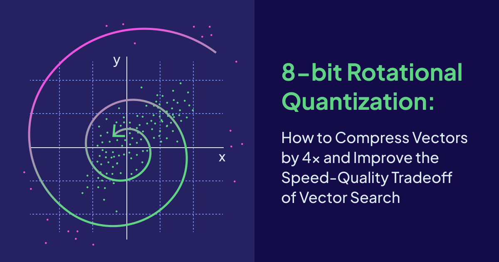
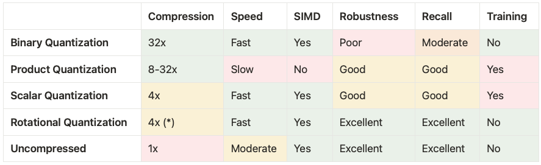
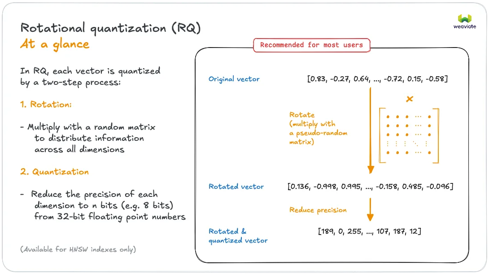
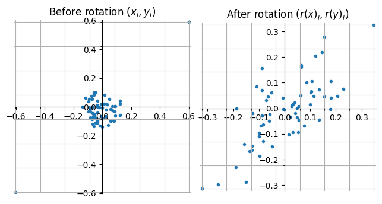
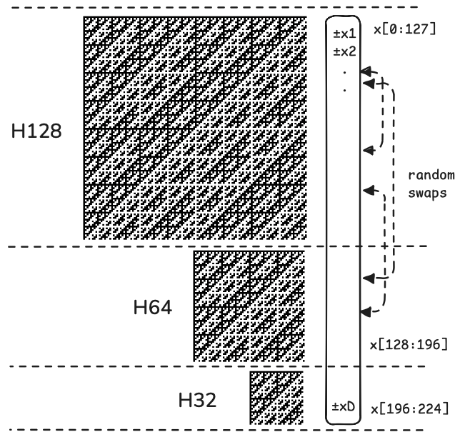
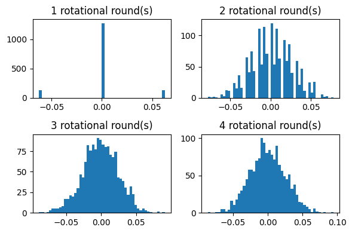

Vector quantization is a common set of techniques for [compressing the vectors in a vector database](https://docs.weaviate.io/weaviate/starter-guides/managing-resources/compression).  By applying a form of quantization one can typically reduce the memory footprint of storing the vectors by 4x-32x while also speeding up distance computations.

One of the most time-consuming operations when performing [vector search](https://weaviate.io/blog/vector-search-explained) is computing distances (or distance estimates) between the query vector and vectors in the database/dataset. These operations are highly optimized to use as few CPU cycles per byte of the vector as possible. By compressing the vector using a quantization scheme that offers e.g. 4x compression while supporting equally fast distance estimation on the quantized codes in terms of throughput as measured in bytes, we would in theory be able to perform 4x as many distance calculations using the same amount of time. In practice [we do see speedups of this magnitude](https://github.com/ashvardanian/SimSIMD?tab=readme-ov-file#benchmarks) when comparing the speed of SIMD-optimized distance estimation on vectors of 8-bit integers (corresponding to 4x compression) against vectors of 32-bit floats.  

When performing approximate nearest neighbor search using a vector index such as [Weaviate’s HNSW index](https://docs.weaviate.io/weaviate/concepts/vector-index#hierarchical-navigable-small-world-hnsw-index) we can choose to trade an increase in search speed for a reduction in the quality of search results. Simplifying things a bit the primary mechanism behind this speed-quality tradeoff involves the index intelligently restricting the search to consider a smaller or larger fraction of the vectors in the dataset for distance estimation. By considering e.g. 2% of the dataset for distance estimation rather than 1% we can typically boost recall (search quality) substantially. Viewed in isolation the use of vector quantization reduces recall compared to uncompressed vectors, but with a sufficiently fast and precise vector quantization scheme we can more than make up for this drop in recall by searching a larger fraction of the dataset with the net result still being an overall speedup in search times due to faster distance estimation.

:::info 🚀🚀🚀
Combining a vector index with a fast and precise vector quantization scheme can simultaneously reduce memory usage, speed up vector search, and improve the quality of search results!
:::

## Vector Quantization to Reduce Memory Bottlenecks and Lower Cloud Costs

Memory (RAM) typically becomes the bottleneck for fast approximate nearest neighbor search as vector collections grow larger. This limitation is especially pronounced in graph-based indexing structures like [Weaviate's HNSW index](https://docs.weaviate.io/weaviate/concepts/vector-index#hierarchical-navigable-small-world-hnsw-index), which depend on rapid random access to individual vectors. The problem is intensified by the high dimensionality of modern vector embeddings, for example dimension sizes from embedding providers such as OpenAI often have 1536 or even 3072 dimensions, significantly increasing RAM requirements.

An important motivation for applying vector quantization is to reduce costs in a cloud setting where memory is an expensive resource. Fitting a simple linear regression across [AWS EC2 on-demand instance types](https://aws.amazon.com/ec2/instance-types/) indicates the following relationship between the instance price and its resource characteristics:

$$
\text{instance price 0.01\$/hour} \approx 5.1 \cdot \text{vCPUs} + 0.48 \cdot \text{GB RAM} + 0.0043 \cdot \text{GB NVMe SSD}
$$

Considering the relative cost of compute, memory, and disk the regression indicates that 1 vCPU is equivalent in terms of cost to 10 gigabytes of RAM which again is equivalent to 1000 gigabytes of NVMe SSD. Therefore, memory usage will tend to dominate cost when storing tens of millions of uncompressed vectors in memory consuming hundreds of gigabytes of RAM. Another interesting observation is that the cost per gigabyte of memory is approximately two orders of magnitude greater than the cost per gigabyte of NVMe SSD storage. This is also a primary motivation behind an orthogonal line of research into how to better utilize SSD storage for vector search — something we are also working on at Weaviate in order to further reduce costs. In the end, no matter whether our vector index keeps vectors in memory or on disk, or some combination thereof, we will benefit from having a quantization scheme that compresses vectors and speeds up distance computations, reducing resource usage.

Vector quantization schemes can be classified into low, moderate, and high compression schemes according to the number of bits the quantized code uses per dimension of the input vector. The table below provides an overview of the space usage and typical recall that can be achieved by state-of-the-art vector quantization methods on a typical dataset of one million OpenAI embeddings.

| **Rate of compression <br/> (bits per input dimension)** | **Space usage <br/> 1 million 1536-dim. vectors** | **Expected recall *k*@*k*** <br/> **\|*k*NN ∩ candidates\| / *k*** |
| --- | --- | --- |
| Uncompresssed (32-bit) | 5859 MB | 100% |
| Low 4x (8-bit) | 1465 MB | 97-99.9% |
| Moderate 8x (4-bit) | 732 MB | 90-97% |
| High 32x (1-bit) | 183 MB | 70-90% |

High compression rates bring significant memory savings, but they typically come with a noticeable reduction in search quality. So while 32x compression is appealing, 4x (8-bit) compression offers higher and more robust recall across various datasets while also supporting fast distance computations. 

## Balancing Tradeoffs: Compression, Speed, and Quality of Vector Quantization

The landscape of compression algorithms for vector search offers different tradeoffs in terms of compression rates, encoding speeds, the speed and SIMD support of distance computations, the robustness of distance estimates across different datasets and different queries, and the need for training of the quantization method to mention some of the most important factors.

Another important distinction is whether the vector quantization algorithm is optimized for single or batched distance computations. The latter is typically the case for IVF-style indexes and it unlocks further options for SIMD optimizations such as the [FastScan algorithm](https://arxiv.org/abs/1704.07355).

At Weaviate we wanted to develop a fast untrained vector quantization technique that was suitable for use with our HNSW index (single distance computations) and could support tens of thousands of queries per second on a typical dataset of one million OpenAI embeddings. Another goal when developing Rotational Quantization was to find an 8-bit quantization method offering essentially the same robustness and recall as using uncompressed vectors.

The table below shows how Rotational Quantization compares against the other [quantization techniques](https://docs.weaviate.io/weaviate/starter-guides/managing-resources/compression#compression-algorithms) at Weaviate.



*(\*) We are developing a 1-bit version of RQ offering 32x compression with performance characteristics and robustness similar to 8-bit RQ but naturally with slightly lower recall.*  

Our initial implementation of 8-bit Rotational Quantization has the unique characteristic that for most datasets it provides a better speed-quality tradeoff for vector search than both Scalar Quantization and Uncompressed (or no quantization). It is more robust, provides significantly more recall, and does not require training in comparison to Scalar Quantization. Compared to Uncompressed it is nearly 50% faster to import data and has very similar recall. Because of this we see 8-bit Rotational Quantization as a much better default for most users of Weaviate.

## Combining Random Rotations and Scalar Quantization

The power of combining random rotations with binary/scalar quantization has recently been showcased by the 1-bit quantization method [RaBitQ [SIGMOD 2024]](https://arxiv.org/abs/2405.12497) and its [extension to B-bits [SIGMOD 2025]](https://arxiv.org/abs/2409.09913), leading to industry adoption of these techniques. 

Inspired by RaBitQ we have developed a simplified and optimized 8-bit Rotational Quantization (RQ) algorithm that is suitable for use with the [HNSW index at Weaviate](https://docs.weaviate.io/academy/py/vector_index/hnsw). The original RaBitQ quantization techniques were primarily intended for use with IVF-style indexes where the data vectors are centered around cluster centroids and distance computations can be batched. We have had to make several modifications to the RaBitQ algorithms in order to make them fast enough to be used with our HNSW index. 

We will begin with a brief description of 8-bit Rotational Quantization before providing some experimental results. Then we will provide some intuition on the power of random rotations for quantization. Finally we will take a deep dive into how we have modified the RaBitQ algorithms in order to arrive at our fast rotational quantization.

### Encoding Rotated Vectors Using 8 Bits Per Dimension



As shown in the above figure rotational quantization takes an input vector  $x \in\mathbb{R}^{d}$ and

1. applies a random rotation matrix  $r(x) = Rx$ where $R \in \mathbb{R}^{d\times d}$,
2. scalar quantizes $r(x)$ into a $d$-dimensional vector of 8-bit integers $c(x) \in \{0, 1, \dots, 255\}^d$.

We quantize the rotated vector by taking the interval between the min and the max entry in $r(x)$ and dividing it into 256 evenly spaced points (including the endpoints). Each entry is then quantized to its nearest point on this interval. In mathematical notation:

$$
c(x)_i = \left\lfloor \frac{r(x)_i - l_x}{\Delta_x} + 0.5 \right \rfloor \text{where} \\
l_x = \min_i r(x)_i, \quad
\Delta_x = \frac{\max_i r(x)_i - \min_i r(x)_i}{255}.
$$

The value $l_x$ is the lower endpoint of the quantization interval and $\Delta_x$ is the step size between the values represented by $c(x)_i.$ The $i$th entry of the quantized vector represents the value

$$
\bar{x}_i = l_x + \Delta_x c(x)_i
$$

in the rotated space. To summarize: The quantized representation of a vector consists of the 8-bit vector $c(x)$ and the two scalars $l_x, \Delta_x$ that we store as 32-bit floating point values. In addition we also store the squared Euclidean norm $\lVert x \rVert_{2}^{2}$ as a 32-bit float in order to support distance computations in Euclidean space. 

Compared to the RaBitQ encoding we do not center our vectors around cluster centers prior to quantizing them. Centering is a very efficient way to increase the accuracy the quantized distance estimates on most datasets, especially those that are naturally clustered. Instead of quantizing the full vector we can quantize the difference between a vector and its nearest cluster center, reducing quantization error. Our internal testing shows that centering data points around just a few k-means cluster centers can often increase recall by as much as adding 1-2 bits to the length of the quantization codes. Unfortunately centering complicates the quantization algorithm as the centers have to be learned and can can suffer from data drift.

As shown in our experiments below we are able to get very high recall values when using 8-bit codes even without centering, but at higher rates of compression such as 4-bit or even 1-bit codes, centering matters relatively more when it comes to producing good recall.

### Estimating Inner Products Between Compressed Vectors

For the [distance measures](https://weaviate.io/blog/distance-metrics-in-vector-search) most commonly used in the context of [vector search](https://weaviate.io/blog/vector-search-explained) estimating the distance between vectors $q, x$ boils down to estimating their inner product $\left< q, x \right>$. A nice property of (random) rotations is that they preserve the length and inner product of vectors, so we have that

$$
\left<q, x\right> = \left<r(q), r(x)\right> 
$$

and we can focus on working with the rotated and quantized vectors. In order to support fast SIMD-optimized single-vector distance estimation we use symmetric 8-bit quantization of both the query vector and data vector and estimate $\left< q, x \right>$ by taking the inner product of the rotated and quantized vectors:

$$
\begin{align*}
\hat{\left<q, x\right>} = \left<\bar{q}, \bar{x}\right> &= \sum_i (l_q + \Delta_q c(q)_i)(l_x + \Delta_x c(x)_i) \\ &= d l_q l_x + l_q \Delta_x \sum_i c(x)_i + l_x \Delta_q \sum_i c(q)_i + \Delta_q \Delta_x\sum_i c(q)_i c(x)_i  .
\end{align*}
$$

The first three terms in the inner product estimator can be evaluated using just a few floating point operations since the sums $\sum_i c(x)_i$ and  $\sum_i c(q)_i$ can be precomputed and stored with the quantized vectors. Computing the inner product of the d-dimensional vectors of unsigned 8-bit integers $\left< c(q), c(x) \right> = \sum_i c(q)_i c(x)_i$ in the fourth term above is the most time-consuming operation when estimating the distance. By utilizing an SIMD-optimized implementation of the inner product of bytes we are able to perform tens to hundreds of millions of distance estimations per second. 

```
goos: darwin
goarch: arm64
pkg: github.com/weaviate/weaviate/adapters/repos/db/vector/compressionhelpers
cpu: Apple M4 Pro
d64-Uncompressed       6.89  ns/op	    145.2  m.ops/sec
d64-8BitRQ             5.49  ns/op	    182.2  m.ops/sec
d256-Uncompressed     18.22  ns/op       54.9  m.ops/sec
d256-8BitRQ            8.06  ns/op	    124.1  m.ops/sec
d1024-Uncompressed    51.27  ns/op	     19.5  m.ops/sec
d1024-8BitRQ          21.02  ns/op	     47.6  m.ops/sec
d1536-Uncompressed    73.88  ns/op	     13.5  m.ops/sec
d1536-8BitRQ          32.36  ns/op	     30.9  m.ops/sec
d3072-Uncompressed   145.90  ns/op	      6.9  m.ops/sec
d3072-8BitRQ          60.55  ns/op	     16.5  m.ops/sec
```

The benchmark results show that we achieve a ~2.3x speedup using 8-bit rotational quantization for distance estimation compared to computing distances using uncompressed vectors of float32 values. By significantly speeding up distance estimates we can afford to perform more of them while still spending less time, paving the way for an overall improvement in both the quality and speed of vector search, as long as we don’t lose too much recall from the quantization.  

The above benchmark was run on an M4 MacBook with ARM Neon SIMD support. Weaviate has SIMD support for Intel and AMD architectures and will use newer SVE SIMD instructions where supported on ARM platforms like Graviton. To see what kind of performance you get on your own setup you can clone the [Weaviate repository from Github](https://github.com/weaviate/weaviate/tree/main) and run the following command from the root directory: 

```
 go test -bench=BenchmarkRQDistancer -run=^$ ./adapters/repos/db/vector/compressionhelpers
```

Comparing our 8-bit rotational quantization scheme and its accompanying estimator to RaBitQ our estimates of the dot product are not theoretically guaranteed to be unbiased. We could easily make the estimator unbiased by using randomized rounding with the scalar quantization, but we found during experiments that it results in a slight reduction in recall (essentially because it corresponds to adding noise to the rotated vectors).  

## Experimental Results

A vector quantization algorithm is ultimately only as good as the level of recall it provides. We define recall*k*@*m* as the fraction of the true *k*-nearest neighbors that are contained in the top *m* candidates returned by the search. With a relatively low-compression technique such as 8-bit rotational quantization we expect almost perfect recall. The table below shows how Rotational Quantization compares against Binary Quantization and Scalar Quantization in terms of recall10@10 (recall10@20 values are given in parentheses) when performing a brute force kNN search using the quantized codes on different datasets. We have randomly sampled 1 million vectors from the datasets in cases where original dataset size exceeded one million. The highest (best) recall value in each row is marked in bold.

| Dataset | Number of vectors | Vector Dimension | 1-bit Binary Quantization recall10@10 (recall10@20) | 8-bit Scalar Quantization recall10@10 (recall10@20) | 8-bit Rotational Quantization recall10@10 (recall10@20) |
| --- | --- | --- | --- | --- | --- |
| [SIFT](https://github.com/erikbern/ann-benchmarks/?tab=readme-ov-file#data-sets) | 1M | 128 | 0.02 (0.02) | **98.46 (100.00)** | 96.42 (100.00) |
| [GIST](https://github.com/erikbern/ann-benchmarks/?tab=readme-ov-file#data-sets) | 1M | 960 | 0.02 (0.02) | 95.66 (100.00) | **96.62 (100.00)** |
| [GLOVE](https://github.com/erikbern/ann-benchmarks/?tab=readme-ov-file#data-sets) | 1M | 200 | 19.78 (26.74) | 93.92 (99.96) | **98.82 (100.00)** |
| [DBPEDIA](https://docs.weaviate.io/weaviate/benchmarks/ann#benchmark-results) | 1M | 1536 | 66.32 (84.22) | 94.76 (99.98) | **99.02 (100.00)** |
| [SPHERE](https://docs.weaviate.io/weaviate/benchmarks/ann#benchmark-results) | 1M | 768 | 45.32 (55.98) | 93.98 (99.92) | **98.22 (100.00)** |
| [MSMARCO](https://docs.weaviate.io/weaviate/benchmarks/ann#benchmark-results) | 1M | 768 | 60.90 (78.18) | 98.74 (100.00) | **99.40 (100.00)** |

Results indicate that Rotational Quantization offers good recall10@10 and perfect recall10@20, outperforming scalar quantization on all datasets except SIFT and offering the type of consistency across datasets that binary quantization lacks. The high recall values (>99%) that we see on high-dimensional vector embedding datasets such as MSMARCO (SNOWFLAKE ARCTIC-M-1.5) and DBPEDIA (OPENAI ADA-002) are particularly reflective of typical use cases.

Looking at recall in isolation provides a good indicator of the viability of a quantization method, but even perfect recall is useless without speed! In order to evaluate the speed-quality tradeoff of 8-bit Rotational Quantization when used with Weaviate’s HNSW index we plot recall against throughput as measured in Queries Per Second (QPS) in the style of an [ANN-Benchmarks](https://ann-benchmarks.com/index.html) plot.   


*Figure: Recall versus throughput for a kNN search with k=10 using Weaviate’s HNSW index on 1 million 1536-dimensional OpenAI embeddings (DBPEDIA (OPENAI ADA-002)). Recall numbers for uncompressed and 8-bit RQ w/o rescoring is recall10@10 while 8-bit RQ w/ rescoring is recall10@20 (the top 20 candidates are rescored).*


We compare the performance of using uncompressed vectors against 8-bit Rotational Quantization with and without rescoring on a dataset of 1 million 1536-dimensional OpenAI embeddings under cosine similarity. The measurements are taken for different values of the [EF parameter](https://docs.weaviate.io/weaviate/concepts/vector-index#managing-search-quality-vs-speed-tradeoffs) which is used to balance search quality and speed.

Rescoring (or over-fetching) for a *k*NN query means that we initially find the top *m* best candidates according to the quantized distances and then recompute the distance estimates for these *m* candidates using the uncompressed vectors to produce the final list of *k* candidates. This improves recall but comes at a cost since the uncompressed vectors have to be retrieved from storage and we have to perform *m* exact distance computations.

Comparing 8-bit Rotational Quantization without rescoring to using uncompressed vectors we see a 15-50% increase in throughput (QPS) while recall across all measurements drops by less than one percentage point for identical EF values. For 8-bit Rotational Quantization with rescoring we do not lose any recall compared to uncompressed vectors, but we see a drop in performance due to the rescoring. However, as we move into the high-recall range where distance computations comprise a relatively larger fraction of the time spent during the search we see an improvement in throughput of 5-42% compared to uncompressed (e.g. 99.41% recall at 1927 QPS for uncompressed compared to 99.41% recall at 2738 QPS for RQ with rescoring). 

Considering the curve associated with each different algorithm in a plot of throughput against recall we have that every point that is positioned up and to the right of another point represents a Pareto improvement, since it improves either throughput or recall or both. If we combine the best parts of the curves for 8-bit Rotational Quantization both with and without rescoring, so we use Rotational Quantization without rescoring in the lower-recall range and Rotational Quantization with rescoring in the high-recall range we see an across-the-board improvement compared to using uncompressed vectors. We are able to compress our vectors by 4x while simultaneously improving throughput and recall! 

## The Universal Power of Random Rotations: Making Every Vector Well-Suited For Scalar Quantization

Applying a random rotation to the vector prior to scalar quantization tends to reduce the quantization error and improve recall as we saw in the experiments above. Here we will attempt to provide some intuition for why this is the case. 

A uniform random point on the $D$-dimensional unit sphere is distributed according to a vector of i.i.d standard normal random variables normalized to unit length: 

$$
x = \frac{1}{\lVert z \rVert_2 }(z_1, z_2, \dots, z_D), z_i \sim \mathcal{N}(0,1).
$$

After applying a random rotation to a (unit) vector it will follow the exact the distribution above since it will be rotated to a uniform random location on the sphere. Note that this applies to every input vector, regardless of how the mass is distributed across its entries. 

If we take a closer look at how the entries of the rotated vectors are distributed we note that the normalization term $\lVert z \rVert_{2}$ will be tightly concentrated around $\sqrt{D}$ as $D$ grows. So for $D \geq 64$ we can essentially treat the entries of the rotated vector as being distributed according to $z_i/\sqrt{D}$ where $z_i \sim \mathcal{N}(0,1)$. The [normal distribution](https://en.wikipedia.org/wiki/Normal_distribution#Quantile_function) is tightly distributed with exponentially decaying tails. With probability at least 0.999 we have that $z_i \in [-3.3, 3.3]$. If for example we consider a 1024-dimensional unit vector it could take the form $x = (1, 0, \dots, 0)$ prior to being rotated, but after applying a random rotation it is very unlikely that an entry would have an absolute value larger than approximately 0.15. Also, if we look at the Manhattan (L1) norm of a rotated unit vector (the sum of absolute values of entries) it is guaranteed to be concentrated around $\sqrt{D}$ so in our 1024-dimensional example we have that $\lVert r(x) \rVert_1 \approx 32$ compared to the unrotated vector that has $\lVert x \rVert_1 = 1$. This gives us a lot more mass to scalar quantize which helps improve the accuracy of the quantization. 

To visualize the effects of applying a random rotation to a pair of 64-dimensional unit vectors $x, y$ consider the figure:



*Figure: Scatter plot of entries 64-dimensional unit vectors $x, y$ with correlation $\left<x, y\right> = 0.71$.*

The vectors $x$ and $y$ have two large correlated entries (the pairs of entries in the upper right and lower left diagonal of the left plot) while their remaining entries are random noise. In both the left and right figure the grid lines represent the scalar quantized values when using 3-bit quantization (8 different values). 

Notice that after applying the rotation the length of the quantization interval is almost halved and the entries are distributed across the entire length of the interval (although not uniformly). The Manhattan norm of both vectors has also increased, making the information about their correlation easier to capture using scalar quantization. Another important property, especially if quantizing using only few bits, such as taking the sign of each entry, is that now most of the entries “tell the same story” of the vectors being highly correlated whereas prior to the rotation this information was only found in two of the entries.

Applying a random rotation lends a universal robustness to scalar quantization. After randomly rotating a vector it will be well-suited for scalar quantization with extremely high probability. This holds universally, for every vector, independently of where the vector is positioned or any structure in the dataset that it belongs to.

If we do not apply a random rotation we risk that a vector is ill-suited for scalar quantization resulting in larger and more variable errors when performing distance estimation. This can for instance happen if the vector has a mixture of large and small entries which will increase the quantization interval.

The price that we pay for this robustness is that we may sometimes lose information when rotating and quantizing a vector. Imagine for example if the input vectors were already quantized, then by rotating and re-quantizing we would lose some information.

To summarize, applying a random rotation has the following three interrelated effects that are beneficial to quantization:

1. It smoothens the entries in the vector guaranteeing a short quantization interval.
2. It preserves the Euclidean norm while guaranteeing a large Manhattan norm which translates into more mass to quantize and more information in the scalar quantization.
3. It randomly re-distributes similarity information across all dimensions, improving estimation accuracy.

## From RaBitQ to Rotational Quantization: Making Vector Quantization Fast Enough

The extended RaBitQ quantization algorithm ([paper](https://arxiv.org/abs/2409.09913), [blog post](https://dev.to/gaoj0017/extended-rabitq-an-optimized-scalar-quantization-method-83m), [repository](https://github.com/VectorDB-NTU/Extended-RaBitQ)) works by centering and normalizing vectors, followed by randomly rotating them and encoding them their nearest neighbor among a set of code points that lie on the surface of the unit sphere. The code book is designed in a clever way that serves multiple purposes: The code points are well-spaced on the unit sphere, offering good quantization properties. The code points are scaled vectors of $B$-bit integers, supporting fast distance estimation. And finally the authors present an efficient encoding algorithm that is able to find the nearest code point to a rotated vector using$O(2^B D \log D)$ operations for $D$-dimensional vectors.

We initially created an implementation of extended RaBitQ in Go, but we found that we had to make two major modifications to the algorithm in order to make it fast enough for our use case.

1. Replace the random rotation with our own implementation of a fast pseudorandom rotation.
2. Replace the extended RaBitQ quantization with simple 8-bit scalar quantization.  

Since we are using the 8-bit encoding for both the query and data vectors we have to rotate and encode the query vector before we can begin navigating the graph and estimate distances. To get a rough idea about the time that we can afford to spend on our quantization in order to remain competitive with using uncompressed vectors say that we want each thread running queries to support at least 1000 queries per second (actual numbers are somewhat higher). This gives us 1000 microseconds per query. If we allow 10% of that time to be spent quantizing the query we have a budget of only 100 microseconds to rotate and encode the query vector.

The below table gives an overview of the running time of different operations on a 1536-dimensional vector of float32 values. We see that our budget of 100 µs corresponds roughly to the time required to sorting the vector as measured by using `slices.sort` from the Golang standard library. 

| **Operation** | **Running time for a 1536-dimensional vector** |
| --- | --- |
| Quantization budget | 100 µs |
| Sorting | 60 µs |
| Random rotation (matrix-vector multiplication) | 1 700 µs |
| RQ fast pseudorandom rotation  | 7  µs |
| Extended RaBitQ 8-bit encoding | ≥4 000 µs |
| RQ 8-bit encoding (scalar quantization)  | 2 µs |
| Sampling a random rotation matrix | 10 000 000 µs |
| Sampling a fast pseudorandom rotation | 150 µs |

A random rotation corresponds to multiplying the vector by a rotation matrix. This operation has a complexity of $O(D^2)$ compared to $O(D \log D)$ of sorting. This difference is also apparent in our benchmarks where a dense matrix-vector multiplication using [gonum](https://www.gonum.org) took 1700 µs. This indicates that using truly random rotations is unviable, even if we could speed them up by 10x. Another drawback of random rotations is that they are expensive both to sample and store.

By developing custom fast pseudorandom rotations based on the [fast Walsh-Hadamard transform](https://en.wikipedia.org/wiki/Fast_Walsh–Hadamard_transform) (described in more detail in the section below) we were able to reduce the time to rotate a 1536-dimensional vector to just 7 microseconds (a 200x speedup!) without losing any recall in our benchmarks.

An even bigger challenge was the complexity of the extended RaBitQ encoding as it scales exponentially in the number of bits of the encoding. Encoding a rotated vector into a $B$-bit representation using the RaBitQ algorithm involves $2^{B}D/2$ insertions into a priority queue. Even highly optimized priority queue implementations use at least ~20ns per insertion, so in the 8-bit case this aspect of the encoding algorithm alone would take at least 4000 µs for a 1536-dimensional vector, rendering the approach unviable. 

Given this limitation on the RaBitQ encoding algorithm we opted to instead use simple scalar quantization as described above. The scalar quantization can be performed in just a few passes over the rotated vector and takes ~2 microseconds. 

## Developing a Fast Pseudorandom Rotation

The $O(D^2)$ complexity of performing a truly random rotation using matrix-vector multiplication scales too poorly to be viable for high-dimensional embedding vectors. Fortunately there exists faster pseudorandom rotations based on the [Fast Walsh-Hadamard Transform](https://en.wikipedia.org/wiki/Fast_Walsh–Hadamard_transform) (FWHT) with a complexity of $O(D \log D)$ that are fast in practice and work just as well as truly random rotations in our use case. The recursive definition of the Walsh-Hadamard transform is given by

$$
H_D = \frac{1}{\sqrt{2}} \begin{bmatrix}   H_{D/2} & H_{D/2} \\ H_{D/2} & -H_{D/2} \end{bmatrix} \text{ where } H_1 = \begin{bmatrix} 1\end{bmatrix}.
$$

Let $S_D$ be a diagonal $D\times D$ sign matrix with random entries drawn uniformly from $\{-1, +1\}$. In the seminal paper introducing the [Fast Johnson Lindenstrauss Transform](https://dl.acm.org/doi/10.1145/1132516.1132597) it was shown how applying the distance-preserving transform $H_D S_D$ to a D-dimensional vector has the same “smoothening” properties as a random rotation. To see why this is the case note that each row in the transform takes the form $(H_D S_D)_i,. = (\pm/\sqrt{D}, \pm/\sqrt{D}, \dots, \pm/\sqrt{D})$  so each entry in in the transformed vector is a sum of $D$ random values no greater than $\pm \lVert x \rVert_2 / \sqrt{D}$ and is concentrated around zero. 

By applying multiple such transforms e.g $H_D S^{(1)}_D H_D S^{(2)}_D H_D S^{(3)}_Dx$ to a vector, using new random signs with each successive application, the output begins to resemble a randomly rotated vector. This can also be understood through the lens of the [Central Limit Theorem](https://en.wikipedia.org/wiki/Central_limit_theorem): After one application of the transform the vector will be smoothened and with subsequent transforms the entries are random sums of bounded variables and thus begin to resemble the normal distribution. This technique was applied in order to get fast pseudorandom projections for locality-sensitive hashing in the [FALCONN library](https://github.com/FALCONN-LIB/FALCONN).

One major drawback of the fast Walsh-Hadamard transform is that it is only supported in dimensions that are a power of two, i.e.  $D = 2^k$ for some positive integer k. We could circumvent this limitation by padding the input vector to the nearest power of two, but this would almost double the dimension on certain input lengths, which would run counter to our objective of quantizing vectors in order to save memory. 

In order to support pseudorandom rotations on all input sizes we have developed the following approach:

1. Pad the input vector to a multiple of a power of two, e.g. a multiple of 32.
2. Randomly swap elements of the input vector and apply random signs.
3. Greedily apply the longest possible FWHT in blocks along the length of the vector until the entire vector has been transformed.
4. Repeat the above steps three times.  

The random signs and FWHT works to smoothen the entries of the vector within individual blocks while preserving lengths and distances. Between each round of block-smoothening we randomly swap elements between blocks, thereby ending up with a global smoothening effect since the mass gets randomly redistributed between blocks when swapping entries. 

Note that in theory the distance between vectors before and after applying a pseudorandom rotation remains exactly the same, but in practice do we introduce some floating point error with each successive rotational round. This error is negligible compared to the error introduced from 8-bit quantization, but it is worth being aware that we introduce some tiny error every time we rotate the vector.



*Figure: Illustration of a single round of a fast pseudorandom rotation on a 224-dimensional vector.*

To further speed up the pseudorandom rotations we restrict the blocked FWHT to be of size 256 or 64 and provide optimized and loop-unrolled implementations of these functions. 

To get a feel for how the entries of a rotated unit vector looks at successive rounds of blocked pseudorandom rotations consider the figure below that plots histograms of the entries of the 1536-dimensional unit vector $x = (1, 0, \dots, 0)$ after applying 1-4 rotational rounds. We see that after three rounds the output looks essentially normally distributed, as expected.



*Figure: Entries of a 1536-dimensional unit vector after 1-4 rounds of pseudorandom rotations.*

Benchmarking the fast pseudorandom rotations reveals that it is fast enough to not be a bottleneck in ANN queries using the HNSW index. We use 3 rotational rounds with 8-bit Rotational Quantization so rotating a 1536-dimensional vector takes ~7 µs as can be seen from the benchmark. 

```
goos: darwin
goarch: arm64
pkg: github.com/weaviate/weaviate/adapters/repos/db/vector/compressionhelpers
cpu: Apple M4 Pro
dim128-rounds1    	       203 ns/op
dim128-rounds3    	       471 ns/op
dim128-rounds5    	       741 ns/op
dim512-rounds1    	       945 ns/op
dim512-rounds3    	      2322 ns/op
dim512-rounds5    	      3737 ns/op
dim1024-rounds1   	      1871 ns/op
dim1024-rounds3   	      4626 ns/op
dim1024-rounds5   	      7397 ns/op
dim1536-rounds1   	      2753 ns/op
dim1536-rounds3   	      6929 ns/op
dim1536-rounds5   	     11628 ns/op
```

## Conclusion

We have presented 8-bit Rotational Quantization: our new fast 8-bit scalar quantization method that uses the power of random rotations. The algorithm is inspired by the recent RaBitQ and Extended RaBitQ quantization methods, but differs in that it untrained and optimized for Weaviate’s HNSW index. In order to make the algorithm fast enough for our use case we had to choose our scalar quantization algorithm carefully and develop a fast pseudorandom rotation.

Using 8-bit Rotational Quantization together with Weaviate’s HNSW index we have seen simultaneous improvements in memory usage, search speed, and search quality indicating that Rotational Quantization is a better default choice compared to using uncompressed vectors.

### Future Work

We are currently developing a 1-bit version of rotational quantization that will offer a 32x rate of compression. In high-compression scenarios the relative benefit in terms of increased recall from centering the vectors is much greater than in low-compression scenarios. We are experimenting with adding support for online-centering to the quantizer in order to boost recall in a robust fashion without requiring users to manually configure a training step for the quantizer.

### How To Try Out Rotational Quantization

Finally, we encourage you to try out [8-bit Rotational Quantization](https://docs.weaviate.io/weaviate/concepts/vector-quantization#rotational-quantization) (supported in Weaviate version `1.32`and above) to hopefully improve the speed-quality tradeoff of vector search on your data. [Enabling Rotational Quantization](https://docs.weaviate.io/weaviate/configuration/compression/rq-compression) in Weaviate is as simple as writing a few lines of code. To further tune the speed-quality tradeoff after enabling 8-bit Rotational Quantization we recommend [playing around with the rescoreLimit parameter](https://docs.weaviate.io/weaviate/concepts/vector-quantization#over-fetching--re-scoring) and/or [changing the EF parameter of the HNSW index](https://docs.weaviate.io/weaviate/concepts/vector-index#managing-search-quality-vs-speed-tradeoffs), but the default settings should work well in most cases.

import WhatsNext from '/_includes/what-next.mdx'

<WhatsNext />