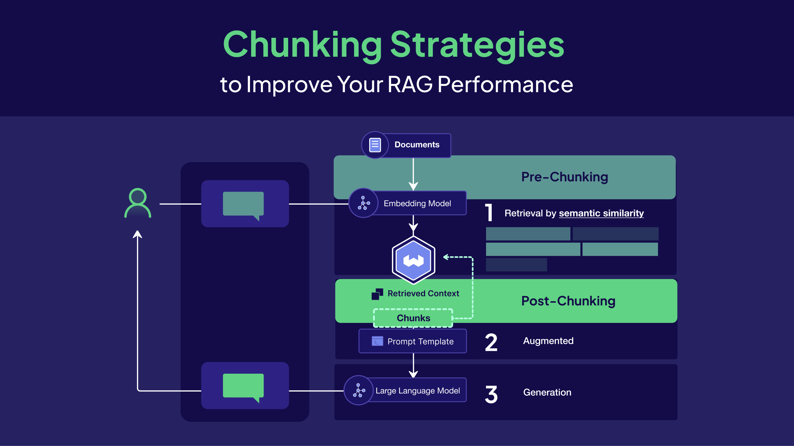
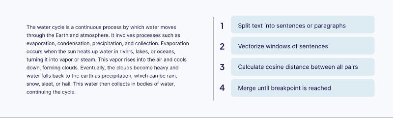

If you’re building AI applications with Large Language Models (LLMs), grounding generated text responses with your specific data is key to accurate answers. [Retrieval-Augmented Generation (RAG)](/blog/introduction-to-rag), often referred to as LLM RAG, connects a large language model to an outside knowledge source as part of a broader RAG pipeline.

In agent-based systems, this retrieval step also acts as a context layer, allowing AI agents to recall relevant information across tasks and interactions.


This lets it find relevant facts before creating a response. The quality of your retrieval process is one of the biggest factors influencing your application's performance. Many developers focus on picking the right vector database or embedding model. But the most important step is often **how you prepare the data itself.**

This is where **chunking** comes in.

In modern LLM RAG pipelines and agent memory systems, chunking directly determines how effectively an agent can retrieve, reason over, and reuse information.

In this post, we’ll review some essential chunking strategies, from fundamentals to advanced techniques, their trade-offs, and tips for choosing the right approach for your RAG application.


## What is Chunking?

In simple terms, **chunking** is the process of breaking down large documents into smaller, manageable pieces called *chunks*. This is a crucial first step when preparing data for use with Large Language Models (LLMs). 

The main reason is that LLMs have a limited **context window,** meaning they can only focus on a certain amount of text at once. If there is too much text within the context window, important details are lost, resulting in incomplete or inaccurate answers. 

Chunking solves this by creating smaller, focused pieces of content that an LLM can use to answer the users query without getting lost in irrelevant information. 

The **size, content, and semantic boundaries** of each chunk influence retrieval performance, and so deciding which technique to use can have a huge downstream impact on your RAG system’s performance.


## Why is Chunking so Important for RAG?

Getting chunking right is one of the **most important decisions in building your RAG pipeline**. How you split your documents affects your system’s ability to find relevant information and give accurate answers. When a RAG system performs poorly, the issue is often not the retriever—it’s the **chunks**. Even a perfect retrieval system fails if it searches over poorly prepared data.

This creates a fundamental challenge: your chunks need to be easy for vector search to find, while also **giving the LLM enough context** to create useful answers.

### 1. Optimizing for Retrieval Accuracy

The first step is making sure your system can *find* the right information in your vector database. Vector search does this by comparing user queries with the embeddings of your chunks.

- Here's the problem with **chunks that are too large**: they often mix multiple ideas together, and subtopics can get lost or muddled. Think of it like trying to describe a book by averaging all its chapters. This creates a noisy, “averaged” embedding that doesn’t clearly represent any single topic, making it hard for the vector retrieval step to find all the relevant context.
- **Chunks that are small and focused**  capture one clear idea. This results in a precise embedding that can encode all the nuanced parts of the content. This makes it much easier for your system to find the right information.
- For AI agents, this retrieval step effectively becomes a form of long-term memory, where well-formed chunks determine what the agent can recall later.

### 2. Preserving Context for Generation

After your system finds the best chunks, they’re passed to the LLM. This is where context quality determines the quality of the outputted response.

Here's a simple test: **if a chunk makes sense to you when read alone, it will make sense to the LLM too.**

- **Chunks that are too small** fail this test. Imagine reading a single sentence from the middle of a research paper—even humans would struggle to understand what's happening without more context.
- **Chunks that are too large** create a different problem. LLM performance degrades with longer context inputs due to attention dilution and the "lost in the middle" effect, where models have trouble accessing information buried in the middle of long contexts while still handling the beginning and end reasonably well. As context length increases, the model's attention gets spread too thin across all the input, making it less accurate at finding relevant information, causing more errors in reasoning, and increasing the likelihood of hallucinating responses.

### The Chunking Sweet Spot

You want to preserve the author's **"train of thought"** while creating chunks that are small enough for precise retrieval but complete enough to give the LLM full context. This is part of  **context engineering**: preparing the input to the LLM in a way that it  can understand it and generate accurate responses.

When you get this balance right, several things improve:

- **Improves Retrieval Quality:** By creating focused, semantically complete chunks, you enable the retrieval system to pinpoint the most precise context for a query.
- **Manages the LLM's Context Window:** Effective chunking ensures only relevant data gets passed to the LLM, helping to avoid too long context lengths that can confuse the model
- **Reduces Hallucinations:** By providing the model with small, highly relevant chunks, you ground its response in factual data and minimize the risk that it will invent information.
- **Enhances Efficiency and Reduces Cost:** Processing smaller chunks is faster and more computationally efficient, which leads to quicker response times and lower costs from LLM  usage.

:::info
If you’re looking for a hands-on Python tutorial, check out this unit in the Weaviate Academy: [https://docs.weaviate.io/academy/py/standalone/chunking](https://docs.weaviate.io/academy/py/standalone/chunking)
:::

## Pre-Chunking vs Post-Chunking

Now that we covered the fundamental dilemma of chunking, we can explore *when* to perform the chunking step in an LLM RAG pipeline. This decision leads to two primary strategies: the standard **pre-chunking** and a more advanced alternative, **post-chunking**.

**Pre-chunking** is the most common method. It processes documents asynchronously by breaking them into smaller pieces before embedding and storing them in the vector database. This approach requires upfront decisions about chunk size and boundaries, but enables fast retrieval at query time since all chunks are pre-computed and indexed.


**Post-chunking** takes a different approach by embedding entire documents first, then performing chunking at query time *only on the documents that are actually retrieved*. The chunked results can be cached, so the system becomes faster over time as frequently accessed documents build up cached chunks. This method avoids chunking documents that may never be queried while allowing for more dynamic, context-aware chunking strategies based on the specific query. However, it introduces latency on first access and requires additional infrastructure decisions.


:::info
We built a post-chunking strategy into Elysia, our open source agentic RAG framework. You can read more about that [here](/blog/elysia-agentic-rag#chunk-on-demand-smarter-document-processing). 
:::

## Chunking Strategies

The best chunking strategy depends on the type of documents you are working with and the needs of your RAG application. The methods below are designed primarily for text-based documents. For other formats, like PDFs, additional steps are needed to convert them into clean text.

:::info
**Working with PDFs**

Before chunking a PDF, you need clean, structured text. PDFs are a visual format, so extracting text can be tricky. Columns, tables, headers, or scanned pages can make text extraction unreliable. For scanned documents, **Optical Character Recognition (OCR)** is required to get any text.

**Pro Tip**: The most reliable approach is first to convert PDFs into a structured format like Markdown. This preprocessing step ensures you have clean, logically ordered text before applying any of the chunking strategies below.
:::

## Simple Chunking Techniques

### Fixed-Size Chunking (or Token Chunking)

Fixed-size chunking is the simplest and most straightforward approach. It splits text into chunks of a **predetermined size**, often measured in tokens (pieces of text that the model processes) or characters. This method is easy to implement but does not respect the semantic structure of the text. As a result, it can cut off in the middle of sentences or even words, resulting in awkward breaks.

A common solution is **chunk overlap**, where some tokens from the end of one chunk are repeated at the beginning of the next. This preserves context that might otherwise be lost at chunk boundaries.

**Key considerations:**

- **Chunk Size:** A common starting point is a chunk size that aligns with the context window of the embedding model. Smaller chunks can be better for capturing fine-grained details, while larger chunks might be more suitable for understanding broader themes.
- **Chunk Overlap:** A typical overlap is between 10% and 20% of the chunk size.

:::info
**When to use:** Quick prototyping and getting a baseline for how well your RAG system performs. It's the easiest place to start, especially when you're dealing with documents that don't have a consistent structure or when you're not sure what you're working with yet. Just make sure to use a decent overlap - 10-20% - so you don't lose important context when information gets split across chunks.
:::


**Code example:**

```python
from typing import List
import re

# Split the text into units (words, in this case)
def word_splitter(source_text: str) -> List[str]:
    source_text = re.sub("\s+", " ", source_text)  # Replace multiple whitespces
    return re.split("\s", source_text)  # Split by single whitespace

def get_chunks_fixed_size_with_overlap(text: str, chunk_size: int, overlap_fraction: float = 0.2) -> List[str]:
    text_words = word_splitter(text)
    overlap_int = int(chunk_size * overlap_fraction)
    chunks = []
    for i in range(0, len(text_words), chunk_size):
        chunk_words = text_words[max(i - overlap_int, 0): i + chunk_size]
        chunk = " ".join(chunk_words)
        chunks.append(chunk)
    return chunks
```

### Recursive Chunking

Recursive chunking is a more nuanced approach. It splits text using a prioritized list of common separators, such as double newlines (for paragraphs) or single newlines (for sentences). It first tries to split the text by the highest-priority separator (paragraphs). If any resulting chunk is still too large, the algorithm *recursively* applies the next separator (sentences) to that specific chunk.

This method adapts to the document’s structure, keeping structurally related units together as much as possible. It avoids the abrupt cuts of fixed-size chunking and ensures that chunks retain the structure of their original format.

:::info
**Recommended for:** Unstructured text documents, such as articles, blog posts, and research papers. This is usually a solid default choice because it respects the natural organization of the text, rather than splitting it randomly.
:::


**Code example:**

```python
from typing import List

def recursive_chunking(text: str, max_chunk_size: int = 1000) -> List[str]
    # Base case: if text is small enough, return as single chunk
    if len(text) <= max_chunk_size:
        return [text.strip()] if text.strip() else []
    
    # Try separators in priority order
    separators = ["\n\n", "\n", ". ", " "]
    
    for separator in separators:
        if separator in text:
            parts = text.split(separator)
            chunks = []
            current_chunk = ""
            
            for part in parts:
                # Check if adding this part would exceed the limit
                test_chunk = current_chunk + separator + part if current_chunk else part
                
                if len(test_chunk) <= max_chunk_size:
                    current_chunk = test_chunk
                else:
                    # Save current chunk and start new one
                    if current_chunk:
                        chunks.append(current_chunk.strip())
                    current_chunk = part
            
            # Add the final chunk
            if current_chunk:
                chunks.append(current_chunk.strip())
            
            # Recursively process any chunks that are still too large
            final_chunks = []
            for chunk in chunks:
                if len(chunk) > max_chunk_size:
                    final_chunks.extend(recursive_chunking(chunk, max_chunk_size))
                else:
                    final_chunks.append(chunk)
            
            return [chunk for chunk in final_chunks if chunk]
    
    # Fallback: split by character limit if no separators work
    return [text[i:i + max_chunk_size] for i in range(0, len(text), max_chunk_size)]
```

### Document-Based Chunking

Document-based chunking uses the **intrinsic structure of a document**. Instead of relying on generic separators, it parses the document based on its format-specific elements. For example: 

- **Markdown**: Split by headings (`#`, `##`) to capture sections or subsections.
- **HTML**: Split by tags (`<p>`, `<div>`) to preserve logical content blocks.
- **PDF**: After preprocessing (e.g., OCR or conversion to Markdown), split by headers, paragraphs, tables, or other structural elements.
- **Programming Code**: Split by functions or classes (e.g., `def` in Python) to maintain logical units of code.

With this method, chunks stay aligned with the document’s logical organization, which often also correlates with semantic meaning as well. Both LangChain and LlamaIndex offer specialized splitters for various document types, including Markdown, code, and JSON.


:::info
**When to use:** Highly structured documents where the format can easily define logical separations. Ideal for Markdown, HTML, source code, or any document with clear structural markers.
:::


**Code example:**

```python
from typing import List
import re

def markdown_document_chunking(text: str) -> List[str]:
    # Split by markdown headers (# ## ### etc.)
    header_pattern = r'^#{1,6}\s+.+$'
    lines = text.split('\n')
    
    chunks = []
    current_chunk = []
    
    for line in lines:
        # Check if this line is a header
        if re.match(header_pattern, line, re.MULTILINE):
            # Save previous chunk if it has content
            if current_chunk:
                chunk_text = '\n'.join(current_chunk).strip()
                if chunk_text:
                    chunks.append(chunk_text)
            
            # Start new chunk with this header
            current_chunk = [line]
        else:
            # Add line to current chunk
            current_chunk.append(line)
    
    # Add final chunk
    if current_chunk:
        chunk_text = '\n'.join(current_chunk).strip()
        if chunk_text:
            chunks.append(chunk_text)
    
    return chunks
```

## Advanced Chunking Techniques

### Semantic Chunking (Context-Aware Chunking)

Semantic chunking shifts from traditional rule-based splitting to meaning-based segmentation. Instead of relying on character counts or document structure, this more advanced technique divides text based on its semantic similarity. The process involves:

- **Sentence Segmentation**: Breaking the text into individual sentences
- **Embedding Generation**: Converting each sentence into a vector embedding
- **Similarity Analysis**: Comparing the embeddings to detect semantic breakpoints (places where the topic changes)
- **Chunk Formation**: Creating new chunks between these breakpoints

The result is a set of highly coherent semantic chunks, each containing a self-contained idea or topic. This method works well  for dense, unstructured text where you want to preserve the logical flow of arguments or narratives.

:::info
**Recommended for:** Dense, unstructured text to preserve the complete semantic context of an idea. This method works well for academic papers, legal documents, or long stories. These texts do not always use clear separators like paragraphs to show topic changes. This approach is great when you're dealing with complex content where the semantic boundaries don't line up neatly with the document structure.
:::



### LLM-Based Chunking

LLM-based chunking uses a **large language model (LLM)** to decide how to split the text. Instead of relying on fixed rules or vector-based similarity scores, the LLM processes the document and generates semantically coherent chunks, often also adding additional context, summaries, or other information. This can be done by:

- **Identifying propositions** (breaking text into clear, logical statements)
- **Summarizing sections** into smaller, meaning-preserving chunks
- **Highlighting key points** to ensure the most relevant information is captured

The result is a set of chunks that preserve semantic meaning more accurately than traditional methods. This makes LLM-based chunking one of the most powerful strategies for retrieval-augmented generation (RAG).


:::info
**When to use:** High-value, complex documents where retrieval quality is critical and budget is less of a concern. Ideal for legal contracts, research papers, compliance documents, or enterprise knowledge bases. This approach can produce chunks that summarize or highlight key ideas, but it comes with trade-offs. It is the most computationally expensive and slowest method compared to other chunking techniques.
:::


### Agentic Chunking

Agentic chunking takes the concept of LLM-based chunking one step further. Instead of applying a single method, an AI agent dynamically decides how to split your documents. It looks at the whole document, including its structure, density, and content. Then it decides on the best chunking strategy or mix of strategies to use. For example, the agent might see that a document is a Markdown file. Then it splits the file by headers. It might also find that a denser document needs a propositional approach. It can even enrich chunks with metadata tags for more advanced retrieval.

These 'LLM-powered methods' can create very clear and context-rich chunks. However, they use a lot of computing power and cost more. They often need many calls to a strong model for each document.

In practice, agentic chunking is often used as part of a broader agent memory architecture, where the agent actively manages how information is stored and recalled.

:::info
**When to use:** High-stakes RAG systems where you need the best possible chunks and cost isn't a dealbreaker. Perfect when you need custom chunking strategies tailored to each document's unique characteristics.
:::


### Late Chunking

[Late chunking](/blog/late-chunking) is a slightly different type of technique that aims to solve a common problem in other chunking strategies: **context loss**.

In other chunking techniques, when you split a document first and then create embeddings, each chunk becomes isolated. This can result in ambiguous or lost context within the chunk that was explained or referenced earlier in a document. 

Late chunking works backwards. Instead of splitting first, you start by feeding the entire document into a long-context embedding model. This creates detailed, token-level embeddings that understand the full picture. Only then do you split the document into chunks.

When you create the embedding for each chunk, you use the token embeddings that were already created with full context. You simply average the relevant token embeddings for that chunk. This means every chunk retains context about the whole document.

:::info
**When to use:** Use this in RAG systems where retrieval quality depends on understanding relationships between chunks and the whole document. This is very useful for technical documents, research papers, or legal texts. These documents have sections that refer to ideas, methods, or definitions mentioned elsewhere. This helps capture connections between different parts of the document that regular chunking methods miss.
:::


### Hierarchical Chunking

Hierarchical chunking can be a game-changer for very large and complex documents. The idea is pretty straightforward: You create multiple layers of chunks at different levels of detail.

- At the **top layer**, you create large chunks that summarize broad sections or themes, like the title and abstract.
- At the **next layers**, you split those sections into progressively smaller chunks that capture finer details such as arguments, examples, or definitions.

This lets your RAG system start with the high-level overview and then drill down into specifics when users need more detail. LlamaIndex's [`HierarchicalNodeParser`](https://docs.llamaindex.ai/en/v0.10.19/api/llama_index.core.node_parser.HierarchicalNodeParser.html) makes it easy to implement this approach.

:::info
**When to use:** Very large and complex documents, such as textbooks, legal contracts, or extensive technical manuals. This strategy is ideal when you need to answer both high-level, summary-based questions and highly specific, detailed queries. It gives you a good middle ground between broad context and granular access without the full complexity of hierarchical chunking, though it's more involved than basic splitting methods.
:::


### Adaptive Chunking

Adaptive chunking techniques dynamically adjust key **parameters** (like chunk size and overlap) based on the document's content.

Instead of applying a single, fixed rule for an entire document, this method treats the text as a varied landscape. It might use machine learning models to analyze the semantic density and structure of different sections. For example, it could automatically create smaller, more granular chunks for a complex, information-rich paragraph to capture fine-grained details, while using larger chunks for a more general, introductory section.

The goal is to create chunks whose size and boundaries are tailored to the specific content they contain, leading to more precise and context-aware retrieval. This differs from Agentic Chunking, where the agent decides *which chunking strategy to use*, rather than just adjusting the parameters of one.

:::info
**When to use:** Documents with varied and inconsistent internal structures. Think of a long report that contains dense, technical paragraphs alongside sparse, narrative sections. An adaptive strategy excels here because it avoids the "one-size-fits-all" problem. It can create small, granular chunks for the complex parts to capture every detail, and larger chunks for the simpler text to preserve context, all within the same document.
:::

## How to Choose the Best Chunking Strategy

There is no single "best" chunking method; the optimal strategy always depends on your specific use case. But before diving into different techniques, the most important question to ask is: 

***“Does my data need chunking at all?”***

Chunking is designed to break down long, unstructured documents. If your data source already has small, complete pieces of information like FAQs, product descriptions, or social media posts, you usually do not need to chunk them. Chunking can even cause problems. The goal is to create meaningful semantic units, and if your data is already in that format, you're ready for the embedding stage.

Once you've confirmed that your documents are long enough to benefit from chunking, you can use the following questions to guide your choice of strategy:

- **What is the nature of my documents?** Are they highly structured (like code or JSON), or are they unstructured narrative text?
- **What level of detail does my RAG system need?** Does it need to retrieve specific, granular facts or summarize broader concepts?
- **Which embedding model am I using?** What are the size of the output vectors (more dimensions increases the ability for more granular information to be stored)??
- **How complex will my user queries be?** Will they be simple questions that need small, targeted chunks, or complex ones that require more context?

| Chunking Strategy | How It Works | Complexity | Best For | Examples |
| --- | --- | --- | --- | --- |
| **Fixed-Size (or Token)** | Splits by token or character count. | Low | Small or simple docs, or when speed matters most  | Meeting notes, short blog posts, emails, simple FAQs |
| **Recursive** | Splits text by repeatedly dividing it until it fits the desired chunk size, often preserving some structure. | Medium | Documents where some structure should be maintained but speed is still important  | Research articles, product guides, short reports |
| **Document-Based** | Treats each document as a single chunk or splits only at document boundaries. | Low | Collections of short, standalone documents | News articles, customer support tickets, short contracts |
| **Semantic** | Splits text at natural meaning boundaries (topics, ideas). | Medium-High | Technical, academic, or narrative documents | Scientific papers, textbooks, novels, whitepapers |
| **LLM-Based** | Uses a language model to decide chunk boundaries based on context, meaning, or task needs. | High | Complex text where meaning-aware chunking improves downstream tasks like summarization or Q&A | Long reports, legal opinions, medical records |
| **Agentic** | Lets an AI agent decide how to split based on meaning and structure. | Very High | Complex, nuanced documents that require custom strategies | Regulatory filings, multi-section contracts, corporate policies |
| **Late** | Embeds the whole document first, then derives chunk embeddings from it. | High | Use cases where chunks need awareness of full document context | Case studies, comprehensive manuals, long-form analysis reports |
| **Hierarchical** | Breaks text into multiple levels (sections → paragraphs → sentences). Keeps structure intact. | Medium | Large, structured docs like manuals, reports, or contracts | Employee handbooks, government regulations, software documentation |
| **Adaptive** | Adjusts chunk size and overlap dynamically with ML or heuristics. | High | Mixed datasets with varying structures and lengths  | Data from multiple sources: blogs, PDFs, emails, technical docs |
| **Code** | Splits by logical code blocks (functions, classes, modules) while preserving syntax. | Medium | Source code, scripts, or programming documentation | Python modules, JavaScript projects, API docs, Jupyter notebooks |

## Tools and Libraries for Chunking

When setting up a data ingestion pipeline for your RAG application, you often face a classic trade-off with chunking: you can rely on a specialized library for speed and ease, or build the logic yourself to have full control.

### Using a Library

*Luckily*, you don’t have to start from scratch. The LLM community often turns to two powerful open-source libraries: LangChain and LlamaIndex, each with a different approach to chunking:

- **LangChain:** A broad framework for building LLM applications. Its flexible [`TextSplitters`](https://python.langchain.com/docs/concepts/text_splitters/) make it easy to integrate chunking as part of a larger system, like a multi-step AI agent.
    - **Best for:** modular workflows where chunking is just one piece of the puzzle.
- **LlamaIndex:** Designed specifically for RAG pipelines. Its sophisticated [`NodeParsers`](https://docs.llamaindex.ai/en/stable/module_guides/loading/node_parsers/modules/) produce “Nodes,” optimized for ingestion and retrieval.
    - **Best for:** high-performance, data-centric retrieval systems.
- **chonkie:** A lightweight, dedicated chunking library that focuses solely on splitting text. It offers a variety of chunking strategies such as [`SemanticChunker`](https://docs.chonkie.ai/python-sdk/chunkers/semantic-chunker) and is easy to integrate with other RAG libraries.
    - **Best for:** projects where you want a simple, focused solution without the overhead of a larger framework.

### Manual Implementation

The alternative to using a library is to implement the chunking logic yourself. Strategies like fixed-size or recursive chunking are straightforward to code in Python, giving you complete authority over how your data is processed and avoiding the need to add external dependencies to your project.

- **Best for:** Projects where you want to avoid adding large libraries, need to implement a highly custom chunking strategy, or require full transparency in your data pipeline.

## How to Optimize The Chunk Size for RAG in Production

Optimizing chunk size in a production setting takes many tests and reviews. Here are some steps you can take:

- Begin with a common baseline strategy, such as fixed-size chunking. A good place to start is a chunk size of 512 tokens and a chunk overlap of 50-100 tokens. This gives you a solid baseline that's easy to reproduce and compare other chunking strategies against.
- Experiment with different chunking approaches by tweaking parameters like chunk size and overlap to find what works best for your data.
- Test how well your retrieval works by running typical queries and checking metrics like hit rate, precision, and recall to see which strategy delivers.
- Involve humans to review both the retrieved chunks and LLM-generated responses - their feedback will catch things metrics might miss.
- Continuously monitor the performance of your RAG system in production and be prepared to iterate on your chunking strategy as needed.
- In production LLM RAG pipelines, chunking is not just a preprocessing step — it defines the quality of retrieval and the effectiveness of agent memory.
- As AI systems evolve from simple RAG setups to long-running agents, chunking becomes a foundational decision for memory, reasoning, and cost efficiency.


:::info
Dive deeper into Advanced RAG Techniques with our **free** eBook: [https://weaviate.io/ebooks/advanced-rag-techniques](https://weaviate.io/ebooks/advanced-rag-techniques)
:::

## Summary

Understanding the different chunking strategies is the first step, but the best way to master them is by seeing them in action. If you're looking for a practical example, check out [**Verba**](https://weaviate.io/blog/verba-open-source-rag-app), our open-source RAG application. You can even fork the repository, load your own data, and start experimenting today. Open source is only possible because of you and the community 💚, so if you have questions or want to troubleshoot, join the conversation in the [Weaviate Community Slack](https://weaviate.slack.com/) or [Forum](https://forum.weaviate.io/). See you there!


import WhatsNext from '/_includes/what-next.mdx'

<WhatsNext />
