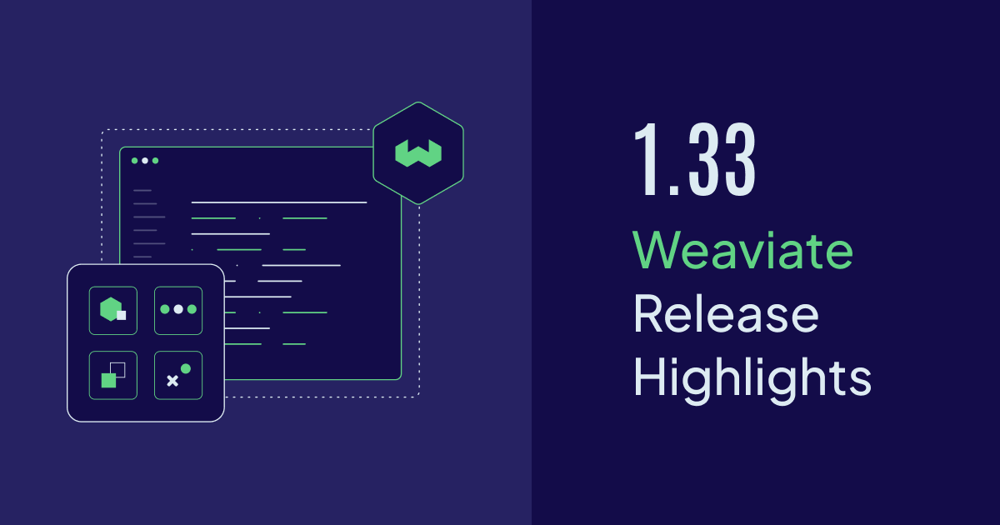

import ThemedImage from '@theme/ThemedImage';

Weaviate `v1.33` is now available open-source and on [Weaviate Cloud](https://console.weaviate.cloud). This release brings **compression by default** for optimal resource utilization, powerful **1-bit rotational quantization (RQ)**, streamlined **server-side batch imports**, enhanced **OIDC group management**, and **collection aliases** become generally available (GA).

There's also expanded filtering capabilities with new **`ContainsNone` and `Not` operators**, plus significant performance improvements across the board.

Here are the release ⭐️*highlights*⭐️!



- [Compression by default (& 8-bit RQ goes GA)](#compression-by-default--8-bit-rq-goes-ga)
- [1-bit rotational quantization (RQ)](#1-bit-rotational-quantization-rq)
- [Server-side batch imports](#server-side-batch-imports)
- [OIDC group management](#oidc-group-management)
- [Collection aliases goes GA](#collection-aliases-goes-ga)
- [`ContainsNone` and `Not` filter operators](#containsnone-and-not-filter-operators)
- [Community contributions](#community-contributions)

## Compression by default (& 8-bit RQ goes GA)

Starting with Weaviate `v1.33`, we're making efficient resource utilization the default experience. **8-bit rotational quantization (RQ) is now enabled by default** when creating new collections, ensuring you get optimal memory usage and faster performance out of the box.

This means that new collections will automatically benefit from:

- **Up-to 4x memory compression** with 98-99% recall maintained
- **No training phase required** - RQ works immediately at index creation
- **Transparent operation** - no configuration needed to get started

<!--  -->

Additionally, **8-bit RQ is now generally available (GA)**, meaning it's fully supported and ready for production workloads. Our extensive testing has shown that RQ provides the best balance of compression, performance, and recall for most use cases.

If you need different behavior, you can customize this through the [`DEFAULT_QUANTIZATION`](https://docs.weaviate.io/deploy/configuration/env-vars#DEFAULT_QUANTIZATION) environment variable:

```bash
# To disable compression by default
DEFAULT_QUANTIZATION=none

# To use a different quantization method
DEFAULT_QUANTIZATION=pq
```

This change represents our commitment to making Weaviate efficient by default, while still providing the flexibility to customize when needed.

:::info Related resources

- [Concepts: Vector quantization](https://docs.weaviate.io/weaviate/concepts/vector-quantization)
- [How-to: Configure quantization](https://docs.weaviate.io/weaviate/configuration/compression)

:::

## 1-bit rotational quantization (RQ)

Building on the success of 8-bit RQ, Weaviate `v1.33` introduces **1-bit rotational quantization (RQ)** as a preview feature. This cutting-edge quantization technique provides massive compression rates while maintaining surprisingly good search quality.

<!--  -->

**1-bit RQ** works through an asymmetric quantization approach:

1. **Data vectors** are quantized using just 1 bit per dimension (storing only the sign)
2. **Query vectors** use 5 bits per dimension during search for improved accuracy
3. **Fast pseudorandom rotation** distributes information evenly across dimensions

This asymmetric design provides several key advantages:

- **Close to 32x compression** as dimensionality increases
- **More robust than binary quantization (BQ)** - works well even on datasets where BQ performs poorly
- **Better recall than symmetric 1-bit schemes** by using higher precision for query vectors

<!--  -->

Our internal testing shows that 1-bit RQ serves as a more accurate alternative to binary quantization, with only about 10% decrease in throughput compared to BQ, but significantly better recall on challenging datasets.

:::caution Preview Feature

1-bit RQ was added in `v1.33` as a **preview** feature. This means it's still under development and may change in future releases. We don't recommend using it in production environments at this time.

:::

:::info Related resources

- [Concepts: Rotational quantization](https://docs.weaviate.io/weaviate/concepts/vector-quantization#rotational-quantization)
- [How-to: Configure RQ compression](https://docs.weaviate.io/weaviate/configuration/compression/rq-compression)

:::

## Server-side batch imports

Data import just got a whole lot easier with **server-side batch imports** (also called automatic batching). Instead of manually tuning batch parameters on the client side, you can now let the server manage the data flow rate for optimal performance.

<!--  -->

Here's how the new automatic batching works:

**1. Persistent Connection**: Your client opens a persistent connection to the server for the duration of the batch job.

**2. Dynamic Backpressure**: The server continuously monitors its internal queue size and calculates an exponential moving average (EMA) of its workload. It then tells the client the ideal number of objects to send in the next chunk.

**3. Asynchronous Error Handling**: If an error occurs while processing an object, the server sends the error message back over a separate stream without interrupting the flow.

<!--  -->

Using server-side batching in Python is straightforward:

```python
# Server-side batching automatically optimizes the flow
with client.batch.automatic() as batch:
    for data_object in data_objects:
        batch.add_object(
            properties=data_object,
            collection="Articles"
        )
```

**Why use automatic batching?**

- **Simplified client code** - No need to manually tune batch size and concurrent requests
- **Improved stability** - Automatic backpressure prevents server overloads and timeouts
- **Enhanced resilience** - Better handling of cluster scaling events and long-running vectorization tasks
- **Optimal performance** - The server determines the ideal batch size based on current workload

:::caution Preview Feature

Server-side batching was added in `v1.33` as a **preview** feature. While functional, it may change in future releases and is not recommended for production use at this time.

:::

:::info Related resources

- [How-to: Batch import](https://docs.weaviate.io/weaviate/manage-objects/batch-import)
- [Tutorial: Efficient data import](https://docs.weaviate.io/developers/tutorials/batch-import)

:::

## OIDC group management

Managing permissions for large teams just became much more streamlined with **OIDC group management**. You can now leverage user groups defined in your identity provider (like Keycloak, Okta, or Auth0) to manage permissions in Weaviate automatically.

<!--  -->

Here's how it works:

1. **Groups are defined** in your identity provider
2. **User group memberships** are passed to Weaviate in the OIDC token
3. **Roles are assigned** to these OIDC groups in Weaviate
4. **Users automatically inherit** permissions based on their group memberships

**Assign roles to an OIDC group:**

```python
# Assign multiple roles to a group
admin_client.groups.oidc.assign_roles(
    group_id="/admin-group",
    role_names=["testRole", "viewer"]
)
```

**List roles assigned to a group:**

```python
# Get all roles for a specific group
group_roles = admin_client.groups.oidc.get_assigned_roles(
    group_id="/admin-group",
    include_permissions=True
)
print(f"Roles assigned to '/admin-group': {list(group_roles.keys())}")
```

**Revoke roles from a group:**

```python
# Remove specific roles from a group
admin_client.groups.oidc.revoke_roles(
    group_id="/admin-group",
    role_names=["testRole"]
)
```

This powerful feature eliminates the need to assign roles to each user individually, making it much easier to manage access for large teams and ensuring permissions stay in sync with your organization's structure.

:::info Related resources

- [Security: OIDC group management](https://docs.weaviate.io/weaviate/configuration/authentication#oidc-group-management)
- [How-to: Manage user permissions](https://docs.weaviate.io/weaviate/manage-objects/permissions)
  
:::

## Collection aliases goes GA

**Collection aliases**, introduced as a preview in Weaviate `v1.32`, are now **generally available (GA)** and ready for production use. This feature provides an elegant solution for seamless collection migrations and production workflows.

<!--  -->

Collection aliases allow you to:

- **Create references** to collections that can be updated without downtime
- **Perform zero-downtime migrations** when changing collection settings
- **Simplify production deployments** with stable collection references

**Creating and using aliases:**

```python
# Create an alias
client.alias.create(alias_name="Products", target_collection="Products_v1")

# Use the alias like a regular collection
products = client.collections.get("Products")
results = products.query.near_text("wireless headphones")

# Update the alias to point to a new collection (zero downtime!)
client.alias.update(alias_name="Products", new_target_collection="Products_v2")
```

This GA release includes full client library support and comprehensive documentation, making collection aliases a robust tool for production environments.

:::info Related resources

- [How-to: Collection aliases](https://docs.weaviate.io/weaviate/manage-collections/collection-aliases)
- [Tutorial: Zero-downtime migrations](https://docs.weaviate.io/developers/tutorials/collection-migrations)

:::

## ContainsNone and Not filter operators

Weaviate `v1.33` expands your filtering capabilities with two powerful new operators: **`ContainsNone`** and **`Not`**. These operators provide more flexible and intuitive ways to express complex filtering logic.

<!--  -->

**ContainsNone Operator**

The `ContainsNone` operator works similarly to existing `ContainsAny` and `ContainsAll` operators, but returns objects where the property contains **none** of the specified values:

```python
# Find articles that contain none of these topics
results = client.query.get("Article", ["title", "content"]).where({
    "path": ["topics"],
    "operator": "ContainsNone",
    "valueTextArray": ["politics", "sports", "entertainment"]
}).do()
```

Internally, `ContainsNone` is efficiently translated to:

```
Not( (prop Equals "politics") Or (prop Equals "sports") Or (prop Equals "entertainment") )
```

**Not Operator**

The `Not` operator provides negation of its single operand, allowing you to express inverse conditions clearly:

```python
# Find products that are NOT in the electronics category
results = client.query.get("Product", ["name", "price"]).where({
    "operator": "Not",
    "operands": [{
        "path": ["category"],
        "operator": "Equal",
        "valueText": "electronics"
    }]
}).do()
```

These operators work seamlessly with Weaviate's existing filtering system and can be combined with other operators for sophisticated queries.

:::info Related resources

- [API references: Filters](https://docs.weaviate.io/weaviate/search/filters)
- [How-to: Combine filters](https://docs.weaviate.io/weaviate/search/filters#combining-filters)

:::

## Performance improvements

As always, Weaviate `v1.33` includes numerous performance improvements that benefit all users:

- **Enhanced HNSW indexing performance** for faster vector operations
- **Improved LSM store efficiency** for better write throughput
- **Optimized query planning** for complex filter combinations
- **Memory usage optimizations** across core components

These improvements work together to make Weaviate faster and more efficient, whether you're running simple queries or complex, multi-step operations.

## Community contributions

Weaviate is an open-source project, and we're always thrilled to see contributions from our amazing community.

<!-- We'll update this section with specific contributor acknowledgments for v1.33 -->

If you're interested in contributing to Weaviate, please check out our [contribution guide](https://docs.weaviate.io/contributor-guide/), and browse the open issues on [GitHub](https://github.com/weaviate/weaviate/issues). Look for the `good-first-issue` label to find great starting points!

:::info Related resources

- [Contribution guide](https://docs.weaviate.io/weaviate/more-resources/contributing)

:::

## Summary

Weaviate `v1.33` represents a significant step forward in making vector databases more efficient, easier to use, and more powerful out of the box. With compression enabled by default, advanced quantization options, streamlined batch imports, and enhanced permission management, this release sets you up for success whether you're just getting started or scaling to production.

**Ready to get started?**

The release is available open-source as always [on GitHub](https://github.com/weaviate/weaviate/releases/tag/v1.33.0), and is already available for new Sandboxes on [Weaviate Cloud](https://console.weaviate.cloud/).

For those upgrading a self-hosted version, please check the [migration guide](https://docs.weaviate.io/deploy/migration#general-upgrade-instructions) for version-specific notes.

It will be available for Serverless clusters on Weaviate Cloud soon as well.

Thanks for reading, and happy vector searching! 👋
