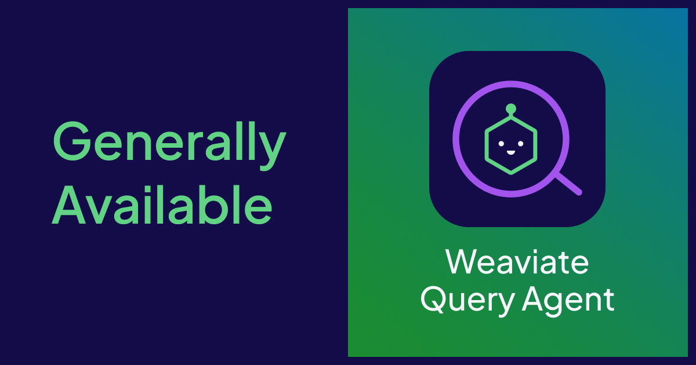
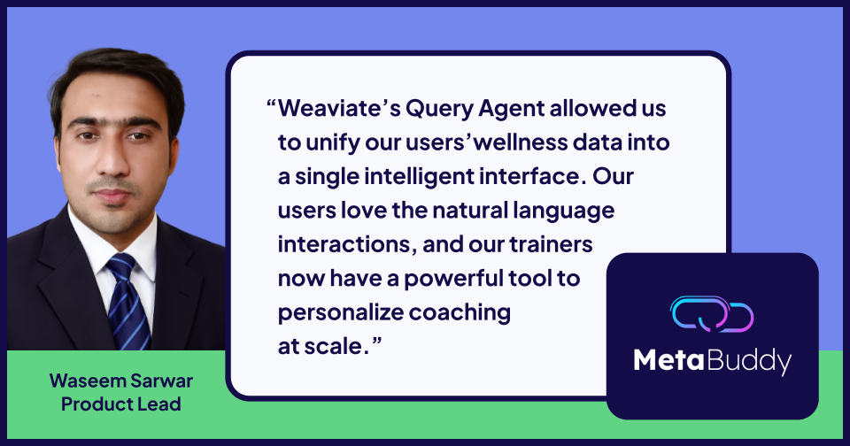

Earlier this year, we released the Query Agent for [early preview](https://weaviate.io/blog/query-agent) to Weaviate Cloud users. After six months of valuable feedback and continuous iteration, we’re thrilled to announce today that Query Agent is now generally available**.** This milestone marks the beginning of a new chapter in how developers interact with data.

---

## The Agentic Database: A New Era for Data Interaction

Database interfaces evolved through decades to meet the needs of developers and data teams. **SQL**, introduced in the 1970s, became the industry standard for querying structured data because it provided a universal, declarative way to express complex data questions. While SQL offers data modelling power and portability, it requires precise syntax and deep schema knowledge. Native drivers and ORMs improve usability with features such as code completion and type management, yet still demand users to understand the underlying data structure in order to extract value and insight.

The rise of **Retrieval-Augmented Generation (RAG)** marked a new shift. Instead of issuing queries against schemas, developers are able to ask questions in natural language, powered by vector embeddings and large language models. But RAG is not a silver bullet: while it excels at surfacing information from unstructured sources, it struggles to bridge the gap with structured data; tasks like filtering, joining, and aggregation still require manual intervention, leaving developers to stitch together results.

**Agentic retrieval**, in addressing this very gap, represents the next landscape shift. Developers can query data in natural language, while the Query Agent acts as an expert intermediary – understanding schemas, APIs, and intent. By combining natural language reasoning with structured query planning, it can automatically apply filters, perform joins, and aggregate results across both structured and unstructured data. By iteratively evaluating outcomes and refining its approach, the Query Agent can introspect on results, adjust strategies, and deliver precise, relevant answers. In doing so, agentic retrieval overcomes the rigidity of SQL and inability of RAG to dynamically decompose and expand queries, finally removing the barriers to truly seamless data interaction.

---

## (re)Introducing the Query Agent

The Query Agent is your expert navigator of Weaviate. It:

* Understands your schemas and APIs  
* Decomposes complex or ambiguous requests  
* Dynamically builds structured and fuzzy searches

The Query Agent works in two primary modes:

* **Ask Mode**:  Examines your collections to determine effective query strategies, refines those strategies when more results are needed, and generates precise answers grounded in your data.  
* **Search Mode**: Similar to Ask Mode but without answer generation, it optimizes for retrieval quality, eliminating the need for complex query understanding pipelines.

The Query Agent is available through robust SDK APIs and directly in the Weaviate Cloud console, bringing with it the **distilled expertise of years of best practices, optimized techniques, and industry learnings** on how to get the most value from your data. You can explore it in our interactive demo, try it hands-on with our Colab notebook, or jump right in with [Weaviate Cloud](https://console.weaviate.cloud). 

---

## Key Features

Query Agent translates search and retrieval best practices into powerful capabilities. From your first query to complex applications, here’s what you can expect when working with Query Agent:

* **Multi-Collection Query Routing**: Run a single query and let the Query Agent handle directing it across multiple collections, saving you from manual routing logic.  
* **Query Expansion**: Enrich your query with semantically related terms, increasing recall without you having to curate synonyms.  
* **Query Decomposition**: Automatically break down multi-intent questions into discrete, concurrent searches, so you capture all facets of requests.  
* **Filter Construction**: Automatically extract and apply schema-valid, structured filters from natural language, ensuring queries run correctly without manual schema lookups.  
* **Intelligent Reranking**: Aggregate and reorder results to reflect the original query’s intent and context, improving precision beyond simple retrieval.  
* **Answer Citation**: Every answer includes full traceability back to the collections and objects, giving you transparency and trust in results.

For a full breakdown of supported features and technical details, see the Query Agent [documentation](https://docs.weaviate.io/agents/query).

---

## Build More, Wrangle Less

The way developers interact with data is fundamentally changing. Agentic workflows enable reasoning and automation that go far beyond traditional search. The Query Agent embodies this shift by acting as a domain expert that is fluent in both your data models and Weaviate’s APIs. Instead of spending valuable time wrangling infrastructure or stitching together multiple tools, developers can focus on building. Complex applications that once required extensive pipelines and custom logic can now be created at lightspeed, without the burden of additional tooling.

Over the past months, we’ve evolved the Query Agent from an end-to-end agentic RAG flow into a robust, flexible agentic retrieval system. This progression reflects our vision that the **“Agentic Database” is not just a feature, but the future of data interactions.**

## What’s New Since Preview

Since releasing the Query Agent for preview in March, we’ve worked closely with early users to refine and add functionality that supports everything from simple exploratory searches to advanced conversational workflows.

## Advanced Retrieval & Search

A major addition is [**Search Mode**](https://docs.weaviate.io/agents/query/usage#search), built for teams that don’t need answer generation but still want the agent’s ability to adapt searches and create filters at runtime. In early benchmarks, this mode consistently outperformed hybrid search across common information retrieval tasks. (Stay tuned – next week we’ll share a deep dive into these results!)

We also added support for [**user-defined filters**](https://docs.weaviate.io/agents/query/usage#user-defined-filters), which are combined with the agent’s generated filters. This gives developers greater control and ensures that critical constraints are always applied, no matter how the query is phrased.

With [**multi-tenant collection support**](https://docs.weaviate.io/agents/query/usage#configure-collections), the Query Agent can now be scoped to specific tenants. This brings parity between single-tenant and multi-tenant use cases and makes it easier to adopt in production environments.

## Conversation & Interaction

The agent now supports [**multi-turn context**](https://docs.weaviate.io/agents/query/usage#conversational-queries). Previously, it could only reference the immediately preceding message, but now it leverages standard message syntax to support full conversation memory - ideal for chat-style applications.

We also introduced [**Ask Mode**](https://docs.weaviate.io/agents/query/usage#ask), which replaces the old run() method with a clearer and more natural API for conversational and query-driven workflows. 

## Performance & Tooling

The agent now supports [**streaming**](https://docs.weaviate.io/agents/query/usage#stream-responses), emitting updates for each step it takes. Developers can pass these progress messages directly to their users, offering both real-time visibility into the agent’s reasoning and a smoother experience through token-by-token answer streaming.

Finally, we released a [**TypeScript client**](https://docs.weaviate.io/agents/query/usage#client-library), developed in response to strong developer demand. Fully aligned with our Python client and supporting modern [async workflows](https://docs.weaviate.io/agents/query/usage#usage---async-python-client), it enables seamless integration into Node backends, edge functions, and other JavaScript environments.

## What Our Users Are Saying

Early adopters are already seeing how the Query Agent changes the way they build with data - delivering explainable and engaging experiences for their users instead of stitching together control panels and pipelines.

MetaBuddy, a digital health and fitness platform, transformed siloed wellness data into a conversational coaching experience with Query Agent. Instead of rigid filters and manual analysis that can only be inferred at runtime, users now ask questions like *“Show my protein-heavy dinners under 600 kcal last week and how they affected recovery”* - and dynamically receive precise, explainable answers. Trainers review trustworthy insights, not spreadsheets.

The shift boosted engagement **3x**, cut trainer analysis time by **60%**, and unified all health metrics behind a single semantic interface without any changes to collection configurations.

Want the full story? Read the [Metabuddy case study](https://weaviate.io/case-studies/metabuddy).

## Get Started with Query Agent

Ready to start building with data in an entirely new way? Query Agent is available now, and you can try it today for free in [Weaviate Cloud](https://console.weaviate.cloud). You can also explore an interactive demo or experiment with a Colab notebook. 

Learn more about Query Agent [APIs](https://docs.weaviate.io/agents/query/usage). 

Stay up to date with the latest news, product updates, and best practices for the Query Agent and other Weaviate Agents by subscribing to [the Weaviate Agents newsletter](https://events.weaviate.io/weaviate-agents-newsletter).  

import WhatsNext from '/_includes/what-next.mdx'

<WhatsNext />